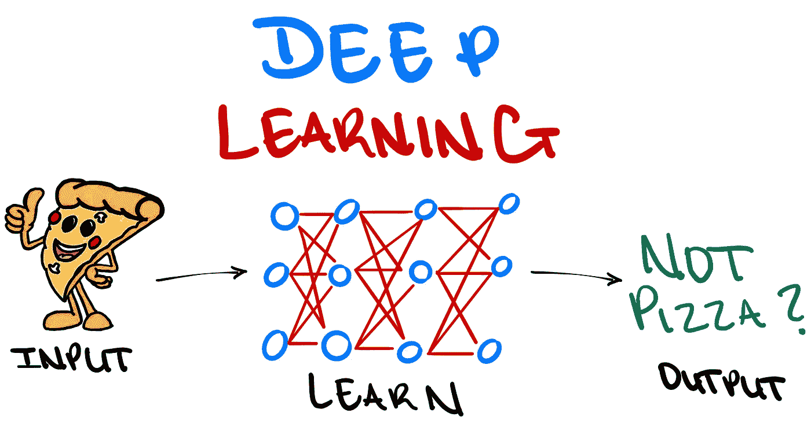
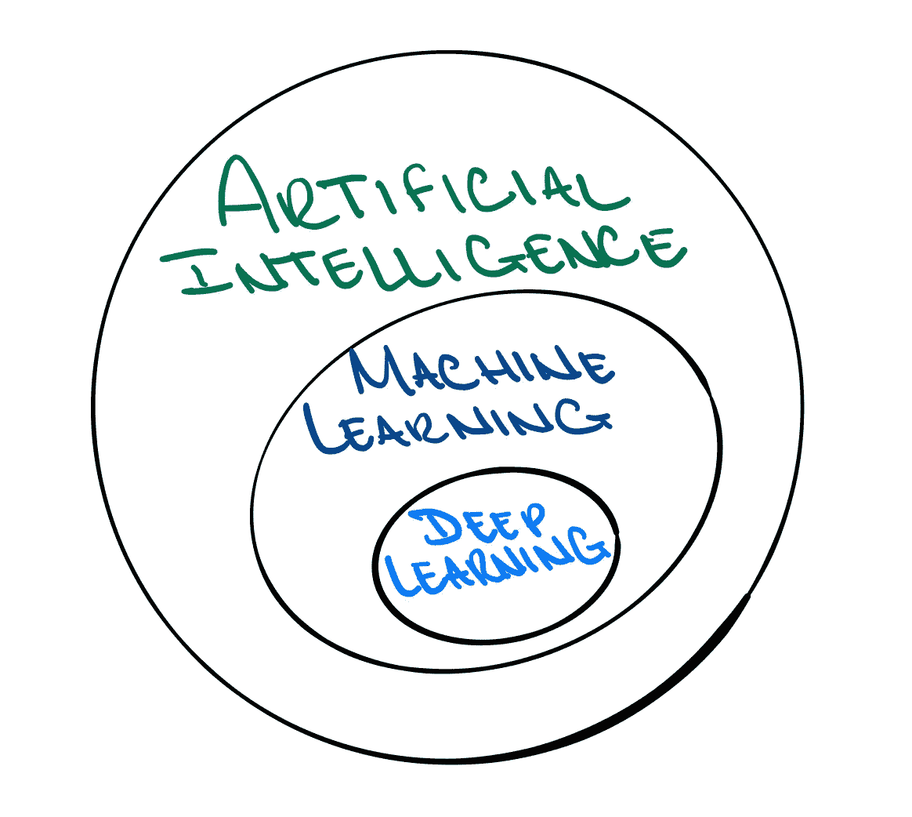
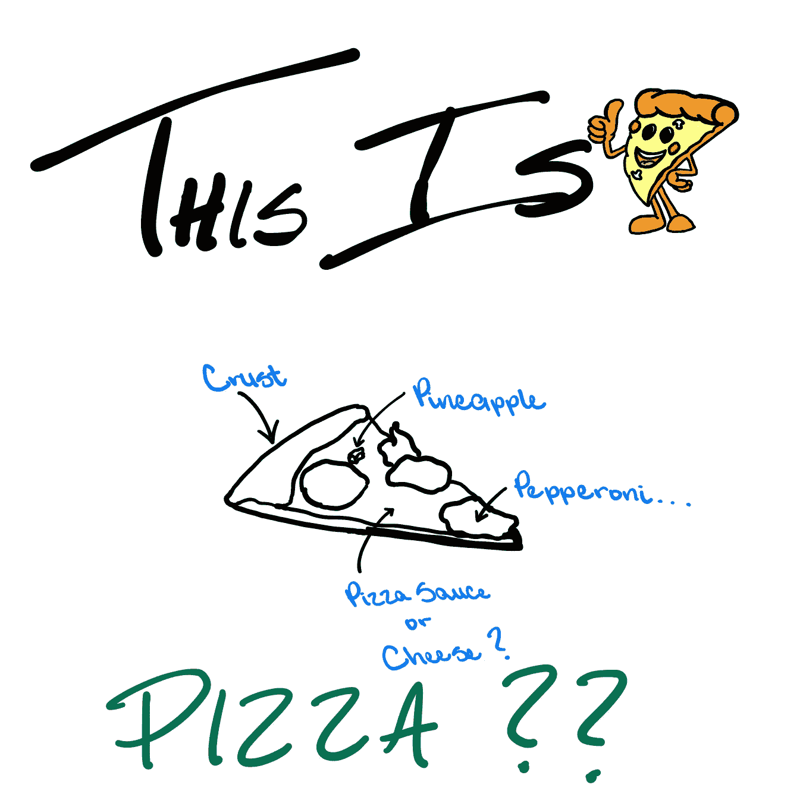
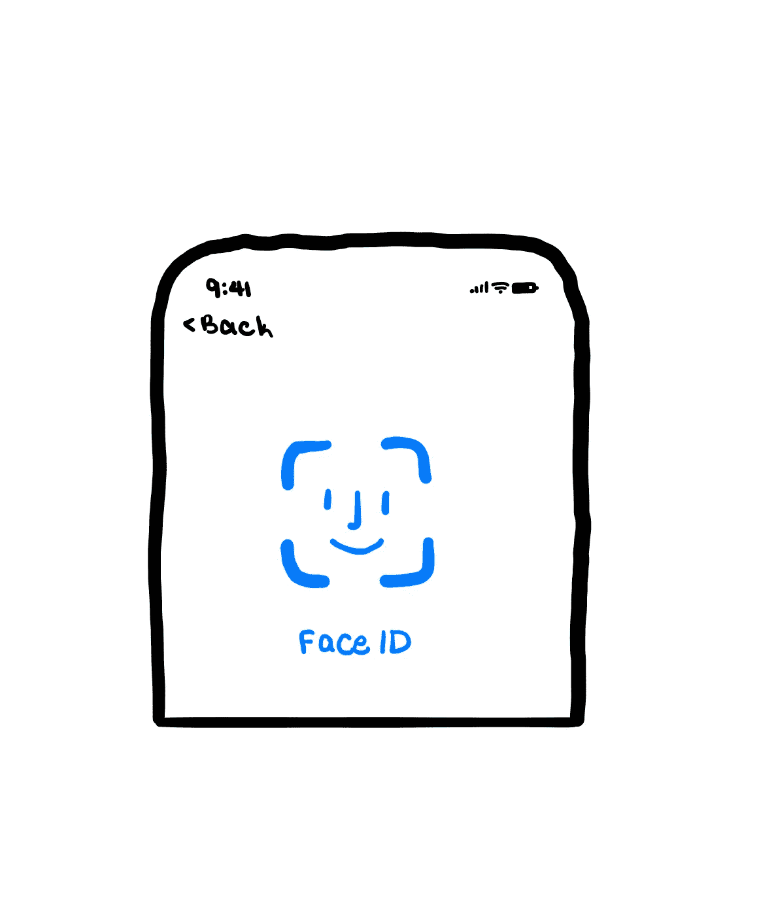

# 什么是深度学习？

> 原文：<https://towardsdatascience.com/what-is-deep-learning-adf5d4de9afc?source=collection_archive---------22----------------------->

## 考察深度学习是如何从人工智能中衍生出来的，并理解其应用

图片作者:特里斯特·约瑟夫

数据科学正在变革许多领域；从机器人学到医学，以及介于两者之间的一切。这场革命部分是由于研究、计算能力、该领域内的兴趣和数据科学工具箱的进步。通常，人们认为数据科学是人工智能(AI)的极端进步；就像，最终赋予机器人独立完成人类主导的任务的能力。

尽管这可能是数据科学的一个方面，但它并不是数据科学的全部。相反，人工智能是数据科学工具箱的一部分。机器学习(ML)和人工智能等领域已经成为数据科学的热门领域，因为它们是非常强大的工具。

这些工具是强大的，因为它们学习并适应优化他们所负责的情况的结果。这很重要，因为尽管人类可以学习和适应优化结果，但机器目前在更大范围内完成这一点上占据上风。

许多问题相当复杂，要求一个人解决一个这样的问题是不合理的。相反，人类应该利用他们对情况的了解，并将其与计算能力和数据结合起来，以实现实质性的结果。这个的交叉点就是**深度学习**！

图片作者:特里斯特·约瑟夫

那么，深度学习到底是什么？广义来说是 AI 的一个应用。由于深度学习是人工智能的一个子集，我们必须首先了解人工智能以及它寻求实现的目标。人工智能是使计算机能够模仿人类行为的任何技术。顾名思义，它是计算机科学的一个分支，强调机器内部智能的发展。在这种情况下，智能可以被认为是处理信息的能力，这些信息可以用来为未来的决策提供信息。

因此，人工智能的目标是开发有效的算法，这些算法可以处理能够通知未来决策的信息。ML 经常被用来达到这个目的。ML 是人工智能的一个子集，它为系统提供了自动学习和从经验中改进的能力，而无需显式编程。

现在‘学习’被提了很多。然而，机器不是像人类一样阅读书籍，进行研究，也不是像人类一样提问学习。相反，ML 算法使用计算方法来直接从数据中理解信息，而不依赖于作为模型的预定方程。

为此，使算法确定数据中的模式并开发目标函数，该目标函数最佳地将输入变量 *x* 映射到目标变量 *y* 。深度学习是进一步发展这一思想的子集。深度学习的目标是自动提取最有用的信息，为未来的决策提供信息。

图片作者:特里斯特·约瑟夫

让 ML 更进一步的想法看起来有点抽象，因此，有点模糊了 ML 和深度学习之间的区别。其思想是，典型的 ML 算法试图在数据中定义一组规则，这些规则通常是手工设计的。因此，当放置在开发环境之外时，ML 算法也可能不如预期的理想。

考虑一下' *ThisIsPizza* '，这是我虚构的一个应用程序，用来检测图片中的对象是否是披萨片。现在，拥有一个能够准确确定一个物体是否是披萨的应用程序和算法非常重要，因为人们不会想要吃一个看起来像披萨但不是披萨的三角形物体。披萨非常复杂，回想一下，机器比人类更擅长处理复杂的情况。因此，分类规则可以是，如果有一个三角形物体至少有番茄酱、奶酪、意大利辣香肠和三角形底部的皮，那么它就是一个比萨饼。但接下来，一个显而易见的问题是，如何确定某样东西是番茄酱、奶酪还是意大利香肠？

深度学习的想法是，这些特征将仅从原始数据中学习。没有必要将意大利香肠定义为一个红色的圆形图像。你能想象给奶酪或番茄酱下定义吗？相反，深度学习模型将开发线条、曲率和其他特征的分层表示，这些特征可用于区分奶酪和番茄酱，然后结合这些特征，然后检测更高级别的特征，如披萨片。

图片作者:特里斯特·约瑟夫

虽然 *ThisIsPizza* 被用作一个玩具例子，但解释的概念在日常应用中被用来克服多种“现实世界”的挑战。理解 *ThisIsPizza* 面临的挑战，以及深度学习如何被用来克服这些挑战，对于理解深度学习到底是什么至关重要。

举个更具体的例子，让我们来看看苹果的 Face ID。这是一个面部识别系统，可用于解锁苹果设备，以及在使用 Apple Pay 等服务时安全地充当认证系统。不需要太多的细节，Face ID 系统使用强大的摄像头来检测和绘制用户的脸。但是软件怎么知道它看到的其实是一张脸呢？换句话说，如果用户不小心扫描了他们的腿，然后付款通过，这将是一个大问题。

为了确定某样东西是否是脸，算法可能会尝试识别嘴、眼睛和鼻子。一旦这些都存在，那么算法可能会将图像分类为面部。但是，问题又来了，如何区分嘴、眼睛和鼻子。因此，为了进一步区分这些特征，我们可以说嘴是一对具有特定方向的线，这些线不应该位于鼻子上方。这些规则会不断变得更加复杂，并且需要为每个感兴趣的子项创建它们。

因此，深度学习的关键思想是，这些特征只需要从原始数据中学习。该算法将通过输入成千上万张人脸图像来学习这一点，然后它将开发一种识别人脸的分层方法。首先，它可能会尝试检测线、边和角等低级特征。接下来，它可以利用这些来检测中级特征，如嘴、眼睛和鼻子。然后，将这些组合在一起以检测高级特征，例如面部毛发或酒窝。

图片作者:特里斯特·约瑟夫

那么，深度学习到底是什么？这是一个强大的过程，通过自动提取未来决策所需的最有用的信息，使计算机能够模仿人类行为。数据科学正在变革许多领域，这部分是由于人工智能和计算能力等令人难以置信的工具的进步。现实世界的问题相当复杂，所以让我们尝试使用**深度学习**来解决它们吧！

**参考文献:**

【machinelearningmastery.com/what-is-deep-learning/ 

[neuralnetworksanddeeplearning.com/](http://neuralnetworksanddeeplearning.com/)

[mathworks.com/discovery/deep-learning.html](https://www.mathworks.com/discovery/deep-learning.html)

**其他有用的素材:**

[towards data science . com/what-is-deep-learning-and-how-it-work-2ce 44 bb 692 AC](/what-is-deep-learning-and-how-does-it-work-2ce44bb692ac)

[www.youtube.com/watch?v=6M5VXKLf4D4](https://www.youtube.com/watch?v=6M5VXKLf4D4)

[deeplearning.mit.edu/](https://deeplearning.mit.edu/)

[https://www.inertia7.com/tristn](https://www.inertia7.com/tristn)