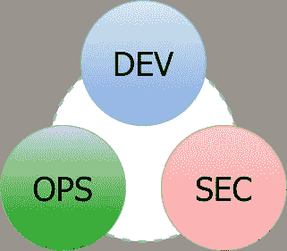

# DevSecOps 到底是什么

> 原文：<https://towardsdatascience.com/what-is-devsecops-a5f82196ad92?source=collection_archive---------47----------------------->

## 安全性必须是开发运维流程的一部分，不能分割。

我说的是坏消息。你的 DevOps 流程需要改变。你可能会迷失方向，因为我要求改变你的部署程序。你花了很多时间创建一个 DevOps 流程，一切都运行良好。那为什么要改呢？当您进行手动部署时，您可能会问同样的问题，我们第一次谈到了 DevOps。IT 趋势瞬息万变，我们需要适应变化。在这种情况下，我们不是在谈论一些惊天动地的事情，而是对效率的重大改善。

现在的话题是关于安全的。拥有一个工作项目是如此的困难，以至于我们经常看到安全问题就像一个冗长乏味的步骤被留在了最后。类似于最终检查。现在，没有安全漏洞的空间了。我们的应用程序和它们管理的信息是如此珍贵，以至于我们需要将安全问题作为需求的一部分。我们不能丢下安全小组不管。他们不是坏人。这就是为什么我们需要让他们参与开发过程，减少摩擦和预防问题。

在本文中，我们将了解 SecOps，以及如何集成到实际的 DevOps 实践中来帮助实现精益和高效的流程。

沃纳·莫泽达[皮克斯拜](https://pixabay.com/it/?utm_source=link-attribution&utm_medium=referral&utm_campaign=image&utm_content=265130)

# 什么是 DevSecOps？

在首字母缩写的噩梦中，DevSecOps 不是另一个弗雷迪·克鲁格。我不喜欢缩写，但是我们需要给事物命名😃

在开始定义之前，我们需要对以前的文章做一个简单的总结。我们有:

*   DevOps 是开发和运营的融合，
*   [FinOps](https://medium.com/better-programming/devops-noops-finops-64e0df91bcb8) 财务与运营的融合
*   NoOps 的目标是创建一个独立工作的流程，

现在我们有了 DevSecOps，它是开发、安全和运营的混合体！这很清楚，如图所示。

作为开发、安全和运营的组成部分。丹尼尔·丰塔尼的照片。

换句话说，DevSecOps 是 DevOps 的发展，我们明确地关注安全角色。安全主题现在是所有团队成员的共同责任。

# 为什么我们需要给保安更多的证据？

这个问题与安全重要性无关。每个应用程序应该工作，但也需要安全。这是必不可少的要求，安全的作用不是题目。我们谈论的是部署应用程序的过程。试着忘记 DevOps 和我们现在拥有的所有好东西，只考虑经典的部署过程。流程是，开发人员构建应用程序，将工件交给系统管理员，在一些测试环境中部署，最后，安全部门在投入使用之前进行一些检查。这听起来很古老，但是，简单地说，这就是我们的过程。由于我们在运营和开发团队之间的互动上存在的所有问题，我们明白我们需要一个新的、更加敏捷的过程，在这个过程中，他们一起工作，共享知识和责任。

DevSecOps 哲学背后的主要思想是，我们需要在安全性方面做同样的事情。这导致一个扩大的团队开始考虑安全性，因为项目移动了第一步，正如 DevOps 案例中的部署一样。

# DevSecOps 有什么优势？

DevSecOps 创建了一个在开发过程中测试 SecOps 主题的循环实践。这样做，您将减少团队之间的摩擦，并且您避免了这样一种棘手的情况，即功能，或者更糟糕的是整个应用程序，已经完成，并且您需要与 SecOps 团队一起在发布前一天匆忙地解决问题。如果安全检查是自动化的，并且在第一个开发日就完成了，你就不会在这个问题上跑了，因为你会被及时注意到，你就能够解决它们并防止它们的扩散。

# DevSecOps 在实践中如何工作

DevSecOps 不是黑魔法。就像简单的 DevOps 一样，它基于工具并从自动化中获取动力。第一步是拥有安全检查的自动化工具，这可以从 SecOps 团队中找到。下一步是将它们自动化，这样就不需要人工去按按钮了。这一步可能有点难，但是大多数测试是由自动化工具完成的，您可以从测试的子集开始。一旦有了这些，为什么不集成到部署管道测试中呢？这将给你带来双重优势:

1.  您被迫从一开始就集成安全性，这将防止不良意外
2.  您的每个部署都将被自动检查，所以您不会有倒退

除此之外，当你需要的时候，你仍然可以运行手动或者监督的测试，但是很明显，你能自动化多少和更容易将是过程管理。

# 带什么回家

我在德弗塞科普斯没有看到任何改变生活的东西。在这个过程中集成 SecOps 是聪明的，也就是说。但是随着从孤立的部门到开发团队的趋势，合作和建立共同责任感的好处是显而易见的。这就是为什么我认为 DevSecOps 是 DevOps 的自然发展，如果安全性在您的项目中很重要，那么以一种整体的方式处理它，用一种结构良好的方法是最好的解决方案。反正有个项目安全性不重要？