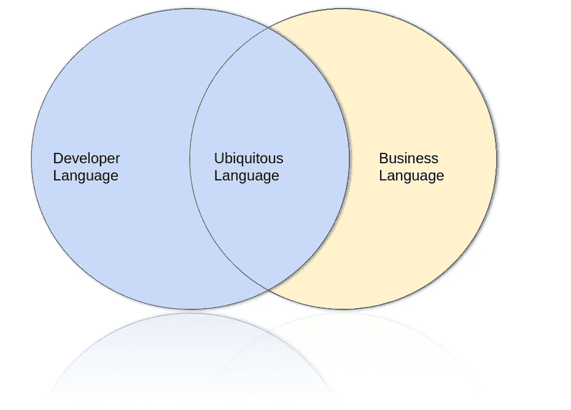

# 什么是领域驱动设计？

> 原文：<https://towardsdatascience.com/what-is-domain-driven-design-5ea1e98285e4?source=collection_archive---------2----------------------->

## 6 关于领域驱动设计的面试问题和答案

照片由[德鲁·海斯](https://unsplash.com/@drew_hays?utm_source=medium&utm_medium=referral)在 [Unsplash](https://unsplash.com?utm_source=medium&utm_medium=referral) 上拍摄

这是前一阵子的事了。工作日已经结束，之后，我将参加一个潜在新客户的面试。在面试中，感觉面试官分享了相同的关于软件开发的想法，他们的产品看起来很有前途。一切都很顺利——直到——不幸的是，面试官问:“什么是领域驱动设计？”

想象你坐在那里。你会说什么？对于领域驱动设计这样一个宽泛的概念，很难给出一个很好的定义，不是吗？你从哪里开始？

很难令人信服地回答这个问题。如果不是这样，每个人都会完美地应用领域驱动设计。然后在 2003 年，埃里克·埃文斯就不会需要 560 页来写一本关于它的书。面试官希望听到的是热情和渴望学习。相反，他经历了尴尬的沉默。

他没有看到被采访者正试图在他的头脑中形成一个关于这个问题的所有概念的定义。采访者看不到这一点，事实上，我们不能因此而责怪他。大声思考是受访者的工作。提示:大声想出来，如果你不知道什么，至少说你想学。

在这篇博文中，让我们来看一下六个重要的概念。如果你遇到同样的问题，告诉你的面试官这是一个非常宽泛的概念。并且告诉他/她你对领域驱动设计的一些重要概念有所了解。讨论一些。如果你不想从读一本 560 页的书开始，可以从这里开始。之后，你会明白领域驱动设计是怎么回事。

## 1.什么是“域”？

正在开发的应用程序所应用的主题领域称为领域。当开发一个应用程序时，了解它应用的环境总是好的。有时，一个组织可以活跃于多个领域。例如，一个公司可以同时从事销售、运输和维修。

一个组织可以针对子领域进行不同的组织。如果你是开发销售的应用，最好从“销售”来看。所开发的应用程序的语言将与业务保持一致，应用程序总体上将更有意义( [E .埃文斯，2003](https://isbnsearch.org/isbn/0321125215) )。

## 2.什么是“有界语境”？

在领域驱动开发中，“有界上下文”是一个重要的概念。它给出了关于如何处理大型领域模型和大型组织的更多信息。为了处理一个大的模型，你可以把模型分成不同的区域，我们称之为“有界环境”。

一个组织可以分为销售部门和支持部门，每个部门都在其上下文中运行。通过在有限的环境中工作，工作变得更容易，更有条理( [M .福勒，2014](https://martinfowler.com/bliki/BoundedContext.html) )。

## 3.「无处不在的语言」是什么意思？

基本上，无处不在的语言是开发团队和领域专家共享的语言。因为他们必须紧密合作来创建一个短的反馈回路，这是非常有意义的。

这种语言不仅要在领域模型中使用，还要在应用程序的代码中使用。如果开发团队和业务团队不合作，他们开发自己语言的机会就会增加。这可能会在他们之间引入语言障碍( [DDD，2019](https://thedomaindrivendesign.io/developing-the-ubiquitous-language/) )。

让我们总结一下这种无处不在的语言的一些关键特征:

*   必须在领域模型中表达。
*   将“技术性的”开发人员语言排除在领域模型之外，这是领域专家无法理解的。
*   减少领域专家引入领域模型的矛盾和不准确性。
*   随着应用程序的增长而发展。

## 4.什么是“反腐败层”？

为了防止两个领域互相污染，你必须在它们之间建立一个边界。每个领域都有其无处不在的语言和领域模型。

反腐败层在两个域模型之间进行转换。该层可以是单向或双向的，并且通常由众所周知的模式(例如适配器、外观、转换器)来实现。我们必须记住，创建一个反腐败层可能非常耗时。只有当你想保护你的领域不受外界影响时才应该使用它( [A Shirin，2018](https://dev.to/asarnaout/the-anti-corruption-layer-pattern-pcd) )。

## 5.“实体”和“值对象”有什么区别？

理解实体和值对象之间的区别对于在应用程序中模拟真实世界很重要。我在这里列出他们之间的主要区别( [V Khorikov，2016](https://enterprisecraftsmanship.com/posts/entity-vs-value-object-the-ultimate-list-of-differences/) ):

*   **身份**:值对象没有身份，而实体有。具有相同值的值对象本质上是相等的。实体是独立存在的。
*   **生命周期**:价值对象不是独立存在的，而是属于某个实体。它们可以很容易地被摧毁和创造。实体存在并有历史。

## 6.什么是“集合”？

埃里克·麦克林在 [Unsplash](https://unsplash.com?utm_source=medium&utm_medium=referral) 上的照片

聚合是一种领域驱动的设计模式。它是域对象(例如实体、值对象)的集群，被视为一个单一的单元。汽车就是一个很好的例子。它由轮子、灯和发动机组成。他们在概念上属于一起。

每个聚合都有一个聚合根。在我们的示例中，这可能是机箱号。它确保了骨料整体的完整性。每个集合表示一个事务边界。

## 结论

这些问题的答案应该让你对领域驱动设计的确切含义有一个很好的了解。不要认为这是一个完整的指南。关于这个主题已经写了很多，你可以读几本这方面的书。

如果你有这方面的必读材料，分享一下吧。回应这个故事，做个英雄。560 页之后，我觉得我才刚刚开始我的 DDD 之旅。