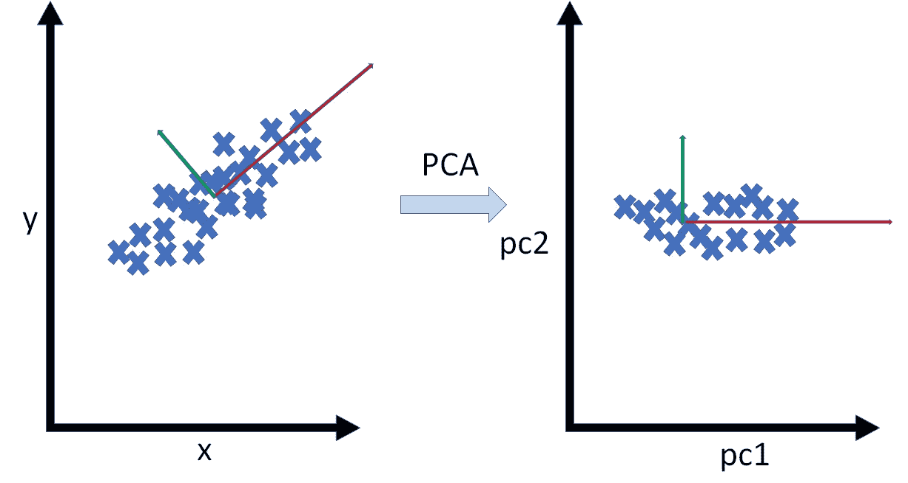

# EDA 是什么？是的，关于 EDA 的另一个帖子

> 原文：<https://towardsdatascience.com/what-is-eda-yes-another-post-on-eda-d8b5c06269a9?source=collection_archive---------26----------------------->


马库斯·斯皮斯克在 [Unsplash](https://unsplash.com/s/photos/math?utm_source=unsplash&utm_medium=referral&utm_content=creditCopyText) 上的照片

## 通过 EDA 库、特征重要性、特征选择和特征提取，使您的数据美观易懂

> 包含所有相关代码的笔记本可以在 [GitHub](https://github.com/Christophe-pere/EDA) 上找到。

# I —探索性数据分析或通常的 EDA

是的，这是许多关于 EDA 主题的文章中的一篇新文章。这一步是数据科学项目中最重要的一步。为什么？因为它允许你获得关于你的数据、想法和直觉的知识，以便能够在以后对数据建模。

EDA 是让数据说话的艺术。能够控制它们的质量(丢失的数据、错误的类型、错误的内容……)。能够确定数据之间的相关性。能够知道基数。

EDA 不仅仅是探索数据。当你有一个目标，一列包含标签(监督学习)你也有特征选择和特征重要性。没有标签，你就有了特征提取(无监督学习)。

多年来，最好的方法是不厌其烦地编写相同的函数来计算相关性，绘制变量，手动浏览列来计算感兴趣的变量，等等…

但是现在有更简单、更快速、更有效的方法来完成所有这些:

## 内务部。熊猫-侧写

首先， [pandas-profiling](https://pandas-profiling.github.io/pandas-profiling/docs/master/rtd/pages/introduction.html) 创建关于*数据帧*内容的报告，采用 HTML 格式，界面非常友好。基于 pandas，它允许以优异的性能(高达一百万行，这是作者推荐的最大值)对数据进行完整的探索。该报告可以通过 *jupyter lab* 或*笔记本*中的小工具进行整合。或者，它也可以呈现为一个框架。

正如作者指出的，您将获得以下信息:

> **类型推断**:检测数据帧中列的类型。
> 
> **要素**:类型、唯一值、缺失值
> 
> **分位数统计**如最小值、Q1、中值、Q3、最大值、范围、四分位间距
> 
> **描述性统计**如均值、众数、标准差、总和、中位数绝对偏差、变异系数、峰度、偏度
> 
> **最频繁值**
> 
> **直方图**
> 
> **相关性**突出显示高度相关的变量、Spearman、Pearson 和 Kendall 矩阵
> 
> **缺失值**缺失值的矩阵、计数、热图和树状图
> 
> **重复行**列出最常出现的重复行
> 
> **文本分析**了解文本数据的类别(大写、空格)、脚本(拉丁文、西里尔文)和块(ASCII)
> 
> 资料来源:[熊猫简介](https://pandas-profiling.github.io/pandas-profiling/docs/master/rtd/pages/introduction.html)

您可以在库的 ***GitHub*** 页面上找到示例，例如:

*   [NASA 陨石降落](https://pandas-profiling.github.io/pandas-profiling/examples/master/meteorites/meteorites_report.html)这个报告是 *profil_report()* 函数的输出，它显示了这个库是多么强大。

怎么用？让我用几行代码向您展示:

与硬编码的东西相比，它需要几秒钟来计算，并得到令人印象深刻的结果。

在小部件中显示报告时的结果:


pandas-widget 中的配置文件报告(渲染)

当您在笔记本内部的框架中显示报告时，结果是:


熊猫-在框架中分析 HTML(渲染)

## Ib。Dataprep.eda

另一个很棒的库是 ***dataprep*** 带模块 ***eda*** 。它在做什么？

您有三个主要功能:

*   **剧情**

```
plot(df)
```


波士顿房价数据集上 dataprep.eda 包的绘图函数

该函数将显示每个特征的直方图。每个情节都基于**散景**库进行交互。您可以使用不同的参数来显示所需数据的信息。

*   **plot_correlation**

```
plot_correlation(df)
```

该函数允许您计算三种相关矩阵(Pearson、Spearman 和 KendallTau)。其优点是该图也是交互式的，只需将光标放在上面就可以看到数值。


波士顿房价数据的 plot_correlation

*   **剧情 _ 失踪**

```
plot_missing(df)
```

最后一个函数非常有趣，如下图所示。它允许您可视化列中缺失数据的位置及其百分比。


plot_missing 函数

## Ic。Sweetviz

最后一个有趣的库是 [sweetviz](https://github.com/fbdesignpro/sweetviz) 。基于 pandas-profiling，该库允许比较不同列或训练和测试数据部分，以确定测试集是否代表训练。就像熊猫简介一样，每一栏都有大量的信息。下图是库生成的 HTML 报表的仪表盘。


使用 Sweetviz 进行训练和测试的比较

# II —特征选择

EDA 不仅仅关注数据内部的内容。还可以通过以下几个部分进行更深入的分析。要素选择是减少数据集中要素数量的一种方式。

在这里，我只提出三种方法。 [sklearn](https://scikit-learn.org/) 库拥有强大的模块来做你想要的选择或提取数据的工作。

## IIa。移除低方差特征

这种技术只允许我们选择方差低于阈值的特征。默认情况下，它会移除所有零方差要素，即在所有样本中具有相同值的要素。在下面的代码中，丢失 80%以上数据的列将被自动删除。

```
from sklearn.feature_selection import VarianceThreshold
threshold = 0.8 *# 80% of low variance*fe_low_variance = VarianceThreshold(threshold=(threshold * (1 - threshold)))
X_variance = fe_low_variance.fit_transform(X)
```

## 联合调查局。单变量选择

在监督学习中，你有一个目标特征(俗称 ***y*** )。单变量选择的目标很简单:选取一个特征，对其进行变异，并观察这如何影响目标。最后，单变量选择将基于单变量统计测试选择最佳特征。

有了 sklearn，你有 4 种方法可以做到。

*   [**【select kbest**](https://scikit-learn.org/stable/modules/generated/sklearn.feature_selection.SelectKBest.html#sklearn.feature_selection.SelectKBest):这将选择数据集的最佳 k(由用户手动选择)特征，并移除其他特征。这个函数需要一个计分器，一个度量函数来应用选择。常用的计分器功能有[***chi2***](https://scikit-learn.org/stable/modules/generated/sklearn.feature_selection.chi2.html#sklearn.feature_selection.chi2)。
*   [**select percentile**](https://scikit-learn.org/stable/modules/generated/sklearn.feature_selection.SelectPercentile.html#sklearn.feature_selection.SelectPercentile):与 *SelectKBest* 相同你需要传递一个计分器，但是你传递的不是一个 ***k*** 数量的特征，而是一个百分位值。
*   [**SelectFpr**](https://scikit-learn.org/stable/modules/generated/sklearn.feature_selection.SelectFpr.html#sklearn.feature_selection.SelectFpr)**/**[**SelectFdr**](https://scikit-learn.org/stable/modules/generated/sklearn.feature_selection.SelectFdr.html#sklearn.feature_selection.SelectFdr)**/**[**SelectFwe**](https://scikit-learn.org/stable/modules/generated/sklearn.feature_selection.SelectFwe.html#sklearn.feature_selection.SelectFwe):由 ***pvalues*** 根据误报率、误发现率和族错误进行选择。
*   [**GenericUnivariateSelect**](https://scikit-learn.org/stable/modules/generated/sklearn.feature_selection.GenericUnivariateSelect.html#sklearn.feature_selection.GenericUnivariateSelect):在这里您可以用可配置的策略定制您的估计器。

在下面的代码中我使用了***SelecKBest***with***chi2***scorer:

```
from sklearn.feature_selection import SelectKBest
from sklearn.feature_selection import chi2#apply SelectKBest class to extract top 10 best features
select_best_features = SelectKBest(score_func=chi2, k=10) *# where k is the number of features you want*
fit = select_best_features.fit(X,y)
df_scores = pd.DataFrame(fit.scores_)
df_columns = pd.DataFrame(X.columns) *# where X is your data*
#concat two dataframes for better visualization 
feature_scores = pd.concat([df_columns,df_scores],axis=1)
feature_scores.columns = ['Specs','Score']  #naming the dataframe columns
print(feature_scores.nlargest(10,'Score'))  #print 10 best features
```

## IIc。递归特征消除

如下图所示，RFE 的原理很简单。估计器拟合数据并计算特征重要性(目标上数据的权重)。在每次迭代中，模型将删除重要性较低的特征，直到达到所需的 ***k*** 个特征的数量。


RFE 的图式

我们该如何编码呢？我在这里展示了 ***、SVM*** 和 ***逻辑回归*** 的一个实现。

SVM:

```
from sklearn.svm import SVC
from sklearn.model_selection import StratifiedKFold
from sklearn.feature_selection import RFECV*# SVM implementation*
svc = SVC(kernel="linear")
*# The "accuracy" scoring is proportional to the number of correct*

rfecv = RFECV(estimator=svc, step=1, cv=StratifiedKFold(5),
                  scoring='accuracy')
rfecv.fit(X, y)print("Optimal number of features : %d" % rfecv.n_features_)
```

**逻辑回归:**

```
*# Feature Extraction with RFE*
from sklearn.feature_selection import RFE
from sklearn.linear_model import LogisticRegressionmodel = LogisticRegression(solver='lbfgs', max_iter=5000)
rfe = RFE(model, 3)
fit = rfe.fit(X, Y)
print("Num Features: %d" % fit.n_features_)
print("Selected Features: %s" % fit.support_)
print("Feature Ranking: %s" % fit.ranking_)
```

## IId。SelectFromModel

最后一种方法是前一种方法的推广，因为***SelectFromModel***采用 ***估计器*** 并返回一个包含缩减维度的新矩阵。

下面的代码显示了如何实现它:

```
from sklearn.svm import LinearSVC
from sklearn.feature_selection import SelectFromModellsvc = LinearSVC(C=0.01, penalty="l1", dual=False) *# estimator*
lsvc.fit(X, y)
model = SelectFromModel(lsvc, prefit=True)
X_new = model.transform(X)
print(f"The new number of feature is {X_new.shape[1]}")
```

# III —特征提取

## IIIa。主成分分析

主成分分析是一种用于降低数据集维度的方法。原理很简单，PCA 会用一条线或一个平面来拟合这些点，以创建数据的另一种表示。



主成分分析投影

代码使用起来很简单。你只需要指定 N_var 参数，它代表你想要的维数。

```
from sklearn.decomposition import PCA
N_var = 2
pca = PCA(n_components=N_var)
X_pca = pca.fit_transform(X)
df_pca = pd.DataFrame(data = X_pca, columns = ['PC1', 'PC2'])
```

## IIIb。独立成分分析

ICA 是分离线性混合的多变量独立信号的一种强有力的技术。这项技术允许我们在信号处理中分离不同的信号。

下面的代码显示了一个 ***FastICA*** 的实现:

```
from sklearn.decomposition import FastICA
N_var = 2
ica = FastICA(n_components=N_var)
X_ica = ica.fit_transform(X)
```

## IIIc。线性判别分析(LDA)

> LDA […]是对 **Fisher 线性判别式**的推广，这是一种在[统计](https://en.wikipedia.org/wiki/Statistics)、[模式识别](https://en.wikipedia.org/wiki/Pattern_recognition)和[机器学习](https://en.wikipedia.org/wiki/Machine_learning)中使用的方法，用于寻找[特征](https://en.wikipedia.org/wiki/Features_(pattern_recognition))的[线性组合](https://en.wikipedia.org/wiki/Linear_combination)，以表征或分离两类或更多类的对象或事件。得到的组合可以用作[线性分类器](https://en.wikipedia.org/wiki/Linear_classifier)，或者更常见的是，在稍后的[分类](https://en.wikipedia.org/wiki/Statistical_classification)之前用于[维度缩减](https://en.wikipedia.org/wiki/Dimensionality_reduction)。[(来源:维基百科)](https://en.wikipedia.org/wiki/Linear_discriminant_analysis)

与 sklearn 一起使用的简单方法:

```
from sklearn.discriminant_analysis import LinearDiscriminantAnalysis
N_var = 2
lda = LinearDiscriminantAnalysis(n_components=N_var)*# run an LDA and use it to transform the features*
X_lda = lda.fit(X, y).transform(X)
```

## IIId。局部线性嵌入(LLE)

像所有以前的特征提取方法一样，LLE 是一种无监督的降维技术(n 维到 k 维，其中 k 是确定的)。目标是保留原始非线性特征结构的几何特征。LLE 是基于 ***k 近邻*** (k-NN)技术。该算法将计算聚类，估计每个聚类的中心，并将其映射为线性加权表示。因此，聚类中包含的点在这个向量中是近似的，它最好地再现了聚类。

实施:

```
from sklearn.manifold import locally_linear_embedding
N_var = 2
lle, error = locally_linear_embedding(X, n_neighbors=5, n_components=N_var, random_state=42, n_jobs=-1)
```

## IIIe。t 分布随机邻居嵌入(t-SNE)

> **T-分布式随机邻居嵌入(t-SNE)** 是由 [Laurens van der Maaten](https://en.wikipedia.org/w/index.php?title=Laurens_van_der_Maaten&action=edit&redlink=1) 和 [Geoffrey Hinton](https://en.wikipedia.org/wiki/Geoffrey_Hinton) 开发的用于[可视化](https://en.wikipedia.org/wiki/Data_visualization)的[机器学习](https://en.wikipedia.org/wiki/Machine_learning)算法。[【2】](https://en.wikipedia.org/wiki/T-distributed_stochastic_neighbor_embedding#cite_note-MaatenHinton-1)这是一种[非线性降维](https://en.wikipedia.org/wiki/Nonlinear_dimensionality_reduction)技术，非常适合在二维或三维的低维空间中嵌入用于可视化的高维数据。具体而言，它通过二维或三维点对每个高维对象进行建模，以这种方式，相似的对象通过附近的点进行建模，而不相似的对象通过远处的点以高概率进行建模。([来源:维基百科](https://en.wikipedia.org/wiki/T-distributed_stochastic_neighbor_embedding#cite_note-MaatenHinton-1))

***t-SNE*** 通常被比作 ***PCA*** 因为用 ***t-SNE*** 比 ***PCA*** 对数据的可视化表示更好。 ***t-SNE*** 比 ***PCA*** 更精确地分离尺寸。

在 [sklearn](https://scikit-learn.org/stable/modules/generated/sklearn.manifold.TSNE.html) 中提供了一个简单的实现:

```
from sklearn.manifold import TSNE
N_var = 2
X_embedded = TSNE(n_components=N_var).fit_transform(X)
```

# VI —特征重要性

## VIa。树形方法

树算法中的每个节点都是表示数据的一种方式。节点允许将要素的值(概率)分割成单个值。这种表示导致要素权重的确定(您想要预测的要素)。因此该算法可以计算目标上每个特征的重要性。您可以使用树模型的***feature _ importance _***参数来显示每个特征的值和标准差。

这里我提供了两种使用基于树的方法来计算这个特性重要性的方法。第一个使用*(我过去经常使用它来确定我的特征的重要性)和 ***RandomForest*** 。*

```
**from sklearn.ensemble import ExtraTreesClassifier
forest = ExtraTreesClassifier(n_estimators=250,
                                  random_state=0)forest.fit(X, y)
importances = forest.feature_importances_
std = np.std([tree.feature_importances_ for tree in forest.estimators_],axis=0)
indices = np.argsort(importances)[::-1]*# Print the feature ranking*
print("Feature ranking:")for f in range(X.shape[1]):
    print("%d. feature %d (%f)" % (f + 1, indices[f],   importances[indices[f]]))**
```

*****RandomForest:*****

```
**from sklearn.ensemble import RandomForestRegressorrf = RandomForestRegressor(n_estimators = 100,
                               n_jobs = -1,
                               oob_score = True,
                               bootstrap = True,
                               random_state = 42)
rf.fit(X, y)print('R^2 Training Score: {:.2f} \nOOB Score: {:.2f} '.format(rf.score(X, y), rf.oob_score_,))results = pd.DataFrame(data=rf.feature_importances_, index=X.columns)
results.columns = ["Importance"]
results.sort_values(by=["Importance"], ascending=False)
importances = rf.feature_importances_**
```

## **VIb。排列方法**

**在这篇文章中，你将看到的最后一件事是排列方法。目标很简单。估计器将采用与目标相关的特征，并将其混洗以测量其与目标的关联程度。它决定了估计器如何依赖于该特征。**

> **这种技术受益于模型不可知，并且可以用特征的不同排列进行多次计算。([来源:sklearn](https://scikit-learn.org/stable/modules/permutation_importance.html) )**

**这里，我提供了使用置换方法的三个实现。第一个包由[RF pipe](https://github.com/parrt/random-forest-importances)提供:**

```
**from sklearn.metrics import r2_score
from rfpimp import permutation_importancesdef r2(rf, X_train, y_train):
    return r2_score(y_train, rf.predict(X_train))perm_imp_rfpimp = permutation_importances(rf, X, y, r2)
importances = perm_imp_rfpimp.Importance**
```

**eli5 库提供了一个版本的[置换重要性](https://eli5.readthedocs.io/en/latest/blackbox/permutation_importance.html):**

```
**import eli5
from eli5.sklearn import PermutationImportanceperm = PermutationImportance(rf, cv = None, refit = False, n_iter = 50).fit(X, y)
results = pd.DataFrame(data= perm.feature_importances_, index=X.columns)
results.columns = ["Importance"]
results.sort_values(by=["Importance"], ascending=False)
importances = perm.feature_importances_**
```

**[置换 _ 重要性](https://scikit-learn.org/stable/modules/generated/sklearn.inspection.permutation_importance.html#sklearn.inspection.permutation_importance)通过基于 R2 估计的 sklearn:**

```
**from sklearn.linear_model import Ridge
from sklearn.inspection import permutation_importance

X_train, X_val, y_train, y_val = train_test_split(
         X, y, random_state=42)

model = Ridge(alpha=1e-2).fit(X_train, y_train)

r = permutation_importance(model, X_val, y_val,
                               n_repeats=30, random_state=42)

for i in r.importances_mean.argsort()[::-1]:
    if r.importances_mean[i] - 2 * r.importances_std[i] > 0:
        print(f"{r.importances_mean[i]:.3f}"
                   f" +/- {r.importances_std[i]:.3f}")**
```

# **结论**

**嗨，你终于做到了。你已经到达这篇关于 EDA 和其他技术的文章的末尾。你知道如何用不同的库做 EDA。您知道选择数据集最佳要素的不同方法、降维以及要素重要性。现在，您已经准备好深入探索您的数据，并以可视化的方式表示它。我希望这篇文章和相关的笔记本能帮助你。**

# **参考**

**[2]范德马腾，法学家委员会；Hinton，G.E. [“使用 t-SNE 可视化数据”](http://jmlr.org/papers/volume9/vandermaaten08a/vandermaaten08a.pdf)(2008 年 11 月)。*机器学习研究杂志*。9:2579–2605。**

## **注意**

**本文中提供的图片由作者生成或由他绘制。**