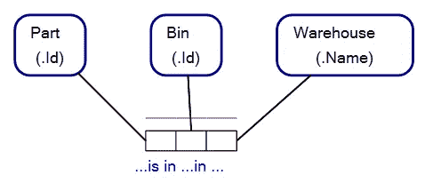
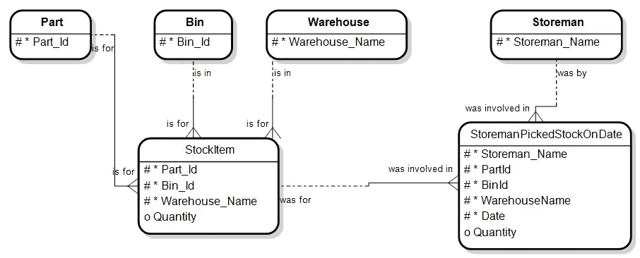
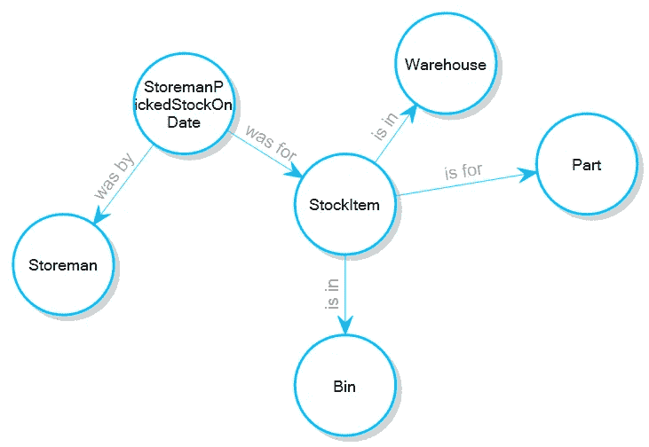
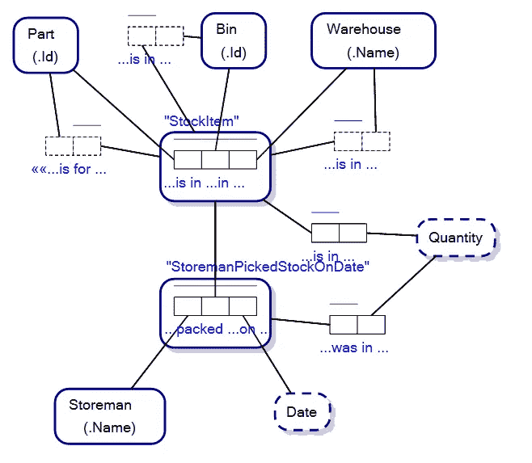
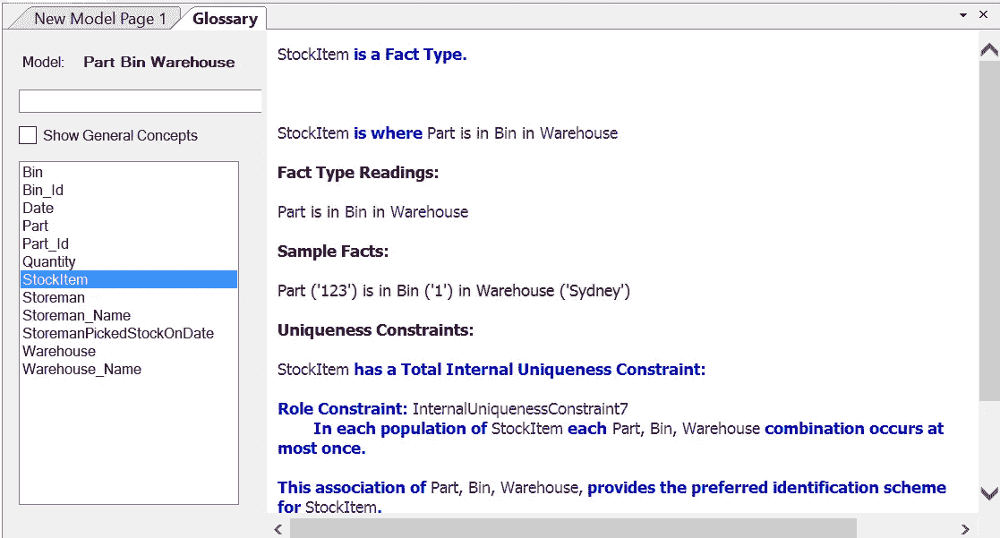
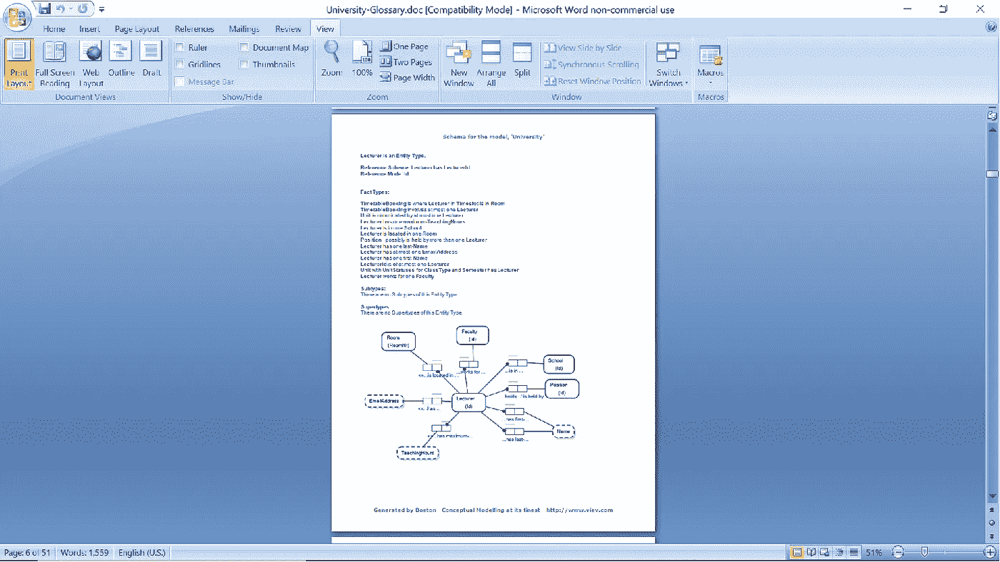
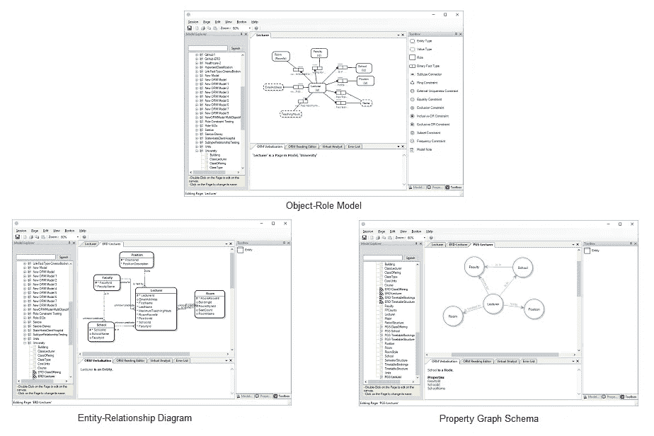

# 什么是基于事实的建模？

> 原文：<https://towardsdatascience.com/what-is-fact-based-modelling-106ba15649fa?source=collection_archive---------34----------------------->

基于事实的建模是一种概念建模，其中关键数据结构，即*事实类型*，对*事实*进行操作。

有一些基于事实的模型是图形化的，还有一些是基于文本的。

基于图形事实的建模方法包括[对象角色建模(ORM)](/why-learn-object-role-modelling-4eebd93dcda2) 、[全面向沟通的信息建模(FCO-IM)](https://en.wikipedia.org/wiki/FCO-IM) 和[认知(CogNIAM)](https://en.wikipedia.org/wiki/Cognition_enhanced_Natural_language_Information_Analysis_Method)。基于文本的基于事实的建模包括星座查询语言。

## 什么是事实？

事实是这样的陈述:

> "零件‘123’在仓库‘悉尼’的‘H2’箱里. "

事实为所谓的*事实类型*提供数据和结构。上述事实的事实类型读数为:

> “零件在仓库的箱子里”

事实类型的读数称为*事实类型读数*。基于事实的建模对一个[论域(UoD)](https://en.wikipedia.org/wiki/Domain_of_discourse) 进行建模，这是模型所研究的主题领域。

下图是一个简单的对象-角色模型，带有一个事实类型及其相关的事实类型读数。

对象-角色建模是一种基于事实的建模

基于事实的建模的历史可以追溯到 20 世纪 70 年代，它诞生于以图形方式描述存储事实数据的数据库结构的愿望*和*将自然语言融入其中。FBM 在模型构造中采用自然语言有助于模型的解释。其他类型的概念建模也在模型的构造中包括自然语言，如下面的实体关系图，它也将库存项目建模为仓库中的一个箱中的部件。

实体关系图

实体关系图中的*库存项目*实体存储仓库中仓位的零件信息，但 ERD 不表示事实类型读数为“*零件在仓库的仓位中”。*

类似地，属性图模式可能有一个库存项目节点和一个边，该边表示某个特定库存项目是针对某个零件的，但不是事实类型“零件在仓库的箱中”。

属性图模式

当作为对象-角色模型创建时，基于事实的建模与实体关系图和属性图模式的不同之处在于，fbm 显示了更多的语义信息，并且将显示不仅库存项目*是针对* (a)零件的，而且每个库存项目是针对(a)仓库中(a)箱中的零件的。

对象-角色模型

因为基于事实的模型语义丰富，基于事实建模的软件可以用自然语言*描述*实体/节点及其关系，这样人们就很容易理解他们在看什么。基于事实的建模工具可以用自然语言提供模型的术语表视图:

自然语言中基于事实的建模术语表示例

如果您是一名业务分析师，需要生成论域的文档，使用适当的基于事实的建模工具，您可以用自然语言生成文档，并带有调查区域的图片。如果您需要有人在数据库/模型模式上签字，这很有帮助:

基于事实的模型文档示例

这是对基于事实的建模的简要概述。总的来说，基于事实的建模语言(如对象-角色建模)的语义丰富性提供了最有益的概念建模体验。

用基于事实的建模语言创建的模型可以很快很容易地转换成实体关系图和属性图模式，如果你的读者喜欢的话，那么使用正确的工具，你就不会局限于基于事实的建模。

感谢您的阅读。如果时间允许，我会写更多基于事实的建模。

— — — — — — — — — — — — —