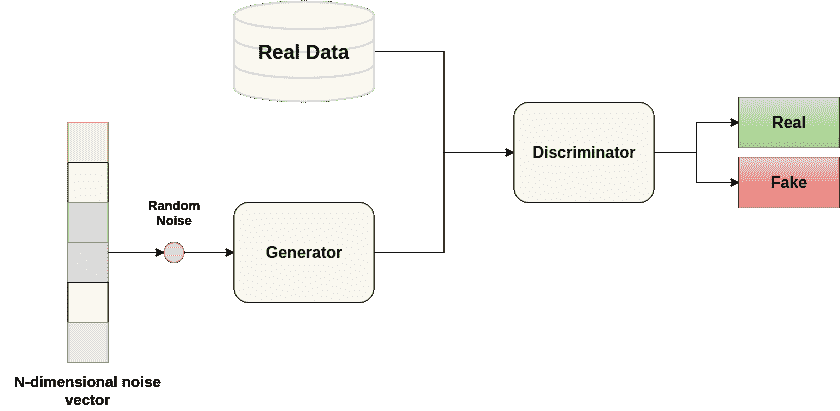
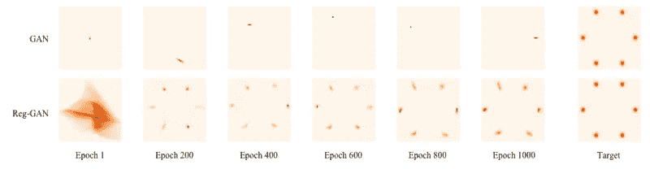
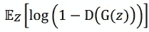
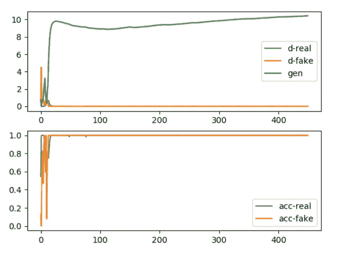
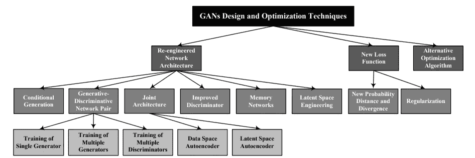

# 我的甘怎么了？

> 原文：<https://towardsdatascience.com/what-is-going-on-with-my-gan-13a00b88519e?source=collection_archive---------29----------------------->

## GANs 的挑战、解决方案和未来

生成对抗网络是一类新的深度生成模型，近年来受到广泛关注。我过去曾以非常概括的方式介绍过它们([表格合成数据](https://medium.com/ydata-ai/generating-synthetic-tabular-data-with-gans-part-1-866705a77302?source=friends_link&sk=beee724f8445a7f9ed66aaf41660325c) —第 1 部分和[表格合成数据](https://medium.com/ydata-ai/generating-synthetic-tabular-data-with-gans-part-1-866705a77302?source=friends_link&sk=beee724f8445a7f9ed66aaf41660325c) a —第 2 部分)，并特别关注它们在[合成表格数据](https://ydata.ai/?utm_source=medium&utm_medium=signature&utm_campaign=blog)中的应用。但今天，重点将有所不同——在一系列文章中，我将涵盖你在训练 GANs 时可以发现的挑战、最常见的解决方案以及文学的未来方向。这篇评论的灵感来自这篇关于 GANs 挑战、解决方案和未来的精彩文章[——我强烈建议你深入了解一下。](https://arxiv.org/pdf/2005.00065.pdf)

# 生成对抗网络

近年来，生成模型被广泛应用于各种各样的实际应用中。“生成模型”可以被定义为计算密度估计的模型，其中模型分布被学习来近似真实数据分布。

这带来了一些挑战，因为研究表明最大似然法不是一个好的选择，会导致样本过于一般化和不可行。

生成对抗网络(GANs)可以通过引入鉴别器网络来解决这一问题，该鉴别器网络能够鉴别原始数据样本和由模型生成的样本。

生成对抗网络体系结构

它们具有广泛的应用范围，因为它们能够通过图像、音频和数据进行隐式学习，而这些图像、音频和数据很难用显式可能性进行建模。

# 挑战

在某些应用领域，GANs 可能非常有用，也相当具有破坏性，但是，就像在所有事情中一样，这是在它们的好处和我们在使用它们时容易发现的挑战之间的权衡。我们可以将 GANs 面临的挑战分为三个主要问题:

*   模式崩溃
*   不收敛和不稳定
*   对超参数和评估指标高度敏感

## 为什么模式崩溃？🔥

GAN 有时会受到生成的样本很少代表总体的限制，这意味着，例如，在 MNIST 数据集上训练 GAN 后，可能会发生我们的生成器无法生成与数字 0 不同的数字。这种情况被称为模式崩溃。

主要缺点是，由于目标函数的原因，GANs 无法集中于整个数据分布。一些实验表明，即使对于双模态分布，GANs 也倾向于产生与主模态的良好拟合，难以推广。总之，模式崩溃是泛化能力差的结果，可分为两种不同类型:

*   来自输入数据的大多数模式在生成的数据中不存在
*   生成器仅学习特定模式的子集。

用香草甘训练时模式崩溃的例子。https://arxiv.org/pdf/1612.02136.pdf

模式崩溃的原因可能各不相同，从不合适的目标函数到所选 GAN 架构在考虑分析数据时的影响。但是不要再害怕了，有很多选择可以解决这个问题，很多人都在努力应对这个特殊的挑战。

## 不收敛和不稳定

GAN 由两个网络组成，并且每个网络都有其损耗函数，这一事实导致 GAN 本质上是不稳定的——深入研究这个问题，**发生器(G)** 损耗会导致 GAN 不稳定，这可能是梯度消失问题的原因，此时**鉴别器****【D】**可以轻松区分真假样本。

鉴别器损失函数

在 GANs 架构中， **D** 试图最小化交叉熵，而 **G** 试图最大化交叉熵。当 **D** 可信度高并开始拒绝 **G** 产生的样品时，导致 **G** 的梯度消失。

收敛失败的 GANs 损失和精度。摘自一篇关于识别和诊断 GAN 故障模式的文章。归功于。[https://machine learning mastery . com/practical-guide-to-gan-failure-modes/](https://machinelearningmastery.com/practical-guide-to-gan-failure-modes/)

这可能指的是我们在训练 GANs 时针对的非凸博弈中存在局部均衡的假设，正如一篇关于 [GANs 收敛和稳定性](https://arxiv.org/pdf/1705.07215.pdf)的文章中所提出的。在文献中已经提出了一些选项来缓解这个问题，例如反转用于构建交叉熵成本的目标或者应用梯度惩罚来避免局部均衡。

## 超参数和评价呢？

没有好的超参数的选择，任何成本函数都不起作用，而 GANs 也不例外，它们对网络超参数的选择更加敏感。超参数的正确选择可能是冗长而费时的，到目前为止，大部分的努力都是在诸如模式崩溃或 GAN 的收敛问题上。

> 没有选择好的超参数，任何成本函数都不起作用！

此外，多边农业组织缺乏有意义的措施来评估其产出的质量。自创建以来，GANs 已被广泛用于各种应用领域，从监督表示学习、半监督学习、修补、去噪和[合成数据创建](https://ydata.ai/?utm_source=medium&utm_medium=signature&utm_campaign=blog)。广泛的应用带来了大量的异构性，这使得我们更难定义如何评估这些网络的平等性。因为没有定义健壮或一致的度量标准，特别是对于图像生成，所以很难评估哪些 GANs 算法优于其他算法。为了克服这一挑战，文献中提出了一系列评估方法，您可以在本文中找到关于 [GANs 评估指标](https://www.researchgate.net/publication/337876790_AN_ANALYSIS_OF_EVALUATION_METRICS_OF_GANS)的有趣细节。

# 解决方案

所涵盖的挑战，是时候检查已经提出并广泛应用于 GANs 的解决方案了。

如前所述，尽管 GANs 训练面临许多挑战，但对于模式崩溃和不收敛问题的解决方案有很多研究。下图描述了 GANs 挑战解决方案的一个有趣的分类，这让我们对文献中可用的选项有了一个很好的了解。

图片来自关于 GANs 挑战、解决方案和未来的文章。演职员表:【https://arxiv.org/pdf/2005.00065.pdf 

此外，将涵盖三个主要技术，以改善 GANs 的培训和整体效果。

## 探索新的网络架构

更好的 GAN 模型架构设计无疑是一个有效的选择。事实上，文献中有几个 GAN 是通过探索新的架构来解决特定数据挑战而产生的——例如， [CGAN](https://arxiv.org/abs/1411.1784) 是第一个提出的 GAN 架构的有条件版本，它无疑会在合成数据时带来更好的结果，另一方面， [VAE-GAN](https://arxiv.org/abs/1512.09300) 遵循编码器-编码器架构，它利用学习到的表示来更好地衡量数据空间中的相似性，从而提高视觉保真度，最后，例如， [*存储器 GAN*](https://arxiv.org/pdf/1803.01500.pdf) 遵循一种存储器架构，该架构可以缓解与无监督学习相关的两个主要问题，即**生成器**正确学习训练样本的表示的能力，以及**鉴别器**更好地记忆已经看到的生成样本的能力。

> [*内存 GAN*](https://arxiv.org/pdf/1803.01500.pdf) 遵循一种内存架构，可以缓解与无监督学习相关的两个主要问题

总之，在架构再造方面，研究将解决方案定位如下:

*   条件生成
*   生成-判别网络对
*   利用编码器加入架构
*   改进的鉴别器架构
*   探索记忆网络

## 引入新的损失函数

由于模型参数波动很大，并且可能以永不收敛的方式变化，一些人决定探索新的损失函数，以帮助 GANs 达到更好的最优。事实上，一些研究人员已经指出，选择正确的损失函数可以有效地解决训练不稳定性。损失函数的改进可以归类为新的概率距离和散度的建议，这可以解决模式崩溃问题，因为它稳定了 GAN 训练，如在 [WGAN](https://arxiv.org/abs/1701.07875) 中观察到的，或者通过引入正则化或梯度惩罚，如在 [WGAN-GP](https://arxiv.org/pdf/1704.00028.pdf) 中观察到的，这改进了之前提出的 [WGAN](https://arxiv.org/abs/1701.07875) 的训练稳定性。

## 检查替代优化算法

GANs 优化背后的概念是最小-最大博弈，这通常导致在训练过程中我们无法找到局部纳什均衡，也就是说，它们无法收敛。在文献中发现的一些文章中，已经提出了使用 [*同时梯度下降*](https://arxiv.org/pdf/1705.10461.pdf) *t* ，即使在已知难以训练的 GAN 架构上，也导致更稳定的训练和改进的收敛。

# 甘斯的未来

恭喜你！简而言之，您已经了解了在与 GANs 一起工作时发现的最常见的挑战，以及文献中最常提出的一些解决方案！从这篇综述中，可以理解，尽管在与 GANs 合作时有许多挑战需要解决，但它们无疑是近年来机器学习领域最重要的发现之一。

希望这篇评论能启发你开始挖掘这些令人惊叹的算法，并探索新的应用！

# 有用的链接

**Github Repos**

*   [https://github.com/whyjay/memoryGAN](https://github.com/whyjay/memoryGAN)
*   [https://github.com/kozistr/Awesome-GANs/tree/master/CGAN](https://github.com/kozistr/Awesome-GANs/tree/master/CGAN)
*   [https://github.com/crmaximo/VAEGAN](https://github.com/crmaximo/VAEGAN)
*   [https://github.com/martinarjovsky/WassersteinGAN](https://github.com/martinarjovsky/WassersteinGAN)
*   [https://github.com/caogang/wgan-gp](https://github.com/caogang/wgan-gp)

[*法比亚娜*](https://www.linkedin.com/in/fabiana-clemente/) *是*[*YData*](https://ydata.ai/?utm_source=medium&utm_medium=signature&utm_campaign=blog)*的首席数据官。*

**通过设计使数据在保密的情况下可用。**

[*YData 帮助数据科学团队交付 ML 模型，简化数据采集，因此数据科学家可以将时间集中在重要的事情上。*](https://ydata.ai/?utm_source=medium&utm_medium=signature&utm_campaign=blog)