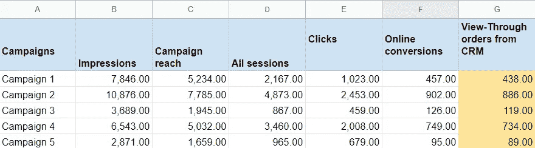
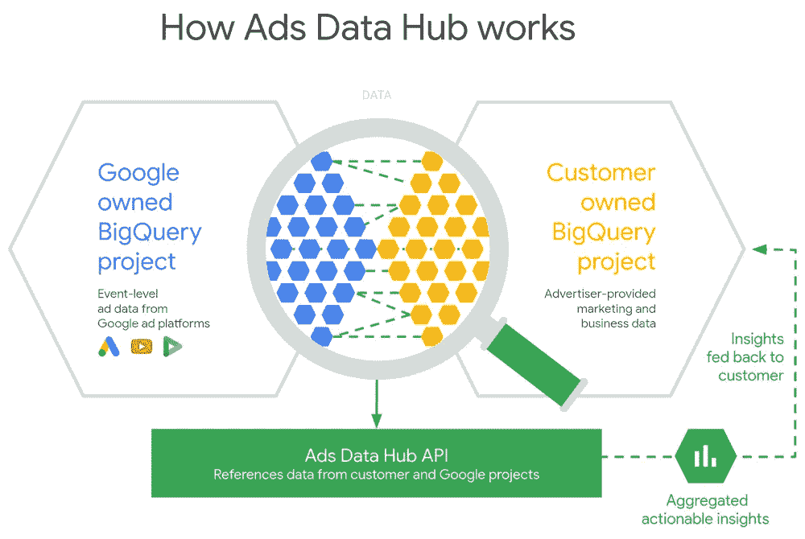

# 什么是谷歌广告数据中心？

> 原文：<https://towardsdatascience.com/what-is-google-ads-data-hub-ac914636d88?source=collection_archive---------15----------------------->

来源:[沉积照片](https://ru.depositphotos.com/154532000/stock-photo-bikes-at-googleplex-google-headquarters.html)

## 营销人员需要知道的一切

每个广告服务都有兴趣展示它是如何帮助广告商增加销售额的。为此，谷歌分析、脸书分析等服务应运而生。但是当涉及到评估媒体广告的效果时，情况就困难重重了。经典的网站分析工具无法衡量媒体广告的有效性(因为广告互动发生在广告商网站之外)，其他工具也无法给出透明的估计。

为了解决这个问题， [Google 推出了 Ads Data Hub](https://www.blog.google/products/marketingplatform/360/faster-and-easier-to-use-ads-data-hub/) ，一个评估媒体库存数据有效性的工具。它允许您将显示广告数据与网站和 CRM 数据相结合。

# Ads 数据中心是为了什么而创建的？

有经典的[透视转换](https://support.google.com/authorizedbuyers/answer/166342?hl=en)。大多数媒体工具让你知道有多少看到横幅的用户下了订单。但是这些工具没有显示用户从查看横幅到购买的所有步骤，也没有考虑从 CRM 系统购买的订单。

广告服务提供上传的工具，比如来自谷歌的[数据传输](https://cloud.google.com/bigquery/transfer/)，这样广告主就可以将活动信息与自己的数据结合起来。以前，你可以从 DoubleClick Campaign Manager (DCM)上传包括用户 ID 在内的每次点击、浏览或事件的原始日志数据到 Google BigQuery。然而，在 2018 年， [GDPR](https://www.owox.com/blog/articles/what-is-gdpr/) 规则禁止广告商下载用户数据，因为他们与出版商的平台而不是广告商的网站进行互动。

因此，谷歌允许广告商根据所有隐私要求透明地评估展示广告的效果。现在用户 id 不能从 DCM 和 DPM 下载，但是可以在 Ads 数据中心获得。

Ads Data Hub 出现还有一个原因。对于大多数广告客户来说，展示广告是电视或户外广告的一种替代方式。它不是绩效营销的替代品，而是另一种媒体推广工具。与电视广告不同，媒体广告没有既定的基准。这就是为什么广告商需要一个工具来显示他通过展示广告与哪些观众互动。

谷歌创造了这样一个工具。很快，大多数投资媒体广告的大型广告商将被迫掌握广告数据中心。

# Ads 数据中心报告示例

假设您在 Google Display Network 发起了媒体宣传活动，并希望评估其效果。借助 Ads Data Hub，您可以将来自 Campaign Manager 的 SQL 查询视图、来自 Google Analytics 的会话和在线购买以及来自 CRM 的已支付订单合并在一起。

因此，您将构建一个包含以下信息的报告:

1.  广告活动的名称。
2.  每个活动的浏览量。
3.  活动覆盖范围—已看到横幅的用户数量。
4.  会话数据。它包括看到横幅广告但没有点击广告链接的用户的会话。比如用户看到了一个广告，记住了，然后在搜索中找到了你的站点。
5.  点击广告中的链接。
6.  在线转换。
7.  来自 CRM 的确认订单。

图片由作者提供

这就是 Ads Data Hub 允许你[测量观看后转化率](https://www.owox.com/blog/articles/how-to-measure-post-view/)的方式。如果您构建这样一个没有 ADH 的报告，它将只包括那些点击横幅进入网站的用户。你不会了解那些没有点击广告，但后来以另一种方式进入网站的人。此外，CRM 中也没有真实的销售额(报告中的黄色栏)。

# 谷歌广告数据中心如何工作

Ads Data Hub 是一个 API，是 Google BigQuery 中的一个数据工具。它不是一个独立的数据存储。事实上，Ads 数据中心链接了两个 BigQuery 项目——你自己的和谷歌的。

来源:[谷歌博客](https://www.blog.google/products/ads/investing-next-generation-measurement-youtube/)

Google 项目存储来自 Campaign Manager、Display & Video 360、YouTube 和 Google Ads 的日志数据。根据 GDPR 规则，你无法从其他地方获得这些信息。

另一个项目存储从 Google Analytics、CRM 或其他来源上传到 BigQuery 的所有营销数据(在线和离线)。谷歌团队没有访问这个项目，因为它完全是你的。

Ads Data Hub 作为一个 API，允许您同时从这两个项目请求数据，而无需在用户级别上传它们。这使得你可以将所有的点击和转换链接到印象数据，并查看每个活动如何影响转换。

**重要:**Ads Data Hub 给出的查询结果聚合到 50 个用户，也就是说每个表行必须包含 50 个或更多用户的数据。您不能深入到一个特定用户。创建此限制是为了遵守 GDPR 规则。

# 如何使用 Ads 数据中心

您需要在 Google BigQuery 中上传网站和 CRM 数据，这些数据将与您的广告活动中的印象数据相结合，以使用 Ads Data Hub。

您还需要配置客户端 ID 用户到 Campaign Manager(以前的 DCM)的传输，以设置将网站数据与显示广告数据相结合的标识符。你可以用[泛光灯](https://support.google.com/displayvideo/answer/3027419?hl=en)做到这一点。

下一步是什么？

1.  访问 Ads 数据中心。为此，你可以[联系 OWOX](https://www.owox.com/company/contacts/) 或另一家谷歌官方合作伙伴。
2.  将您的活动管理器、DV360、Google Ads 或 YouTube 数据连接到 Ads 数据中心。
3.  如果您还没有将您的数据连接到 Google BigQuery，您可以使用 [OWOX BI Pipeline](https://www.owox.com/products/bi/pipeline/) 来完成。
4.  使用 OWOX BI 将在线转换数据从 CRM 上传到 Google BigQuery。
5.  构建 SQL 查询来分析上传的数据。
6.  在 BigQuery 项目中选择一个表来保存查询结果并运行查询。
7.  将你的分析结果可视化。

如果你不熟悉 SQL，这没什么大不了的。我们将为您提供一个解决方案，通过在[报告构建器](https://support.owox.com/hc/en-us/articles/360020955973)中选择所需的指标和参数，在没有任何 SQL 知识的情况下，在 OWOX BI 中基于 Ads 数据中心数据构建报告。

# 关于广告数据中心对营销人员的优势

很久以前，营销人员创建 Excel 文件并交换它们来共享信息。后来大家发现，最好把数据存储在一个地方，按需使用最新的信息。文档云存储的想法就是这样出现的。

Excel 仍然是最流行、最快速的数据处理工具之一。但是让“编辑”访问同一文档和处理文档的副本之间有很大的区别。

MarTech data 在为每个 MarTech 服务创建数据副本以进行计算和报告方面取得了历史性的进步。每份新报告都需要大量的工作，一遍又一遍地将数据从一个来源上传到另一个来源。Ads 数据中心成为这种模式的概念性替代。

现在，每个营销人员都可以手动将谷歌广告中的数据上传到 BigQuery。如果这些数据在广告服务中被追溯性地更改，那么 BigQuery 项目中的数据将不会自动更新，并且不可靠。

有时甚至不清楚构建某个报告需要什么样的媒体广告数据。为了每周构建一次报告，营销人员需要手动将千兆字节的相应数据上传到项目中。

相反，Ads Data Hub 通过 SQL 接口引用来自 Google 广告服务的数据。您的 GBQ 项目包含来自其他来源的数据(例如，来自 CRM)。当您需要广告活动数据的报告时，您只需通过 SQL 请求所需的信息，即可立即获得所有最新信息。您不需要在项目中存储广告数据。现在更新也是自动功能，营销人员不用担心。您收集的所有数据都可以用于您的报告。