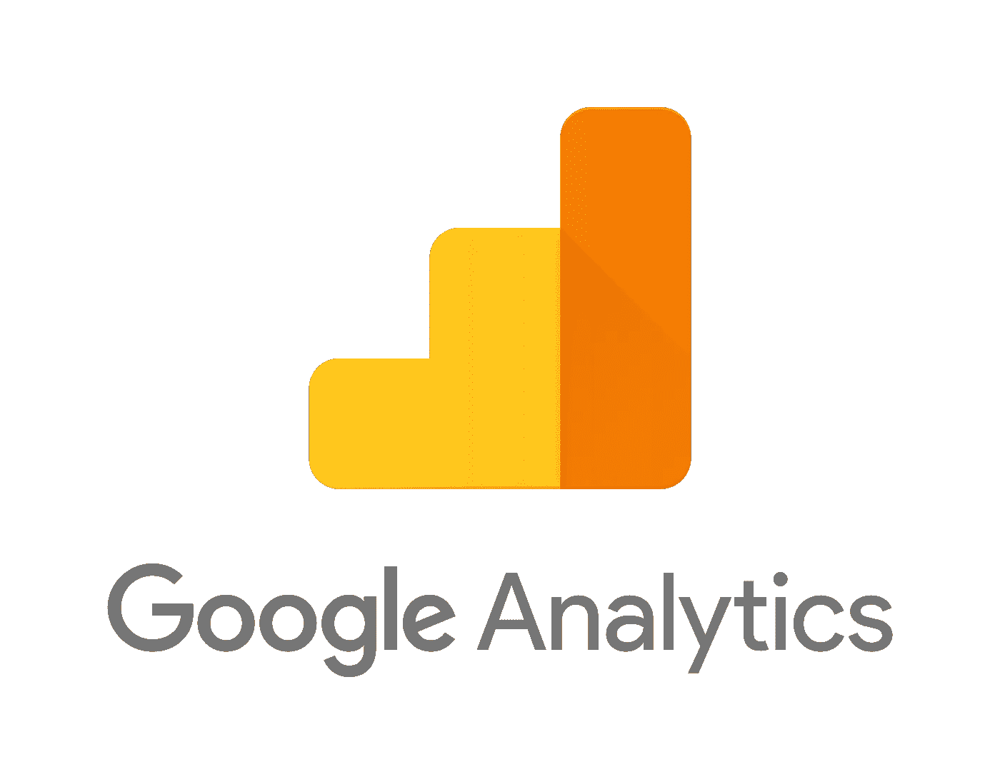
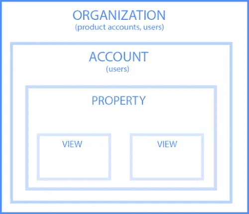
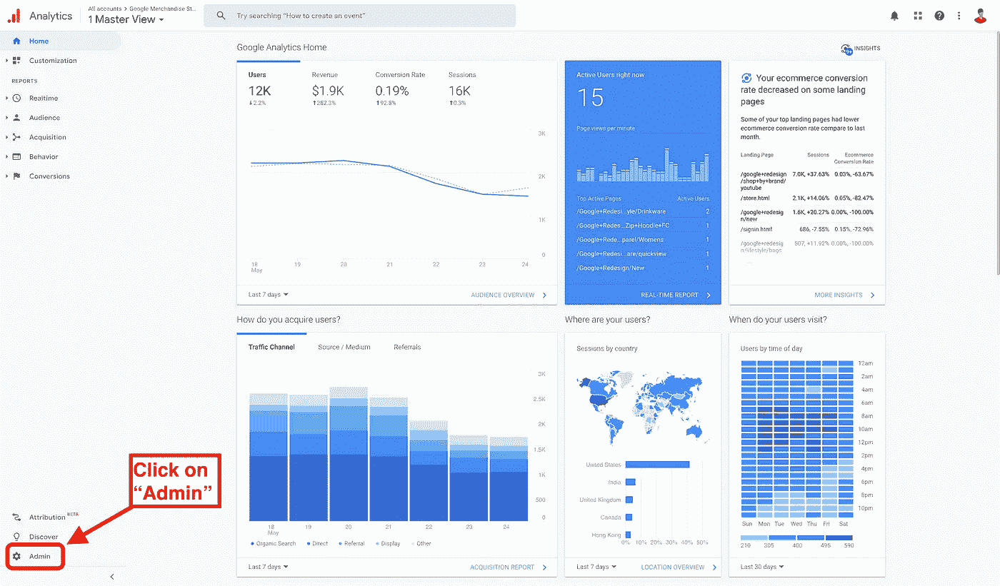
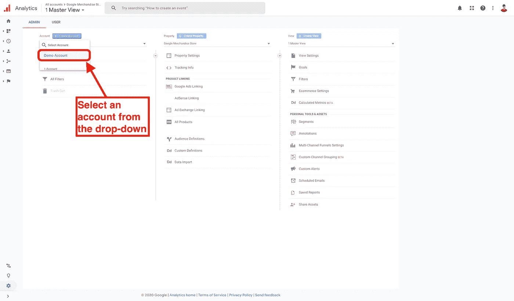
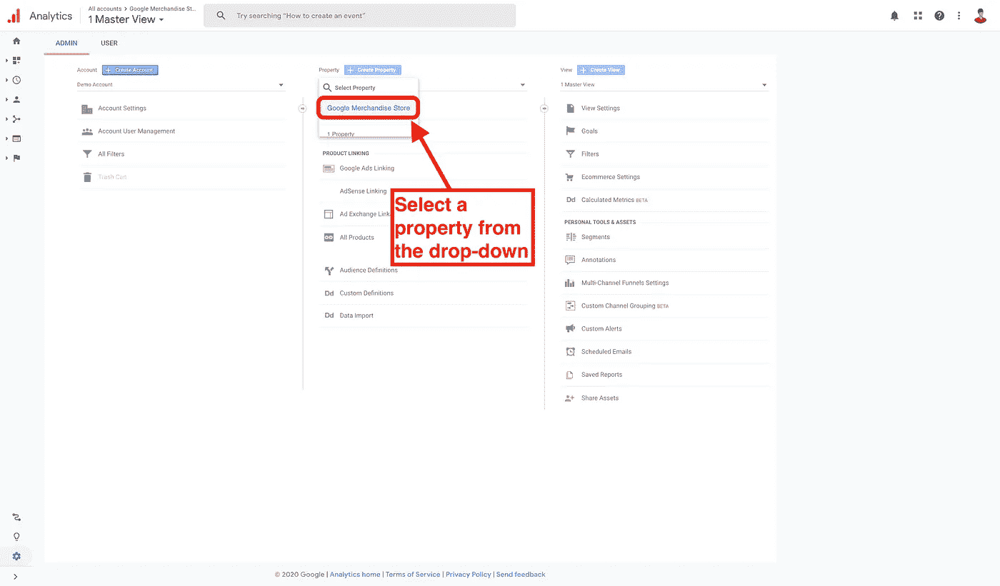
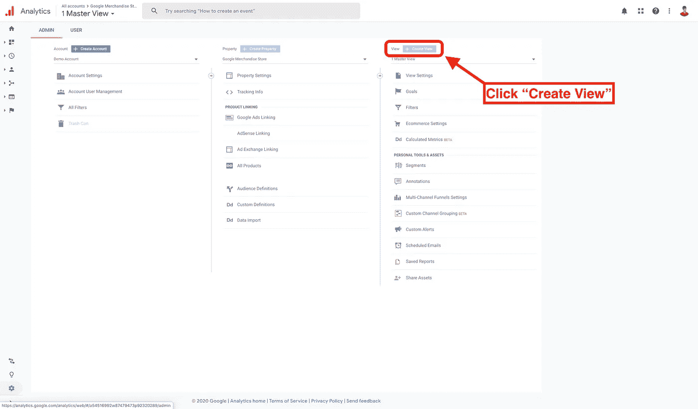
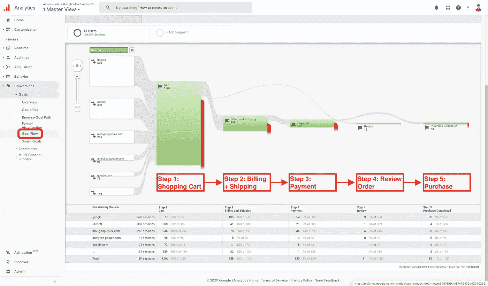

# 什么是谷歌分析？

> 原文：<https://towardsdatascience.com/what-is-google-analytics-23fe684b1e75?source=collection_archive---------52----------------------->

## 理解谷歌分析，为什么使用它，以及如何使用它的介绍性指南。(附案例分析示例！)

[来源。](https://developers.google.com/analytics/terms/branding-policy)

# 介绍

**本质上，谷歌分析是一种工具，它允许我们聚集、过滤和可视化数据，以了解用户如何与网站互动。**我们可以访问人们在他们使用的网站上留下的数据踪迹，而不是仅仅依靠直觉和经验来影响业务成果。这种数据跟踪为企业提供了对用户行为、兴趣等的宝贵见解，以采取行动来改进他们的产品或服务。

# 为什么要用？

对于任何拥有交易数据和/或在线业务(几乎所有企业都这样做)的当代企业来说，谷歌分析是一个至关重要的工具。谷歌分析帮助企业衡量营销策略的有效性、在线内容的质量、点击量、用户体验和网站功能等。通常，公司会识别并跟踪**KPI****(关键绩效指标)**来监控增长和转换率。在数据丰富的 21 世纪，企业的成功已经成为数据收集、分析和测试以满足公司目标的严格练习。

# 它是如何工作的？

Cookies 是由浏览器存储在计算机硬盘上的小文本文件，用于保存用户特定的数据。Cookies 是使用 JavaScript 跟踪代码嵌入的。[来源。](https://www.online-tech-tips.com/computer-tips/what-are-tracking-cookies-and-are-they-bad/)

听说过**饼干吗？**嗯，cookies 是使用谷歌分析的一个基本要素。没有 cookies，就没有数据可以分析！Cookies 已经成为日常网络浏览的一部分。据 [W3Techs](https://w3techs.com/technologies/details/ce-cookies) 统计，截至 2020 年 5 月， **44.2%的网站使用 cookies。**

它是这样工作的:JavaScript 跟踪代码(cookies)被嵌入到一个公司的网站中。跟踪代码为访问网站的每个用户(其中“用户”是“设备”和“浏览器”的组合)分配一个唯一的“客户端 ID”。由此，一家公司可以收集大量关于用户如何参与其网站的数据。例如，这里有一些可以收集的东西:

*   您使用的是什么设备和浏览器。
*   如果你是新的网站或以前访问过。
*   你点击了什么，点击了多少次。
*   你在网站上下载的东西。
*   你是如何进入网站的？
*   你在网站上花了多少时间(会话时长)。
*   你放在购物车里的东西，你丢弃的东西，你购买的东西。

# 帐户-属性-视图

使用 Google Analytics 的结构是通过一个 4 层的层次来定义的:**组织、账户、属性、**和**视图。**该层级通过下图进行解释。

[出处。](https://support.google.com/analytics/answer/1009618?hl=en)

**组织** —组织是我们公司。在这里，我们可以控制组织的所有 Google 产品帐户，管理谁使用 Google 产品，以及他们的权限。

**账户** —账户是我们可以访问谷歌分析产品的地方。我们选择一个帐户来访问谷歌分析，并确定我们想要跟踪的属性。我们可以将一个帐户仅与一个属性相关联，或者我们可以使用一个帐户来管理多个属性，无论哪种方式对组织我们的工作流最有意义。

**属性** —属性是我们从中提取数据的位置。这可以是数字位置，如网站或应用程序，也可以是物理位置，如收银机或读卡器。当我们添加新酒店时，Google Analytics 会自动创建跟踪代码(cookies ),用于从该酒店收集数据。跟踪代码中的唯一“ID”允许 Google Analytics 识别来自该物业的数据。我们所要做的就是将跟踪代码整合到我们的网站/应用程序中。

**视图** —视图是我们查看数据的方式。在视图中，我们可以解析、过滤和组织来自属性的数据。我们可以为用户分配对视图的访问权限，以控制哪些人可以看到某些数据，哪些人不能。我们通常在一个物业内有许多视图。

# 正在设置

首先，我们想创建一个谷歌分析帐户。幸运的是，我们可以免费做这个！谷歌将为我们设置一个“演示”帐户，其中包含来自谷歌商品商店的真实数据。这是一个很好的实验环境，让我们看看真实的数据，让我们尝试谷歌分析必须提供的一些功能。要设置这个，我推荐跟随这篇在 support.google.com 找到的文章。

完成所有设置后，您可以开始创建新视图来分析和可视化您的数据。首先，要创建一个新视图，请单击“Admin”选项卡。然后，选择您想要添加视图的“帐户”和“属性”。最后，在“视图”列中，单击“创建新视图”。参见下面的分步截图作为示例。

第一步:点击仪表板左下角的“管理”。来源:作者。

第二步:从“账户”栏下的下拉菜单中选择一个账户。来源:作者。

第 3 步:从“属性”列下的下拉菜单中选择一个属性。来源:作者。

第四步:点击“创建视图”来创建一个新的视图！来源:作者。

# 基本观点

视图是一个透镜，通过它可以看到我们的数据。我们经常过滤我们的数据，看我们想看什么。但是，了解筛选数据永久地包括、排除或改变视图的传入数据是很重要的。我们应该始终拥有所有数据的未经过滤的原始视图，这样我们就可以随时访问我们的全部数据集。

请注意，一旦我们删除了一个视图，与该视图相关的所有数据都将永久消失。**因此，我们在创建新视图时应该非常慎重，在删除任何视图之前要非常谨慎。**

最后，请注意，一旦我们创建了一个视图，该视图的仪表板将显示从视图创建之日起的数据。**视图不显示创建日期之前的数据。**

我们希望在谷歌分析中为每个属性创建至少 3 个基本视图，以查看我们的数据:

1.  所有网站数据 —这个视图是在谷歌分析中默认创建的，我们不应该弄乱它。这个视图向我们展示了来自我们网站/应用程序的所有原始数据。我们可以把这个视图看作是我们数据的备份。
2.  **测试视图** —如果我们想要应用新的过滤器或者进行更改，我们可以首先使用这个视图来测试它。通过使用“测试视图”，我们可以看到新的过滤器如何影响我们的数据收集，而没有丢失数据的风险。如果我们对“测试视图”中的结果有信心，那么我们可以将这些变化应用到我们的“主视图”中。
3.  **主视图** —主视图是我们用来将数据转化为关键见解的主要视图。在这里，数据由我们之前在“测试视图”中试验过的 Google Analytics 过滤器处理。请记住，如果由于某种原因出现问题，我们总是可以依靠我们的备份视图:“所有网站数据”。

# 例如:谷歌商品商店

一旦我们建立了自己的观点，我们需要对数据提出问题。提问允许我们有目的地浏览数据，以便解析、过滤和可视化我们收集的数据。

例如，假设我们正在谷歌商品商店的数据分析团队工作。我们的任务是找出是否有办法增加网站上的购物量。所以我们可能会问数据这三个问题:

> “每周有多少用户在网站上购买商品？
> 
> 有多少用户把 merch 放在购物车里，却不买？
> 
> 用户在什么时候决定不买？"

为了解决这些问题，我们可以使用 Google Analytics 中的一个名为**“目标流报告”的功能。**使用此报告，我们可以了解用户在结账前放弃购物车中商品的时间点。从这里，我们可以使用[动态再销售](https://support.google.com/google-ads/answer/3124536?hl=en)来获得更多放入购物车的鞋子的顾客转化(购买)。

“目标流报告”可以在谷歌分析界面的左侧找到，在转化-目标-目标流下。在这份报告中，我们可以了解网站在购买过程中失去客户的原因。来源:作者。

在最左侧，我们可以看到显示用户在过去一周如何访问谷歌商品商店的所有不同来源。从左到右，结账过程分为五个步骤:购物车、账单+运费、付款、审核订单和购买。

从图形上看，Google Analytics 让我们很容易确定我们在哪里失去了大部分购买。从“购物车”到“账单+发货”这一步，数量会有巨大的下降。从 1600 次会议，我们减少到 300 次会议。**谷歌商品商店在这第一步就失去了超过 80%的顾客！**

随着客户采取更多的购买步骤，我们可以看到，我们逐渐失去越来越多的潜在买家。在图的最后一步，我们可以看到只有 30 个人最终从商店购买了东西。商店在采购过程中流失了大约 98%的顾客！想想看:每 100 个人把东西放进购物车，其中只有 2 个人最终会购买。 **哇！**

因此，根据这些发现，我们可能会建议对谷歌商品商店用户界面进行调整，使“购物车”到“账单+运输”的过渡不那么令人生畏，因为这是我们失去最多客户的阶段。作为一个想法，我们可以请 UX 的研究人员在这些网页上推荐一种更有效的背景颜色，然后进行 A/B 测试，并随着时间的推移对这些颜色进行实验，看看什么最能阻止人们放弃他们的购物车物品，以便最大限度地购买。

在这种情况下，谷歌分析和使用它的企业之间有一个持续的反馈回路。通过分析数据，公司可以了解客户在某些网页上的行为。这就告诉了公司应该改变他们的网站以实现他们的商业目标，无论是更多的购买，更多的点击，还是更多的流量。这就是数据分析的力量。

# 了解更多关于谷歌分析！

如果你很好奇，想了解更多关于 Google Analytics 的知识，有很多资源可以学习！我花了几天时间学习谷歌在 [**谷歌分析学院**](https://analytics.google.com/analytics/academy/) 免费提供的初级和高级实践课程，以提高我的技能。这些课程非常容易使用，而且互动性很强——考考你刚刚学过的知识，这样你就不会变得懒惰，对内容感到厌倦。

完成这些课程后，我通过了谷歌分析个人资格(GAIQ)考试，这表明了使用谷歌分析的熟练程度。这是一个 70 题的选择题考试，时间限制为 90 分钟。你可以在这里免费参加[T5 考试。](https://skillshop.exceedlms.com/student/path/2938-google-analytics-individual-qualification)

# 结论

在 21 世纪，数据分析是一项真正令人兴奋和有价值的技能。随着公司越来越少依赖直觉和经验，而是更多地依赖数据来做出决策和发展业务，对它的需求可能会继续上升。因此，请查看 Google Analytics，了解数据如何提供见解来转变您企业的产品、服务和在线形象。