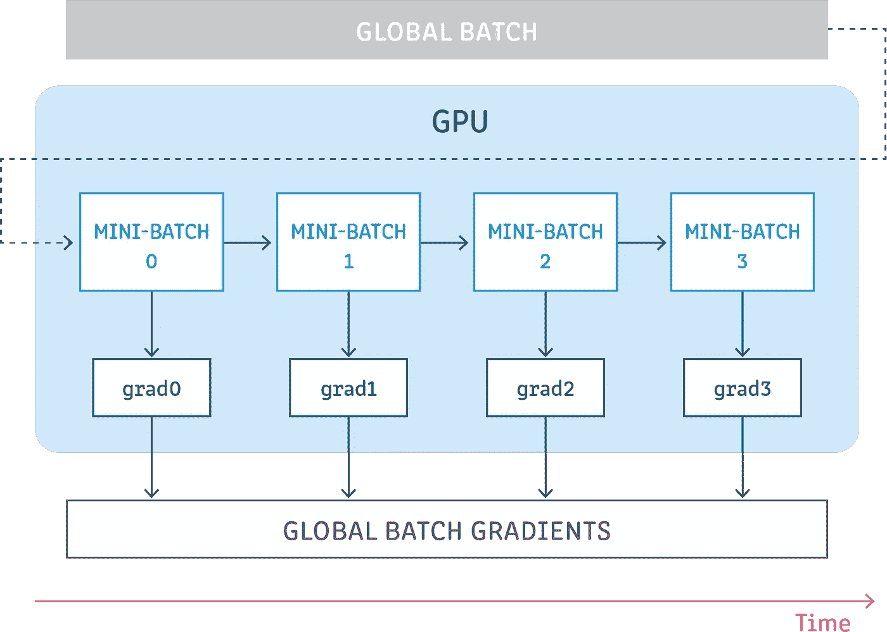
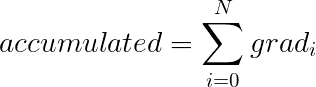
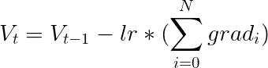

# 深度学习中的梯度积累是什么？

> 原文：<https://towardsdatascience.com/what-is-gradient-accumulation-in-deep-learning-ec034122cfa?source=collection_archive---------4----------------------->

## 解释了神经网络的反向传播过程

澳大利亚八月在 [Unsplash](https://unsplash.com/?utm_source=unsplash&utm_medium=referral&utm_content=creditCopyText) 拍摄的照片

在[的另一篇文章](/how-to-break-gpu-memory-boundaries-even-with-large-batch-sizes-7a9c27a400ce?source=friends_link&sk=74a7a2793da909c1194c0add818c7fd3)中，我们解决了批量大小受 GPU 内存限制的问题，以及梯度累积如何帮助克服这个问题。

在这篇文章中，我们将首先检查一个神经网络的反向传播过程，然后通过梯度积累的技术和算法细节。我们将讨论它是如何工作的，并通过一个例子进行迭代。

# 什么是梯度积累？

****

梯度累积

在进一步研究梯度累积之前，最好先研究一下神经网络的反向传播过程。

# 神经网络的反向传播

深度学习模型由许多相互连接的层组成，在所有这些层中，样本在每一步中都通过正向传递进行传播。在传播通过所有层之后，网络生成样本的预测，然后计算每个样本的损失值，该值指定“网络对此样本的错误程度如何？”。然后，神经网络计算这些损失值相对于模型参数的梯度。然后，这些梯度用于计算相应变量的更新。

在建立模型时，我们选择一个优化器，它负责用于最小化损失的算法。优化器可以是已经在框架中实现的常见优化器之一(SGD、Adam 等)，也可以是自定义优化器，实现所需的算法。除了梯度之外，优化器可能还会管理和使用更多的参数来计算更新，例如学习率、当前步长指数(用于自适应学习率)、动量等

优化器表示计算参数更新的数学公式。一个简单的例子是随机梯度下降(SGD)算法:`V = V — (lr * grad)`，其中`V`是任何可训练的模型参数(权重或偏差)，`lr`是学习率，`grad`是损失相对于模型参数的梯度:

SGD 优化器的算法

# 那么从技术上讲，什么是梯度累积呢？

梯度累积意味着在不更新模型变量的情况下运行配置数量的步骤，同时累积这些步骤的梯度，然后使用累积的梯度来计算变量更新。

是的，真的就这么简单。

在不更新任何模型变量的情况下运行一些步骤是我们逻辑上将一批样本分成几个小批的方式。每个步骤中使用的样本批次实际上是一个小批次，这些步骤的所有样本组合起来实际上是一个全局批次。

通过在所有这些步骤中不更新变量，我们使得所有小批量使用相同的模型变量来计算梯度。这是强制性的，以确保计算相同的梯度和更新，就像我们使用全局批量大小一样。

在所有这些步骤中累积梯度会产生相同的梯度和，就像我们使用全局批量大小一样。

# 遍历一个例子

假设我们在 5 个步骤中累积梯度。我们希望累积前 4 步的梯度，而不更新任何变量。在第五步，我们希望使用前 4 步累积的梯度与第五步的梯度相结合来计算和分配变量更新。让我们来看看它的实际应用:

从第一步开始，第一个小批量的所有样本通过前向和后向途径传播，产生每个可训练模型变量的计算梯度。我们不想实际更新变量，所以此时没有必要计算更新。然而，我们需要的是一个存储第一步的梯度的地方，以便在随后的步骤中可以访问它们，并且我们将为每个可训练模型变量使用另一个变量来保存累积的梯度。因此，在计算第一步的梯度后，我们将把它们存储在我们为累积梯度创建的变量中。

N 步结束时累积的梯度值

现在，第二步开始了，第二个小批量的所有样本通过模型的所有层传播，计算第二步的梯度。就像上一步一样，我们还不想更新变量，所以不需要计算变量更新。与第一步不同的是，我们不是将第二步的梯度存储在变量中，而是将它们添加到变量中存储的值中，这些值当前包含第一步的梯度。

第 3 步和第 4 步与第二步非常相似，因为我们还没有更新变量，我们通过将它们添加到变量中来累积梯度。

然后，在步骤 5 中，我们想要更新变量，因为我们打算在 5 个步骤中累积梯度。在计算出第五步的梯度后，我们将把它们加到累积的梯度上，得到这五步所有梯度的总和。

然后，我们将得到这个总和，并将其作为参数插入到优化器中，得到使用这 5 个步骤的所有梯度计算的更新，这些更新是在全局批处理中的所有样本上计算的。

如果我们以 SGD 优化器为例，让我们看看第五步结束时更新后的变量，这些变量是使用这五个步骤的梯度计算的(在下面的示例中 N=5):

N 步后可训练变量的值(使用 SGD)

# 太好了！所以我们来实施吧！

可以实现任何优化器的梯度累积版本。每个优化器都有不同的公式，因此需要不同的实现。这不是最佳的，因为梯度累积是一种通用的方法，应该是独立于优化器的。

在[的另一篇文章](/how-to-easily-use-gradient-accumulation-in-keras-models-fa02c0342b60?source=friends_link&sk=ff9137c1c7fa5bbfc4c4e09bacc0273b)中，我们介绍了实现通用梯度累积机制的方法，并向您展示了如何使用您选择的任何优化器在您自己的模型中使用它。