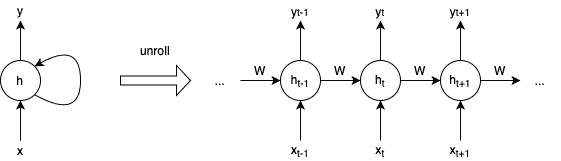
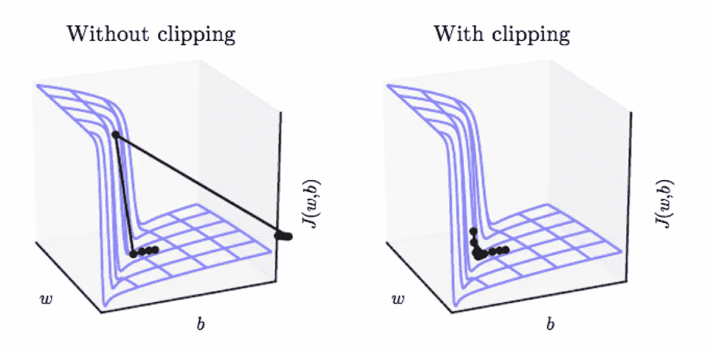

# 什么是渐变裁剪？

> 原文：<https://towardsdatascience.com/what-is-gradient-clipping-b8e815cdfb48?source=collection_archive---------4----------------------->

## 一个简单而有效的方法来处理爆炸梯度


在 [Unsplash](https://unsplash.com?utm_source=medium&utm_medium=referral) 上[阿三 S.](https://unsplash.com/@ahsan19?utm_source=medium&utm_medium=referral) 的照片

递归神经网络(RNN)通过利用存储关于过去输入的信息的隐藏状态来很好地处理序列数据:隐藏状态在时间 *t* 的值取决于它们在时间 *t* -1 的值以及在时间 *t* 的输入。这种架构虽然强大，但在训练中会导致两个问题:*爆炸渐变*和*消失渐变*。在本文中，我们将研究*渐变剪辑*，它处理爆炸渐变问题。

## 爆炸和消失渐变背后的直觉

爆炸梯度是指梯度在训练中变得过大，使模型不稳定的问题。类似地，消失梯度指的是在训练中梯度变得太小。这可以防止网络权重改变其值。这两个问题都会导致模型无法从训练数据中学习。下面的非正式讨论并不严格，但足以给我们一个关于爆炸和消失梯度来源的直觉。

当我们通过时间反向传播来训练 RNN 时，这意味着我们首先通过为每个时间步长创建网络的副本来及时展开 RNN，将其视为多层前馈神经网络，其中层数等于时间步长数。然后，我们在展开的网络上进行反向传播，考虑权重共享:



其中 **W** 是递归权重矩阵。可以看出，损失函数的梯度由 **W** ᵀ的 *n* 个副本的乘积组成，其中 *n* 是及时返回的层数。矩阵的这个乘积是爆炸和消失渐变的来源。

对于一个定标器*一个*一个**≦**一个 *aⁿ* 呈指数级收缩或增长。比如考虑 *n* = 30。然后比如 1.1 *ⁿ* ≈ 17.45 和 0.9 *ⁿ* ≈ 0.042。我们选择 30 是因为自然语言处理任务中的一个句子有 30 个单词是很常见的，时间序列分析处理 30 天的数据也是很典型的。矩阵的乘积( **W** ᵀ) *ⁿ* 的情况非常相似。看到这一点的最简单的方法是假设**w**ᵀ*t19】可对角化。然后 **W** ᵀ = **QDQ** ⁻求点对角矩阵**d**=*diag*(*λ*₁*，…，λ* ₓ)，以及(**w**ᵀ)*ⁿ*=**qd***ⁿ***q**⁻用【T44*

我们参考[2]对爆炸和消失梯度问题的严格处理。

## 渐变剪辑

渐变裁剪是一种处理爆炸式渐变的技术。渐变裁剪的想法非常简单:如果渐变变得太大，我们重新调整它以保持它很小。更准确地说，如果‖**g**≥*c*，则

```
**g** ↤ *c* · **g**/‖**g**‖
```

其中 *c* 为超参数， **g** 为梯度，‖ **g** 为 **g** 的范数。由于**g**/**g**‖是一个单位向量，重新缩放后，新的 **g** 将具有范数 *c* 。注意，如果‖ **g** ‖ < *c* ，那么我们什么都不需要做。

渐变裁剪确保渐变向量 **g** 最多有范数 *c* 。这有助于梯度下降有一个合理的行为，即使模型的损失景观不规则。下图显示了 loss 地貌中一个极其陡峭的悬崖的示例。如果没有削波，参数会大幅下降，并离开“好”区域。使用削波，下降步长受到限制，参数保持在“良好”区域。



[1]图 10.17

## 履行

*   tensor flow:[TF . clip _ by _ global _ norm](https://www.tensorflow.org/api_docs/python/tf/clip_by_global_norm)。
*   py torch:[torch . nn . utils . clip _ grad _ norm _](https://pytorch.org/docs/stable/nn.html#torch.nn.utils.clip_grad_norm_)。

## 常见问题

问:我们如何选择超参数 *c* ？

答:我们可以为一些时期训练我们的神经网络，并查看梯度范数的统计数据。梯度范数的平均值是一个很好的初步尝试。

问:除了 RNN，我们能在训练神经结构中使用梯度裁剪吗？

答:是的。每当我们有爆炸梯度时，我们可以对任何神经架构使用梯度裁剪。

## 进一步阅读

1.  [1]的第 10.11 章很好地概述了渐变裁剪的工作原理。
2.  [3]引入了新的光滑条件，为梯度裁剪的有效性提供了理论解释。

## 参考

1.  古德菲勒、本吉奥和库维尔。[深度学习](http://www.deeplearningbook.org/) (2016)，麻省理工学院出版社。
2.  R.帕斯卡努、t .米科洛夫和 y .本吉奥。[论训练递归神经网络的难度](http://proceedings.mlr.press/v28/pascanu13.pdf) (2013)，ICML 2013。
3.  J.张，何铁男，施瑞华，贾德巴贝。[为什么梯度裁剪加速了训练:适应性的理论证明](https://openreview.net/pdf?id=BJgnXpVYwS) (2020)，ICLR 2020。