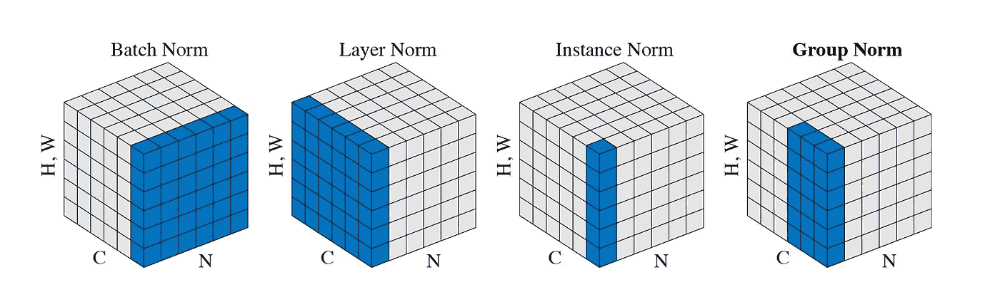

# 什么是群体常态化？

> 原文：<https://towardsdatascience.com/what-is-group-normalization-45fe27307be7?source=collection_archive---------10----------------------->

## 批处理规范化的替代方法


照片由[假虎刺属·魏泽](https://unsplash.com/@carissaweiser?utm_source=medium&utm_medium=referral)在 [Unsplash](https://unsplash.com?utm_source=medium&utm_medium=referral) 上拍摄

批处理规范化(BN)已经成为许多最新深度学习模型的重要组成部分，特别是在计算机视觉中。它通过批次内计算的平均值和方差对层输入进行归一化，因此得名。为了使 BN 起作用，批量需要足够大，通常至少为 32。然而，有些情况下我们不得不接受小批量:

*   当每个数据样本都非常消耗内存时，例如视频或高分辨率图像
*   当我们训练一个非常大的神经网络时，它只留下很少的 GPU 内存来处理数据

因此，我们需要 BN 的替代品，它能很好地用于小批量生产。分组归一化(GN)是最新的归一化方法之一，它避免了利用批维数，因此与批大小无关。

## 不同的标准化方法

为了推动 GN 的形成，我们将首先看看以前的一些归一化方法。

以下所有标准化方法都执行计算

```
*xᵢ* ← (*xᵢ* - 𝜇*ᵢ*) / √(𝜎*ᵢ*² + 𝜀)
```

对于输入特征 *x* 的每个系数 *xᵢ* 。𝜇 *ᵢ* 和𝜎 *ᵢ* 是对一组系数 *Sᵢ* 计算的平均值和方差，𝜀是一个小常数，为了数值稳定和避免被零除而添加。唯一的区别是如何选择 set *Sᵢ* 。

为了说明归一化方法的计算，我们考虑一批大小为 *N* = 3，具有输入特征 *a* 、 *b* 和 *c.* 它们具有通道 *C* = 4，高度 *H* = 1，宽度 *W* = 2:

```
*a* = [ [[2, 3]], [[5, 7]], [[11, 13]], [[17, 19]] ]
*b* = [ [[0, 1]], [[1, 2]], [[3, 5]], [[8, 13]] ]
c = [ [[1, 2]], [[3, 4]], [[5, 6]], [[7, 8]] ]
```

因此，该批次将具有形状( *N* 、 *C* 、 *H* 、 *W* ) = (3，4，1，2)。我们取𝜀 = 0.00001。

## 批量标准化

BN 对通道进行归一化，并沿( *N* 、 *H* 、 *W* )轴计算𝜇 *ᵢ* 和𝜎 *ᵢ* 。 *Sᵢ* 被定义为与 *xᵢ* 在同一通道中的一组系数。

对于 *a* 的第一个系数 *aᵢ* = 2，其中 *i* = (0，0，0)，对应的𝜇 *ᵢ* 和𝜎 *ᵢ* 是在第一个通道的 *a* 、 *b* 和 *c* 的系数上计算的:

```
𝜇*ᵢ = mean*(2, 3, 0, 1, 1, 2) = 1.5
𝜎*ᵢ*² = var(2, 3, 0, 1, 1, 2) = 0.917
```

将这些代入标准化公式，

```
*aᵢ* ← (2 - 1.5) / √(0.917 + 0.00001) = 0.522
```

计算一个给出的*的所有系数*

```
*a* ← [ [[0.522, 1.567]], [[0.676, 1.690]], [[1.071, 1.630]], [[1.066, 1.492]] ]
```

## 图层规范化

层标准化(LN)旨在克服 BN 的缺点，包括其对批量大小的限制。它沿着( *C* 、 *H* 、 *W* )轴计算𝜇 *、ᵢ* 和𝜎 *、ᵢ* ，其中 *Sᵢ* 被定义为与 *xᵢ* 属于同一输入特征的所有系数。因此，输入要素的计算完全独立于批处理中的其他输入要素。

*a* 的所有系数都被同一个𝜇 *ᵢ* 和𝜎 *ᵢ* 归一化

```
𝜇*ᵢ = mean*(2, 3, 5, 7, 11, 13, 17, 19) = 9.625
𝜎*ᵢ*² = var(2, 3, 5, 7, 11, 13, 17, 19) = 35.734
```

因此将 LN 应用于 *a* 给出

```
*a* ← [ [[-1.276, -1.108]], [[-0.773, -0.439]], [[0.230, 0.565]], [[1.234, 1.568]] ]
```

## 实例规范化

实例规范化(IN)可视为将 BN 公式单独应用于每个输入要素(也称为实例),就好像它是批处理中的唯一成员一样。更准确地说，在沿着( *H* 、 *W* )轴计算𝜇 *、ᵢ* 和𝜎 *、ᵢ* 时， *Sᵢ* 被定义为与 *xᵢ* 处于相同输入特征并且也在相同通道中的一组系数。

由于 IN 的计算与批大小= 1 的 BN 的计算相同，因此在大多数情况下，IN 实际上会使情况变得更糟。然而，对于风格转换任务，IN 更善于丢弃图像的对比度信息，并且具有比 BN 更好的性能。

对于第一个系数 *aᵢ* = 2 的 *a* ，*t39】其中 *i* = (0，0，0)，对应的𝜇 *ᵢ* 和𝜎 *ᵢ* 简单来说就是*

```
𝜇*ᵢ = mean*(2, 3) = 2.5
𝜎*ᵢ*² = var(2, 3) = 0.25
```

这给了

```
*aᵢ* ← (2 - 2.5) / √(0.25 + 0.00001) = -1.000
```

当我们向 *a* 申请时，我们得到

```
*a* ← [ [[-1.000, 1.000]], [[-1.000, 1.000]], [[-1.000, 1.000]], [[-1.000, 1.000]] ]
```

## 群体规范化

之前，我们在中介绍了将 BN 单独应用于每个输入要素，就好像批量大小= 1 一样。请注意，IN 也可以视为将 LN 单独应用于每个通道，就好像通道数= 1 一样。

群规范化(GN)是 IN 和 LN 之间的中间地带。它将通道组织成不同的组，并沿( *H* 、 *W* )轴和一组通道计算𝜇 *ᵢ* 和𝜎 *ᵢ* 。 *Sᵢ* 则是与 *xᵢ* 处于相同输入特征和相同通道组的一组系数。

组数 *G* 是一个预定义的超参数，通常需要除以 *C* 。为简单起见，我们按顺序对通道进行分组。因此，通道 1、…、 *C* / *G* 属于第一组，通道 *C* / *G* + 1、…、2 *C* / *G* 属于第二组，依此类推。当 *G* = *C* 时，意味着每组只有一个通道，GN 变为 IN。另一方面，当 *G* = 1 时，GN 变为 LN。因此 *G* 控制 IN 和 LN 之间的插值。

对于我们的例子，考虑 G = 2。为了归一化第一个系数 *aᵢ* = 2 的 *a* 其中 *i* = (0，0，0)，我们在前 4 / 2 = 2 个通道中使用 *a* 的系数

```
𝜇*ᵢ = mean*(2, 3, 5, 7) = 4.25
𝜎*ᵢ*² = var(2, 3, 5, 7) = 3.687
```

将这些代入标准化公式，

```
*aᵢ* ← (2 - 4.25) / √(3.687 + 0.00001) = -1.172
```

对于 *a* 的其他系数，计算类似:

```
*a* ← [ [[-1.172, -0.651]], [[0.391, 1.432]], [[-1.265, -0.633]], [[0.633, 1.265]] ]
```

## 归一化方法的比较

下图显示了 BN、LN、IN 和 GN 之间的关系。



图二之四

蓝色区域对应于用于计算𝜇 *ᵢ* 和𝜎 *ᵢ* 的集合 *Sᵢ* ，然后这些集合用于归一化蓝色区域中的任何系数。

从这个图我们可以看出 GN 是如何在 IN 和 LN 之间插值的。GN 比 IN 好，因为 GN 可以利用跨信道的依赖性。它也比 LN 好，因为它允许为每组通道学习不同的分布。

当批量较小时，GN 始终优于 BN。但是，当批量非常大时，GN 的扩展性不如 BN，并且可能无法与 BN 的性能相匹配。

## 履行

*   TensorFlow:可通过 TensorFlow 插件[TFA . layers . group normalization](https://www.tensorflow.org/addons/api_docs/python/tfa/layers/GroupNormalization)获得
*   py torch:[torch . nn . group norm](https://pytorch.org/docs/stable/nn.html#groupnorm)

请注意，GN 的两种实现都有一个可学习的、按通道的线性变换，遵循故障归一化。这类似于 BN、LN 和 IN 的实现。

## 进一步阅读

1.  GN [4]的原始论文是关于 GN 的技术细节以及不同归一化方法的比较的极好参考。
2.  即使在批量较大时 GN 不匹配 BN，GN +重量标准化[2]也能够匹配甚至优于 BN。我们参考了文献[1]和[2]的一些实验结果。
3.  [3]展示了 BN 通过使优化前景更加平滑所做的工作。这推动了重量标准化的形成。

## 参考

1.  A.、L. Beyer、X. Zhai、J. Puigcerver、J. Yung、S. Gelly 和 N. Houlsby。[大迁移(BiT):一般视觉表征学习](https://arxiv.org/abs/1912.11370) (2019)，arXiv 预印本。
2.  南乔，王，刘，沈文伟，尤耶。[重量标准化](https://arxiv.org/abs/1903.10520) (2019)，arXiv 预印本。
3.  南桑图尔卡、齐普拉斯、易勒雅斯和马德瑞。[批处理规范化如何帮助优化？](https://papers.nips.cc/paper/7515-how-does-batch-normalization-help-optimization.pdf) (2018)，NIPS 2018。
4.  Y.吴和何国梁。[分组归一化](https://eccv2018.org/openaccess/content_ECCV_2018/papers/Yuxin_Wu_Group_Normalization_ECCV_2018_paper.pdf) (2018)，ECCV 2018。