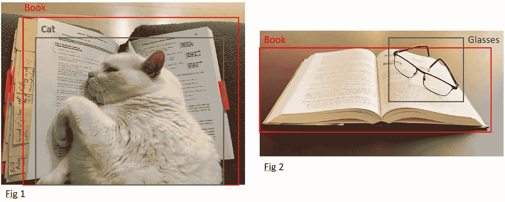
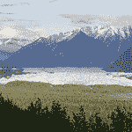
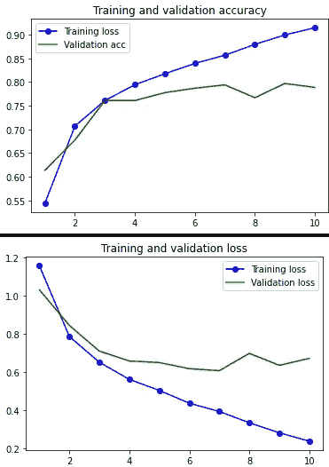
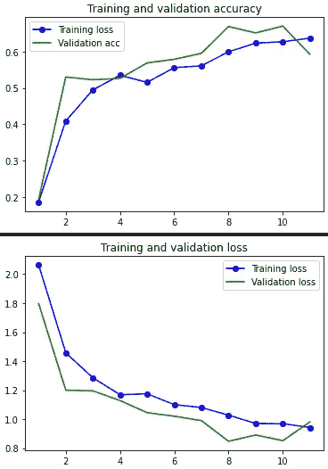

# 什么是图像分类？数据增强？转移学习？

> 原文：<https://towardsdatascience.com/what-is-image-classification-data-augmentation-transfer-learning-689389c3f6c8?source=collection_archive---------15----------------------->



来源:图片由作者拍摄，并有他的注释

## 技术及其应用之间的差异

> 本文是关于计算机视觉的三篇文章的第一部分。第 2 部分将解释对象识别。第 3 部分将是关于图像分割。
> 
> 随本文提供一个笔记本:[此处](https://github.com/Christophe-pere/Image_classification)在 GitHub 上

## 介绍

有什么比看世界更刺激的？能够看到我们周围最好的东西？日落之美，令人难忘的瀑布，还是冰海？如果进化没有赋予我们眼睛，一切都是不可能的。

我们认识事物是因为我们已经学会了物体的形状，我们已经学会了估计与我们所遇到的不同形状可以与同一物体联系起来。我们通过经验学习，因为我们被给定了所述物体的名称。就像需要一个标签来将形状、细节、颜色与类别相关联的监督算法。狗和狼只是在像素上非常相似。计算机视觉方法已经使机器能够破译这些形状，并“学习”对它们进行分类。

现在，算法，就像我们的眼睛可以识别图片或电影，物体或形状。方法不断进化完善，达到所谓的人的水平。但是，有几种方法，图像分类、对象检测或识别以及图像分割。在本文中，我们将探讨图像分类问题。第一部分将介绍从零开始训练模型，第二部分将介绍数据增强的训练，最后是预训练模型的迁移学习。

## 方法

***图像分类从无到有***

当你拥有的数据量足够大时，图像分类可以“T6”从零开始。想法是创建一个模型并从头开始训练它。

像任何分类问题一样，数据必须被注释。当涉及到图像时，如何进行？事实上很简单，同一类的数据必须存储在同一个文件夹中。有必要为所考虑的每个类或类别准备一个文件夹。像这样:

```
> train/
      ... forest/
            ... img_1.jpeg
            ... img_2.jpeg
            ...
      ... moutain/
            ... img_1.jpeg
            ... img_2.jpeg
            ...
      ... sea/
            ... img_1.jpeg
            ... img_2.jpeg
      ...
  validation/
      ... forest/
            ... img_1.jpeg
            ... img_2.jpeg
            ...
      ... moutain/
            ... img_1.jpeg
            ... img_2.jpeg
            ...
      ... sea/
            ... img_1.jpeg
            ... img_2.jpeg
  test/
      ... forest/
            ... img_1.jpeg
            ... img_2.jpeg
            ...
      ... moutain/
            ... img_1.jpeg
            ... img_2.jpeg
            ...
      ... sea/
            ... img_1.jpeg
            ... img_2.jpeg
```

这种简单的方法允许模型将标签与图片关联起来。

之后，你建立你的神经网络。从现在开始，标准是针对卷积神经网络( *CNN* )在处理图片时。所以你要建立一个 CNN 并用英特尔数据集训练它。您将添加一个卷积层，然后是一个汇集层，可能是一个下降层，以降低过度拟合的风险，并以密集的全连接层结束。最后一层会输出结果，或者说预测，这最后一层的单元数就是你要预测的类数。

```
***# building the model***
model = tf.keras.Sequential([
  layers.Conv2D(32, 3, activation='relu'),
  layers.MaxPooling2D(),
  layers.Dropout(0.5),
  layers.Conv2D(32, 3, activation='relu'),
  layers.MaxPooling2D(),
  layers.Dropout(0.3),
  layers.Conv2D(32, 3, activation='relu'),
  layers.MaxPooling2D(),
  layers.Flatten(),
  layers.Dense(128, activation='relu'),
  layers.Dense(num_classes, activation='softmax')
])***# compile the model with adam optimizer and sparse cross entropy*** model.compile(
  optimizer='adam',
  loss=tf.losses.SparseCategoricalCrossentropy(from_logits=True),
  metrics=['accuracy'])***# use early stopping to break the learning process if the model stop learning during 3 epochs*** es = tf.keras.callbacks.EarlyStopping(patience=3)
history = model.fit(
  train_x,train_y,
  validation_data=(valid_x, valid_y), callbacks=[es], batch_size=32,
   epochs=30
)
```

在这里，我提出了一个小的 CNN 架构，其中 num_classes 是类的数量。在本文的上下文中，我们将预测 6 个类，所以`num_classes=6`。`EarlyStopping` 约束模型在过度拟合时停止，参数`patience=3`意味着如果在 3 个时期内模型没有改善，训练过程停止。

如果你有足够的数据，如果你的 CNN 不太深——但足够产生一个好的数据表示，你将获得好的结果。

不幸的是，这种情况很少发生，您需要尝试其他选项。

***数据扩充***

所以，如果你的模型不能获得良好的性能。你可以改变你的网络结构。您可以添加或删除隐藏层。您可以减少或增加每层的单元数。您可以更改激活函数或损失函数。或者，您可以更改预处理或您的数据。

但是，不够怎么办？

可以使用*数据增强*。这种技术允许您从内存中创建人工(合成)图像(这种方法不会影响您的原始数据)。它包括旋转等操作，相同的图片将被旋转不同的角度(创建新的图像)。移位，也就是说，图像的图案将从帧偏移，从而产生必须被内插的“洞”。这种操作可以水平进行，也可以垂直进行。缩放，新图像将是原始数据的一部分的缩放，等等…

完成这项工作的完美工具是 Keras[2] ( `keras.preprocessing.image.ImageDataGenerator()`)提供的名为`ImageDataGenerator` 的对象。

```
from tensorflow.keras.preprocessing.image import ImageDataGenerator
data_gen = ImageDataGenerator(
        rotation_range=40,
        width_shift_range=0.2,
        height_shift_range=0.2,
        rescale=1./255,
        shear_range=0.2,
        zoom_range=0.2,
        horizontal_flip=True,
        fill_mode='nearest')
test_gen = ImageDataGenerator(rescale=1./255)
```

以下是我在笔记本中使用的示例值。

此工具将创建合成影像来增加数据集的容量。怎么用？

CNN 中数据扩充的快速实现。结果将显示在结果部分。

不幸的是，是的，你可以有太少的图像，以获得良好的结果。如果你的数据集非常小，即使数据扩充也救不了你。接下来你会做什么？

***迁移学习【3】***

不，现在不是逃避害怕转学的时候。什么是迁移学习？这是一种简单的方法，你可以将学到的知识用于一项任务，并将其输出到另一项任务中。

在我们的案例中，迁移学习发生在相当大的模型(有数百万甚至上亿个参数)上，这些模型已经在海量数据(Imagenet[4]数据集)上进行了训练以进行归纳。

当您有一个小数据集时，您构建的模型不能很好地表示数据。因此，您必须使用将根据您的数据进行训练的预训练模型。

方法很简单，取预先训练好的模型，冻结它们层的权重，只留下最后一层，或者最后几层，然后用你的数据训练它们。

神经网络根据其深度越来越专门化。第一层将检测一般模式，例如线条。然后形状会出现，直到你在最后一层达到非常精细的细节。这些是必须用来根据您的数据“调整”模型的。因此，使用迁移学习，您可以在几分钟/几小时内获得一个性能极佳的模型，而不是使用 ImageNet 数据集和您的数据重新训练完整的模型(这将花费数月时间，并需要大量资金投入)。

在笔记本上，我比较不同的预训练模型，看看哪个最适合我们的学习。为了轻松快速地更改预训练模型，下面的函数包含了根据数据调整预训练模型并使用指标对其进行评估的架构。返回的是一个包含度量结果的数据框，以及绘制学习曲线的模型历史。

下一个*要点*将告诉你如何使用该功能。

是的，你需要指标来评估不同算法的性能，你需要绘制学习曲线(准确性和损失)来观察你的训练行为。

***度量***

为了评估分类模型，可以使用不同的度量，例如准确度、精确度、召回率、f1 分数等。(这些指标的详细信息可以在[这里](/model-selection-in-text-classification-ac13eedf6146)找到)。下面的代码显示了如何建立一个度量字典和将用于评估神经网络的函数。

该函数可用于二值和多值分类问题。

***绘制学习曲线***

在训练深度学习模型时，查看学习曲线的行为以确定模型是偏差、过度拟合还是正常行为非常重要。为此，让我们看看下面的代码，它允许绘制训练集和评估集的准确度和损失曲线。

至此，您知道了用于评估模型的不同方法和指标。

## 数据

为了避免经典的 MNIST[5]或 FashionMNIST[6]进行分类，我们将采用英特尔提供的数据集(可在 Kaggle[1]上获得)。这些数据更为奇特，它们代表了来自世界各地的场景，代表了 6 个类别(建筑、森林、山脉、冰川、海洋和街道)。对于本地计算机上的项目，数据量也是可访问的，因为训练集由 14k 图像组成，验证集包含 3k 图像和 7k 图像用于测试。每个图像的形状为(150x150)像素。


从列车组构建图像


火车场景中的森林图像



火车场景中的冰川图像

比衣服好不是吗？

如何加载和准备数据？首先，您需要配置到达数据的不同路径。

```
***# creating paths to retrieve the data***
ROOT = "/mnt/d"
FOLDER = "INTEL_images_classification"
TRAIN = os.path.join(ROOT, FOLDER, 'seg_train/seg_train')
TEST = os.path.join(ROOT, FOLDER, 'seg_test/seg_test')
PRED  = os.path.join(ROOT, FOLDER, 'seg_pred/seg_pred')
```

然后你需要通过图片(。jpg)到 NumPy 值数组。

```
def prepare_dataset(path,label):
    x_train=[]
    y_train=[]
    all_images_path=glob(path+'/*.jpg')
    for img_path in tqdm(all_images_path) :
       img=load_img(img_path, target_size=(150,150))
       img=img_to_array(img)
       img=img/255.0   ***# here you normalize the data between 0 and 1***
       x_train.append(img)
       y_train.append(label)
    return x_train,y_train
```

该函数将生成一个包含所有图像和相关标签的矩阵。您可以看到像素值将在[0，1]之间重新调整。深度学习模型在这个值范围内表现得更好，因为范围 255 是为' *RGB* '颜色制作的，一种算法不理解'颜色'。好了，是时候提取数据了:

```
***# Train dataset***
labels = os.listdir(TRAIN)
x = []
y = []
for label in labels:
    x_, y_ = prepare_dataset(os.path.join(TRAIN, label), label)
    x.extend(x_)
    y.extend(y_)
x = np.array(x)
y = np.array(y)***# Test dataset***
labels = os.listdir(TEST)
x_test = []
y_test = []
for label in labels:
    x_, y_ = prepare_dataset(os.path.join(TEST, label), label)
    x_test.extend(x_)
    y_test.extend(y_)
x_test = np.array(x_test)
y_test = np.array(y_test)
```

这里有一个训练集和一个测试集。接下来，您需要将训练集拆分为*训练*和*验证*集(80/20 就足够了)。Scikit-learn 为我们带来了`train_test_split`功能:

```
# create a validation set 
from sklearn.model_selection import train_test_split
train_x, valid_x, y_train, y_valid = train_test_split(x, y, random_state=42, stratify=y, test_size=0.2)
```

几乎完美，还有一点，标签还是*字符串*类型。模型不欣赏这种数据，所以需要对它们进行编码(需要 int 值):

```
from sklearn import preprocessing***# create the label encoder***
encoder = preprocessing.LabelEncoder()
***# train it on the training labels set*** 
train_y = encoder.fit_transform(y_train)
***# apply it on the other corresponding labels*** 
valid_y = encoder.transform(y_valid)
test_y  = encoder.transform(y_test)
```

现在，它是完美的。您有方法、指标和数据。

## 结果

***从零开始***

在 ***方法*** 一节中呈现的简单 CNN 模型已经在数据集上进行了训练。在 10 个时期之后，训练停止，因为算法不再学习。

```
Epoch 1/30
351/351 [==============================] - 536s 2s/step - loss: 1.1578 - accuracy: 0.5443 - val_loss: 1.0311 - val_accuracy: 0.6138
...
Epoch 10/30
351/351 [==============================] - 649s 2s/step - loss: 0.2364 - accuracy: 0.9146 - val_loss: 0.6711 - val_accuracy: 0.7887
```

相应的曲线表明，在 3 个时期之后，在测试集上达到大约 75%的准确度。该模型在训练中继续学习，但是不能如验证准确性所示的那样进行概括。损失显示同样的事情，在 3 个时期之后，验证集上的损失没有改变。



“从头开始”模型的精确度和损耗曲线

相应的指标:

```
 accuracy          : 78.33%
  balanced_accuracy': 78.44%
  precision         : 78.94%
  recall            : 78.33%
  f1-score          : 78.31%
  cohens_kappa      : 73.97%
  matthews_corrcoef : 74.10%
  roc_auc           : 93.37%
```

在测试集上的结果并不坏，在准确度、精确度和召回率上达到了 78+%。这是分类的一个好的开始。

***数据扩充***

```
Epoch 1/50
62/62 [==============================] - 1116s 18s/step - loss: 2.0628 - accuracy: 0.1857 - val_loss: 1.7963 - val_accuracy: 0.1925...
Epoch 11/50
62/62 [==============================] - 984s 16s/step - loss: 0.9419 - accuracy: 0.6369 - val_loss: 0.9811 - val_accuracy: 0.5925
```

训练以糟糕的结果结束。学习曲线表明培训不够好。这可以通过调整模型来改变。



学习曲线数据扩充

如你所见，即使结果不是完美的，学习也是更好的。训练 et 和验证之间的曲线更接近。所以训练更稳定。

相关指标如下所示:

```
accuracy          | 68.60%
balanced_accuracy | 68.13%
precision         | 70.28%
recall            | 68.61%
f1-score          | 67.54%
cohens_kappa      | 62.18%
matthews_corrcoef | 62.76%
roc_auc           | 93.73%
```

***转移学习***

本研究中测试的模型如下:

```
Xception[7]           | ResNet50V2[12]  | InceptionV3[14]
VGG16[8]              | ResNet101V2     | 
VGG19                 | ResNet152V2     | 
InceptionResNetV2[9]  | DenseNet121[13] | 
MobileNetV2[10]       | DenseNet169     |
NASNetLarge[11]       | DenseNet201     |
```

是的，Keras 中实现了很多预先训练好的模型(这里只是其中的一部分)。他们每个人都在 ImageNet 数据集上进行了训练。下表显示了根据我们的数据训练的每个模型的结果。

使用不同的预训练模型获得的结果

> 由于 input_shape 的原因，NASNetLarge 模型尚未经过测试。该模型考虑了具有形状(331，331，3)的图片。

这些结果是用`EarlyStopping(patience=1)`获得的，这意味着如果模型没有从一个时期学习到另一个时期，学习过程就停止了。为什么一个？因为测试所有模型很费时间。这些结果也是通过仅调整每个模型的顶层而获得的。为了提高性能，可以调整更多的层。

## 讨论

数据扩充方法是最微妙的，结果不是预期的那样。为了提高性能，需要调整模型的复杂性。从头开始和迁移学习方法的实现是最容易建立的。

## 结论

使用迁移学习方法的预训练模型允许我们在数据集上获得最佳结果。通过减少对早期停止参数的限制和调整预训练模型的更多层，可以提高性能。显然，这会更费时间。
“从零开始的*”和数据扩充方法已经显示出有趣的结果，但是没有超过迁移学习。
resnet 101v 2 模型在 INTEL 数据集(测试集)上取得了 90.33%的准确率和 90.36%的精度。它是比较的赢家。*

*我希望你会对这篇文章感兴趣，并对你将来的图像分类项目有所帮助。计算机视觉的下一篇文章将是关于图像中的物体检测。回头见。*

## *参考*

*[1][https://www . ka ggle . com/puneet 6060/Intel-image-class ification](https://www.kaggle.com/puneet6060/intel-image-classification)
【2】keras . io
【3】Pratt，L. Y. (1993)。[《基于区分度的神经网络间迁移》](http://papers.nips.cc/paper/641-discriminability-based-transfer-between-neural-networks.pdf) (PDF)。NIPS 会议:神经信息处理系统的进展。摩根·考夫曼出版社。第 204-211 页。
[4] Olga Russakovsky 等《ImageNet 大规模视觉识别挑战赛》。IJCV，2015 年。
【5】[勒村，y .等人，1998 年。"基于梯度的学习应用于文档识别."IEEE 会议录，86(11):2278–2324](http://yann.lecun.com/exdb/publis/index.html#lecun-98)
【6】韩 x .，卡希夫 r .，罗兰 v .，2017。Fashion-MNIST:一个用于对标机器学习算法的新型图像数据集 [arXiv 预印本](https://arxiv.org/abs/1708.07747)
【7】Chollet f .，2016。例外:深度可分卷积深度学习 [arXiv 预印本](https://arxiv.org/abs/1610.02357)
【8】Simon Yan k .和 Zisserman A .，2014。用于大规模图像识别的极深度卷积网络 [arXiv 预印本](https://arxiv.org/abs/1409.1556)
【9】Szegedy c .等人，2016。Inception-v4，Inception-ResNet 和剩余连接对学习的影响 [arXiv 预印本](https://arxiv.org/abs/1602.07261)
【10】Sandler m .等人，2019。MobileNetV2:反演残差和线性瓶颈 [arXiv 预印本](https://arxiv.org/pdf/1801.04381.pdf)
【11】Zoph b .等人，2018。可扩展图像识别的学习可转移架构 [arXiv 预印本](https://arxiv.org/pdf/1707.07012.pdf)
【12】何 k 等，2016。用于图像识别的深度残差学习 [arXiv 预印本](https://arxiv.org/abs/1512.03385)
【13】黄 g .等，2017。密集连接的卷积网络 [arXiv 预印本](https://arxiv.org/abs/1608.06993)
【14】Szegedy c .等人，2016。重新思考计算机视觉的初始架构 [arXiv 预印本](https://arxiv.org/abs/1512.00567)*