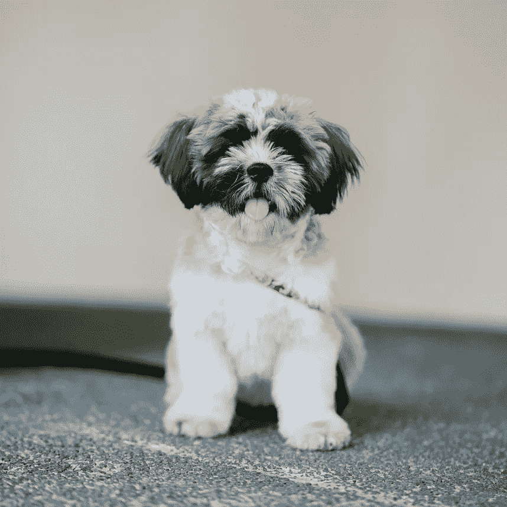
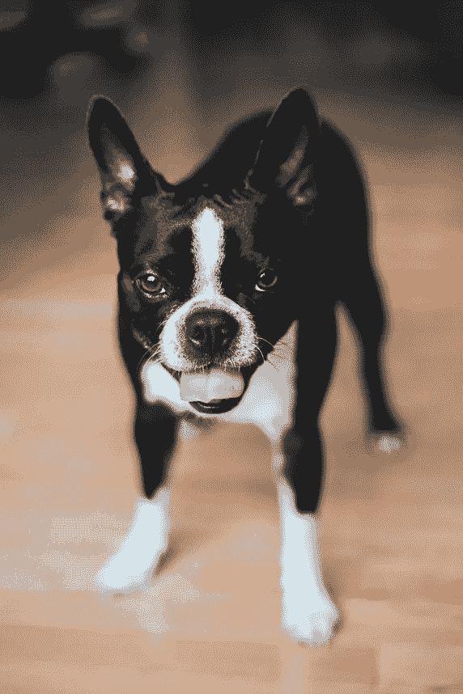
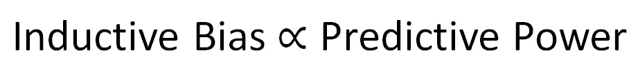

# 深度学习至高无上的原因

> 原文：<https://towardsdatascience.com/what-is-inductive-bias-beac6ab1789b?source=collection_archive---------43----------------------->

## 嘶！这不是关于深入…

来自 [Pexels](https://www.pexels.com/photo/five-bulb-lights-1036936/?utm_content=attributionCopyText&utm_medium=referral&utm_source=pexels) 的 Rodolfo Clix 的照片

> 如果一件事不存在，它会导致曾经创建的每个深度学习模型的垮台，这是什么？

归纳能力是深度学习模型在技术领域占据主导地位的原因。

# 感应偏差的定义

> 让你的算法推断出它的推论的最小断言集。

我们来深入一下(双关，本意)。

你的模型所具有的假设，这使得它能够执行。

在狗与猫分类器的情况下，当新的狗照片遇到模型时，模型能够成功地识别它是猫还是狗。

> **为什么？**
> 
> 我们这么说是因为模型已经知道了猫和狗的样子。因为它创造了一个猫和狗的形状的内部表示。

这个模型所做的学习。*是什么？*

这是它的感应偏差，它的性能的基础。

# 深度学习模型是如何得出其归纳偏差的？

最初，当你创建一个神经模型时，在你给它输入数据之前，它逼近任何东西的能力是无限的。

因此，你输入的任何数据都开始限制无限的近似能力来完成某个特定的任务。你用数据来定义你的深度学习模型的边界。你告诉它:这就是你的工作；如果你偏离了它，你将受到惩罚。

> 你用数据来定义你的深度学习模型的边界。

模型开始收缩自己，并开始应用于它前面的数据。它开始发现一个一般假设(一个可以通过调查证实的尝试性解释)可以帮助它以最佳方式完成工作。本质上，模型开始寻找这个问题的答案。

> 我应该知道的那一件事是什么，其他的一切都应该知道？

最初，它可能会尝试学习一切，即它会尝试学习你给它的每个训练示例的特定假设。

来自[佩克斯](https://www.pexels.com/photo/brown-and-white-short-coated-puppy-1805164/?utm_content=attributionCopyText&utm_medium=referral&utm_source=pexels)的[瓦莱里娅·博尔特涅娃](https://www.pexels.com/@valeriya?utm_content=attributionCopyText&utm_medium=referral&utm_source=pexels)的照片，来自[佩克斯](https://www.pexels.com/photo/white-brown-and-black-shih-tzu-puppy-936317/?utm_content=attributionCopyText&utm_medium=referral&utm_source=pexels)的[心理医生](https://www.pexels.com/@mentatdgt-330508?utm_content=attributionCopyText&utm_medium=referral&utm_source=pexels)的照片，来自[佩克斯](https://www.pexels.com/photo/black-and-white-french-bulldog-4061381/?utm_content=attributionCopyText&utm_medium=referral&utm_source=pexels)的[埃里克·麦克林](https://www.pexels.com/@introspectivedsgn?utm_content=attributionCopyText&utm_medium=referral&utm_source=pexels)的照片

例如，在上面不同品种的狗的照片中，我们可以看到它们是多么的不同。如果我们试图创建特定的假设来对它们进行分类，例如:

> 第一个假设可以是如果有金色和白色的皮毛，脸上有很多皮毛，腿很小，等等，那么，它是一只狗。
> 
> 第二个假设是，如果它有黑白相间的颜色，三角形的脸，等等，那么，它是一只狗。
> 
> 第三个假设可以是，如果它的皮毛是棕色和白色混合的，以此类推，那么，它就是一只狗。

所有这些特定的假设根本不会帮助我们创建一个通用的分类器。因为这些特定的假设只对特定的训练图像有效。

> 深度学习模型的*正向传递*相当于这些特定假设的创建。

但是，这不是我们的目标。这就是我们进行训练的原因，即我们以拒绝这些特定假设的方式来修正模型。

如果模型倾向于特定的假设，我们会惩罚它，因为它们会导致我们使用的损失值更高，而性能度量值(比如，准确性)值更低。

> 深度学习模型的后向传递相当于对这些特定假设的拒绝。

向前和向后传递的每一个循环都导致对某个特定假设的拒绝，而接受一个更普遍的假设。随着更多这样的循环继续发生，模型达到越来越普遍的假设，这将允许它以最佳方式完成任务。

最后一个假设，即模型达到的最一般的假设是它的归纳偏差。最一般的假设是约束条件最少的假设。这里既有神经网络的辨别能力，也有神经网络的泛化能力。

> 该模型得出的最普遍的假设是它的归纳偏差

一般的假设是深度学习模型如何能够在看不见的数据上表现得非常好，因为导出的假设是如此普遍，以至于它几乎包含了问题网络被训练的所有排列和计算。

> 为什么深度学习模型需要大量数据？

这也暗示了为什么他们如此渴望数据，因为他们想为给定的问题推导出最佳的一般假设，所以他们需要看到越来越多的数据变化，以便他们可以将这些变化纳入其一般假设中。

简而言之，归纳偏差越好，神经网络的预测能力(对看不见的数据执行的能力)就越好。

来源:作者

## 旁注

归纳偏差的概念不仅适用于深度学习，它还驱动着现有所有学习算法的性能。

> "眼睛只能看到头脑准备理解的东西。"罗伯逊·戴维斯

# 摘要

在这篇文章中，我们理解了归纳偏差的概念，以及它是如何成为深度学习模型统治的基础的。我们也了解了感应偏差是如何产生的。