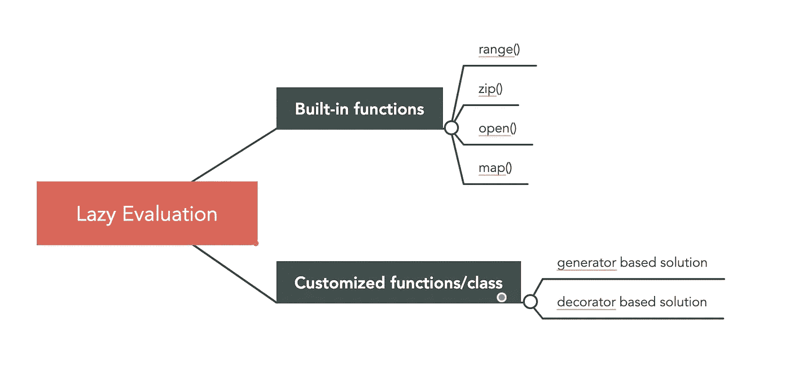

# Python 中的懒求值是什么？

> 原文：<https://towardsdatascience.com/what-is-lazy-evaluation-in-python-9efb1d3bfed0?source=collection_archive---------5----------------------->

## 你不知道 Python 为你优化了多少代码


由[霍利·曼达里奇](https://unsplash.com/@hollymandarich)在 [Unsplash](https://unsplash.com/) 上拍摄的照片

如果你以前从未听说过*惰性求值*， [*惰性求值*](https://en.wikipedia.org/wiki/Lazy_evaluation) 是一种求值策略，它将表达式的求值延迟到需要它的值时，同时也避免了重复求值(来自维基百科)。这通常被认为是一种优化代码的策略。



作者:高

让我们把这个理论变成一个例子。例如，你有一个简单的表达式`sum = 1 + 2`，Python 会试图理解这个表达式的真正含义并得出结论`sum = 3`。这个过程被称为*评估*，它需要某种计算能力。在这种情况下，**评估立即完成**，因此它有另一个名称:*严格评估*。

另一方面，我们有一个不严格的评价，叫做*懒评价。*不同的是 ***懒求值*不会立即对表达式求值，而是只在需要结果时才求值。**有点像一个懒惰的学生，只在作业需要交给老师的时候才去做。

但是在这里偷懒不一定是坏事，它可以提高你代码的效率，节省大量资源。幸运的是，Python 已经悄悄地将*惰性评估*应用于许多内置函数，以优化您的代码。我敢肯定，即使没有意识到*懒惰评估，您也必须熟悉这些功能。*

在本文中，我将解释*懒惰求值*在 Python 中是如何工作的，哪些函数从中受益，以及背后的原因。最后，我将向您展示如何编写自己的*惰性*函数/类。我们开始吧！

## 范围()

很多时候 Python 还是会立即对 expression 求值。让我们看看这个例子。你觉得需要多长时间？

```
print([time.sleep(0), time.sleep(1), time.sleep(2)][0])
```

答案是 3 秒。这是因为当你创建一个列表时，Python 会立即评估列表中的每一项，即使你只需要第一个元素。

从 Python3 开始，在让这样的列表遍历更加内存高效和时间高效方面有了很大的改进，这就是`range()`函数。我敢打赌，每个 Python 开发人员一生中都至少使用过一次这个函数。在 Python2 中，`range(5)`将返回一个包含 5 个元素的列表。随着列表大小的增加，会使用更多的内存。

```
Python 2.7.16
>>> range(5)
[0, 1, 2, 3, 4]
>>> import sys
>>> sys.getsizeof(range(5))
112
>>> sys.getsizeof(range(500))
4072
```

然而在 Python 3 中，`range(5)`返回一个范围类型。这个对象可以被迭代以产生一个数字序列。无论范围有多大，对象总是具有相同的大小。这是因为`range(5)`只存储*开始*、*停止、*、*步骤*的值，需要时计算每一项。

```
Python 3.7.7
>>> range(5)
range(0, 5)
>>> import sys
>>> sys.getsizeof(range(5))
48
>>> sys.getsizeof(range(500))
48
```

*如果你不熟悉生成器、迭代器及其好处，请继续阅读本节。否则，请随意跳过这一部分。*

**迭代器>生成器**

简单来说，迭代器是一个比生成器更大的概念。迭代器是一个**对象**，它的类有一个`__next__`和`__iter__`方法。每次你调用迭代器对象时，你会得到序列中的下一个条目，直到迭代器对象用尽并引发`StopIteration`。然而，生成器是一个返回迭代器的**函数**。除了使用了`yield`而不是`return`之外，它看起来就像一个普通的函数。

当执行`yield`语句时，程序会暂停当前函数的执行，并将产生的值返回给调用者。这是*惰性求值*的关键思想，当需要调用者时计算并返回值，下一个值仍然是安静的，在程序中不做任何事情。

要创建生成器，有两种方法:

创建发电机的两种方法

然后，让我们用`range()`来改进第一个例子。在我们得出最终结果之前，还有另一个“陷阱”。下面的例子有两个功能:`use_generator()`和`use_list()`。除了`use_generator()`在`islice()`功能中使用`()`，而`use_list()`使用`[]`之外，它们看起来几乎一样。然而，这种微小的差异会对运行时间产生巨大的影响。

这种行为的答案已经存在于函数名中。`(time.sleep(x) for x in range(3))`是一个生成器，而`[time.sleep(x) for x in range(3)]`是一个列表，尽管它使用了`range()`。因此，使用 list 的函数比另一个函数花费更多的时间。

如果你理解了这部分，那么恭喜你，你已经对*懒评*了解了 50%。

## Zip()

一个非常相似的用例是`zip()`，它合并两个可重复项来产生一个元组序列。在 Python2 中，`zip(*iterables)`将返回元组列表。

```
Python 2.7.16
>>> type(zip([1,2],[3,4]))
<type 'list'>
>>> import sys
>>> sys.getsizeof(zip([1,2],[3,4]))
88
>>> sys.getsizeof(zip([i for i in range(500)],[i for i in range(500)]))
4072
```

而从 Python3 开始，已经改进为返回一个类似于`range`对象的`zip`对象，可以迭代。

```
Python 3.7.7 
>>> type(zip([1,2],[3,4]))
<class 'zip'>
>>> import sys
>>> sys.getsizeof(zip([1,2],[3,4]))
72
>>> sys.getsizeof(zip([i for i in range(500)],[i for i in range(500)]))
72
```

原因我就不再重复了，因为它和`range()`的思路一样。但是如果你想了解`zip`的其他方面，可以随意看我的另一篇文章。

[](/understand-zip-a-hidden-gem-in-python-9488a255f45d) [## 理解 zip()—Python 中隐藏的瑰宝

### 有效地合并未知数量的列表

towardsdatascience.com](/understand-zip-a-hidden-gem-in-python-9488a255f45d) 

## 打开()

这是另一个内置功能，我们可能每天都在使用它，并认为它是理所当然的。当我们打开一个文件时，我们通常会:

```
with open("file.csv", "r") as f:
    for line in f:
      print(line)
```

`with open(...)`不读取整个文件并将其存储在内存中，而是返回一个可以迭代的 file 对象。正因为如此，它能够有效地读取巨大的文件，而不伤害内存。

## λ表达式

几周前，我收到了一位读者关于 Lambda 表达式的问题，这实际上引发了我写这篇文章。他的问题是:

> 为什么像 x = map(lambda x: x*2，[1，2，3，4，5])这样的 lambda map 对象不占用任何空间？但是如果你做了 list(x)，它会打印所有的值并占用内存空间？

我希望到目前为止，你应该对这里发生的事情有所了解。`map`对象也是一个可以迭代的惰性对象。在每个循环中只对 1 个项目进行计算`x*2`。做`list(x)`的时候，基本上是一次性计算完所有的值。如果只是想迭代`map`对象，就不用做`list(x)`。

lambda 表达式中的惰性求值

## 如何写一个懒惰的评价函数/类？

在文章的最后一部分，我想把我们带到下一个层次，在这里我们编写自己的*懒惰评估*函数/类。这有助于我们扩展内置功能之外的功能。

正如我们所理解的，惰性求值的一个关键部分无非是一个生成器。因此，我们可以简单地把函数写成一个生成器。

***懒惰功能—生成器***

惰性函数:生成器

***懒惰属性—装饰者***

自定义惰性计算的另一个常见用例是类属性的初始化。当我们初始化一个类时，某些属性可能需要很长时间来计算。在下面的例子中，属性`cities`花费了更长的时间，因为它需要调用一个 API 来获取城市名称列表。因此，如果我们对于一些国家对象实际上不需要这个值，那将是浪费时间。

这个博客中的一个好的解决方案是为这样的*懒惰*属性创建一个装饰器，这样昂贵的操作只有在需要这个属性的时候才会被执行。从控制台输出可以看到，`cities property is called`是在我们打印出`china.cities`之后打印出来的。

惰性属性:装饰者

我希望这篇文章能启发你对代码优化有一个新的看法。

## 参考:

 [## Python 中延迟求值的属性模式

### 惰性求值是一种有用的模式，在许多情况下可以提高代码的效率。这方面的一个例子是…

stevenloria.com](https://stevenloria.com/lazy-properties/) [](https://sanjayasubedi.com.np/python/python-tips-lazy-evaluation-in-python/) [## Python 技巧:Python 中的惰性求值

### 虽然小数据集可能适合您的主内存，但不是所有的数据集都适合。有时您无法读取整个数据集…

sanjayasubedi.com.np](https://sanjayasubedi.com.np/python/python-tips-lazy-evaluation-in-python/)