# 作为一名对游戏充满热情的数据科学家是什么感觉…

> 原文：<https://towardsdatascience.com/what-is-like-to-be-a-data-scientist-with-a-passion-for-gaming-43c067ad6415?source=collection_archive---------15----------------------->

## 英雄联盟:创建一个模型，根据表现预测获胜的球队

弗洛里安·奥利佛在 [Unsplash](https://unsplash.com/s/photos/gaming?utm_source=unsplash&utm_medium=referral&utm_content=creditCopyText) 上拍摄的照片

# 摘要

在 2 个月的时间里，我做了一个关于英雄联盟**的简短数据项目，因为我是这个游戏及其数据使用的忠实粉丝。该项目的重点是我们是否可以创建一个模型，根据表现来预测获胜的团队。我试图用逻辑回归和其他模型来预测比赛结果。特征是从[**Riot Games API**](https://developer.riotgames.com/)**公开的数据中提取的——包括为游戏挑选的冠军、玩家角色信息、玩家对冠军的掌握程度(*赛前*知识)以及*游戏内*玩家统计。我发现，从一开始只使用*预赛*知识(冠军、大师、角色、法术)只是比赛结果的一个弱预测器，但是使用*游戏内*统计，该模型成为一个强预测器。****

# ****介绍****

## ****1-游戏行业数据和分析简介:****

********

****安东尼·布洛林在 [Unsplash](https://unsplash.com/s/photos/esport?utm_source=unsplash&utm_medium=referral&utm_content=creditCopyText) 上拍摄的照片****

****正如他们对传统体育所做的那样，各种数据的收集、分析和使用正在开始改变在线竞技游戏的玩法和概念。如今，随着**电子竞技**越来越受欢迎，关于**电子竞技**游戏的数据分析也变得越来越常见。****

****在这个项目中，我选择了 2009 年由 [**Riot Games**](https://www.riotgames.com/en) 开发的著名网游**作为案例研究。主要原因是我从游戏的第五个赛季就开始玩并喜欢这个游戏，我想给这个项目带来一个比其他案例研究更有见识的观点。另一个重要的动机点是 [**Riot Games 的 API**](https://developer.riotgames.com/) ，它允许公众轻松地进行查询并从他们的服务器上获取信息。******

## ****2-相关工作****

****由于**英雄联盟**是一款受欢迎的游戏，在数据分析领域已经有了一些应用。像 [**图盟**](https://www.leagueofgraphs.com/) 和 [**MetaSrc**](https://www.metasrc.com/5v5) 这样的网站从**英雄联盟 API** 中收集基本的统计数据和信息，并使用它来构建简单的分析，如最受欢迎的冠军是谁，两个冠军在一起比赛时的胜率是多少...这些现有的应用程序目前没有做的是预测当前正在进行的游戏，并记住该游戏的所有功能，这正是该项目试图填补的。****

# ****英雄联盟作为游戏的背景****

## ****1-游戏概述:****

******英雄联盟**是由**开发的一款 ***多人在线战场竞技场(MOBA)*** 风格游戏。每场比赛由**两个**队组成，每队有 **5** 名队员。每个队在竞技场的相对两侧开始游戏，目标是克服障碍(炮塔、抑制剂和敌方球员)，以摧毁敌方基地( *Nexus)* 。全地图划分的团队玩家有 5 个标准位置:**顶、中、丛林、攻击伤害搬运(ADC)和支援**。每场比赛通常持续二十分钟到一小时。玩家可以从 140 多个具有不同特点和能力的冠军中选择一个独特的冠军。这款游戏也代表了一个蓬勃发展的竞争场景，拥有数百万的锦标赛奖金池和在线观众。******

********

****链接:[https://www.pinterest.com/pin/579697783257078372/?lp=true](https://www.pinterest.com/pin/579697783257078372/?lp=true)****

****每个游戏中有这么多的参数，不可能说一个因素将决定任何特定玩家的成功或失败。此外，**英雄联盟**背后有这么大的社区，预测休闲玩家和锦标赛游戏的比赛结果对玩家和粉丝来说都是有趣和有价值的。****

## ****2-游戏信息:****

******英雄联盟**是一款复杂的游戏，需要掌握许多元素的知识才能玩得熟练。游戏中，两队各五名玩家在一个名为 ***召唤师裂谷*** 的战场上对战。还有其他不同目标和布局的战场，但在我们的项目中不会研究。 ***召唤师裂谷*** 由各队的基地、三条车道、丛林组成。英雄联盟的目标是摧毁对方队伍的 Nexus，一个位于敌方基地的建筑。****

****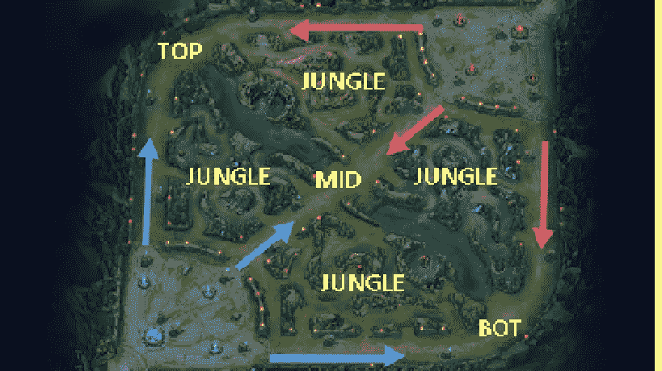****

****链接:shorturl.at/ktAK1****

*******gold differential***是一个原始统计数据的例子，可以一眼看出比赛的状态。通常当一个队比另一个队拥有更多的金牌时，这意味着他们的冠军携带更强大的物品，如果他们进入团队战斗，更有可能获胜。结合个人***【KDA(杀死数、死亡数、助攻数)*** 的数字和一个团队累计的总杀死数，这是一个让观众知道谁赢了的简单方法。如果我们看一下 LCS 的广播， ***黄金微分*** 是我们在屏幕上方看到的第一组数字之一。但是像这样的统计数据并不能说明全部情况…****

# ****数据收集****

****我试图从公共 **Riot Games API** 中提取数据，该 API 允许收集关于召唤师(LoL 对玩家的称呼)、冠军和过去比赛的数据。然后我用 ***把这些都收集到一个文件里。xlsx*** 格式，包含 2017 赛季每场比赛的所有可用数据。****

> ****备注:下载的数据集包含超过 75 个变量，其中一些没有意义。所以我决定去掉那些对我们的分析没有帮助的变量。****

****我在 Kaggle 上上传了数据，可以在这里随意下载[。](https://www.kaggle.com/kamalchouhbi/league-of-legends-match-data-2017)****

****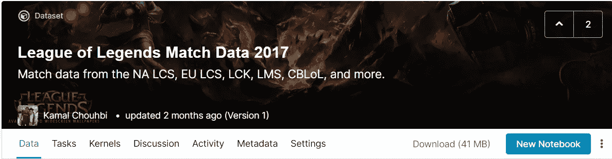****

****所以，我决定删除 25 个对我们的预测没有帮助的变量。现在，我们在 ***中有了一个数据集。csv*** 格式，其中包含 50 个变量。****

****为了解释下载的比赛数据文件，你可以在这里找到一个包含变量名及其描述的字典。****

****这是我们使用 Tableau Desktop 软件分析的数据集的预览:****

****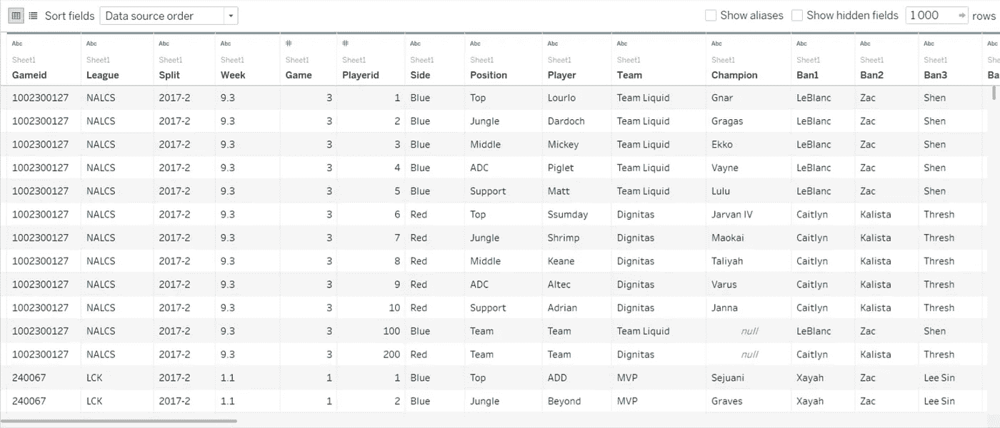****

****文件预览:2017clean.csv****

# ****探索性数据分析(EDA):****

## ****a-英雄联盟的演变:****

****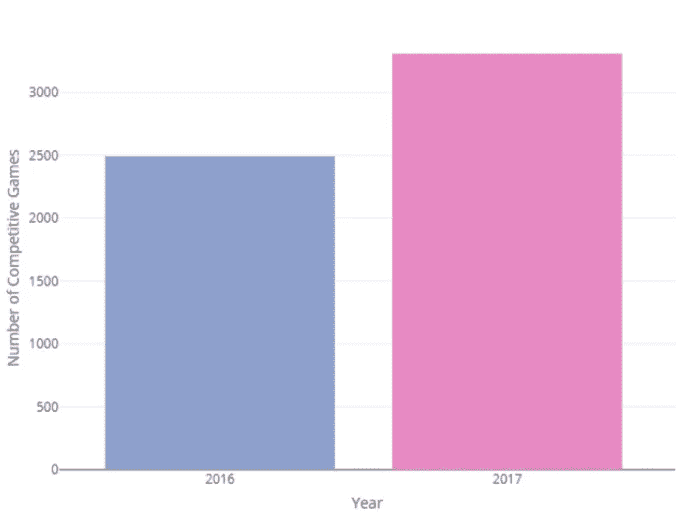****

****首先，我试图通过对比我们数据中的竞技游戏数量与前一年 2016 年的对比来说明游戏令人印象深刻的增长。****

****2016 年 **2429** 场比赛。联赛继续大幅增长，2017 年达到了令人难以置信的 3117 场职业竞技比赛。****

****我们还可以看到，联赛 ***LPL、纳尔茨、LCK*** 和 ***尤尔茨*** 各有超过 350 场的比赛最多。****

****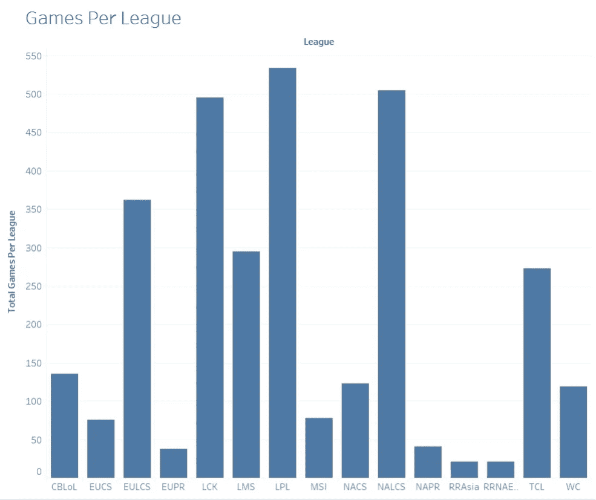****

## ****b 队:****

****计算胜率相当于估算胜率占游戏总数的比例。下面我们可以看到，有球队把 0%和 100%作为胜率，这是不连贯的。****

****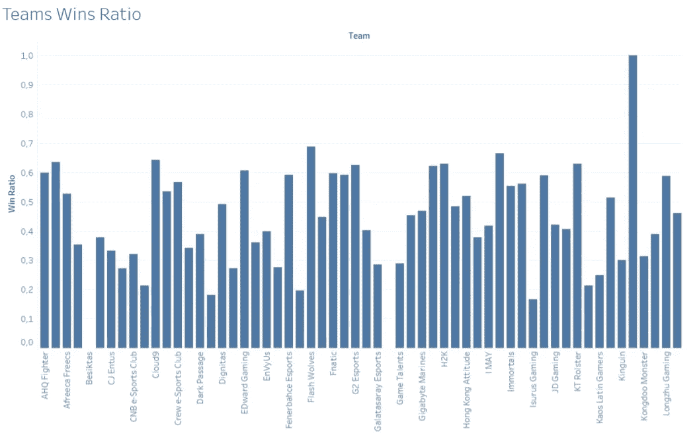****

****问题是有些球队只打了几场比赛，有些甚至只打了一场。为了克服这个问题，我们需要计算在不同联赛中参加 60 场以上比赛的“出场最多的球队”的胜率。****

****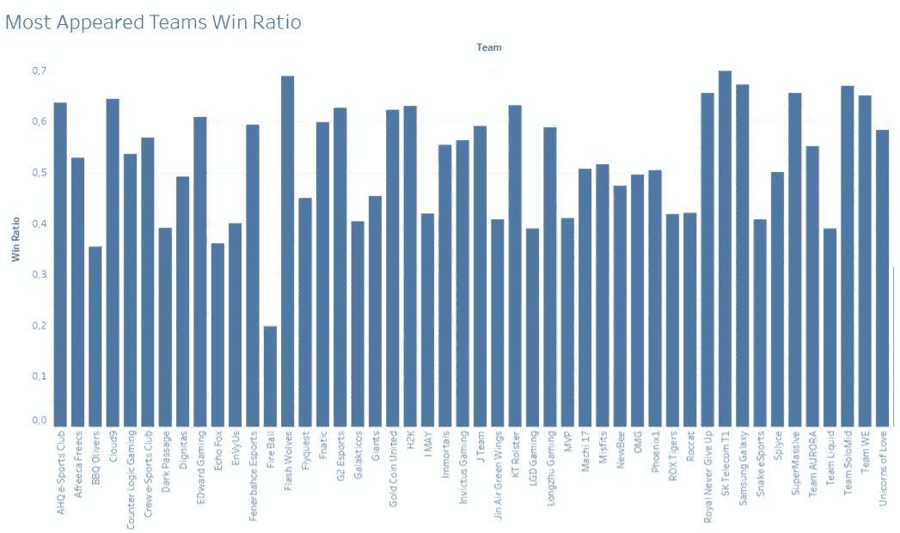****

****我们可以看到， [**SK 电讯 T1**](https://lol.gamepedia.com/SK_Telecom_T1)[**闪狼**](https://lol.gamepedia.com/Flash_Wolves)[**三星银河**](https://lol.gamepedia.com/Samsung_Galaxy) 胜率最高。我首先计算了赢&输，然后我分别计算了每个团队的胜率:****

****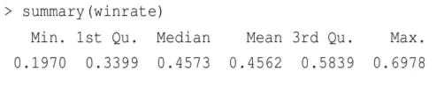********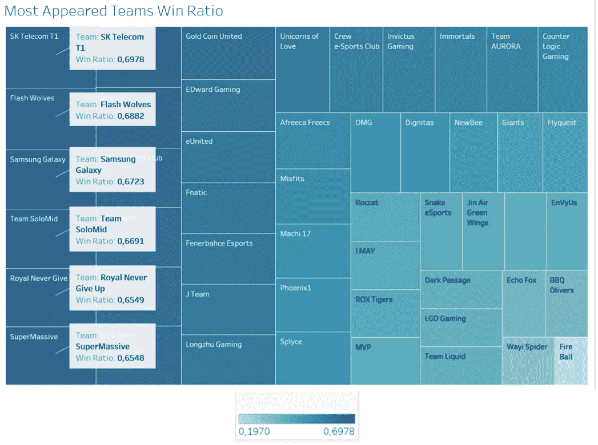****

****因此，我们得出结论:****

*   ****一个*职业队*的平均**胜率**是 **45%** 。****
*   ****[**SK 电讯 T1**](https://lol.gamepedia.com/SK_Telecom_T1) 胜率最高**。在 139 场比赛中，他们设法赢了 97 场**比赛，以 69，78% **的高胜率**********
*   ****[**闪狼**](https://lol.gamepedia.com/Flash_Wolves) 有 **93** 场胜率**64(68.82%)******
*   ****[**三星银河**](https://lol.gamepedia.com/Samsung_Galaxy) 胜率第三。他们设法赢得了 80 场比赛，胜率达到了 67.23%****

## ****c 级玩家:****

****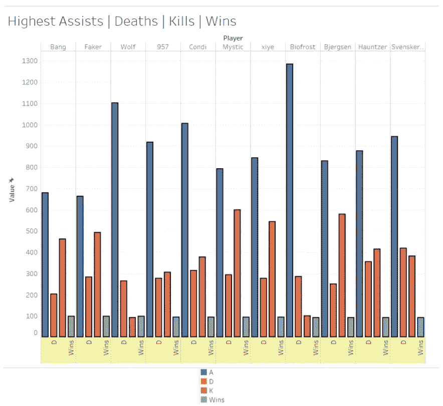****

*   ****[**【神秘主义者】**](https://lol.gamepedia.com/Mystic)**(598)**[**比格森**](https://lol.gamepedia.com/Bjergsen)**(577)****[**西野**](https://lol.gamepedia.com/Xiye) **(541)** 是竞技联赛中击杀次数最多的选手。******
*   ****[**生物弗罗斯特**](https://lol.gamepedia.com/Biofrost)**(1282)**[**沃尔夫**](https://lol.gamepedia.com/Wolf_(Lee_Jae-wan))**(1099)****[**康迪**](https://lol.gamepedia.com/Condi) **(1004)** 是竞技联赛中助攻次数最多的球员。******

****这场比赛的另一个重要因素是 t *他的杀数*，死亡数和助攻数 **KDA(杀数，死亡数，助攻数)**。公式:****

> *******KDA 比率= (K+A) / Max(1，D)*** 其中:K =死亡数| D =死亡数| A =助攻数****

****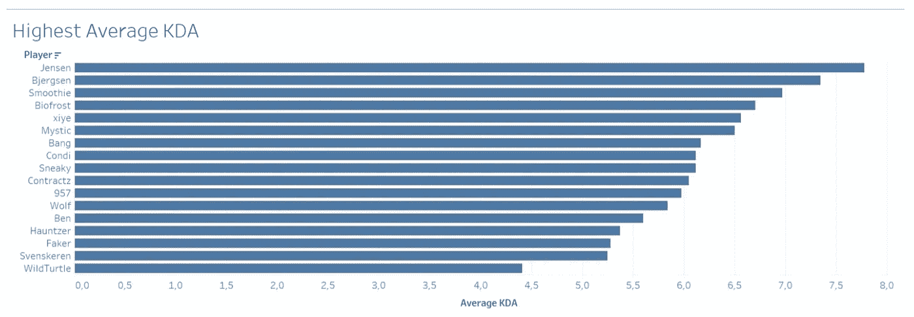****

*   ****职业玩家的平均 KDA 是 3.74****
*   ****[**詹森**](https://lol.gamepedia.com/Jensen) & [**比耶格森**](https://lol.gamepedia.com/Bjergsen) 是竞技联赛中 **KDA** 最高的两名球员，分别拥有 **7、78**&7、34****

## ****黄金和伤害****

****同时，我也试着用线性回归的方法来看看获得的**金币**和造成的**伤害**之间的相关性。如下图所示，**黄金**和**伤害**之间有很强的线性相关性，也就是说玩家利用好游戏中获得的黄金，将黄金转化为对敌人的伤害。****

****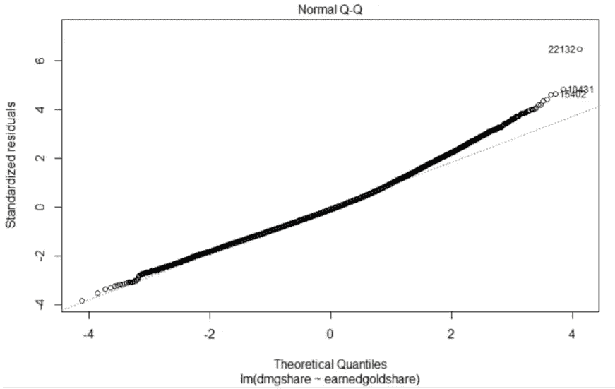********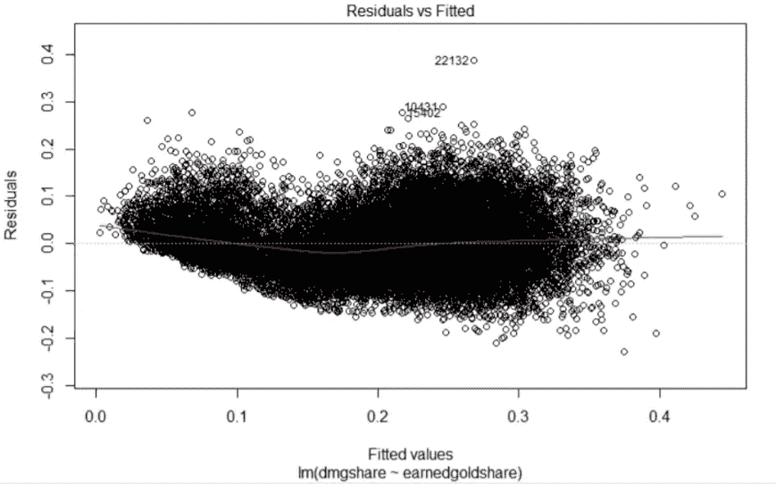****

****另外，我研究了**英雄联盟**游戏的其他方面，这里不想解释，以免写长篇。也许我可以在未来写其他文章来呈现整个研究。现在让我们进入最重要的部分！****

# ****赢家预测:****

> ****我们能预测一场比赛的结果吗？****

****实际上，从一开始就只使用赛前知识(冠军，大师，角色，法术)只是比赛结果的一个弱预测器，但是使用游戏中的统计数据，该模型成为一个强预测器。这就是为什么我会试着根据游戏中的统计数据来建立我们的模型。****

****事实上，我们不确定哪些变量对预测结果有用。建立双变量模型通常很有帮助，双变量模型是使用单个独立变量预测结果的模型。但问题是，在双变量逻辑回归模型中，28 个变量中的哪一个是结果变量的重要预测因子？我们需要建立不同的模型，以便找到具有最高准确性的最佳模型，或者我们可以使用相关函数来了解与变量结果高度相关的变量。****

****首先，我开始排除游戏结束时统计数据的变量，因为在那种情况下预测胜利已经太晚了。此外，我决定忽略与个人统计数据相关的变量，因为这是一个团队游戏，一个球员不可能独自获胜。****

****我在同一个数据集上应用了**逻辑回归**和**随机森林**。所以我得到了可变重要性*(逻辑回归的绝对系数)*和*(随机森林的可变重要性)*。我试图将两者结合起来，得到一个最终的变量重要性。经过多次尝试，我设法建立了一个最终模型**(叠加:逻辑回归&随机前沿)**，其重要变量如下:****

*   ******gdat 10:**10 点黄金差****
*   ******gdat15 :** 金差 15:00****
*   ******fb :** 第一次血杀(1 是，0 否)****
*   ****团队杀戮，s : 团队杀戮总数****
*   ******团队死亡:**团队死亡总数****
*   ****游戏的第一座塔被杀死(1 是，0 否)****
*   ******组队任务:**组队杀死的塔总数****
*   ******敌方死亡人数:**被对方杀死的总塔数****
*   ******fd :** 游戏中第一条龙被杀死(1 是，0 否)****
*   ******团队屠龙:**团队屠龙总数****
*   ****被对方杀死的龙总数****

## ****混乱矩阵解释****

*   *******正确:*** 预测红队获胜，实际获胜:6318 次****
*   *******正确:*** 预测蓝队获胜，实际获胜:6351 次****
*   *******错:*** 预测红队赢但红队输了:95 次****
*   *******错:*** 预测蓝队赢但蓝队输了:106 次****

> ****准确率= 98.43 %****

# ****r 闪亮应用:****

****[**Shiny**](https://shiny.rstudio.com/) 是一个 **R** 包，它使得直接从 **R** 构建交互式 web 应用变得容易。我决定构建一个包含两部分的 web 应用程序:****

*   ****第一部分使用我们的最佳预测模型，其准确率为 98%；你可以填一张表格，然后得到你获胜机会的百分比。****
*   ****第二个用 **Riot Games Api** 对比**英雄联盟**冠军统计。一次可以比较两个冠军，补丁版本也可选。****

****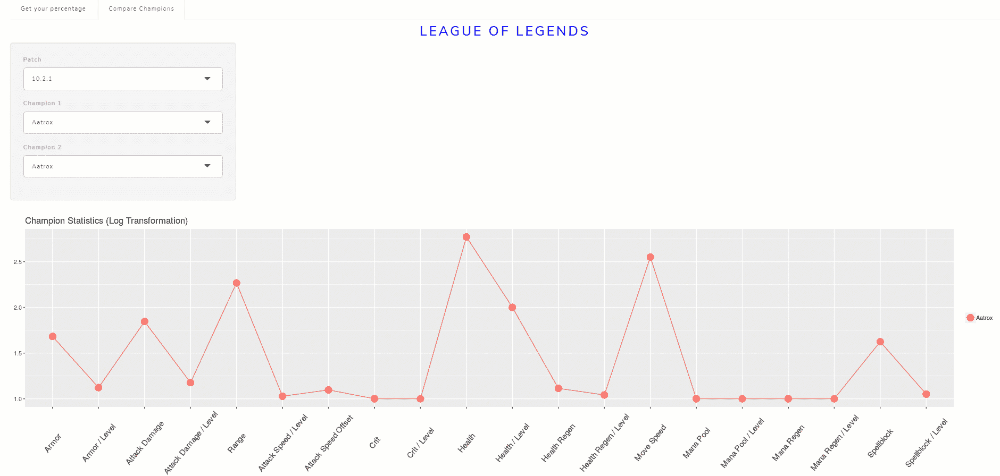****

# ******讨论**:****

****在这项研究中，我使用了与游戏的一个补丁相关的数据，因为 Riot Games 试图将冠军胜率保持在接近 50%。任何高于 50%的胜率意味着冠军给了玩家优势，而任何低于 50%的胜率意味着冠军给了玩家劣势。****

****为了保持平衡，**暴动**决定分别 ***nerf*** 和 ***buff*** 这些冠军。这意味着，如果团队选择相同的冠军，补丁的变化数量和胜率之间有很强的相关性。****

# ****结论:****

****我们希望将来能够看到更多的最新数据，但这是一个很好的演示，说明了数据如何能够推动任何人，从**普通玩家**，到**暴乱游戏** **专业广播**，甚至**团队**寻找最佳方法来分析敌方团队的优势和劣势，以做出明智的决策。****

****通过 Riot API 挖掘数据并发布有趣的统计数据的现有网站中，没有一个能够有效地预测比赛中的冠军球队。这项研究使用与两个队的统计数据相关的不同变量来完成这项任务，以便预测获胜者。****

****我想提到的是， [**Riot API**](https://developer.riotgames.com/) 还包含了更多我们忽略的信息，但这些信息可以用于许多其他目的。****

# ****参考资料:****

*   ****英雄联盟:游戏 API = = >[https://developer.riotgames.com](https://developer.riotgames.com/)****
*   ****匹配数据字典= = >[https://oracleselixir.com/match-data/match-data-dictionary/](https://oracleselixir.com/match-data/match-data-dictionary/)****
*   ****双提升分析 2018 = = >[https://rpubs.com/kail/dlift](https://rpubs.com/kail/dlift)****
*   ****Kaggle:英雄联盟排名游戏= = >[https://www . ka ggle . com/jaytege/League-of-Legends-data-analysis/data](https://www.kaggle.com/jaytegge/league-of-legends-data-analysis/data)****
*   ****分析联盟= = >[http://league-analytics.com](http://league-analytics.com/)****