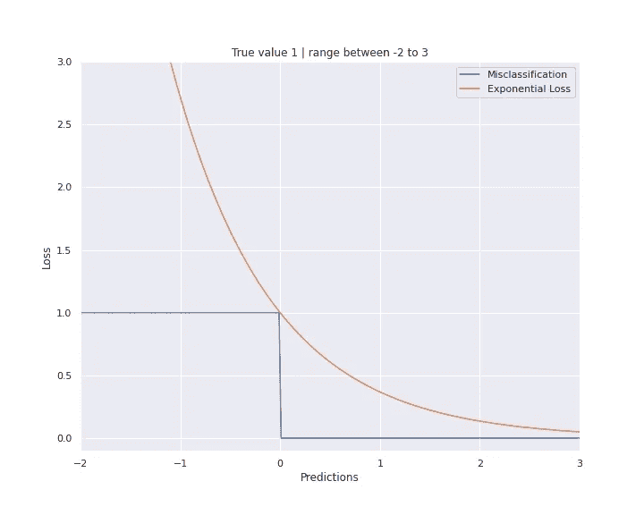
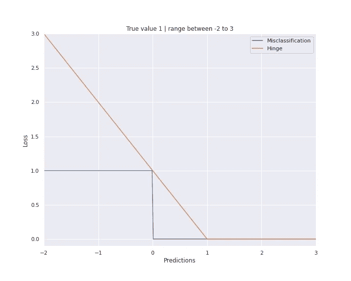
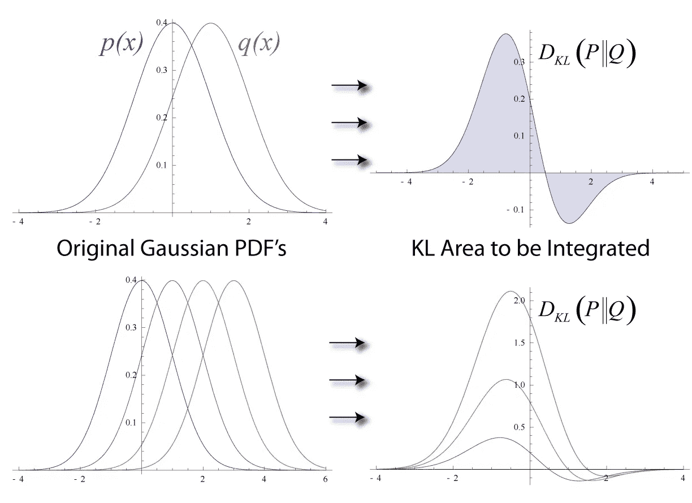
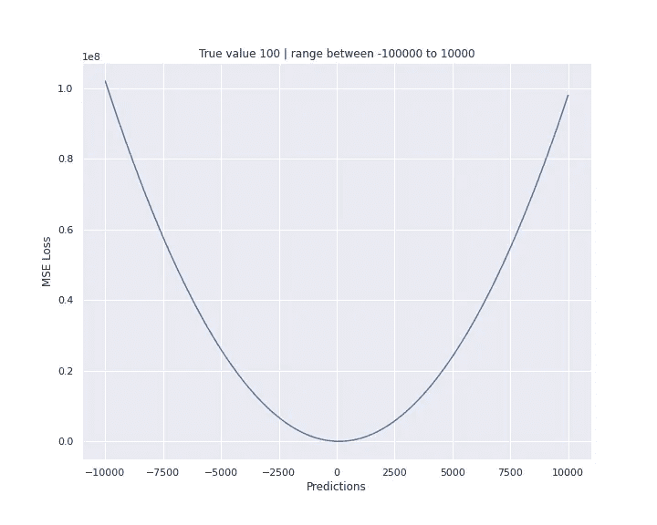
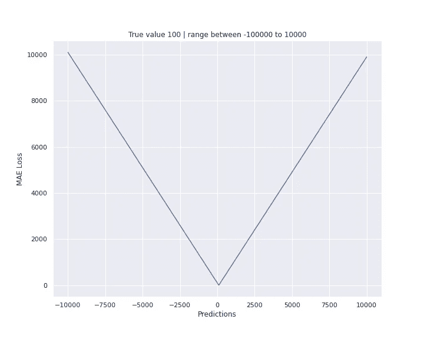
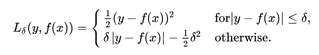
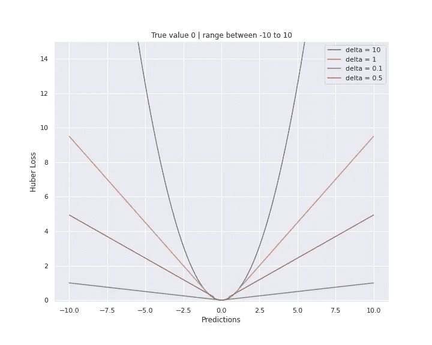
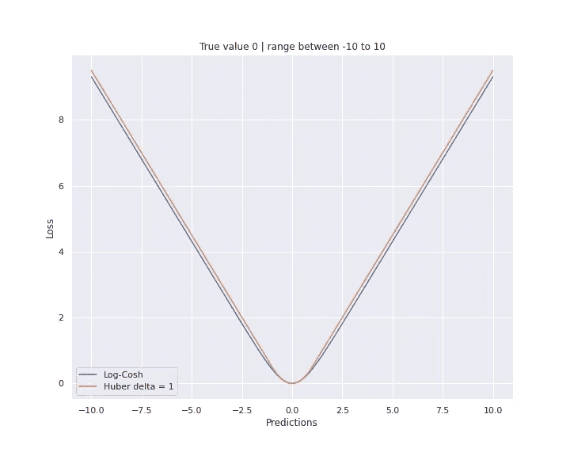

# 什么是损失函数？

> 原文：<https://towardsdatascience.com/what-is-loss-function-1e2605aeb904?source=collection_archive---------4----------------------->


来源:米里亚姆·埃斯帕奇

## 在关于激活功能的帖子之后，我们将潜入第二部分，将 ***【损失】*** 或 ***目标*** ***功能*** 用于神经网络

包含所有代码的笔记本可以在这里找到: [GitHub](https://github.com/Christophe-pere/Loss_function) 你可以找到代码来生成不同类型的数据集和神经网络来测试损失函数。

为了理解什么是*损失函数，*这里引用一下学习过程:

> 一种衡量算法是否做得很好的方法-这是确定算法的当前输出与其预期输出之间的距离所必需的。该测量被用作反馈信号来调整算法的工作方式。这个调整步骤就是我们所说的*学习*。
> Fran ois Chollet，Python 深度学习(2017)，Manning，第 1 章，第 6 页

**损失函数**是**计算算法当前输出和期望输出**之间距离的函数。这是一种评估算法如何对数据建模的方法。它可以分为两类。一个用于**分类**(离散值，0，1，2…)，另一个用于**回归**(连续值)。

## 训练一个神经网络常用的损失函数有哪些？

# 内容

*   交叉熵
*   原木损失
*   指数损失
*   铰链损耗
*   Kullback Leibler 发散损失
*   均方误差(MSE — L2)
*   平均绝对误差(美-L1)
*   胡伯损失

这些软件包是必需的:

```
%matplotlib inline
import keras.backend as K
import numpy as np
import matplotlib.pyplot as plt
```

# **分类**

## **交叉熵**

该函数来自信息论，其目标是**测量信息分布比特数的两个平均值之差**。**交叉熵**作为**对数损失函数**(不相同，但它们测量相同的东西)计算两个概率分布函数之间的差异。

> **熵**是传输从概率分布中随机选择的事件所需的比特数。偏斜分布具有低熵，而事件概率相等的分布具有较大的熵。
> 
> 在信息论中，我们喜欢描述一个事件的*惊喜*。低概率事件更令人惊讶，因此有更多的信息。而事件同样可能发生的概率分布更令人惊讶，熵也更大。
> 
> **-偏态概率分布** ( *不足为奇*):低熵。
> 
> **-均衡概率分布** ( *惊人*):高熵。

交叉熵是机器学习中最常用的一类损失函数，因为它导致更好的泛化模型和更快的训练。

交叉熵可用于二元和多类分类问题(许多类具有一个标签，不同于许多类具有称为多标签分类的多标签)。

**交叉熵的类型**:

*   二元交叉熵:用于二元分类问题
*   分类交叉熵:二进制和多类问题，标签需要被编码为分类的，一键编码表示(对于 3 类:[0，1，0]，[1，0，0]…)
*   稀疏交叉熵:二元和多类问题(标签是整数——0 或 1 或… n，取决于标签的数量)

这类损失函数的取值范围:

*   **0.00** :完美概率
*   **< 0.02** :大概率
*   **< 0.05** :良好
*   **< 0.20** :太好了
*   **> 0.30** :不大
*   1.00 :地狱
*   **> 2.00** 有些东西不工作

## **原木损耗**

对数损失是高达 1 / log(2)因子的二进制交叉熵。这个损失函数是凸的，并且对于负值线性增长(对异常值不太敏感)。使用对数损失的常用算法是 ***逻辑回归*** 。

> 二元分类问题的负对数似然性通常简称为“对数损失”,作为逻辑回归的损失函数。
> 
> -对数损失=负对数似然，符合伯努利概率分布
> 
> 对于分类问题，“*对数损失*”、“*交叉熵*”和“*负对数似然*”可以互换使用。
> 
> 更一般地，术语“*交叉熵*”和“*负对数似然*”在分类模型的损失函数的上下文中可互换使用。

## 指数损失

指数损失被设计在 Adaboost 算法的开始，该算法贪婪地优化它。数学形式为:
exp _ loss = 1/m * sum(exp(-y * f(x)))

可以这样编码:

```
def exponential_loss(y_pred, y_true):
    return np.mean(np.exp(- y_pred * y_true))
```

结果如下所示:



指数损失与错误分类(如果 y<0，则为 1，否则为 0)

## 铰链损耗

在分类任务中，铰链损失函数被用来修正 SVM 算法的超平面。目标是在没有被正确预测或离超平面太近的点上进行不同的惩罚。

它的数学公式是 Hinge = max(0，1-y*f(x))和相应的代码:

```
def Hinge(y_pred, y_true):
    return np.max([0., 1\. - y_pred * y_true])
```

这个方程的结果是凸的，但不可微，需要一个次梯度算法来优化。

结果如下所示:



铰链损失 vs 误分类(1 if y <0 else 0)

## Kullback Leibler Divergence Loss

The KL divergence is the score of two different probability distribution functions. The KL difference between a PDF of q(x) and a PDF of p(x) is noted KL(Q||P) where || means *散度*(不是对称 KL(P||Q)！= KL(Q||P))。

KL(Q | | P)=-sum(Q(x)* log(P(x)/Q(x))或 sum(q(x)*log(q(x)/p(x))

求和是针对离散情况的，积分是针对连续情况的。这意味着，对于相同的数据，如果 q(x)的 PDF 大，而 p(x)的 PDF 小，则散度增加。在机器学习中，你可以将这表示为预测和基本事实之间的差异。

以下代码显示了如何将 KL 散度用于预测和地面实况:

```
def kl_divergence(y_true, y_pred):
    return y_true * np.log(y_true / y_pred)
```

这里可以显示一个简单的可视化:



来源:维基百科

> 因此，KL 散度通常被称为“*相对熵*
> 
> **-交叉熵**:用 Q 而不是 p 来表示一个事件的平均总位数
> 
> **-相对熵** ( *KL 散度*):从 Q 而不是 p 来表示事件的平均额外比特数。

# **回归**

## 均方误差损失(也称为 L2 正则化)

它是当前输出 *y_pred* 和预期输出 *y_true* 的平方差除以输出数。**MSE 函数对异常值非常敏感**，因为差值是给予异常值更多重要性的平方。如果我们必须预测所有目标的一个值，预测值应该是平均值。

这是这样表述的:

```
def mean_square_error(y_true, y_pred):
    return K.mean(K.square(y_true-y_pred), axis=-1)
```

我们可以将 MSE 函数的行为可视化，将一系列值(此处为-10000 到 10000)与一个常数值(此处为 100)进行比较:



均方误差损失的行为

该行为是对梯度下降算法特别有用的二次曲线。越接近最小值，梯度越小。如果异常值对问题很重要，则 MSE 非常有用。如果异常值是有噪声的、错误的数据或错误的测量值，则应使用 MAE 损失函数。

## 平均绝对误差损失(也称为 L1 正则化)

在前一个损失函数的差值处，平方被一个绝对值代替。这种差异对具有“V”形的损失函数的行为有很大的影响。每个点的梯度都是相同的，即使值接近最小值(可能会产生跳跃)。它需要动态修改学习速率，以减少接近最小值的步长。MAE 函数对异常值更稳健，因为它基于与 MSE 的平方相比的绝对值。这就像一个中位数，离群值不能真正影响她的行为。

您可以像这样轻松地实现它:

```
def mean_square_error(y_true, y_pred):
    return K.mean(K.abs(y_true-y_pred), axis=-1)
```

我们可以将一系列值(此处为-10000 到 10000)与一个常量值(此处为 100)进行比较，从而直观地了解 MAE 函数的行为:



平均绝对误差损失的行为

## 均方对数误差

## 胡伯损失

Huber 损失是 MAE 和 MSE(L1-L2)的组合，但它取决于一个影响损失函数形状的附加参数 delta。这个参数需要通过算法进行微调。**当值很大(远离最小值)时，函数具有 MAE 的行为，接近最小值时，函数的行为类似于 MSE** 。所以 ***delta*** 参数就是你对离群值的敏感度。胡伯损失的数学形式是:



我们可以用两种方式实现这个函数，这里我给出一个函数，其中所有的块都是显式的。

```
*# custom huber loss function* 
def huber_loss_error(y_true, y_pred, delta=0.1):
    res = []
    for i in zip(y_true, y_pred):
        if abs(i[0]-i[1])<=delta:
            res.append(0.5*((i[0]-i[1])**2))
        else:
            res.append(delta*((abs(i[0]-i[1]) )-0.5*(delta**2)))
 *# can also be write as:
 # np.where(np.abs(y_true-y_pred) < delta, 0.5*(y_true-y_pred)**2 , delta*(np.abs(y_true-y_pred)-0.5*delta))*
    return res # np.sum(res)
```

我们可以将一系列值(此处为-10 到 10)与一个常数值(此处为 0)进行比较，从而直观地了解 Huber 损失函数的行为:



胡伯损失行为

Huber 损耗允许对较大的数字有较大的梯度，但当值变小时梯度减小。但是，这个函数需要微调增量，但计算量很大。为了避免这种情况，您可以使用 Log-Cosh 损失(本文中没有解释，但您可以在下一个图中看到它们之间的差异)。



Huber 损失函数(δ= 1)和 Log-Cosh 损失函数的比较

## 参考资料:

*   [https://machine learning mastery . com/how-to-choose-loss-functions-when-training-deep-learning-neural-networks/](https://machinelearningmastery.com/how-to-choose-loss-functions-when-training-deep-learning-neural-networks/)
*   [https://keras . io/API/losses/regression _ losses/# meansqualdlogarithmicerror-class](https://keras.io/api/losses/regression_losses/#meansquaredlogarithmicerror-class)
*   [许静怡](https://arxiv.org/search/cs?searchtype=author&query=Xu%2C+J)等，[一种利用符号知识进行深度学习的语义损失函数(2017)](https://arxiv.org/abs/1711.11157) ，arxiv
*   [https://en . Wikipedia . org/wiki/kull back % E2 % 80% 93 lei bler _ divergence](https://en.wikipedia.org/wiki/Kullback%E2%80%93Leibler_divergence)
*   [https://towards data science . com/KL-divergence-python-example-b 87069 e4b 810](/kl-divergence-python-example-b87069e4b810)
*   [https://machine learning mastery . com/divergence-between-probability-distributions/](https://machinelearningmastery.com/divergence-between-probability-distributions/)
*   [https://dibyaghosh.com/blog/probability/kldivergence.html](https://dibyaghosh.com/blog/probability/kldivergence.html)
*   [https://algorithm ia . com/blog/introduction-to-loss-functions #:~:text =这里讨论了% 20 几种% 20 不同% 20 常见% 20 损失% 20 函数% 20。](https://algorithmia.com/blog/introduction-to-loss-functions#:~:text=There%20are%20several%20different%20common,of%20loss%20functions%20is%20discussed.)
*   [伊恩·古德菲勒、约舒阿·本吉奥、亚伦·库维尔，《深度学习》(2016)，麻省理工学院出版社](http://www.deeplearningbook.org/)
*   [Fran ois Chollet，用 Python 进行深度学习(2017)，Manning](https://www.manning.com/books/deep-learning-with-python)
*   [Fran ois Chollet，](https://github.com/fchollet/deep-learning-with-python-notebooks)该书的配套 Jupyter 笔记本[用 Python 进行深度学习(2017)，github](https://github.com/fchollet/deep-learning-with-python-notebooks)
*   [https://ml-cheat sheet . readthedocs . io/en/latest/loss _ functions . html](https://ml-cheatsheet.readthedocs.io/en/latest/loss_functions.html#kullback-leibler)
*   [https://towards data science . com/common-loss-functions-in-machine-learning-46 af 0 ffc 4d 23](/common-loss-functions-in-machine-learning-46af0ffc4d23)
*   [https://medium . com/@ phu ctrt/loss-functions-why-what-where-when-189815343 d3f](https://medium.com/@phuctrt/loss-functions-why-what-where-or-when-189815343d3f)
*   [https://algorithmia.com/blog/introduction-to-loss-functions](https://algorithmia.com/blog/introduction-to-loss-functions)
*   [https://machine learning mastery . com/loss-and-loss-functions-for-training-deep-learning-neural-networks/](https://machinelearningmastery.com/loss-and-loss-functions-for-training-deep-learning-neural-networks/)
*   [https://en . Wikipedia . org/wiki/Loss _ function #:~:text =在% 20 数学% 20 优化% 20 和% 20 决策，成本% 22% 20 关联% 20 与% 20 事件。](https://en.wikipedia.org/wiki/Loss_function#:~:text=In%20mathematical%20optimization%20and%20decision,cost%22%20associated%20with%20the%20event.)
*   墨菲，凯文，*《机器学习:概率视角》* (2012)，麻省理工学院