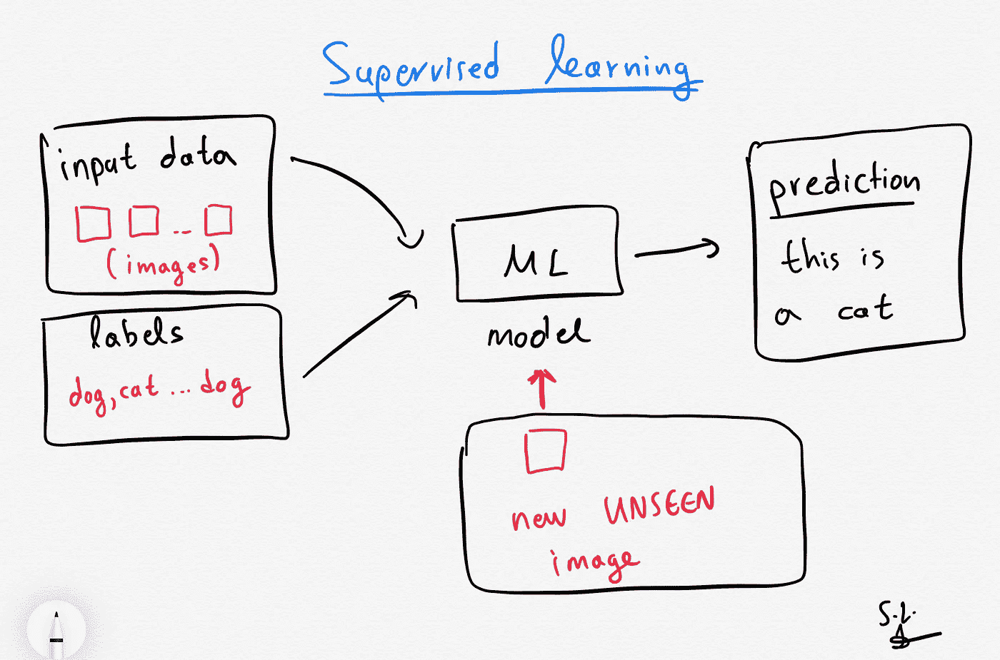
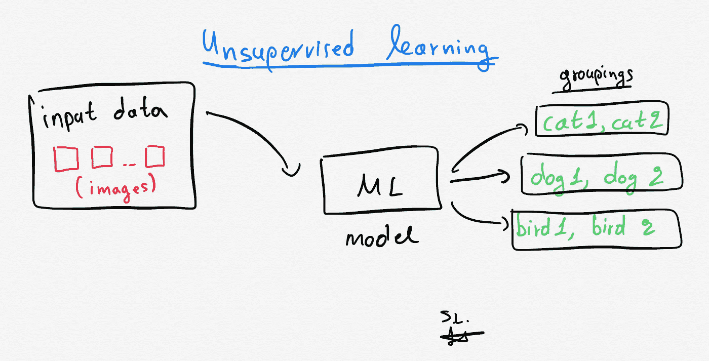
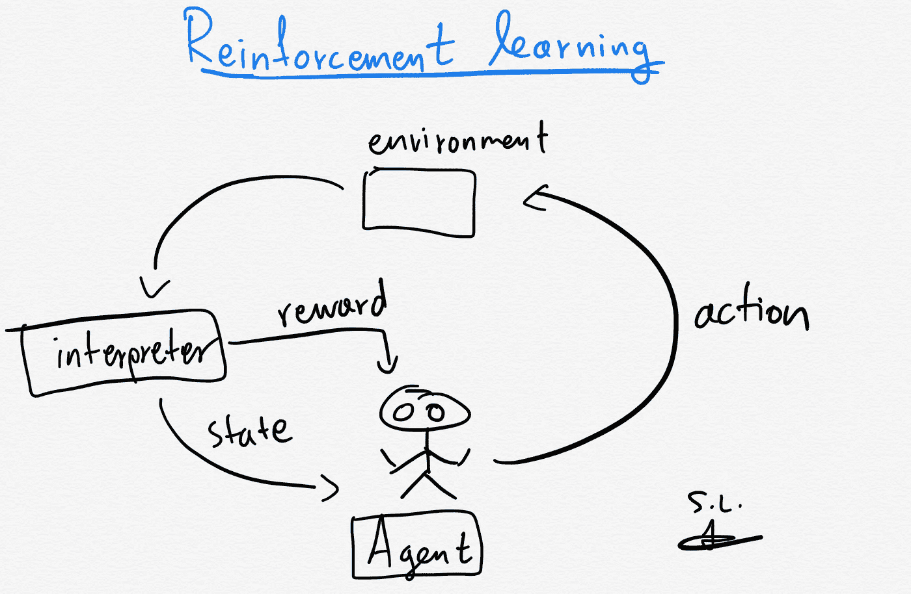

# 什么是机器学习:监督、非监督、半监督和强化学习方法

> 原文：<https://towardsdatascience.com/what-is-machine-learning-a-short-note-on-supervised-unsupervised-semi-supervised-and-aed1573ae9bb?source=collection_archive---------3----------------------->

## 一篇关于什么是机器学习的短文:监督、非监督、半监督和强化学习

阿瑟尼·托古列夫在 [Unsplash](https://unsplash.com/s/photos/machine-learning?utm_source=unsplash&utm_medium=referral&utm_content=creditCopyText) 上的照片

# 1.介绍

**机器学习**是人工智能(AI)的一个子领域，它为**系统**提供自动****学习**和**从**经验** **中改进**的能力，而不需要**被**显式**编程。**

**在**学习**(模型拟合)的过程中，我们需要有一些可用的**观测值**或**数据**(也称为*样本*或*样本*，以便探索隐藏在我们数据中的**潜在** **潜在** **模式**。这些**学来的** **模式**都是**没什么**比一些**功能**或**决定** **界限**。**

> **这些模式由系统(计算机系统)自动学习，无需人工干预或输入。**

**如果你想在交互式路线图和活跃的学习社区的支持下自学数据科学，看看这个资源:[https://aigents.co/learn](https://aigents.co/learn)**

# **2.主要的机器学习类别**

**机器学习算法通常分为有监督的和无监督的。**

## **2.1 受监督的机器学习算法/方法**

****

**作者做的手工素描。**

**对于这类模型，研究需要手头有一个数据集，其中包含一些观察值和观察值的标签/类别。例如，观察可以是动物的图像，标签可以是动物的名字(例如猫、狗等)。**

**这些模型从标记的数据集学习，然后用于预测未来事件。对于训练过程，输入是具有其相应标签的已知训练数据集，并且学习算法产生推断函数，以最终对可以给予模型的一些新的看不见的观察进行预测。经过充分的训练后，该模型能够为任何新的输入提供目标。学习算法还可以将其输出与正确的预期输出(基本事实标签)进行比较，并找出错误，以便相应地修改自身(例如，通过反向传播)。**

****监督**模型可以进一步分为**回归**和分类**案例**:**

*   ****分类**:分类问题是当输出变量是一个类别时，例如“疾病”/“无疾病”。**
*   ****回归**:回归问题是当输出变量是一个真实的连续值时，例如股票价格预测**

**属于这个家族的模型的一些例子如下:SVC、LDA、SVR、回归、随机森林等。**

## **2.2 无监督机器学习算法/方法**

****

**作者做的手工素描。**

**对于这类模型，研究需要手头有一个带有一些观察值的数据集，而不需要观察值的标签/类别。**

**无监督学习研究系统如何从未标记的数据中推断出描述隐藏结构的函数。该系统不会预测正确的输出，而是探索数据，并可以从数据集进行推断，以描述来自未标记数据的隐藏结构。**

**无监督模型可以进一步分组为**聚类**和**关联**情况。**

*   ****聚类**:聚类问题是你想要揭示数据中**固有的** **分组**的地方，比如根据一些特征/特性(比如腿的数量)对动物进行分组。**
*   ****关联**:关联规则学习就是你想发现**关联**规则，比如买 X 的人也倾向于买 y**

**属于这个家族的模型的一些例子如下:PCA、K-means、DBSCAN、混合模型等。**

## **2.3 半监督机器学习算法/方法**

**这个家族介于有监督和无监督学习家族之间。半监督模型使用标记和未标记的数据进行训练。**

## **2.4 强化机器学习算法/方法**

****

**作者做的手工素描。**

**这一系列模型由使用估计误差作为奖励或惩罚的算法组成。如果误差大，那么惩罚就高，奖励就低。如果误差小，那么惩罚就低，奖励就高。**

****试错搜索**和**延迟** **奖励**是强化学习最相关的特征。该系列模型允许在特定环境下自动确定理想行为，以最大化所需性能。**

****奖励** **反馈**是模型学习哪一个动作最好所需要的，这就是所谓的“****强化** **信号**”。****

****属于这个家族的模型的一些例子是 [Q-learning](https://en.wikipedia.org/wiki/Q-learning) 。****

# ****3.摘要****

> ****监督:数据集中的所有观察值都被标记，算法学习从输入数据预测输出。****
> 
> ****无监督:数据集中的所有观察值都是未标记的，算法从输入数据中学习固有结构。****
> 
> ****半监督:数据集的一些观察值被标记，但大多数通常是未标记的。因此，通常混合使用监督和非监督方法。****

****使用机器学习(ML)模型，我们能够对大量数据进行分析。人类无法识别的数据模式可以在几秒钟内(在某些情况下)使用这些最大似然模型准确地(T21)提取出来。然而，大多数情况下，准确的结果(好的模型)通常需要大量的时间和资源用于模型训练(模型学习函数或决策边界的过程)。****

****那都是乡亲们！希望你喜欢这篇文章！****

# ****敬请关注并支持这一努力****

****如果你喜欢这篇文章并觉得它有用，请关注我，这样你就可以看到我所有的新帖子。****

****有问题吗？把它们作为评论贴出来，我会尽快回复。****

# ****和我联系****

*   ******领英**:[https://www.linkedin.com/in/serafeim-loukas/](https://www.linkedin.com/in/serafeim-loukas/)****
*   ******研究之门**:[https://www.researchgate.net/profile/Serafeim_Loukas](https://www.researchgate.net/profile/Serafeim_Loukas)****
*   ******EPFL**简介:[https://people.epfl.ch/serafeim.loukas](https://people.epfl.ch/serafeim.loukas)****
*   ******堆栈**溢出:【https://stackoverflow.com/users/5025009/seralouk】T42****