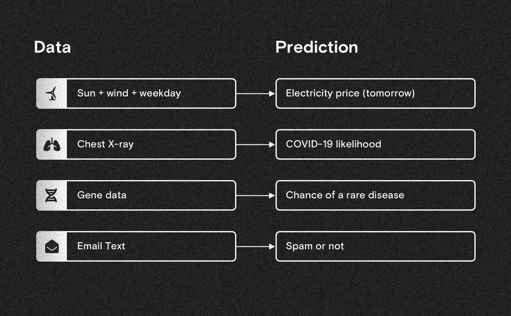
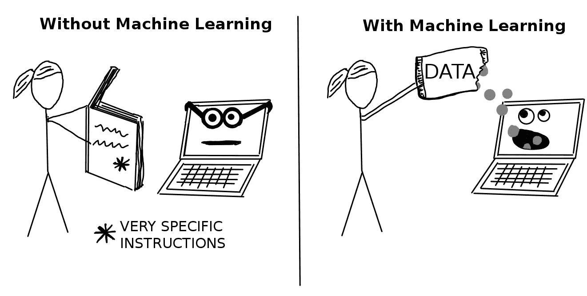
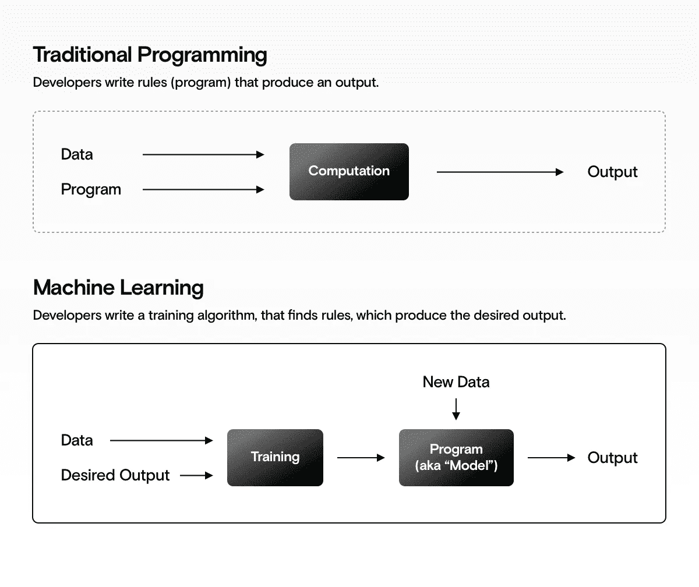
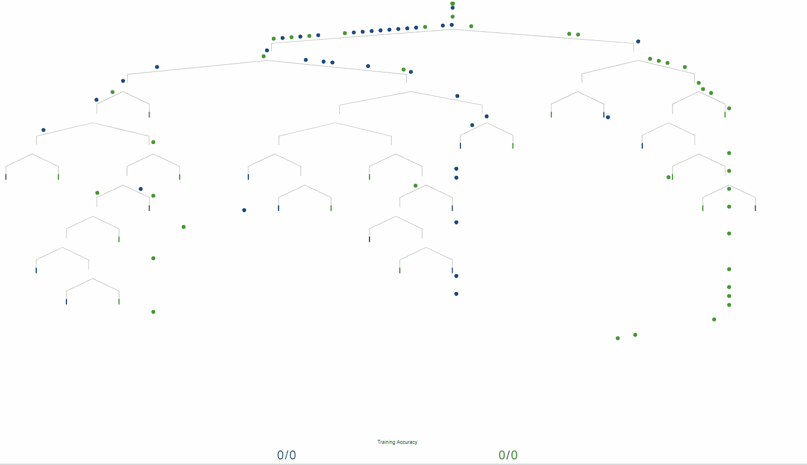
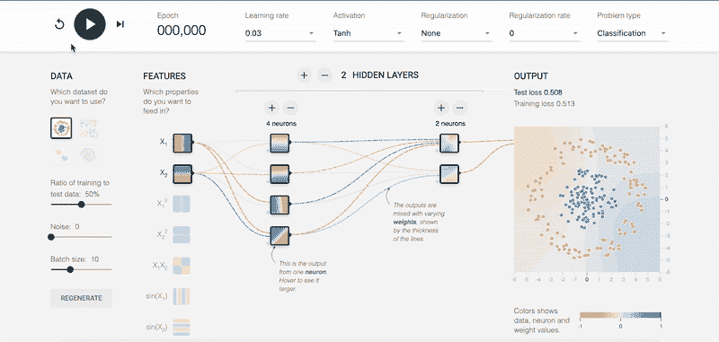
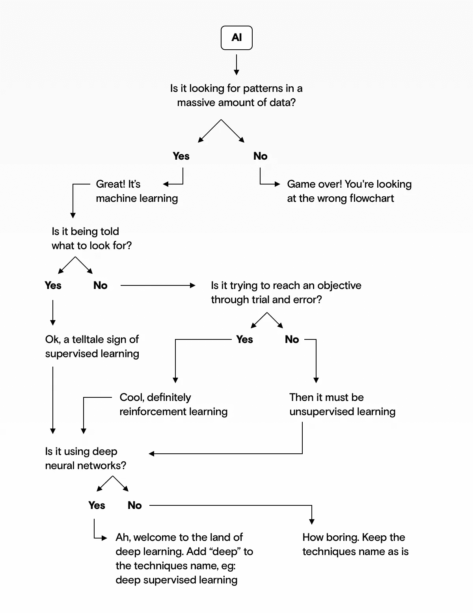
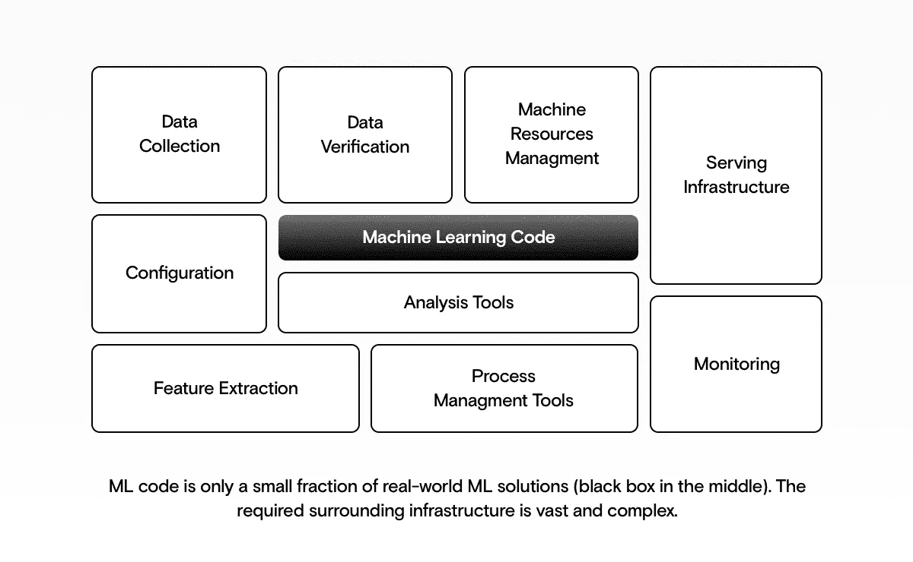
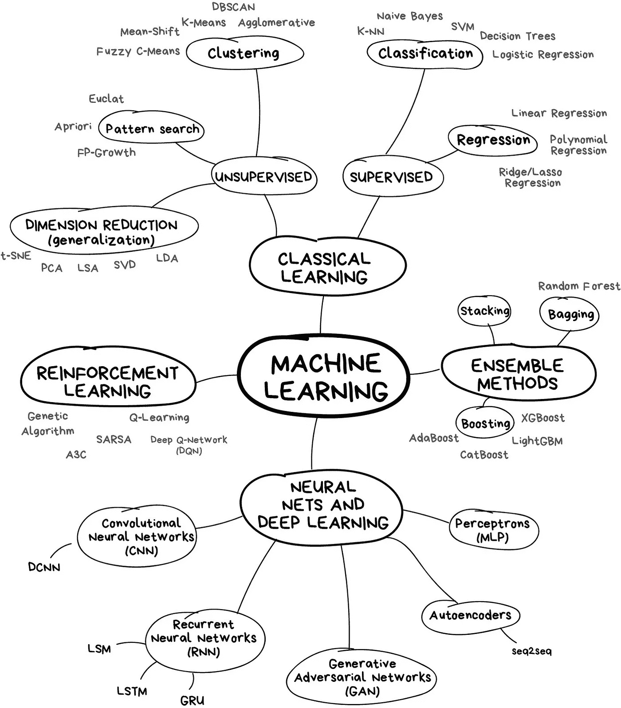

# 什么是机器学习？—直观的解释。

> 原文：<https://towardsdatascience.com/what-is-machine-learning-a-visual-explanation-14642b90429f?source=collection_archive---------25----------------------->

## 最佳 ML 视觉效果

## 解释机器学习的 9 个精选图像、交互式工具和流程图。

来源:作者

要想很好地掌握机器学习，光有文字是不够的。这篇文章用我在过去 5 年中遇到的最好的视觉解释向你介绍了机器学习。

# 1.机器学习在数据中寻找模式

简单地说，机器学习在数据中找到模式，并使用它们进行预测。

每当你有大量的数据，并且想要**自动进行智能预测**时，机器学习可能是使用的正确工具。

机器学习的示例应用:将数据转化为预测。来源:作者

# 2.AI vs .机器学习 vs .深度学习

让我们先解决这个问题。AI、机器学习、深度学习有什么区别？英伟达的这张图表解释道:

*   **人工智能**是一门创立于 20 世纪 50 年代初的学术学科。
*   **机器学习**是通过经验学习的算法研究。自 20 世纪 80 年代以来，它一直在获得动力，是人工智能的一个子领域。
*   **深度学习**是使用神经网络的机器学习的一个较新的子领域。它在某些领域非常成功(图像、视频、文本和音频处理)。

来源:[英伟达](https://blogs.nvidia.com/blog/2016/07/29/whats-difference-artificial-intelligence-machine-learning-deep-learning-ai/)

## 那么你应该用什么术语呢？

*   **简答**:没那么重要。
*   **更长的回答**:该领域从业者使用最多的术语是“机器学习”——它比 AI 更具体。

> *“如果是用 Python 写的，那就是机器学习；如果是用 PowerPoint 写的，那就是 AI。”😅*

# 3.ML 和“普通”软件的区别

机器学习算法也只是软件。那有什么区别呢？

## 3.1 简短回答

用“普通”软件，我们告诉计算机做什么。通过机器学习，我们告诉计算机如何利用我们提供给它的数据自己找出答案。

[来源](https://christophm.github.io/interpretable-ml-book/terminology.html)

## 3.2 略长的回答

*   **普通软件**基本上是一套规则，由人类编写，旨在实现特定的输出。
*   **机器学习软件**自行寻找规则(模式)，并尝试产生某种输出。是写软件的软件。🤯

*直观解释:*

传统软件与机器学习——来源:作者

# 4.ML 算法如何学习？

但是机器学习如何在数据中找到正确的模式来进行预测呢？

来自 R2D3 的团队设法可视化了机器学习模型如何学习。任务:“告诉我公寓是在纽约还是旧金山。”

[**👉他们对机器学习**](http://www.r2d3.us/visual-intro-to-machine-learning-part-1/) 的交互可视化简直是英雄主义。技术上准确，美观。

来源: [R2D3](http://www.r2d3.us/visual-intro-to-machine-learning-part-1/)

# 5.深度学习呢？

谷歌帮你搞定了。忘掉无聊的“网络图”检出 [**👉**](http://www.r2d3.us/visual-intro-to-machine-learning-part-1/) [**这是一个关于神经网络如何学习的现场互动示例**](https://playground.tensorflow.org) 。

一个学习在蓝色和橙色点之间绘制边界的神经网络。

您甚至可以修改:

*   **训练参数**，表示算法的配置(nobs)；
*   **神经元和层**，定义模型可以变得多复杂；
*   **任务**，这样模型就能学会分离圆形、矩形或者——最难的任务——螺旋形中的点。

对于每个模型，您可以观察它如何随着时间的推移而变得更好(测试损失)。

# 6.但是神经网络是如何工作的呢？

神经网络有点复杂——但是如果你真的感兴趣，那么没有比这更好的视频来解释它了👉[**3 blue 1 brown——什么是神经网络**](https://www.youtube.com/watch?v=aircAruvnKk&t=0s) ，格兰特在这里告诉你神经网络是如何识别数字的。

[3Blue1Brown](https://www.youtube.com/watch?v=aircAruvnKk&t=0s) 讲解神经网络！👀

# 7.怎么分辨是不是机器学习？

这里有一个快速简单的流程图，可以帮助你弄清楚机器学习是否在你所看到的背后:

灵感来自[郝凯伦](https://www.technologyreview.com/2018/11/17/103781/what-is-machine-learning-we-drew-you-another-flowchart/) —来源作者

# 8.ML 解决方案的要素是什么？

事实是，机器学习只是每个机器学习解决方案的一小部分。大部分工作和代码都进入了围绕它的基础设施:

*   **数据**:为算法收集、验证、分析、准备数据；
*   **基础设施:**部署、托管和服务机器学习模型；
*   **监控:**协调工作流程，监控和维护模型。

来源:作者

# 9.有哪些 ML 算法？

我们有很多算法可以选择。它们大致分为以下几类:

*   **经典学习**:进一步分为监督学习(通过从例子中学习来预测数字或类别)或无监督学习(在没有任何指导的情况下在数据中寻找聚类)。
*   **神经网络和深度学习**:基于多层感知器原理的算法，在利用图像、文本、音频、视频和时间序列数据进行预测时非常有用。
*   **强化学习**:有点像自然进化的算法，在学习周期中改善它们的行为，以获得最大回报。
*   **集成学习:**构建大量弱模型并将它们组合成强模型的算法。

来源:[瓦斯特里克](https://vas3k.com/blog/machine_learning/)

# 摘要

这些视觉效果应该让你很好地掌握所有基本的机器学习概念。要更深入地了解如何在项目中使用机器学习，请查看我们的[机器学习指南:项目经理需要知道的事情](https://www.datarevenue.com/en-blog/machine-learning-for-managers)。

如果遗漏了什么重要的东西，请告诉我:[markus@datarevenue.com](mailto:markus@datarevenue.com)。

*原载于***。**