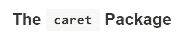

# 什么是机器学习，机器如何学习东西？

> 原文：<https://towardsdatascience.com/what-is-machine-learning-and-how-can-a-machine-learn-something-4f66fa05714b?source=collection_archive---------31----------------------->

## 机器学习的直观解释

机器如何学习东西？阿瑟尼·托古列夫在 [Unsplash](https://unsplash.com/s/photos/machine-learning?utm_source=unsplash&utm_medium=referral&utm_content=creditCopyText) 上的照片

在这篇文章中，我给出了一个关于机器学习模型在实践中实际做什么的非常实用的观点。

在这篇文章结束时，你会深刻理解我们如何使用机器学习来预测未知，我会给你一个开始做这件事所需的工具的切入点。

我将集中讨论监督模型。

# 什么是有监督的机器学习？

在监督机器学习中，目标是使用定义在多个独立变量上的函数来预测目标变量。

监督机器学习的一个**非常著名的例子是[波士顿房价数据集](https://www.kaggle.com/c/boston-housing)。该数据集包含许多房屋销售数据，并为每栋房屋列出了房屋的特征和最终销售价格。该练习的目标是建立一个机器学习模型，该模型可以根据房屋的特征预测任何房屋的销售价格。**

可用于此预测任务的历史房屋销售数据

# 理解“函数”的概念

为了得到这样一个模型，我将使用**函数**的概念，所以让我先解释一下什么是函数以及它们是如何工作的。这将是很好理解机器学习的重要基础。

> 函数是如何将输入转换成输出的定义。

作为一个简单的起点，假设函数是如何将输入转换为输出的定义。该函数就像一个黑盒操作，每次都以相同的方式工作。这就像一个**烹饪食谱**，其中输入数字代表配料，函数代表手工工作和烤箱指令，输出代表最终的菜肴。

**一个简单的功能:**

作为一个简单的起点，假设函数是如何将输入转换为输出的定义。例如，让我们定义一个对任何输入数字都为+1 的函数:

*   我们可以把函数定义写成:
    f(x) = x + 1
*   例如，当我们想对输入数字 3 应用这个函数时，我们有 3 作为输入，所以我们用 3 代替 x:
    f(3)= 3+1
*   现在变得简单了:3 + 1 + 4，所以 f(3) = 4

**稍微复杂一点的函数:**

为了使它稍微有趣一点，让我们做一个有两个输入 x1 和 x2 的函数。我们称函数 f2(函数 2)

*   该函数输出两个输入的和并加 1:
    f2(x1，x2) = x1 + x2 + 1
*   然后当我们想对输入数字 3 和 5 应用这个函数时，我们有 3 和 5 作为输入，所以我们用 3 代替 x1，用 5 代替 x2:
    F2(3，5) = 3 + 5 + 1
*   现在又变得容易了:3 + 5 + 1 = 9，所以 f(3，5) = 9

## 如何在房价机器学习示例中使用函数:

现在让我们回到房价的例子来理解为什么我们需要一个函数。房价练习的目标是根据输入数字预测房价。由于我们将有多个输入数和 1 个输出数，这将完全符合我们刚才看到的函数概念。

> 我们可以做一个函数，把房子的多个特征转换成对房价的预测！

当将这个想法应用到实际案例中时，我们可以说我们的目标是构建一个函数，以房屋的多个特征作为输入，计算房屋价格的正确值！

# 从功能到模型

我上面讨论的函数有非常精确的映射。3 + 1 等于 4，这是完美的。现在看起来很容易，但是在现实生活中，我们不得不面对以下两个现实 **:**

**要找到正确的函数，我们必须反过来:**

> 在现实生活中，我们还不知道预测函数！

在现实生活中，我们从来没有预测我们想要预测的函数。我们的任务不是将一个函数应用于某些输入数据，而是找到这个函数，它最精确地将一个已知的输入映射到一个未知的输出。方法如下:

*   我们从 x1、x2…和目标变量(输出)的许多值开始。这是我们过去观察和收集的数据。
*   然后，我们试图找到最精确地预测输出的函数，而不真正知道该函数是否应该由加法、减法、除法等构成。这将由机器学习模型来完成。
*   第三步是测试我们已经确定的功能在实践中是否也有效。希望如此，否则我们需要回到第二步。

**第二个问题:生活并不精确**

对于我们现有的数据来说，完美的函数可能并不存在。最好的函数可能会接近正确答案，但不会这么简单。尽管在很多情况下，接近完美的预测已经非常有用了！只要我们能够测量我们函数的误差，如果它几乎是完美的，我们就会很高兴！

不幸的是，我们不只是输出完美的预测，也会有误差。

# 真实交易:如何找到这个“神奇”的功能？

现在我们来看监督机器学习的核心目标:找到(隐藏和未知的)函数，该函数允许我们尽可能精确地将正确的输入变量转换为正确的输出变量。

例如，当我们输入我们房子的花园面积、房间数量和建造年份时，我们希望我们的函数输出尽可能接近的房价。

这个功能不太好找！有很多机器学习工具可以解决这个问题，我现在就要进入这个领域。

## “尝试”不同类型的功能

我们在实践中要做的是精心设计的“尝试”许多不同类型的“功能”。但不仅仅是随机的，我们需要一个可靠的方法来进行这些试验。

我们需要的第一个构件是机器学习模型。有许多公开可用的模型，例如“决策树”、“随机森林”、“梯度推进机器”和[等等](https://scikit-learn.org/stable/supervised_learning.html)。

这些模型是一种优化机器，试图找到将输入转换为输出的最佳函数:这将是我们的预测函数。有许多可用的模型，因为每个模型都有自己特定的方法来尝试和优化预测函数的精度。

这些模型中的每一个都将使用不同类型的操作符来定义函数，但是也使用不同类型的映射(例如决策树使用 if/else 语句，而线性模型使用矩阵计算)。

监督机器学习的目标是找到最佳预测函数

## 测量误差和基准

在上一步中，假设我们能想到的每个模型都构建了一个略有不同的预测函数(输入数据到目标变量的映射略有不同)。

模型创建的下一步是测量每个模型的误差。每个模型都略有不同，因为我们必须接受微小的误差(生活是随机的)。但是我们仍然希望误差尽可能小！

我们将对模型开发中未包括的数据的单独部分测试所有不同的预测函数，预测最接近我们在现实中观察到的数据的模型将是我们保留的最终模型。

**我们现在已经建立了一个模型:一个尽可能将输入转化为输出的预测函数！**

# 去哪里找那些机器学习工具？

现在你对监督机器学习有了直观的了解，开始学习一些模型(函数制作工具)是很重要的。

Scikit Learn 是一个常用于机器学习的 Python 库

这里列出了最常见的型号。这会给你一个进一步学习的切入点:

*   线性回归
*   逻辑回归
*   决策图表
*   套索
*   山脉
*   弹性网
*   SVM
*   随机森林
*   XGboost
*   神经网络

两个很好的参考列表是:

*   scikit-learn 网站,上面有 scikit 所有机器学习模型的列表

caret R 包是另一个常用的机器学习库

*   [R caret 网站](https://topepo.github.io/caret/available-models.html)，上面有 Caret 所有机器学习模型的列表

# 机器真的学到东西了吗？

有许多机器学习模型，每个模型都有自己独特的方式，根据输入和输出数据以数学方式找到预测函数。

在实践中，您应用不同的模型并测量部分外部数据的误差。然后选择效果最好的模型，也就是误差最小的模型。然后，您可以将此模型用作预测函数，将输入变量转换为目标变量。这就是你的机器学习模型！

> 机器已经学习了预测功能

一旦这个过程完成，我们可以说**机器已经学习了这个预测函数**，因此得名机器学习。

**对我的解释做一些扩展:**

我们可以不使用房价，而是使用图像作为输入(然后它被称为*计算机视觉*)，甚至是人类编写的文本(然后它被称为 *NLP* )。在那些类型的机器学习中，人们更可能称之为人工智能。需要其他类型的模型，通常是神经网络和深度学习，而不是描述的那些。但是过程还是一样的。

我们还可以通过在收到新数据后立即更新学习到的函数来使学习更加强大，这使得预测函数随着时间的推移而改进！这使得学习过程更接近人类的学习过程！

*这篇文章的目标是给出有监督机器学习的直观解释。感谢读到这里，希望对你有用！敬请关注更多内容！*