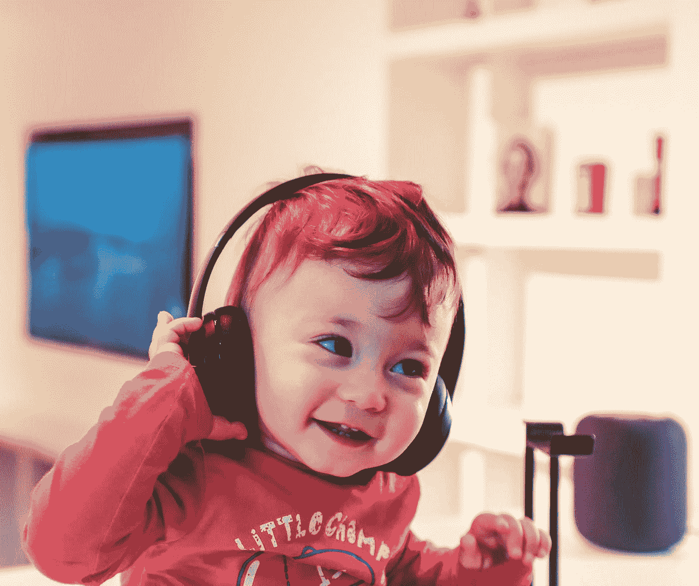
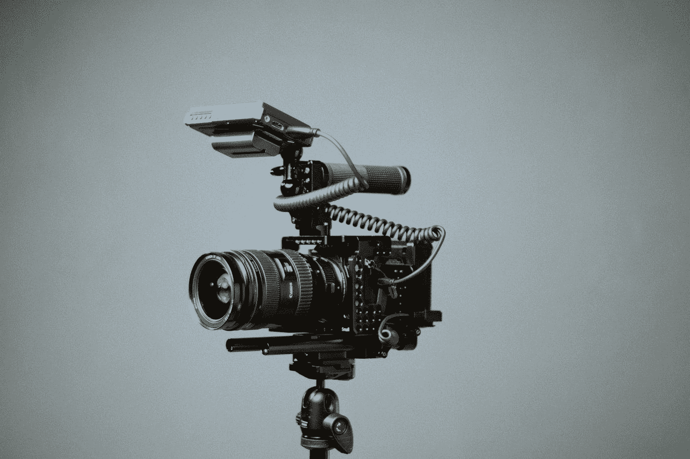

# 机器学习与自闭症

> 原文：<https://towardsdatascience.com/what-is-machine-learning-doing-for-autism-6e86daa3b12a?source=collection_archive---------39----------------------->

在 [Unsplash](https://unsplash.com?utm_source=medium&utm_medium=referral) 上由 [Alireza Attari](https://unsplash.com/@alireza_attari?utm_source=medium&utm_medium=referral) 拍摄

## 关于机器学习如何有助于自闭症诊断和治疗的简要文献综述。

机器学习已经扩展到许多不同的领域和学科。尝试新的领域是成长和学习新事物的最好方式。以下是研究人员如何应用机器学习来诊断和治疗自闭症谱系障碍(ASD)的总结。

# 论文(按顺序)

所有这些论文都可以在没有任何大学赞助或付款的情况下获得。

1.  [基于面孔加工异常识别自闭症谱系障碍儿童:一个机器学习框架](https://www.researchgate.net/publication/299585544_Identifying_children_with_autism_spectrum_disorder_based_on_their_face_processing_abnormality_A_machine_learning_framework)
2.  [自闭症治疗中机器人情感感知和参与的个性化机器学习](https://robotics.sciencemag.org/content/robotics/3/19/eaao6760.full.pdf)
3.  [用于低成本和非侵入性测量婴儿自闭症相关行为的计算机视觉工具](http://downloads.hindawi.com/journals/aurt/2014/935686.pdf)
4.  [使用机器学习来缩短基于观察的自闭症筛查和诊断](https://www.nature.com/articles/tp201210.pdf)

# [眼球运动和自闭症](http://downloads.hindawi.com/journals/aurt/2014/935686.pdf)

作者刘文擘、李明和李毅开发了一个 ML 模型，根据看脸时的眼球运动来识别 ASD。

> 眼球追踪，SVM，RBF Kernal，参考文献 2 [DP Wall，J. Kosmicki](https://www.nature.com/articles/tp201210.pdf)

由[蔡斯·克拉克](https://unsplash.com/@chaseelliottclark?utm_source=medium&utm_medium=referral)在 [Unsplash](https://unsplash.com?utm_source=medium&utm_medium=referral) 上拍摄的照片

## 意识形态

患有自闭症的人在识别人脸和解释面部情绪方面有困难。此外，患有自闭症的人通常有一个非典型的面部扫描模式。作者想知道你是否能根据一个人看脸时看的地方和时间来识别自闭症。

## 数据

研究中的个体是 29 名自闭症儿童和 29 名非自闭症儿童。本文中使用的数据是从另一项研究中收集的，研究人员在这项研究中观察患有自闭症的儿童是否很难识别不同种族的人。

## 方法

研究人员使用 K-means 算法将每张脸分成 K 个不同的部分。然后，他们制作了直方图，测量个体看每个不同细胞的频率。这些信息被用来训练 SVM 来预测观众是否患有自闭症。

## 结果

SVM 能够以 88.51%的准确率预测观众是否患有自闭症。尽管并非不受假阳性和假阴性的影响，但该模型确实支持缺乏眼神交流是自闭症的一个强烈迹象。

# [机器人增强疗法](https://robotics.sciencemag.org/content/robotics/3/19/eaao6760.full.pdf)

麻省理工学院媒体实验室在诊所里放置了一个机器人来帮助自闭症治疗。此外，他们为每个与之互动的孩子制作了专门的模型。

> 机器人，治疗，T-SNE，深度提升，开放姿势，开放面孔，开放微笑

由[法兰克诉](https://unsplash.com/@franckinjapan?utm_source=medium&utm_medium=referral)在 [Unsplash](https://unsplash.com?utm_source=medium&utm_medium=referral) 上拍摄的照片

## 意识形态

机器人过去曾被用于自闭症治疗，但其有效性仍有争议。每个自闭症儿童都是不同的。

> “如果你遇到了一个自闭症儿童，你就遇到了一个自闭症儿童。”

因此，预测情绪的通用模型是行不通的。解决方案是为每个与机器人互动的孩子制作一个专门的模型。这样，机器人就知道什么特征构成了快乐或悲伤。

## 方法

研究人员让每个孩子和一名临床医生在一个房间里玩耍，同时戴上手表来记录生理数据。临床医生会记录孩子玩耍时的情绪。这些数据，以及视频和音频，被用来训练机器人的模型。

## 影响

以前，当机器人被部署在临床环境中时，它会模仿治疗师在故事中描述或告诉孩子的情感。现在，机器人可以对孩子的情绪做出反应，并提出建议/问题，如“你为什么难过？”或者“我们休息一下吧。”

# [计算机视觉辅助房间隔缺损诊断](http://downloads.hindawi.com/journals/aurt/2014/935686.pdf)

杜克大学的研究人员设计了一种低成本、非侵入性的计算机视觉(CV)工具来帮助诊断自闭症。

> AOSI，评分者间评分，追踪面部特征

Matteo Bernardis 在 [Unsplash](https://unsplash.com?utm_source=medium&utm_medium=referral) 上拍摄的照片

## 方法

这项研究的重点是 7-14 个月大的高危儿童(有兄弟姐妹被诊断患有自闭症的儿童)。所有的儿童都由专业临床医生使用婴儿孤独症观察量表(AOSI)进行评估。一名 AOSI 专业临床医生、一名普通心理学家和两名心理学学生观看了该评估的视频。他们都根据孩子对不同听觉刺激的反应来给孩子打分。

然后，研究人员通过使用 CV 工具来跟踪儿童在观看不同刺激时的面部运动，从而自动化了审查过程。在测量孩子的反应后，他们会给出与人类评估者相同的“通过”、“延迟”和“卡住”分数。

## 结果

通过只跟踪眼睛、鼻子和耳朵，自动方法在 89%的时间里与专业的 AOSI 临床医生一致，并获得了 75%的优秀评分者间评分。

## 影响

这项研究应该作为更多心血管辅助 ASD 诊断工具的垫脚石。最初的工作非常有限，但可以扩展到不同的临床测试甚至家庭视频。最终目标是降低房间隔缺损诊断的成本，这项工作为此做出了贡献。

# [ADTree 缩短基于观察的 ASD 筛查](https://www.nature.com/articles/tp201210.pdf)

研究人员将最广泛使用的评估自闭症谱系障碍的工具——自闭症诊断观察量表——通用(ADOS ),从 29 个项目缩短到 9 个项目，而准确性没有明显损失。

> ADOS，广告树，上采样

照片由[paweczerwiński](https://unsplash.com/@pawel_czerwinski?utm_source=medium&utm_medium=referral)在 [Unsplash](https://unsplash.com?utm_source=medium&utm_medium=referral) 上拍摄

## 数据

研究人员从波士顿自闭症协会(AC)、自闭症遗传资源交易所(AGRE)和西蒙斯基金会获得了 1073 个 ADOS 观察数据。在 1073 个观察结果中，只有 15 个来自没有自闭症的个体。一些观测数据缺失，因此没有使用。考虑到不平衡的类别，研究从 15 个观察值增加到 612 个。

## 模特们

这篇论文的重点是创建一个机器学习模型，可以帮助临床医生量化 ADOS 评估的结果。在这个过程中，他们开发了 16 个不同的模型，每个模型都有不同程度的成功。

ADTree 模型表现最好，准确率为 100%。除了对给定的每个样本进行正确分类，ADTree 还删除了许多给定的输入。广告树只需要最初 27 个项目中的 9 个就可以达到同样的准确度。

## 影响

这一减少将临床医生的工作量减少了 66%，从而加快了 ASD 诊断流程。随着更多 ADOS 数据的报告和记录，广告树可能能够将个体分类到光谱上的不同区域。

# 机器学习和自闭症的下一步是什么？

看到在自闭症早期检测以及儿童新疗法方面所做的所有研究令人兴奋。我最喜欢关于 ADTrees 缩短基于观察的 ASD 筛查的论文，并认为像树修剪这样的策略也可以导致对其他疾病更有效的调查。

我希望看到更多关于 DNA 和自闭症的研究。《自闭症之声》有一篇[很棒的文章](https://www.autismspeaks.org/press-release/worlds-largest-autism-genome-database-shines-new-light-many-autisms)描述了在该领域已经完成的一些工作。