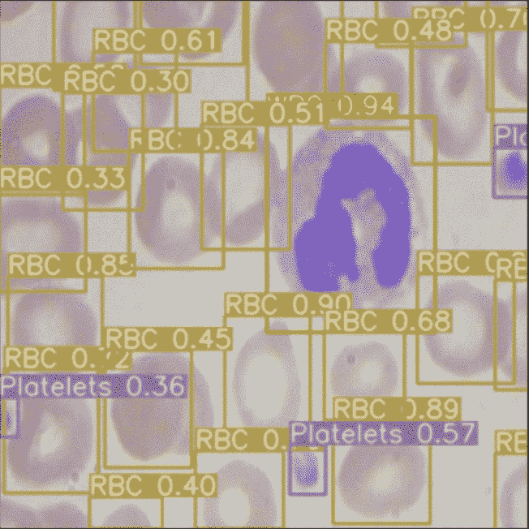
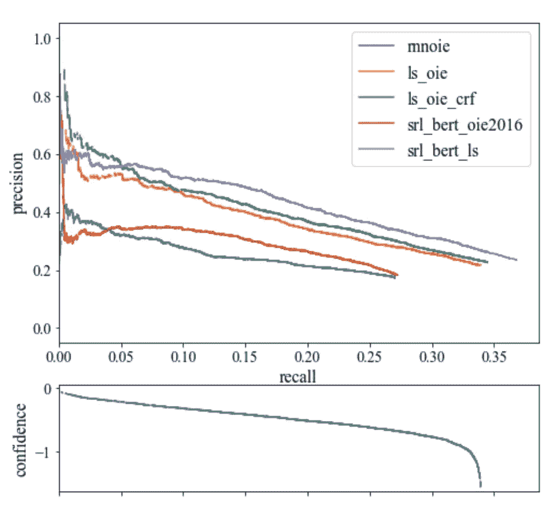
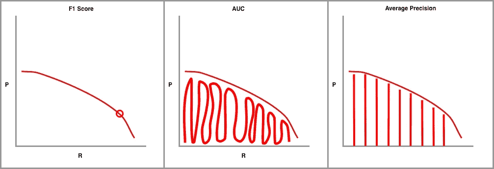
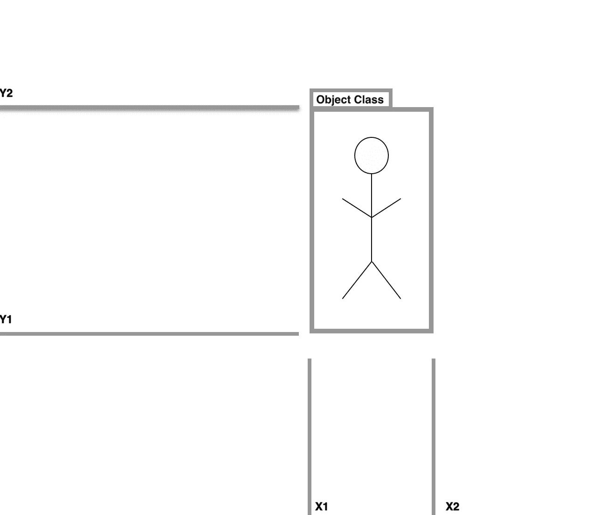
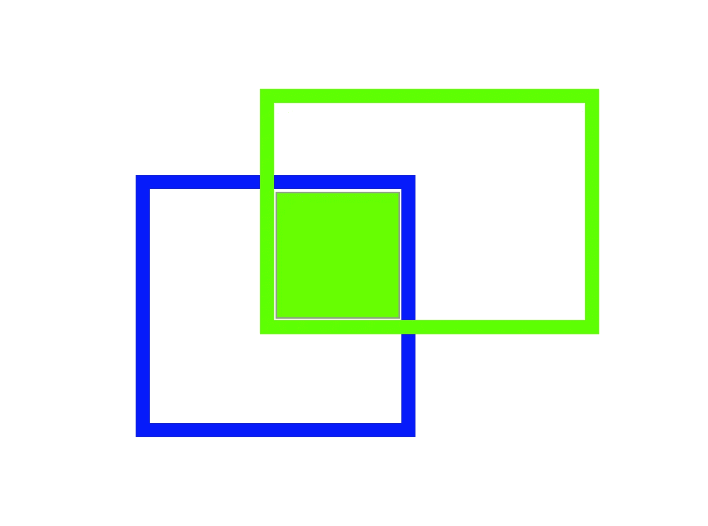
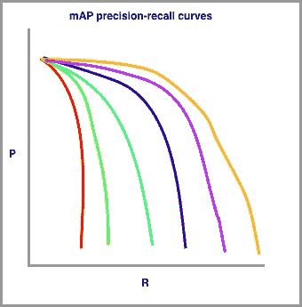
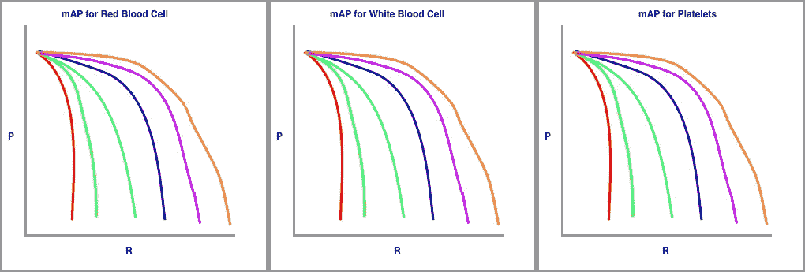

# 物体检测中的平均精度(mAP)是什么？

> 原文：<https://towardsdatascience.com/what-is-mean-average-precision-map-in-object-detection-8f893b48afd3?source=collection_archive---------20----------------------->

## 注意:我们也在博客上发布了[什么是地图](https://blog.roboflow.ai/yolov4-data-augmentation/)。在本文中，我们通过解释和图表来分析平均精度指标。

计算机视觉社区已经聚集在公制地图上来比较[物体探测系统](https://blog.roboflow.com/the-ultimate-guide-to-object-detection/)的性能。在本帖中，我们将深入探究平均精度(mAP)是如何计算的，以及为什么 mAP 成为[物体检测](https://blog.roboflow.com/the-ultimate-guide-to-object-detection/)的首选指标。

如果您更喜欢以视频形式观看这些内容，我们可以满足您的需求。别忘了[订阅我们的 YouTube 频道](https://www.youtube.com/channel/UCUlRrGpNRT5jbiV8h5Q_4Fg?sub_confirmation=1)。

# [物体检测](https://blog.roboflow.com/the-ultimate-guide-to-object-detection/)快速概述

在我们考虑如何计算平均精度之前，我们将首先定义它测量的任务。

对象检测模型试图识别图像中相关对象的存在，并将这些对象分类到相关类别中。例如，在医学图像中，我们可能希望能够计数血液中的红细胞(RBC)、白细胞(WBC)和血小板的数量。为了自动做到这一点，我们需要训练一个对象检测模型来识别这些对象中的每一个，并正确地对它们进行分类。(我在一台 [Colab 笔记本电脑上做了这个测试，以比较 EfficientDet 和 YOLOv3](https://colab.research.google.com/drive/1pLvZpz0_Ob0yOQ7hxPhVRT04Cb3FGARb#scrollTo=dFSgxwD9Igo6) ，这两种最先进的图像检测模型。)



我的笔记本中 EfficientDet(绿色)与 YOLOv3(黄色)的输出示例

这两个模型都预测图片中包围单元的边界框。然后他们给每一个盒子分配一个类别。对于每一项任务，网络都会对其预测的可信度进行建模。您可以在这里看到，我们总共有三个类别(红细胞、白细胞和血小板)。

**我们应该如何决定哪种模式更好**？查看图像，看起来 EfficientDet(绿色)绘制了一些过多的红细胞框，并错过了图片边缘的一些细胞。基于事物的外观，这当然是它的感觉——但是我们能相信图像和直觉吗？如果是的话，好了多少？(提示:不是——不信直接跳到最下面。)

如果我们可以直接量化每个模型在我们的测试集中的图像上、在不同的类别上以及在不同的置信度阈值下的表现，那就太好了。输入地图！

为了理解平均精度，我们必须花一些有意义的时间来研究精度-召回曲线。

# 精确回忆曲线

精度是对“w *当你的模型猜对的时候，它猜对的频率有多高*？”的度量回忆是一个衡量“T2”的标准，你的模型是否每次都猜到了它应该猜到的东西？“考虑一个有 10 个红细胞的图像。只找到这十个标签中的一个但正确的模型是“RBC ”,它具有完美的精确度(因为它做出的每一个猜测——一个——都是正确的),但具有不完美的回忆(在十个 RBC 细胞中只找到一个)。

包含置信度元素的模型可以通过调整进行预测所需的置信度来权衡精确度和召回率。换句话说，如果模型处于避免假阳性(当细胞是 WBC 时声明 RBC 存在)比避免假阴性更重要的情况下，它可以将其置信度阈值设置得更高，以鼓励模型仅以降低其覆盖量(回忆)为代价仅产生高精度预测。

将模型的精度和召回率绘制为模型的置信度阈值的函数的过程是精度召回率曲线。它是向下倾斜的，因为随着置信度的降低，会做出更多的预测(帮助回忆)和更不精确的预测(损害精确度)。

这样想:如果我说，“说出每一种鲨鱼的名字”，你会从显而易见的开始(高精度)，但你会对你能说出的每一种鲨鱼越来越不自信(精度越来越低，越来越接近完全回忆)。对了，你知道还有[牛鲨](https://en.wikipedia.org/wiki/Cow_shark)吗？



我的一个 NLP 项目中不同模型的精确度、召回率和置信度

随着模型变得越来越不自信，曲线向下倾斜。如果该模型具有向上倾斜的精度和召回曲线，则该模型可能在其置信度估计方面存在问题。

人工智能研究人员喜欢度量标准，整个精度-召回曲线可以在单个度量标准中捕获。第一个也是最常见的是 F1，它结合了精确度和召回率来寻找最佳的置信度阈值，其中精确度和召回率产生最高的 F1 值。接下来是 AUC(曲线下面积),它整合了落在精度和召回曲线下的图量。



您真实的精确召回汇总指标草图

最后一个精度-召回曲线指标是平均精度(AP ),也是我们最感兴趣的。它被计算为在每个阈值达到的精确度的加权平均值，从先前阈值开始的召回的增加被用作权重。

AUC 和 AP 都反映了精确召回曲线的整体形状。选择一个或另一个用于对象检测是一个选择的问题，研究社区已经集中在 AP 的可解释性上。

# 通过并集上的交集度量正确性

[物体检测系统](https://blog.roboflow.com/object-detection/)根据边界框和类别标签进行预测。



你真实的物体探测草图

实际上，在 X1、X2、Y1、Y2 坐标中预测的边界框肯定会偏离(即使稍微偏离)地面真实标注。我们知道，如果一个包围盒预测是错误的类，我们应该把它算作不正确的，但是我们应该在包围盒重叠的什么地方画线呢？

并集上的交集(IoU)提供了设置此边界的度量标准，测量方法是预测边界框与地面真实边界框重叠的量除以两个边界框的总面积。



你真实的 IoU 度量的图形描述。

为 IoU 指标选择正确的单一阈值似乎有些武断。一位研究人员可能认为 60%的重叠是合理的，而另一位则认为 75%似乎更合理。**那么，为什么不在一个单一的指标中考虑所有的阈值呢？输入地图。**

# 绘制地图精确召回曲线

为了计算 mAP，我们绘制了一系列不同难度的 IoU 阈值精确回忆曲线。



由您真实绘制的地图精确回忆曲线草图。

在我的草图中，红色代表对借据的最高要求(可能是 90%)，橙色代表对借据的最宽松要求(可能是 10%)。要绘制的行数通常由挑战设置。例如，COCO challenge 设置了 10 个不同的 IoU 阈值，从 0.5 开始，以 0.05 为步长增加到 0.95。

快到了！

最后，我们为按类类型划分的数据集绘制了这些精确召回曲线。



由你的实物类绘制的地图草图

该指标计算所有 IoU 阈值中每个类别的平均精度(AP)。然后，该度量对所有类别的地图进行平均，以得出最终估计值。🤯

# 在实践中使用平均精度(mAP)

我最近在一篇帖子[中使用了 mAP，比较了最先进的检测模型](https://blog.roboflow.ai/yolov3-versus-efficientdet-for-state-of-the-art-object-detection/)，EfficientDet 和 YOLOv3。我想看看哪个模型在识别血液中的细胞和识别棋子的任务上做得更好。

在我对测试集中的每张图片进行推理之后，我导入了一个 python 包来[计算我的 Colab 笔记本](https://colab.research.google.com/drive/1pLvZpz0_Ob0yOQ7hxPhVRT04Cb3FGARb#scrollTo=dFSgxwD9Igo6)中的地图。这就是结果！

细胞目标检测的效率评估:

```
78.59% = Platelets AP 
77.87% = RBC AP 
96.47% = WBC AP 
mAP = 84.31%
```

YOLOv3 对细胞目标检测的评价:

```
72.15% = Platelets AP 
74.41% = RBC AP 
95.54% = WBC AP 
mAP = 80.70%
```

**与本文开头的单一推断相反，事实证明 EfficientDet 在模拟细胞对象检测方面做得更好！**您还会注意到，该指标是按对象类别划分的。这告诉我们，白细胞比血小板和红细胞更容易检测，这是有道理的，因为它们比其他细胞更大，更独特。

地图也经常被分成小、中和大对象，这有助于识别模型(和/或数据集)可能出错的地方。

# 结论

现在你知道如何计算地图，更重要的是，它意味着什么！

为了改善你的模型的地图，看看[开始使用一些数据增强技术](https://blog.roboflow.com/boosting-image-detection-performance-with-data-augmentation/)。

感谢您的阅读，并希望您的平均精确度不断提高🚀