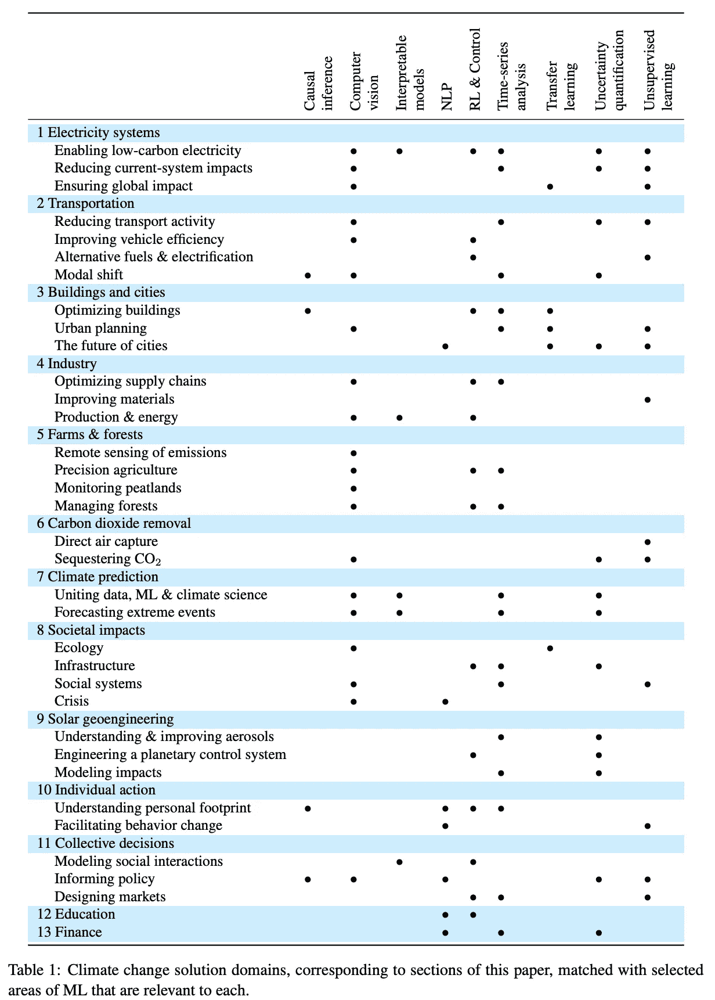

# 气候变化的 ML 是什么？

> 原文：<https://towardsdatascience.com/what-is-ml-for-climate-change-2fb683c0de25?source=collection_archive---------40----------------------->

## 2019 年成立的一个新的“子领域”正在掀起波澜，比我最初想象的更容易接近

随着世界秩序的转变，我在寻找积极的、有吸引力的工作，我想知道 a)针对气候变化的机器学习到底是什么，b)是否有合理的途径让我们投入其中并做出贡献？引用我后来大量引用的一篇论文中的行动呼吁:

> 突破性的技术会产生影响，但对世俗问题的精心构建的解决方案也会产生影响。

照片由来自[佩克斯](https://www.pexels.com/photo/white-and-green-text-lot-2053892/?utm_content=attributionCopyText&utm_medium=referral&utm_source=pexels)的[达莉亚·谢夫索娃](https://www.pexels.com/@daria?utm_content=attributionCopyText&utm_medium=referral&utm_source=pexels)拍摄

## 最近的工作

首先，我知道最近有一堆关于气候变化和机器学习的研讨会(如 [ICLR 2020](https://www.climatechange.ai/events/iclr2020) 、 [ICML 2019](https://www.climatechange.ai/events/icml2019) 、 [NeurIPs 2019](https://www.climatechange.ai/events/neurips2019) 版)。往这里看，原来是一个 [climatechange.ai](https://www.climatechange.ai/) 的集中群。这对我来说似乎不错，但我希望了解人们实际上在做什么。

我写了一个小脚本来收集研讨会记录的标题和作者，并提出了这个关键词列表(一路上了解了 NLP 和[停用词](https://en.wikipedia.org/wiki/Stop_word))。

`LEARNING, USING, CLIMATE, DEEP, MACHINE, DATA, NETWORKS, CHANGE, SATELLITE, PREDICTION, IMAGERY, NEURAL, WEATHER, POWER, FORECASTING, ENERGY, TOWARDS, MODELS, CARBON, REINFORCEMENT, BASED, DETECTION, ENVIRONMENTAL, MONITORING, FLOW, VIA, DYNAMICS, FRAMEWORK, SOLAR, RISK, CLOUD, GRID, LEARNING-BASED, FOREST, CONSERVATION, SMART, ANALYSIS, OPTIMAL, MAPPING, URBAN, INTELLIGENCE, RENEWABLE`

我预料会有一些时髦的词汇，但这几乎没有教我人们在做什么。一些提供洞察力的关键词可能是这个子集(去除数据和学习描述词):

`NETWORKS, SATELLITE, WEATHER, POWER, ENERGY, FLOW, SOLAR, DYNAMICS, GRID, FOREST, CONSERVATION, MAPPING, URBAN`

它列出了在城市发展、电力系统、能源网、保护和动态系统领域的应用。粗略分析之后，我意识到我实际上需要阅读 100 页的白皮书来初始化这个领域。

我将用于纸张信息的数据[放在这里](https://github.com/natolambert/mlcc)。你可以花 100 美元(25 美元)在注册 2020 年虚拟 NeurIPs 会议，并参加[用机器学习应对气候变化研讨会的下一次迭代。](https://www.climatechange.ai/events/neurips2020.html)

## 用机器学习应对气候变化——开创性论文

这篇来自 17 个机构的 22 位作者的论文揭开了我提到的研讨会的序幕，并提供了关于人们可以从哪里开始的详细解释。如果你从这篇博客帖子中没有得到任何其他信息，请注意:*针对气候变化的机器学习是一场* ***运动*** ***鼓励基于应用的*** *机器学习研究，这将有益于地球的长期生态系统*(并不是说所有的变化都需要很长时间)。

我将在本文中总结潜在的应用领域，如果读者有兴趣了解更多信息，可以打开文档:

> ML 可以通过遥感实现自动监测(例如，通过确定毁林、收集建筑物数据和评估灾后损失)。它可以加速科学发现的进程(例如，为电池、建筑和碳捕获提出新材料)。ML 可以优化系统以提高效率(例如，通过整合货运、设计碳市场和减少食物浪费)。此外，它还可以通过混合建模(例如气候模型和能源调度模型)来加速计算成本高昂的物理模拟。

本质上，遥感、科学发现、能源密集型系统等所有应用领域都有许多未被触及的数据，而机器学习已被证明在任何大数据集中发现模式都非常有用。我把这一点从列表中分离出来，是为了让它变得清晰——单靠计算机科学家无法解决这些问题:

> 对气候问题采取有意义的行动需要与计算机科学内外的领域进行对话，并可以导致跨学科的方法创新，如改进的物理约束的 ML 技术。

过去十年中开发的机器学习工具在许多领域从数据中提取模式方面取得了令人印象深刻的结果。虽然仍然有许多理由对技术持怀疑态度，但有充分的理由认为一些新工具将在其中一些领域发挥作用。例如，强化学习，通常被认为是不稳定的，难以转移到现实世界，充满了未建模的行为，同时在电网优化中非常有用([示例 1](https://ieeexplore.ieee.org/stamp/stamp.jsp?arnumber=8834806&casa_token=BWXnOgUelpwAAAAA:rnczsRQ-eOFZ5HcxFlOc7eGuP3us3AbWzIcGJNJQQ6SKk0plgrwqHnBADS5jlCfwteBgw5ui-07W) ，[示例 2](https://livrepository.liverpool.ac.uk/3034527/1/RevisedManuscript_ReinforcementLearning.pdf) )。为什么强化学习在这里起作用:该系统基于非常众所周知的物理学和受约束的变量——所以当 RL 代理做一些奇怪的事情时，它可以很容易地被标记为物理上不可能的，等等(*我正在与一些研究生成立一个阅读小组，研究安全或不安全的现实世界 RL 应用的差异，所以如果你是专家，想谈谈，或者有兴趣，请告诉我*)。

不过有一个警告，这在考虑如何部署这项技术时至关重要:许多国家没有支撑美国如此多行业的数据基础设施。该论文给出了从美国到印度的能源工厂的不同数据记录的例子——这变成了第二个机器学习问题，即在弄清楚如何优化美国电网之后的 ***迁移学习*** 。

它们呼吁采取行动，这很好地总结了我现在的感受。

> **学**。确定你的技能如何有用——我们希望这篇文章是一个起点。
> 
> **协作**。寻找合作者，他们可能是研究人员、企业家、已建立的公司或政策制定者。这里讨论的每个领域都有了解其机会和陷阱的专家，即使他们不一定了解 ML。
> 
> **听**。倾听你的合作者和其他利益相关者所说的需要。突破性的技术会产生影响，但对世俗问题的精心构建的解决方案也会产生影响。
> 
> **展开**。确保您的工作部署在可以实现其影响的地方。

如果你想知道你的专业知识可能重叠的地方，看看这个表格。我认为我们有义务解决世俗的问题，因为它们往往是唾手可得的果实。机器学习的从业者可以看看上面，看看自己的技能在哪里有用，然后参考原论文。其他人可以看看左边，然后它会指出哪些 ML 工具在你的领域中最有用，可以学习和利用。

来源[https://arxiv.org/pdf/1906.05433.pdf](https://arxiv.org/pdf/1906.05433.pdf)。

## 鼓励参与的系统性变革

我们如何鼓励研究人员与实践者合作来解决论文中提到的*世俗*问题。我知道我的顾问会完全同意我这么做，但顾问和经理的覆盖范围并不一致。我已经谈到了学术系统在激励方面有点破碎，但我想在等式中添加另一个变量:如何鼓励许多学者几乎没有注意到的对社会有益的工作(引用较少，bleh)。

谷歌大脑和脸书人工智能公司的人有动力从事这项工作吗？我应该花 6 个月的时间在这个领域工作，作为一个独立的研究者来占有一些地盘吗？我只是想开启讨论，让人们思考到底是什么限制了在这个领域的花费时间。

## 创造技术作为研究气候变化的替代方法

我在讨论气候变化时总会想到的另一个问题是，我们能制造出什么样的技术，要么 a)改变公众对“绿色”设备的看法，要么 b)在没有消费者关心的情况下有益于环境(就像特斯拉一样更好)？我从上面的论文中得到的印象是，减轻危害、优化当前基础设施和测量当前系统的影响是降低门槛的方法。我仍然坚持认为，从长远来看，制造改变思维的产品更有益。这里是来自特斯拉的一些[统计数据和他们去年的](https://www.tesla.com/carbonimpact)[报告](https://www.tesla.com/ns_videos/2019-tesla-impact-report.pdf)。

在*创新气候*变化与通过*公众认知活动*和保护来减缓气候变化的光谱中，你属于哪一种？

2020 年 12 月 11 日或 12 日，[用机器学习应对气候变化的研讨会上再见。*这是我关于机器人学&自动化、*](https://www.climatechange.ai/events/neurips2020.html) [*民主化自动化*](http://robotic.substack.com) *的免费时事通讯的一个高峰。*

 [## 自动化大众化

### 一个关于机器人和人工智能的博客，让它们对每个人都有益，以及即将到来的自动化浪潮…

robotic.substack.com](https://robotic.substack.com/)