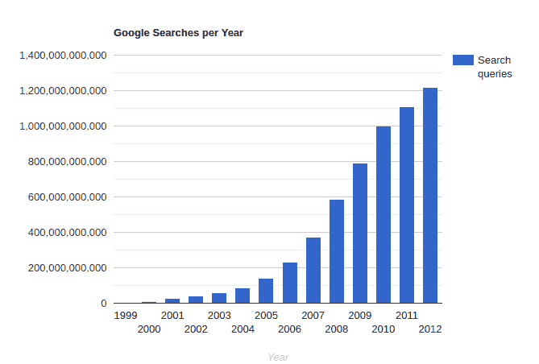
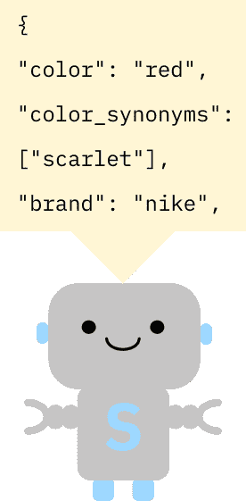
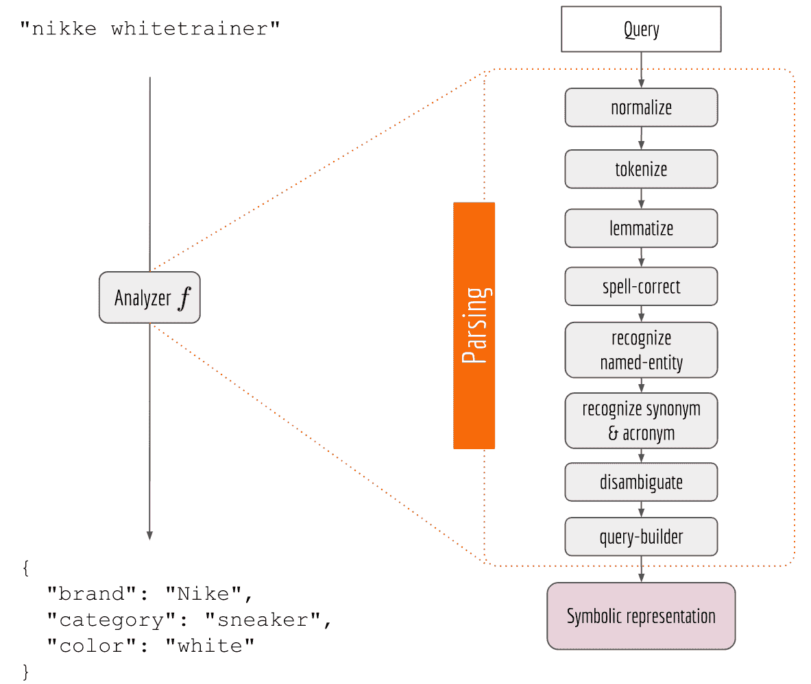
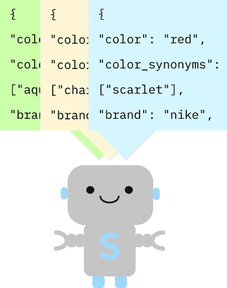
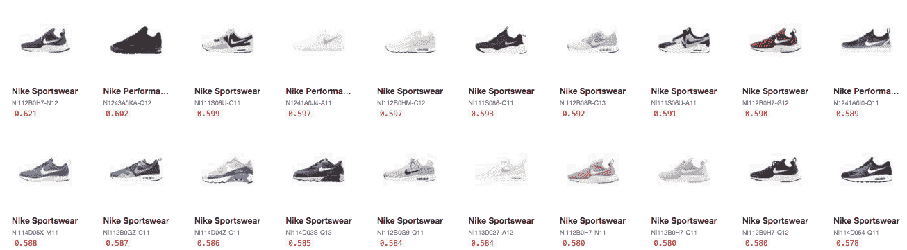
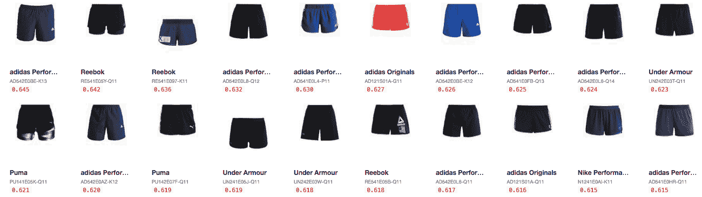
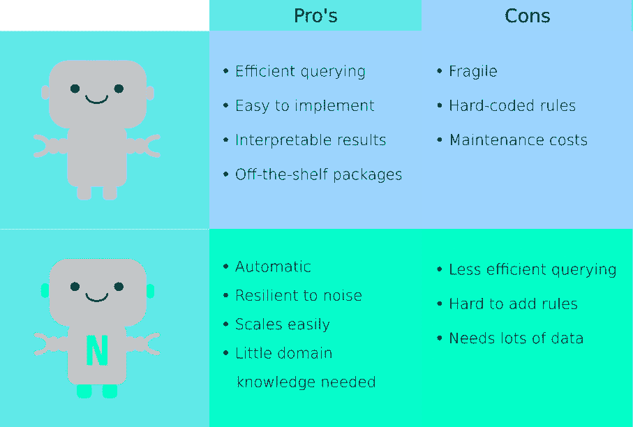

# 什么是神经搜索，我为什么要关心？

> 原文：<https://towardsdatascience.com/what-is-neural-search-and-why-should-i-care-4a6cee6b2249?source=collection_archive---------58----------------------->

## 人工智能搜索更省力，更灵活

# 神经搜索？那是什么？

简而言之，神经搜索是一种检索信息的新方法。神经搜索不是告诉机器一套规则来理解什么数据是什么，而是通过预先训练的神经网络来做同样的事情。这意味着开发人员不必编写每一个小规则，节省了时间和麻烦，同时系统会不断训练自己变得更好。其中一家提供开源神经搜索框架的公司是纪娜 T2。

# 背景

搜索是一项大生意，而且每天都在变大。就在几年前，搜索意味着在文本框中输入一些东西(啊，那是雅虎令人兴奋的日子！和 Altavista)。现在，搜索包括文本、语音、音乐、照片、视频、产品等等。就在千年之交之前，每天只有 350 万次谷歌搜索。今天(根据搜索词`2020 google searches per day`的最高搜索结果)，这个数字可能高达 50 亿，并且还在上升，超过 1000 倍。更不用说数百万人每天从手机、电脑和虚拟助手上搜索的数十亿篇维基百科文章、亚马逊产品和 Spotify 播放列表。

只要看看谷歌查询的飞速增长就知道了——而且这只是到 2012 年为止！



简而言之，搜索是巨大的 T4。我们将看看搜索方法的卫冕冠军，符号搜索，和勇敢的暴发户竞争者，神经搜索。


资料来源:Unsplash 的背景

**注:**本文基于晓寒在他许可下发表的[帖子。如果你想了解更多关于神经搜索的技术介绍，可以去那里看看。](https://hanxiao.io/2018/01/10/Build-Cross-Lingual-End-to-End-Product-Search-using-Tensorflow/)

# 符号搜索:规则就是规则

谷歌是一个巨大的通用搜索引擎。其他公司不能仅仅根据他们的需求对其进行改造并将其插入他们的系统。相反，他们使用像 [Elastic](http://elastic.co/) 和 [Apache Solr](https://lucene.apache.org/solr/) 这样的框架，这些符号搜索系统让开发者编写规则并创建搜索产品、人员、信息或公司需要的任何东西的管道。

让我们以 [Shopify](http://www.shopify.com) 为例。他们使用 Elastic 在数百个类别的数百万个产品中进行索引和搜索。这不能开箱即用，也不能用像谷歌这样的通用搜索引擎来完成。他们必须使用 Elastic 并编写特定的规则和管道，根据各种标准对产品进行索引、过滤、排序和排名，并将这些数据转换为系统可以理解的符号。因此得名，*符号搜索*。这是一家很受欢迎的运动鞋商店:


你我都知道，如果你搜索`red nike sneakers`你想要红色耐克运动鞋。不过，这些只是典型搜索系统的词汇。当然，如果你输入它们，你就有希望得到你想要的，但是如果那些运动鞋被标记为运动鞋呢？或者甚至被贴上*猩红*的标签？在这种情况下，开发人员需要编写规则:

*   **红色**是一种颜色
*   **猩红色**是红色的同义词
*   耐克是一个品牌
*   运动鞋是鞋类的一种
*   运动鞋的另一个名字是**运动鞋**

或者，用 JSON 表示为键值对:

这些键值对中的每一个都可以被认为是一个符号，因此命名为*符号搜索*。当用户输入搜索查询时，系统将其分解成符号，并将这些符号与其数据库中的产品符号进行匹配。



但是如果用户输入的是`nikke`而不是`nike`，或者搜索的是`shirts`(带有一个`s`)而不是`shirt`，会怎么样呢？语言中有如此多的规则，人们一直在打破它们。为了获得有效的符号(即知道`nikke`实际上意味着`{"brand": "nike"}`，您需要定义许多规则并将它们链接在一个复杂的管道中:



# 符号搜索的缺点

## 你必须解释每一个。很少。东西

我们上面的示例搜索查询是`red nike sneaker man`。但是如果我们的搜索者是英国人呢？英国人会打出`red nike trainer man`。我们必须向我们的系统解释，运动鞋和运动鞋只是名称不同的一样东西。或者是有人在搜索什么`LV handbag`？必须告诉系统`LV`代表`Louis Vuitton`。

对每一种产品都这样做需要花费*永远*的时间，而且总有东西会被遗漏。如果你想本地化为其他语言呢？你得从头再来一遍。这意味着大量的辛勤工作、知识和对细节的关注。



## 它是易碎的

文本是复杂的:正如我们上面解释的，如果用户在`red nikke sneaker man`中输入，经典的搜索系统必须识别出他们正在搜索一个红色的耐克(纠正拼写的品牌)男式运动鞋(类型)(子类型)。这是通过管道将搜索字符串和产品细节解释为符号来完成的，这些管道可能会有重大问题。


*   链中的每个组件都有一个输出，作为输入提供给下一个组件。因此，在流程的早期出现问题会破坏整个系统
*   一些组件可能从多个前任获取输入。这意味着你必须引入更多的机制来阻止它们相互阻塞
*   很难提高整体搜索质量。仅仅改进一两个组件可能不会导致实际搜索结果的改进
*   如果你想用另一种语言搜索，你必须重写管道中所有依赖于语言的组件，增加了维护成本

# 神经搜索:(预)训练，不解释

一种更简单的方法是建立一个基于现有数据的搜索系统。如果你事先在足够多的不同场景下训练一个系统(即预训练模型)，它会发展出一种找到匹配输入的输出的通用能力，无论它们是[花](https://github.com/jina-ai/examples/tree/master/flower-search)、[南方公园的线](https://github.com/jina-ai/examples/tree/master/southpark-search)还是[神奇宝贝](https://github.com/jina-ai/examples/tree/master/pokedex-with-bit)。您可以将该模型直接插入您的系统，并立即开始索引和搜索。

代码非常简单。它加载一个“流”,该流又加载一系列模块来处理、索引和查询您的数据:

这样，你就不需要浪费时间为你的用例编写无尽的规则。相反，只要在你的代码中加入一行代码，从“应用商店”下载你想要的模型(就像即将到来的[纪娜中心](https://github.com/jina-ai/jina-hub/))，然后开始。


与符号搜索相比，神经搜索:

*   移除脆弱的管道，使系统更具弹性和可扩展性
*   找到一种更好的方法来表示产品和搜索查询的底层语义
*   一边学习，一边进步

# 神经搜索有用吗？

如果搜索能够理解并返回高质量的结果，则该搜索“有效”:

*   **简单查询:**如搜索“红色”、“耐克”或“运动鞋”
*   **复合查询:**像‘红色耐克运动鞋’

如果它连这些都做不到，那么检查拼写检查和使用不同语言的能力就没有意义了。

总之，少说话，多寻找:

```
🇬🇧 nike
```



```
🇩🇪 nike schwarz (different language)
```


```
🇬🇧 addidsa (misspelled brand)
```


```
🇬🇧 addidsa trosers (misspelled brand and category)
```



```
🇬🇧 🇩🇪 kleider flowers (mixed languages)
```


所以，你可以看到，神经搜索做得很好！

# 比较符号搜索和神经搜索

那么，神经搜索与符号搜索相比如何呢？让我们来看看各自的优缺点:



我们并不试图在团队象征和团队神经之间做出选择。这两种方法都有各自的优点，并且可以很好地互补。因此，更好的问题是:哪一个适合您的组织？

# 自己试试神经搜索


测试一项技术的最佳方式莫过于一头扎进去玩一玩。纪娜提供预先训练好的 Docker 图像和 [jinabox.js](https://github.com/jina-ai/jinabox.js/) ，这是一个易于使用的搜索文本、图像、音频或视频的前端。目前还没有产品搜索的例子，但是你可以*搜索更多轻松的东西，比如[你最喜欢的神奇宝贝](https://github.com/jina-ai/examples/tree/master/pokedex-with-bit)或者《南方公园》里的[台词。](https://github.com/jina-ai/examples/tree/master/southpark-search)*