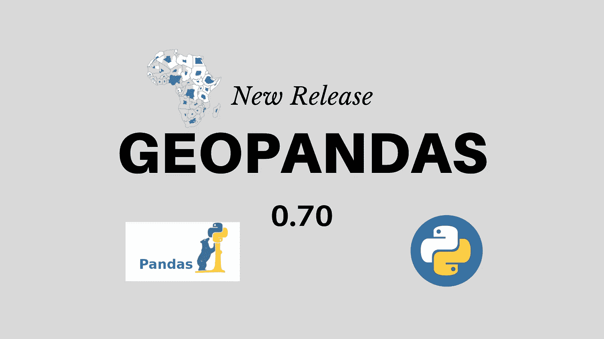
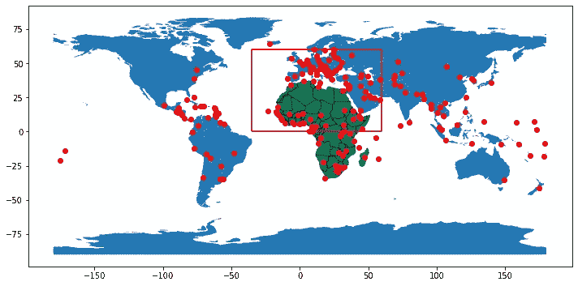
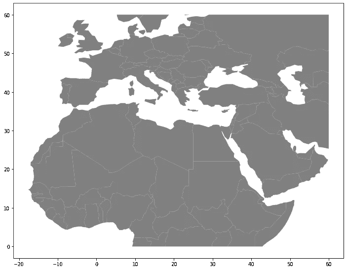
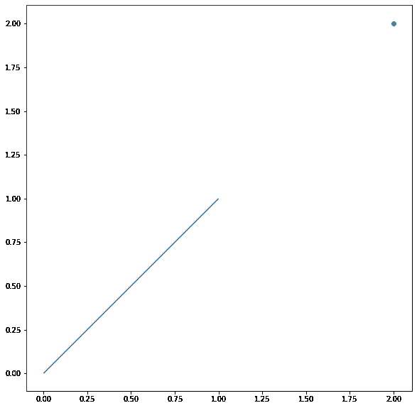

# Geopandas 0.70 有什么新特性？

> 原文：<https://towardsdatascience.com/what-is-new-in-geopandas-0-70-dda0ddc90978?source=collection_archive---------26----------------------->

## 主要变化和新的改进，带有示例和代码说明。



Geopandas 是用 Python 进行地理空间数据科学的主力，它扩展了 pandas 的数据类型来执行空间数据操作。Geopandas 0.70 于昨天 2 月 17 日刚刚发布，它带来了一些重大的变化和改进。

我在这里重点介绍了 Geopandas 0.70 的一些最佳新特性。

## 原生剪辑功能

通过将地理数据框裁剪到其他形状的空间范围的固有功能，裁剪变得非常容易。裁剪是最常用的地理空间数据处理功能之一；然而，在以前的版本中，Geopandas 没有执行它的直接函数。如果您想要地理数据的特定区域，您必须执行裁剪以获得感兴趣的区域。

现在有了新的`geopandas.clip`功能，您可以轻松地按照提供的空间范围裁剪数据。让我们看一个例子。

```
import geopandas as gpd
import matplotlib.pyplot as plt
from shapely.geometry import Polygon, LineString
gpd.__version__'0.7.0'
```

我们使用 Geopandas 作为可用的数据集，首都城市，世界边界。此外，我们将非洲划分为子集，并创建一个多边形来标记我们感兴趣的空间范围。

```
capital_cities = gpd.read_file(gpd.datasets.get_path(“naturalearth_cities”))world = gpd.read_file(gpd.datasets.get_path(“naturalearth_lowres”))africa = world[world[“continent”] == “Africa”]poly = Polygon([(-35, 0), (-35, 60), (60, 60), (60, 0), (0, 0)])polygon = geopandas.GeoDataFrame([1], geometry=[poly], crs=world.crs)
```

让我们在一个图像中看到所有的数据。

```
fig, ax = plt.subplots(figsize=(12,10))world.plot(ax=ax)africa.plot(ax=ax, edgecolor=”black”, color = “brown”, alpha=0.5)capital_cities.plot(ax=ax, color=”Red”)polygon.boundary.plot(ax=ax, color=”Red”)
```



所有数据的映射

首都标为红点，非洲标为绿色。红色矩形显示了我们感兴趣的范围。

现在，如果我们只想从世界边界中裁剪红色矩形的一部分，您可以调用`geopandas.clip`并提供两个地理数据框。首先，`world` 世界边界和`polygon`范围。

```
clipped = gpd.clip(world, polygon)fig, ax = plt.subplots(figsize=(12,10))clipped.plot(ax=ax, color=”gray”);
```

如下图所示，你可以看到被剪切的区域，非洲、欧洲和亚洲的部分地区。



剪裁的边界

您不仅可以使用此函数多边形和多边形，还可以使用其他数据类型，如线和点。

## 读取文件时过滤行

对于当前的大数据集，在读取数据的同时过滤行的能力是必不可少的。想象一下，有一个包含数百万行的数据集，由于内存问题而无法读取。有了这个新功能，您可以在读取数据之前提供行或切片来过滤数据。

让我们看一个例子。

```
cities_filtered = gpd.read_file(gpd.datasets.get_path(“naturalearth_cities”),**rows=30**)
```

这将只读取数据的前 30 行。如果想从中间切片，可以加切片。

```
cities_filtered_slice = gpd.read_file(gpd.datasets.get_path(“naturalearth_cities”),**rows=slice(10,30)**)
```

只有 10 到 30 之间的行才返回上面的代码。

## 地块几何图形集合

无法绘制几何图形集合数据，例如不同数据类型(点、线或多边形)的数据。使用当前版本，您可以打印各种几何对象集合。让我们看一个例子。

```
a = LineString([(0, 0), (1, 1), (1,2), (2,2)])b = LineString([(0, 0), (1, 1), (2,1), (2,2)])x = a.intersection(b)gc = gpd.GeoSeries(x)type(x)shapely.geometry.collection.GeometryCollection
```

`a`和`b`只是普通的 LineString，但是它们的交集返回一个几何图形的集合(线和点)。如果您从 x 中的几何图形集合中创建了一个`Geoseries`，现在您可以用 Geopandas 绘制它。请参见下面的示例。您在同一个地理数据框中绘制了点和线。



用 Geopandas 绘制的几何图形集合

## PROJ 6 号取代 PROJ 4 号

Geopandas 0.70 版本开始使用新的投影接口。PROJ 6 取代了 PROJ4，带来了更好的界面和更多的信息。

以前`gpd.crs`只返回这样一个字符串。

```
{'init': 'epsg:4326'}
```

但是，当前版本带来了大量关于数据地理投影的元数据。

```
world.crs
```

返回以下有用信息

```
<Geographic 2D CRS: EPSG:4326> Name: WGS 84 Axis Info [ellipsoidal]: — Lat[north]: Geodetic latitude (degree) — Lon[east]: Geodetic longitude (degree) Area of Use: — name: World — bounds: (-180.0, -90.0, 180.0, 90.0) Datum: World Geodetic System 1984 — Ellipsoid: WGS 84 — Prime Meridian: Greenwich
```

例如，如果要访问投影的数据，可以调用。

```
world.crs.datum
```

结果只显示了这一部分

```
DATUM[“World Geodetic System 1984”, ELLIPSOID[“WGS 84”,6378137,298.257223563, LENGTHUNIT[“metre”,1]], ID[“EPSG”,6326]]
```

还有一些其他的改进或错误修复没有在本文中提及，但是值得一提。Geopandas 中的空间连接现在可以正确处理 Multindex 并保留左侧地理数据框的索引名称。将文件写入磁盘时，如果需要，现在可以保留索引。此版本现在可以绘制缺少数据的 choropleth 地图。

## 结论

感谢当前版本的所有贡献者。Geopandas 0.70 在地理空间数据科学过程中带来了许多改进。得益于此版本，现在可以在读取和绘制多几何图形数据时进行裁剪、过滤数据。Proj 6 还带来了一个更好的用户界面，其中包含地理空间世界中最不为人所知的主题之一，地理投影。

这篇文章的代码可以在这个 Google Colab 链接中找到。

[](https://colab.research.google.com/drive/1wPJlGuT4BTISiCo8rYd01BJEG6TC-nBQ) [## 谷歌联合实验室

### 编辑描述

colab.research.google.com](https://colab.research.google.com/drive/1wPJlGuT4BTISiCo8rYd01BJEG6TC-nBQ)