# 什么是一键编码以及如何使用熊猫 get_dummies 函数

> 原文：<https://towardsdatascience.com/what-is-one-hot-encoding-and-how-to-use-pandas-get-dummies-function-922eb9bd4970?source=collection_archive---------2----------------------->

## 一个完整的初学者一键式编码教程


照片由[希望之家出版社——皮革日记工作室](https://unsplash.com/@hope_house_press_leather_diary_studio?utm_source=unsplash&utm_medium=referral&utm_content=creditCopyText)在 [Unsplash](/s/photos/coding?utm_source=unsplash&utm_medium=referral&utm_content=creditCopyText) 拍摄

我一直在问机器学习中的一些概念以及它们的真正含义，例如，在我以前的一篇文章[谷歌实践机器学习的 7 个步骤](/the-googles-7-steps-of-machine-learning-in-practice-a-tensorflow-example-for-structured-data-96ccbb707d77)中，有人问我什么是一键编码，我们应该什么时候使用它？这是一个很好的问题，每个机器学习实践者都需要知道答案，所以让我们来讨论一下这个问题，并使用 Pandas `get_dummies()`深入了解一些代码。

# 1.什么是一键编码？

在机器学习的数据处理步骤中，我们通常需要在输入机器学习模型之前以特定的方式准备我们的数据。其中一个例子是对分类数据执行一次性编码。

> 一种热编码是应用于分类数据的数据处理过程，将其转换成用于机器学习算法的二进制向量表示

## 为什么以及什么时候我们应该使用一次性编码？

机器学习的一个主要问题是许多算法不能直接处理分类数据。分类数据[1]是可以取有限数量的可能值之一的变量。一些例子是:

*   人的**性别** : *女*或*男*。
*   **航空旅行舱** : *头等舱*，*公务舱*，*经济舱*。
*   **电脑厂商** : *联想*，*惠普*，*戴尔*，*苹果*，*宏碁*，*华硕*，*其他*。

因此，我们需要一种方法来将分类数据转换为数字形式，我们的机器学习算法可以将其作为输入。最广泛使用的编码技术是:

1.  **整数编码**:将数值编码为整数。
2.  **一键编码**:将数值编码为二进制向量数组。
3.  **虚拟变量编码**:同 One-Hot 编码，但少一列。

在上面的例子中，分类变量中的每个值代表一个不同的类别。一些类别可能彼此具有自然关系(称为自然排序)。**航空旅行等级**变量确实有自然的值排序。这种类型的分类变量被称为 [**序数变量**](https://en.wikipedia.org/wiki/Ordinal_data) 。**序数变量**在机器学习中应该区别对待，因为序数一般都带有某种意义。在**航空旅行等级**的情况下，更高等级的乘客往往更富有，年龄也更大。**整数编码**用于将**序数变量**转换为数值数据，例如

> *头等舱*为 1，*公务舱*为 2，*经济舱*为 3

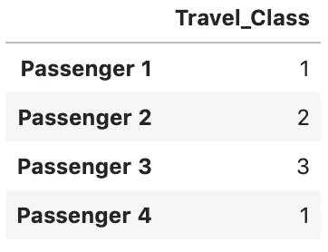

整数编码表示

整数值之间具有自然的有序关系，机器学习算法可以学习这种关系[2]。

对于不存在这种顺序关系的类别变量，**整数编码**可能会导致较差的性能或意外的结果[2]。幸运的是，**一键编码**是对抗这种情况的一种方法。**一键编码**简单地为每个可能的值创建一列，并在适当的列中放置一个`1`。下面是等效的独热编码表示。

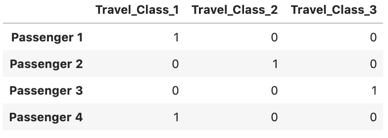

独热编码表示

通过**一键编码**，二进制向量数组表示允许机器学习算法利用包含在类别值**中的信息，而没有由普通性**引起的混淆。

但是，**一键编码**有一些冗余。例如，在上面的例子中，如果我们知道某个乘客的机票不是*头等舱*也不是*经济舱*，那么它一定是*公务舱*。所以我们只需要使用这三个虚拟编码变量中的两个作为预测器。更一般地，所需的伪编码变量的数量比可能值的数量少一个，即`K-1`。在统计学中，这被称为 [**虚拟编码变量**](https://en.wikiversity.org/wiki/Dummy_variable_(statistics)) ，或**虚拟变量**。下面是等效的虚拟编码变量表示:

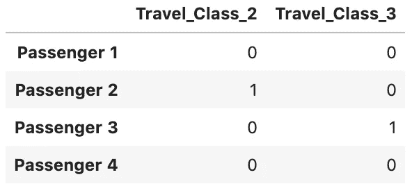

虚拟编码变量表示

[**哑元编码变量**](https://en.wikiversity.org/wiki/Dummy_variable_(statistics)) 是统计学中避免 [**哑元陷阱**](https://www.geeksforgeeks.org/ml-dummy-variable-trap-in-regression-models/) 的标准建议，然而，在机器学习的世界中，更推荐**一键编码**，因为**哑元陷阱**在应用正则化时并不是真正的问题[3]。

# 2.如何使用熊猫 get_dummies()函数？

在我们开始学习教程之前，让我们先来看一个我们可以使用的示例数据集。在本教程中，我们将处理来自 Kaggle 的[泰坦尼克号数据集。这是一个非常著名的数据集，通常是学生学习机器的第一步。让我们导入熊猫并加载数据来开始。](https://www.kaggle.com/c/titanic/overview)

```
import pandas as pd**def load_data():
    return pd.read_csv('data/train.csv')**df = load_data()
df.head()
```

我们创建了一个函数`load_data()`来将 **train.csv** 文件加载到 pandas DataFrame 中。

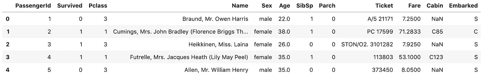

泰坦尼克号数据预览

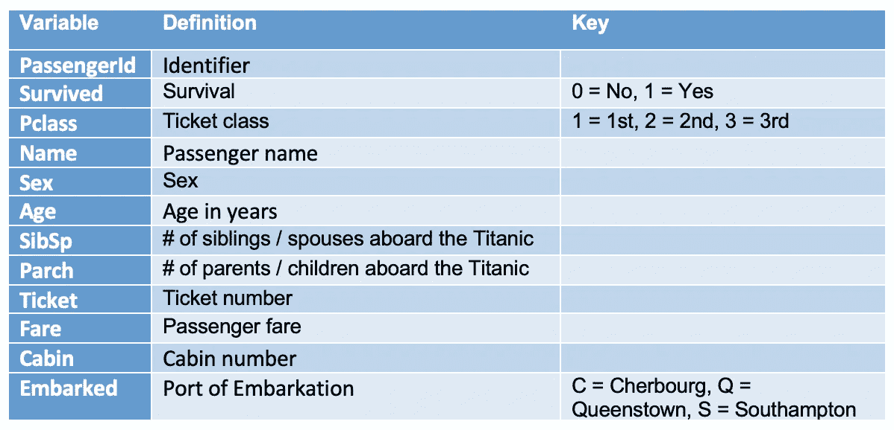

数据字典来自 [Kaggle](https://www.kaggle.com/c/titanic/data?select=train.csv)

## 2.1 创建一次性编码变量

假设我们想要为**性别**列创建一个一次性编码变量。下面是我们如何创建它。

```
pd.get_dummies(**df.Sex**)
```

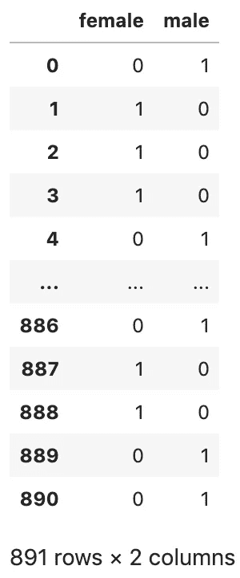

它的作用是为每一个可能的值创建一列，这是性别的两个可能值。它通过在适当的栏中放一个`1`来告诉你它是雌性还是雄性。

一般来说，如果一个分类变量有`K`个可能值，我们将得到`K`列来表示它。

## 2.2 创建虚拟编码变量

在一键编码中有一些冗余。例如，在上面的**性别**一次性编码中，一个人要么是男性，要么是女性。所以我们只需要使用这两个伪编码变量中的一个作为预测器。更一般地说，所需的伪编码变量的数量比可能值的数量少一个，这就是`K-1`。在统计学中，这被称为 [**虚拟编码变量**](https://en.wikiversity.org/wiki/Dummy_variable_(statistics)) ，或**虚拟变量**。

默认情况下，`get_dummies()`不做**也不做**哑编码，而是一键编码。为了从数据帧中产生一个实际的伪编码，我们需要传递`drop_first=True`

```
pd.get_dummies(df.Sex, **drop_first=True**)
```

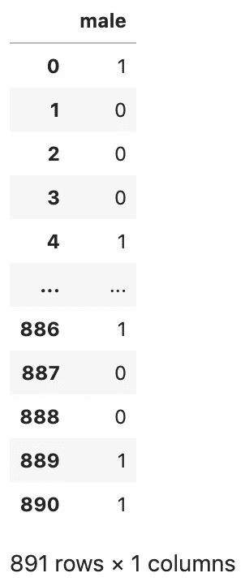

虚拟编码

## 2.3 向列名添加前缀

默认情况下，`get_dummies()`使用变量值作为列名。比如上面**性别**一栏中的 ***男*** 和 ***女*** 例子。为了识别虚拟变量的来源，我们可以使用`prefix`参数。例如:

```
pd.get_dummies(df.Sex, **prefix='Sex'**)
```

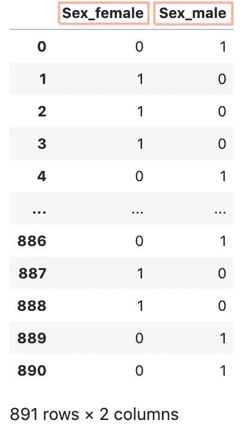

## 2.4 对于具有两个以上可能值的变量

现在，让我们试着对一个有两个以上可能值的变量进行一次性编码。例如，有一个**开始于**列，我们可以做`value_counts()` 来检查它的不同值。

```
df.Embarked.**value_counts()****S    644
C    168
Q     77**
Name: Embarked, dtype: int64
```

让我们用`get_dummies()`来表示

```
pd.get_dummies(**df.Embarked**, **prefix='Embarked'**)
```

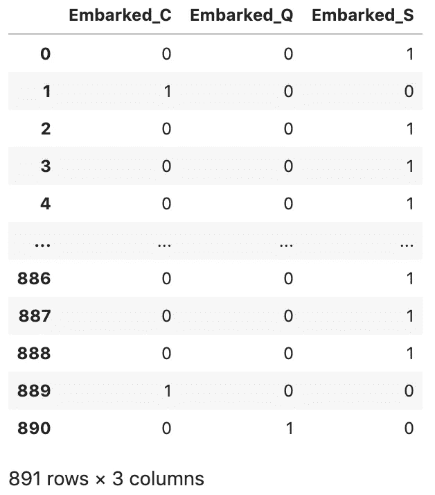

## 2.5 连接到数据框

您可能会想，我们仍然需要将一次性编码变量附加到数据帧上。为此，我们首先将输出分配给一个名为`embarked_dummies`的变量

```
**embarked_dummies** = pd.get_dummies(df.Embarked, prefix='Embarked')
```

然后，我们使用`pd.concat()`将`embarked_dummies`连接到数据帧`df`。

```
df = pd.**concat**(**[df, embarked_dummies]**, axis=1)
```

`pd.concat()`的工作方式是我们可以并排连接列，或者一行接一行。所以在这种情况下，我们沿着列(`axis =1`)连接`df`和`embarked_dummies`。最后，我们改写原来的`df`。

通过运行`df.head()`，我们可以看到现在已经有了`Embarked_C`、`Embarked_Q`和`Embarked_S`。

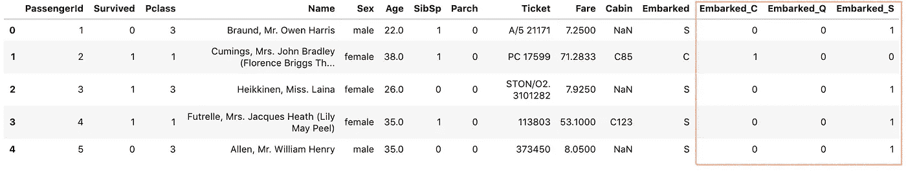

`pd.**concat**(**[df, embarked_dummies]**, axis=1)`的输出

## 2.6 将数据帧传递给 get_dummies()

我们已经向`get_dummies()`传递了一个序列，但我们将传递一个数据帧。

```
df = load_data() # reset dataframe
df = pd.get_dummies(**df**, **columns=['Sex', 'Embarked']**)
```

`df`是一个数据帧。我们传递给`columns`一个列表，并告诉它**性别**和**已出发**是我们想要虚拟的列。

通过运行`df.head()`，我们可以看到原来的**性**列和**上船**列不见了，取而代之的是虚拟列。

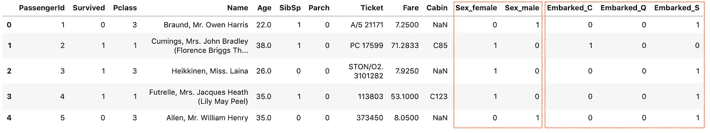

# 好了

感谢阅读。

请在我的 Github 上查看[笔记本的源代码。](https://github.com/BindiChen/machine-learning)

如果你对机器学习的实用方面感兴趣，请继续关注。

# 参考

*   [1] [维基百科中的分类变量](https://en.wikipedia.org/wiki/Categorical_variable)
*   [2] [为什么机器学习中的一键编码](https://machinelearningmastery.com/why-one-hot-encode-data-in-machine-learning/)
*   [3] [一键式编码会让你焦头烂额吗](https://kiwidamien.github.io/are-you-getting-burned-by-one-hot-encoding.html)