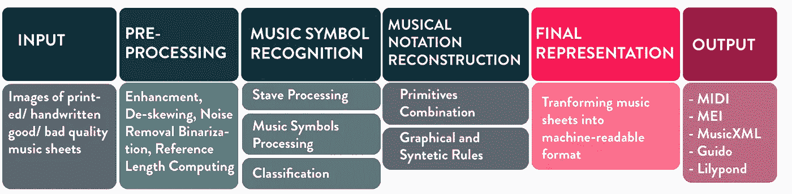

# 什么是光学音乐识别？

> 原文：<https://towardsdatascience.com/what-is-optical-music-recognition-6515d8a53e01?source=collection_archive---------33----------------------->

## 我们能让机器读懂音乐吗？

我一直热衷于获取计算机视觉方面的知识，同样，音乐也是我生活中很重要的一部分。结合起来，它们构成了一个伟大的研究问题！四个月前，我开始了为期四年的博士课程。到目前为止，就我学到的知识和学习更多知识的热情而言，这是一次疯狂的旅程。

由[莎拉](https://unsplash.com/@sllda?utm_source=unsplash&utm_medium=referral&utm_content=creditCopyText)在 [Unsplash](/s/photos/sheet-music?utm_source=unsplash&utm_medium=referral&utm_content=creditCopyText) 上拍摄的照片

我正在进行的研究问题是光学音乐识别(OMR)，更明确地说，是调查深度学习是否可以帮助提高当前方法的性能。

为了让你们更好地理解这个问题，我将尝试阐明什么是 OMR，所使用的传统方法以及未来需要解决的主要问题。

到目前为止，我们大多数人大概都用过谷歌翻译和它的相机翻译功能。仅仅是拍一张文字的照片，我们就节省了时间，也避免了学习中文或其他语言。现在让我们想想这个特性如何应用于音乐。音乐家仍然在乐谱或白纸上写作。然而，如果他们想分享他们的音乐，他们必须把它转录到电脑里。计算机可读的音乐文件将更容易访问。因此，这项研究背后的动机是允许作曲家、音乐家不仅通过拍摄活页乐谱的照片来转录和编辑音乐，而且最终分享和演奏他们的作品。OMR 还将协助音乐统计，并使搜索符号，类似于搜索文本。

卡尔沃-萨拉戈萨等人对 OMR 给出了一个非常清晰和包容的定义，称之为一个研究领域而不是一个简单的问题。

> **光学音乐识别是研究如何通过计算读取文档中的音乐符号的研究领域。**

定义的第二部分强调了 ***“通过计算读取文档中的音乐符号”*** ，假设它是由计算机(而不是人类)执行的，它不涉及音乐符号模型本身，但它建立在这一知识的基础上。此外，它强调了由这些系统捕获的信息，我将在下面的部分中更详细地解释这些信息。

该研究领域于 20 世纪 60 年代末在麻省理工学院建立，使用扫描印刷的乐谱。该领域的先驱是藤永一郎、尼古拉斯·卡特、吴起亚、大卫·班布里奇和蒂姆·贝尔。他们的工作仍然是今天研究的极好基础。OMR 与音乐信息检索、计算机视觉和文档分析等其他领域相关。

根据已开展的研究，形成了反映解决问题方法的标准管道(见图 1)。

图一。标准的 OMR 管道(图片由作者提供)

这个管道的通常输入是打印/手写乐谱的扫描/图片。这些图像然后经受图像处理技术。这些技术包括二值化(黑和白)、模糊、去歪斜(旋转)，并且将有助于减少图像中的噪声。

增强的图像接下来将用于音乐对象识别。在这一步中，算法将尝试识别音乐对象，如谱号、音符头、小节、圆滑线等。在这个阶段，对象是原语，并与它们的语义相分离。

图二。用更快的 R-CCN 检测物体(来源:[https://github.com/apacha/MusicObjectDetector-TF](https://github.com/apacha/MusicObjectDetector-TF)

因此，下一步试图重建这些原语之间的关系以及语义。这种方法基于音乐中存在的语法规则重建语义。

最终输出可以表示输入中乐谱的音乐含义和描述，并且是机器可读的。这些文件的常用格式可以是 MIDI、MusicXML、MEI 等。

文件格式输出示例(图片由作者提供)

我们希望利用深度学习(DL)来探索执行这些步骤的新方法。大多数 DL 模型建立在人工神经网络上。这些网络受到生物神经网络的启发。它们由许多层组成，这些层具有所谓的节点；它们包含一个输入层、一个或多个隐藏层和输出层。越深入，模型可以学习和提取的复杂特征就越多。中间的隐藏层通常被称为“黑盒”这是因为我们不容易理解内部发生了什么，尽管新的研究正在关注这一点。

我们计划首先在 OMR 的第二阶段，即音乐对象检测中应用这种方法。要做到这一点，我们需要一个包含乐谱图像的庞大数据集。这个数据集还应该有一个基础事实，以便模型可以从中很好地学习。一部分数据，称为测试数据，不应该被模型看到。通过这种方式，我们可以评估模型在它从未见过的事物上做得有多好。这个模型应该根据实验的性质、输入和期望的输出来设计。我们还建议将输入、输出及其评估的格式标准化。

参考资料:

A.雷贝洛、I. Fujinaga、F. Paszkiewicz、A. R. S. Marcal、C. Guedes 和 J. S. Cardoso，“光学音乐识别:最新技术和开放问题”， *Int J Multimed Info Retr* ，第 1 卷，第 3 期，第 173-190 页，2012 年 10 月。【在线】。可用信息:http://link . springer . com/10.1007/s 13735–012–0004–6

J.Calvo-Zaragoza，J. Hajicˇ Jr .，A. Pacha，《理解光学音乐识别》，*arXiv:1908.03608【cs，eess】*，2019 年 8 月，arXiv:1908.03608。【在线】。可用:【http://arxiv.org/abs/】T41908.03608

帕查、亚历山大、扬·哈吉和豪尔赫·卡尔沃-萨拉戈萨。"深度学习的一般音乐对象检测的基线."*应用科学* 8.9 (2018): 1488。