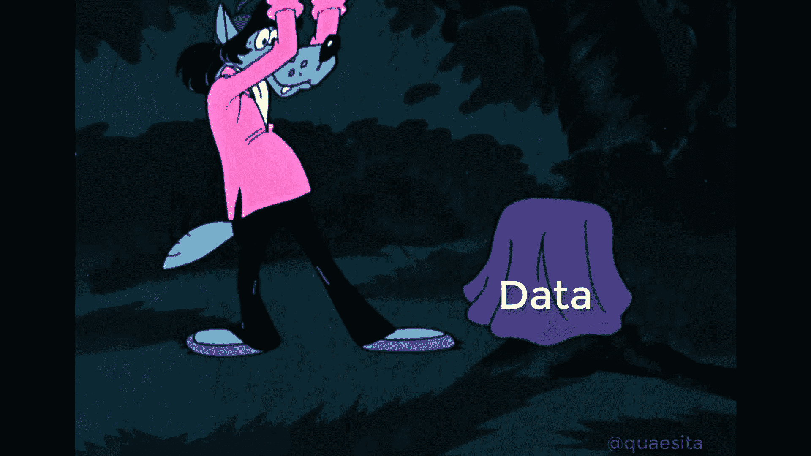
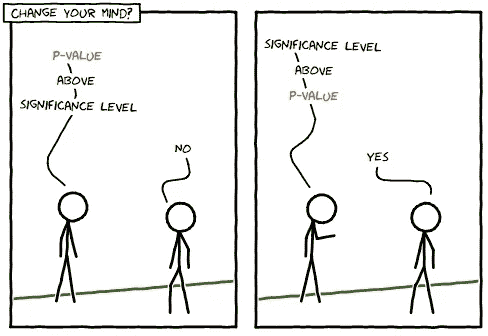

# p 值是什么的简称？

> 原文：<https://towardsdatascience.com/what-is-p-value-short-for-no-seriously-c548200660a?source=collection_archive---------7----------------------->

## 重命名那个讨厌的小数字，并重新学习如何使用它

# p 代表概率吗？

从技术上讲， [p 值](http://bit.ly/quaesita_puppies)代表*概率值*，但是由于所有的[统计](http://bit.ly/quaesita_statistics)都是关于处理[概率决策](http://bit.ly/quaesita_di)，这可能是我们能给它的最没用的名字。

相反，这里有一些更有趣的候选人名字供你娱乐。

**痛苦值:**他们让你在课堂上计算，没有给你适当的解释；难怪你的大脑会受伤。这一类的荣誉奖还包括**困惑值**、**困惑值**和**惩罚值**。

讨厌的值/有问题的值:统计学家已经厌倦了看到无知的人滥用 p 值，他们中的一些人希望看到 p 值被废除。他们希望他们可以震撼人们，大喊，“这是个人决策的工具，而不是你认为的那种*其他*的东西！”

**说服价值:**我一会儿会解释，试图用 p 值来说服某人是一个危险的赌注，你的受害者比你更无知。如果你打算诉诸 p 值来增加你的信息的趣味，我可以建议你用拉丁文重写你所有的论点吗？

**可发表的价值:**说到滥用 p 值的方法，如果你是那些“科学家”中的一员，毫无悔意地折磨(“p-hacking”)你的数据，直到它承认你认为会给学术期刊的审稿人留下深刻印象的那种 p 值，你就是问题的一部分，而不是解决方案。

如果你认为学术界是唯一一个你的薪水取决于你创造好看的 p 值的地方，那你再想想吧！

**妙语值:**经典统计推断[归结为问](http://bit.ly/quaesita_fisher) *“我们收集的证据是否让原假设看起来很可笑？”p 值是笑点，用一个小数字总结了这个大测试问题的答案。*

**似真值:**p 值越高，你的证据看起来就越可信，在这个世界里，我们不会完全疯狂地坚持我们的[默认行为](http://bit.ly/quaesita_damnedlies)。请注意，这是关于你的证据在一个特定的世界中的合理性…而不是那个世界本身的合理性！

**被动值:**你的 p 值越高，你改变主意的理由就越少。继续做你被动计划要做的事情。要了解原因，请继续阅读。(但请记住，缺乏证据与缺乏证据并不是一回事。无声烟雾报警器并不总是意味着没有火灾。)

如果你喜欢视频，这里是第一部分:什么是 p 值？这可能会让你认为 p 可能是“小狗”的简称…

# p 代表笑点！

还记得我们如何把统计推断归结为一句话吗？那是:

> 我们收集的证据让我们的零假设看起来可笑吗？

p 值是这个问题的笑点。它用一个小数字总结了答案。p 值越低，零假设看起来越荒谬！

那么，我们如何把答案变成是或不是呢？我们只是提前设定了一个门槛，来表明什么事情可笑到足以改变我们的想法。该阈值的别称是 [***显著性水平***](http://bit.ly/quaesita_statistics) 。如果 p 值低于它，那就改变你的想法。如果没有，继续做默认情况下你乐意做的事情。

# 它*是什么*和它*做什么*

p 值的一个奇妙之处在于，它们使用起来很简单，而且相对安全……如果你为你的[零假设](http://bit.ly/quaesita_damnedlies)和[假设](http://bit.ly/quaesita_assumptions)选择了正确的测试。(这是一个很大的如果！)但是不要忘记，你刚刚学到的是他们*做*的事，而不是他们*是*的事。

> 不要犯试图在简洁的一行程序中理解它们是什么的错误。

它们*是*一些奇怪的东西:关于一个特定假想宇宙中样本的概率陈述。它们绝对不是你想要它们成为的那种直截了当的东西；它们不是为了直观解释或简洁描述而设计的。它们是用来读取假设检验的输出的。

那么，他们是什么*？要明白这一点，你需要理解我们是如何计算它们的。我已经在我的其他文章中写过，例如[这里](http://bit.ly/quaesita_needles)，所以我将坚持在这里总结一下。*

# 总结:如何获得 p 值？

计算 p 值有五个步骤。

1.  选择[默认动作](http://bit.ly/quaesita_damnedlies)。
2.  陈述[零假设](http://bit.ly/quaesita_damnedlies)。
3.  陈述关于零假设所描述的世界如何运作的假设。
4.  制作一个世界模型(使用方程式或模拟)——这是统计学家的主要工作。
5.  找出这个世界咳出证据的概率至少和我们在现实生活数据中看到的一样糟糕。

第 2 部分:如何获得 p 值？

# 总结:你如何使用 p 值？

1.  将其与 [*显著性水平*](http://bit.ly/quaesita_statistics) 进行比较。
2.  如果 p 值低于显著性水平**，请改变您的想法。否则，只要继续做你打算做的事情，如果你从来没有分析过任何数据。**

如何使用 p 值来获得假设检验的结果。(没有人会怀疑我的 [xkcd](http://xkcd.com) 是山寨货。缺乏幽默不会引起任何人的警觉。)

第 3 部分:如何使用 p 值？

# 总结:简短说明

一个 p 值问道，*“如果我生活在一个我应该采取我的* [*默认动作*](http://bit.ly/quaesita_damnedlies) *的世界里，我的证据有多令人惊讶？”p 值越高，我对坚持计划行动的感觉就越不荒谬。如果 p 值足够低，我会改变主意，做点别的。*

**争议值/极化值:** *如果你想了解关于* [*p 值争议*](http://bit.ly/quaesita_needles) *并阅读我对 p 值原因的所有情绪的看法，请查看本系列的下一篇文章:* [*为什么 p 值像针一样？*](http://bit.ly/quaesita_needles)

第 4 部分:用这个总结来检验你的理解！

# 使用 p 值的最安全方式

为了解释 p 值，您必须了解假设和零假设的每个细节。如果你得不到这些信息，那么对低 p 值的唯一有效解释就是:*“有人对某事感到惊讶。”如果你不太了解正在讨论的*某人*或*某事*，让我们都来思考一下这能告诉你多少。*

> *将低 p 值解释为:“某人对某事感到惊讶。”*

试图用 p 值来说服某人是一个危险的赌注，你的受害者比你更无知。那些明白这是什么的人可能不会欣赏你试图侮辱他们的智慧。

# 感谢阅读！人工智能课程怎么样？

如果你在这里玩得开心，并且你正在寻找一个为初学者和专家设计的有趣的应用人工智能课程，这里有一个我为你制作的娱乐课程:

在这里欣赏整个课程播放列表:[bit.ly/machinefriend](http://bit.ly/machinefriend)

# 与凯西·科兹尔科夫联系

让我们做朋友吧！你可以在 [Twitter](https://twitter.com/quaesita) 、 [YouTube](https://www.youtube.com/channel/UCbOX--VOebPe-MMRkatFRxw) 、 [Substack](http://decision.substack.com) 和 [LinkedIn](https://www.linkedin.com/in/kozyrkov/) 上找到我。有兴趣让我在你的活动上发言吗？使用[表格](http://bit.ly/makecassietalk)取得联系。