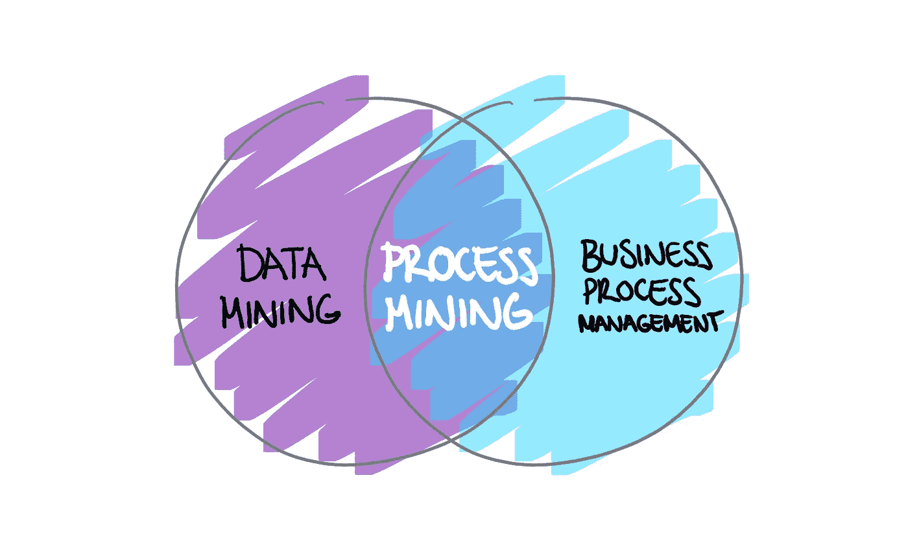
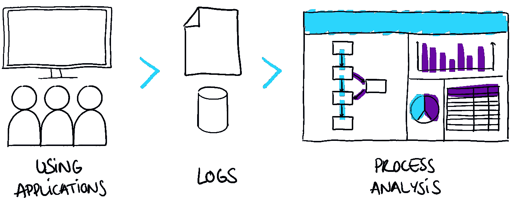
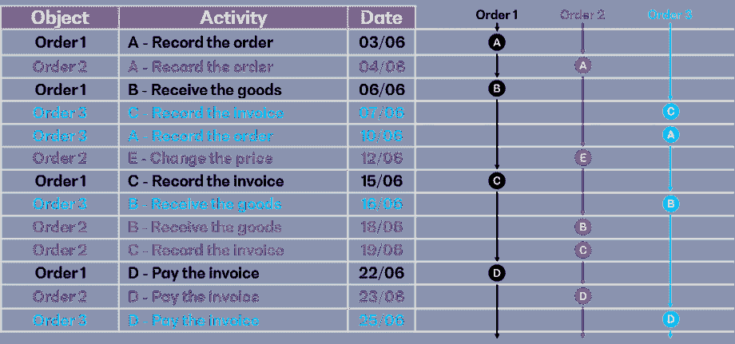
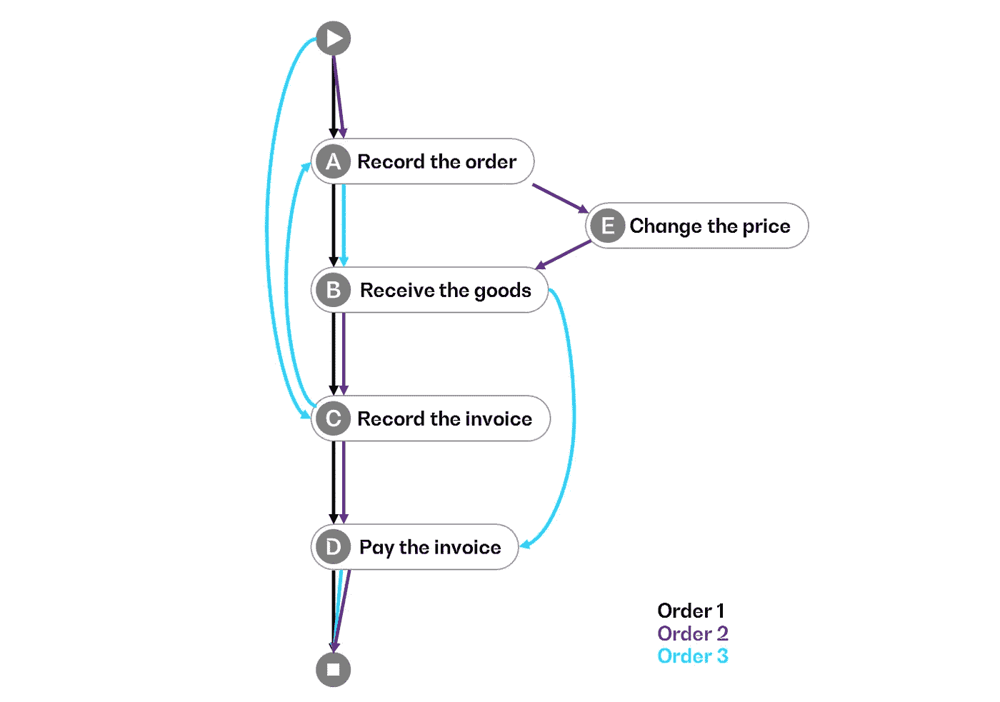
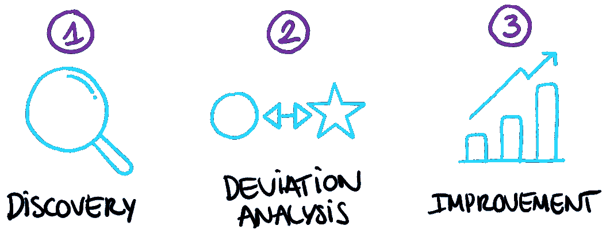

# 什么是流程挖掘？

> 原文：<https://towardsdatascience.com/what-is-process-mining-8afae06b5c33?source=collection_archive---------25----------------------->

弗兰基·查马基在 [Unsplash](https://unsplash.com/s/photos/data?utm_source=unsplash&utm_medium=referral&utm_content=creditCopyText) 上拍摄的照片

## 一种分析方法，旨在基于事实数据构建详尽客观的流程愿景

# 背景和问题

在企业环境中，**许多业务流程部分甚至完全由 IT 系统支持**:流程的数字化代表越来越多的活动，由越来越多的系统支持，产生越来越多的数据。

话虽如此，询问研究过程的传统方法是否仍然足够是合理的:

*   记录目标流程的愿景**是否足以让流程在实践中得以实施**？
*   当察觉到**与模型的偏差**时，从**主观角度**寻求团队一致意见是否是最佳选择？
*   是否可以**测量流程从开始到结束的实际执行速度**？

过程挖掘提供了一种新的方法来考虑这些因素。

# 第一个定义

流程挖掘是一种**分析**方法，旨在基于**事实数据**构建**详尽且客观的流程愿景**。

流程挖掘处于数据挖掘和业务流程管理的十字路口

因此，过程挖掘是一种高附加值的方法，当涉及到建立一个过程的实际实施的观点，并确定与理想过程的偏差，瓶颈和潜在的过程优化时。

# 它是如何工作的？

无论流程的性质如何，一旦得到数字工具的支持，**信息就会被相应的 it 系统** (ERP、业务应用程序等)创建和存储。)，尤其是通过应用程序日志。这些存储的信息通常具有相似性，并使得**有可能在不同的时间通过不同的阶段来追踪“物体”**的路径。

流程挖掘基于**工具，这些工具使用这些数字足迹来重建、可视化和分析流程**，从而为真实流程提供透明度和客观性。

流程分析基于应用程序日志

# 所需数据

为了可用，这些**数字足迹**必须至少包括:

*   **Object** :在整个流程中被跟踪的实例，具有唯一的标识符。这个对象的选择影响了所研究过程的范围
*   **活动**:学习过程中的一个步骤。活动的选择会影响流程的粒度
*   **日期**:决定活动的顺序和时间

此外，根据流程收集**额外数据**可能会很有趣，例如:供应商、产品类型、位置、人员/管理、渠道、价值……这些将允许**进一步调查**。

# 过程可视化和分析

从这些数据中，可以看到理想过程的**表示和所有**偏差**。这样可以及早发现流程中潜在的低效率。**

除了过程的表示，还可以查看每个步骤的**执行时间**，或者查看更有限的范围，以便识别**过程在哪里、何时以及为什么偏离其理想版本**。

# 采购流程示例

对于由 4 个步骤组成的简化采购流程(“记录订单”、“接收货物”、“记录发票”和“支付发票”)，订单遵循的流程可从 ERP 中留下的数字**足迹**中追溯。

## 剥削数字**脚印**:

## 过程可视化:

您会很快注意到，与遵循理想流程的**订单 1** (黑色)相比，其他两个订单出现了偏差:

*   **订单 2** (紫色)之后是一个额外的步骤:“更改价格”。
*   **顺序 3** (蓝色)遵循正确的步骤，但顺序不理想

# 使用案例和优势

流程挖掘有三个主要用例:

1.  **发现**:在没有先验模型的情况下，构建现有流程的愿景
2.  验证正确实施和**分析与先前模型的偏差**
3.  流程**改进**

在所有这三种情况下，基于客观和详尽的数据的对过程的实际实现的理解，使得过程挖掘方法更有价值。

此外，该方法代表了流程管理领域的**改进**:

*   **加速研究**(限制花费的时间和访谈次数)以建立现有流程的代表性
*   在测量中考虑更多的数据，甚至数据的穷尽性
*   一旦设计了新流程，就有机会**确保有效管理其使用**并看到改进

流程挖掘**并不致力于特定的活动领域**:这种方法将能够在流程被实施和研究的任何地方带来价值。在一家公司内，**几个职能部门可能对这种方法感兴趣**:

*   卓越运营团队:补充已经使用的方法(精益、六适马等)。)
*   数据科学家:数据的可视化表示以产生新的见解
*   流程经理:补充其专家视野的事实分析
*   CIO:系统使用的远景和相应的用户路径
*   审计或内部控制:更快的分析和依赖案例的详尽性而不是样本的可能性

# 关键成功因素

为了获得好的结果，流程挖掘计划的启动需要一些预防措施。可以注意到，重要的是:

*   从一开始就确定**增值目标**:降低成本、改善用户/客户体验…
*   从过程角度定义**明确的研究范围**
*   在固定的总时限内，用短周期分析反复操作**和**
*   确保研究所依据的数据的质量。要做到这一点，与所用系统的 it 专家以及所研究流程的业务专家合作是必不可少的
*   在目标过程重新定义的情况下，伴随的改变

此外，Process Mining 进行的**分析**本身并不是目的，而是**作为进一步流程研究**的实际起点。重新引入人的方面，例如通过使用**设计思维方法**，使得**通过考虑最终用户来深化通过流程挖掘获得的结果成为可能**。

## 来源

*   [https://www . Gartner . com/en/documents/3870291/market-guide-for-process-mining 0](https://www.gartner.com/en/documents/3870291/market-guide-for-process-mining0)
*   [https://www . win . tue . nl/ieeetfpm/downloads/Process % 20 mining % 20 manifesto . pdf](https://www.win.tue.nl/ieeetfpm/downloads/Process%20Mining%20Manifesto.pdf)
*   [https://towards data science . com/unleash-the-value-of-process-mining-4 E3 b5 af 4 e 9d 8](/unleash-the-value-of-process-mining-4e3b5af4e9d8)
*   [https://en.wikipedia.org/wiki/Process_mining](https://en.wikipedia.org/wiki/Process_mining)
*   https://www.celonis.com/
*   【https://processminingbook.com 
*   [https://HBR . org/2019/04/what-process-mining-is-and-why-companies-should-do-it](https://hbr.org/2019/04/what-process-mining-is-and-why-companies-should-do-it)