# PyTorch 是什么？

> 原文：<https://towardsdatascience.com/what-is-pytorch-a84e4559f0e3?source=collection_archive---------13----------------------->

## **想想 Numpy，但是有强大的 GPU 加速**

# 介绍

[PyTorch](https://pytorch.org/) 是一个 Python 程序库，方便构建**深度学习项目**。我们喜欢 Python，因为它易于阅读和理解。PyTorch 强调灵活性，允许深度学习模型用**惯用 Python 表达。**

简单一句话，**想想 Numpy，但是有强大的 GPU 加速**。更好的是，PyTorch **支持动态计算图**，允许你**动态改变网络行为**，不像 Tensorflow 等框架中使用的静态图。

> 为什么是 PyTorch？
> 
> GPU 上类似 NumPy 的数组
> 
> -动态计算图
> 
> -是蟒蛇皮！

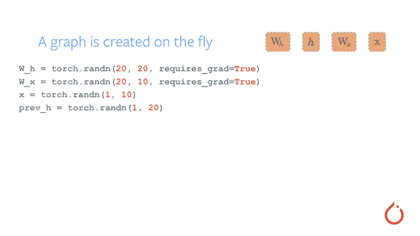

检索自 [PyTorch Github](https://github.com/pytorch/pytorch)

# 入门指南

PyTorch 可以在 macOS 上安装和使用。为了利用 PyTorch 的 [CUDA](https://developer.nvidia.com/cuda-zone) [支持](https://pytorch.org/tutorials/beginner/blitz/tensor_tutorial.html?highlight=cuda#cuda-tensors)的全部能力，建议但不要求使用 NVIDIA GPU。

用 Anaconda 安装

```
conda install pytorch torchvision -c pytorch
```

使用 pip 安装

```
pip3 install torch torchvision
```

如果你在安装上有任何问题，在这里找到更多关于安装 PyTorch [的不同方法。](https://pytorch.org/get-started/locally/)

如果你的电脑中没有 NVIDIA GPU，那么使用 [Google Colab](https://colab.research.google.com/notebooks/intro.ipynb) 来利用其免费的 GPU 功能吧！点击左上方的新笔记本开始。


记得在运行笔记本之前将运行时类型更改为 GPU

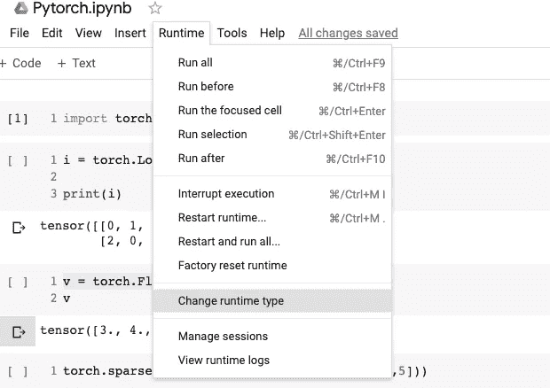

# 想想 Numpy 但是有强大的 GPU 加速！

你熟悉 Numpy 吗？太好了！您只需要将使用 on Numpy 的语法转换为 PyTorch 的语法。如果你不熟悉 Numpy，PyTorch 的编写方式非常直观，你可以在几秒钟内学会。

导入两个库以比较它们的结果和性能

```
import torchimport numpy
```

## 张量

PyTorch 张量类似于 NumPy ndarrays，可以选择在 GPU 上运行。

```
>>> numpy.array([[0.1, 1.2], [2.2, 3.1], [4.9, 5.2]])array([[0.1, 1.2],
       [2.2, 3.1],
       [4.9, 5.2]])>>> torch.tensor([[0.1, 1.2], [2.2, 3.1], [4.9, 5.2]])tensor([[0.1000, 1.2000],
        [2.2000, 3.1000],
        [4.9000, 5.2000]])
```

我们在这里看到了什么？`tensor`代替了`array.`还记得我们喜欢的`np.empty()`、 `np.random.randn()`、`np.zeros()`、`np.ones()`吗？PyTorch 可以应用相同的函数和语法

```
w = torch.empty(3, 3)
print(w,'**\n**', w.shape, '**\n**')x = torch.randn(3, 3, 7)
print(x,'**\n**', x.shape, '**\n**')y = torch.zeros(3, 3)
print(y,'**\n**', y.shape, '**\n**')z = torch.ones(3, 3)
print(z,'**\n**', z.shape, '**\n**')[0., 0., 3., 0., 0.],         
        [4., 0., 5., 0., 0.],         
        [0., 0., 0., 0., 0.]
```

## 形状和视图

用`view()`方法改变形状

```
>>> x = torch.rand(100,50)
>>> print(x.shape)
torch.Size([100, 50])>>> y=x.view(20,5,50)
>>> print(y.shape)
torch.Size([20, 5, 50])>>> z=x.view(-1,5,50)
>>> print(z.shape)
torch.Size([20, 5, 50])
```

# CPU 和 GPU 中的张量

GPU(图形处理单元)由数百个更简单的核心组成，这使得训练深度学习模型的速度快得多。下面是 GPU 和 CPU 的快速对比。

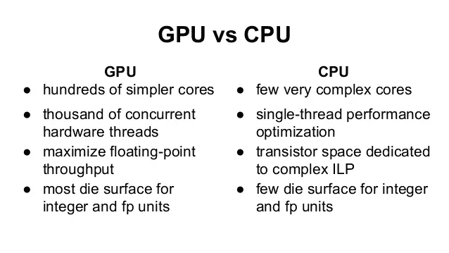

[来源](https://www.slideshare.net/AlessioVillardita/ca-1st-presentation-final-published)

无论我们决定使用 GPU 还是 CPU，PyTorch 都可以让我们轻松地在两者之间切换

```
cpu=torch.device("cpu")
gpu=torch.device("cuda:0") # GPU 0# Create tensor with CPU
x=torch.ones(3,3, device=cpu)
print("CPU:",x.device)x=torch.ones(3,3, device=gpu)
print("GPU:",x.device)x=torch.ones(3,3).cuda(0)
print("CPU to GPU:",x.device)x=torch.ones(3,3, device=gpu).cpu()
print("GPU to CPU:",x.device)
```

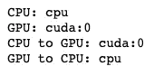

比较 CPU 和 GPU 的时间

CPU 时间

```
>>> import time
>>> x=torch.rand(10000,10000)
>>> y=torch.rand(10000,10000)>>> t = time.time()
>>> z=x@y
>>> t = time.time()-t
>>> print(t)6.999474763870239
```

GPU 中的时间

```
>>> yc=y.cuda(0)
>>> t = time.time()
>>> z=xc@yc
>>> t = time.time()-t
>>> print(t)0.4787747859954834
```

对于简单的矩阵乘法，它比 Numpy 快 15 倍！

# NumPy 呼叫 PyTorch

既然 NumPy 和 PyTorch 真的很像，那么有没有方法可以把 NumPy 数组改成 PyTorch 数组，反之亦然？是啊！

```
a = np.ones(5)#From NumPy to Torchb = torch.from_numpy(a)print('a:',a)print('b:',b)
```

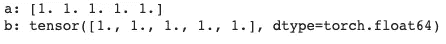

# PyTorch 的亲笔签名

什么是亲笔签名？还记得在你的微积分课上，你需要计算一个函数的导数吗？梯度类似于导数，但是是矢量形式。计算神经网络中的损失函数是很重要的。但是由于维数很高，通过求解数学方程来计算如此大的复合函数的梯度是不切实际的。幸运的是，PyTorch 可以在几秒钟内找到这个梯度的数值！

假设我们想求下面向量的梯度。我们期望 y 的梯度为 x，用张量求梯度，检查是否得到正确答案。

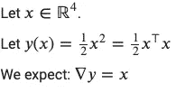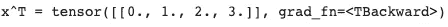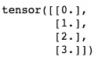

厉害！梯度是 x，和我们预期的一样。分解上述代码:

*   `requires_grad = True`允许有效的梯度计算。如果我们知道我们将计算基于 x 的梯度，我们需要为输入设置`.requires_grad = True`。点击了解更多关于亲笔签名的工作方式[。](https://pytorch.org/docs/stable/notes/autograd.html)
*   `y.backward()`数值计算梯度
*   `x.grad()`返回 y 在 x 点的梯度

# 例子

让我们通过一个分类示例来了解如何使用 PyTorch。我们的任务是找到一个点是否在黄色或紫色的簇中

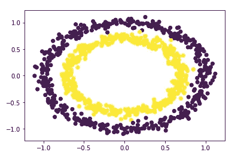

首先构建一个用于构建神经网络的 PyTorch 模块的子类`nn.Module,`。

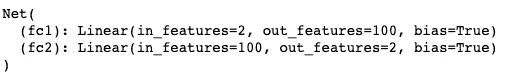

将数据分为训练集和测试集

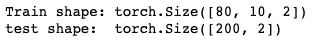

训练数据

预测和评估预测

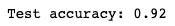

# 结论

恭喜你！您刚刚学习了 PyTorch 是什么以及如何使用它。本文只是对 PyTorch 的一个委婉的介绍。我希望你从这篇文章中获得的是，深度学习可以通过这个工具变得简单高效。要了解更多关于如何将 PyTorch 用于您的深度学习项目，我推荐查看这本伟大的书: [*用 PyTorch 进行深度学习*](https://pytorch.org/deep-learning-with-pytorch) *，*了解 PyTorch 的最佳资源之一。

在[这个 Github repo](https://github.com/khuyentran1401/Data-science/blob/master/nlp/PyTorch.ipynb) 中，您可以随意使用本文的代码。

我喜欢写一些基本的数据科学概念，并尝试不同的算法和数据科学工具。你可以在 LinkedIn 和 Twitter 上与我联系。

如果你想查看我写的所有文章的代码，请点击这里。在 Medium 上关注我，了解我的最新数据科学文章，例如:

[](/step-by-step-tutorial-web-scraping-wikipedia-with-beautifulsoup-48d7f2dfa52d) [## 用美丽的声音抓取维基百科

### 关于如何使用 Beautiful Soup 的分步教程，这是一个用于 web 抓取的简单易用的 Python 库

towardsdatascience.com](/step-by-step-tutorial-web-scraping-wikipedia-with-beautifulsoup-48d7f2dfa52d) [](/how-to-solve-analogies-with-word2vec-6ebaf2354009) [## 如何用 Word2Vec 解决类比问题

### 美国之于加拿大，就像汉堡之于 _？

towardsdatascience.com](/how-to-solve-analogies-with-word2vec-6ebaf2354009) [](/how-to-create-fake-data-with-faker-a835e5b7a9d9) [## 如何用 Faker 创建假数据

### 您可以收集数据或创建自己的数据

towardsdatascience.com](/how-to-create-fake-data-with-faker-a835e5b7a9d9) [](/an-introduction-to-tweettokenizer-for-processing-tweets-9879389f8fe7) [## 如何用 Python 对 Tweets 进行标记

### 我们应该选择 TweetTokenizers 还是其他 4 种常见的 Tokenizers？

towardsdatascience.com](/an-introduction-to-tweettokenizer-for-processing-tweets-9879389f8fe7) [](/boost-your-efficiency-with-these-6-numpy-tricks-29ca2fe81ecd) [## 用这 6 个小窍门提高你的效率

### 并控制您的阵列

towardsdatascience.com](/boost-your-efficiency-with-these-6-numpy-tricks-29ca2fe81ecd)