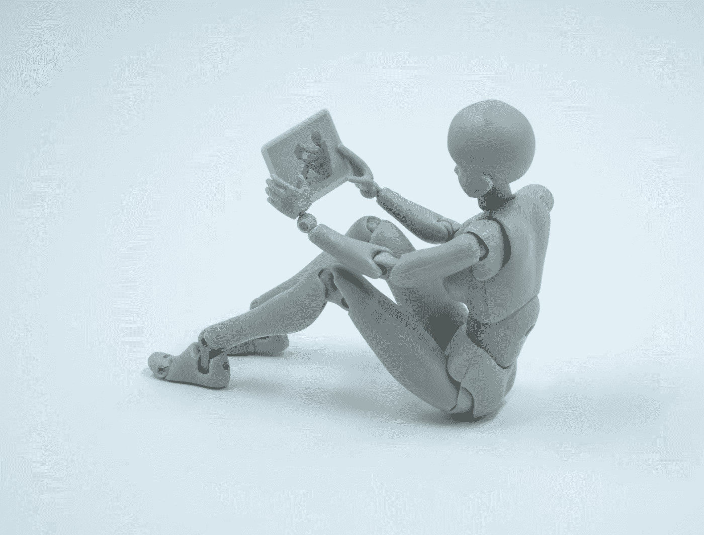

# 什么是推理？

> 原文：<https://towardsdatascience.com/what-is-reasoning-526103fd217?source=collection_archive---------38----------------------->

布雷特·乔丹在 [Unsplash](https://unsplash.com/s/photos/robot-thinking?utm_source=unsplash&utm_medium=referral&utm_content=creditCopyText) 上的照片

*(这是人工智能推理系列的第一部分)*

*前阵子我在 AI* *写了一篇关于* [*六个容易和不那么容易的棋子的文章。推理是我不太容易完成的清单上的第一项。在这一系列文章中，我将仔细研究推理——它是什么，为什么它很重要，以及它与当前流行的机器学习有何不同。沿着这条路，我追溯了计算推理的历史，并强调了一些今天仍然相关的重要思想和系统。*](https://medium.com/@unmesh.kurup/six-easy-and-not-so-easy-ai-pieces-e8fee651eaf3)

*从 20 世纪 60 年代开始，人工智能研究分成了两个阵营——基于规则的系统和机器学习等经典方法。早期的优势属于古典技术。但是，特别是在过去几十年里，这一趋势几乎完全逆转，机器学习成为人工智能重大进步的主要来源。ML 是如此的成功，以至于它成为了视觉、听觉和语言应用的主流。但是，像推理这样更复杂的任务仍然远远超出了今天可能实现的舒适区。另一方面，经典方法几乎只关注像推理这样的高阶问题。我相信我们现在正处于一个拐点——经典和机器学习方法已经足够发展，将它们结合在一起可以将人工智能推向下一个水平。*

人工智能现在可以做一些惊人的事情。它可以回答我们的问题，驾驶我们的汽车，让世界领导人唱歌，从一张照片中创作电影，甚至创作艺术。所有这些能力都是预测的例子——以图像、音频或文本作为输入，并返回类别、文本或控制命令作为输出。这些类型的预测不是微不足道的，可以是任意复杂的管道的结果，并使用控制系统、传统机器学习和深度学习的方法的组合。但在所有情况下，这些管道中的步骤都是固定的(尽管它们可能被跳过)，并且产生的模型(或管道)针对非常狭窄的问题(问题回答、图像分类、控制车辆)。你不能让一个问答模型来控制一辆汽车，或者让一个玩游戏的模型来检测核磁共振成像中的肿瘤。今天的每个人工智能都是专门构建的，并经过大量训练来实现那一个(狭窄的)功能。

现在将这与人类大脑的工作方式进行比较——我们可以开车、煮咖啡、回答问题、玩视频游戏，最重要的是，学会做非常不同的新事物。我们甚至可以学习用不同的方式完成旧的任务。我们从很少的例子中学会做这些工作，同时在不断做的过程中不断变得更好。

> AlphaGo (Alphastar)怎么样？
> 
> AlphaGo 是我们理解如何构建可以学习复杂任务的机器学习模型的一个巨大成就。AlphaGo 使用了过去二十年中最成功的发现之一——深度神经网络——它有效地使用这些网络来学习如何求解围棋。但是，有人坐下来制定了训练 AlphaGo 学习如何玩围棋的网络和强化学习策略。在它成为最擅长围棋的人之后，AlphaGo 不得不完全重做，以创建 AlphaStar，即玩星际争霸 2 的人工智能。(L [墨迹到 AlphaGo 如何工作的简单解释](https://medium.freecodecamp.org/explained-simply-how-an-ai-program-mastered-the-ancient-game-of-go-62b8940a9080)

**那么推理有什么不同呢？**

最简单地说，推理可以被认为在复杂性上至少比预测高一个级别——如果预测是在给定正确的架构和管道的情况下训练模型，那么推理就是找出架构和管道本身。换句话说，如果问题的解决方案是一系列预测(和其他工程)步骤，那么推理就是构建这些步骤序列的能力。推理可以应用于许多不同类型的任务。当你思考如何做某事时，这被称为*解决问题*。当你对某事为什么会发生进行推理时，这被称为*因果推理*。

**为什么推理比预测更难？**

直觉上，在训练这个序列的基础上构建一个步骤序列比训练本身更困难是有道理的。但是为了理解推理有多困难，我们必须使用一个类比…考虑制作咖啡的问题。给定咖啡机、牛奶、咖啡豆、研磨机、起泡器和一套操作说明，制作拿铁咖啡只是找到每种成分的正确用量的问题(咖啡的量、研磨机上的毛刺、使用多少牛奶、起泡多长时间、牛奶与泡沫的比例等等)。这一步需要一些尝试和错误，但经过几次尝试后，你就可以做对了。预测也差不多。你会得到一堆资源和如何使用它们以及使用顺序的说明，而预测是找到每种成分的正确用量的过程。

现在想象一下，你只是得到了制作咖啡的原料和工具。你不能把水倒在豆子上。你加热水，研磨咖啡豆，把咖啡放在杯子上的过滤器里，然后把水倒在咖啡豆上。你不能简单地独立于牛奶运行起泡机，你必须确保起泡机在牛奶中才能产生泡沫。这个问题肯定更难，是关于 autoML 工作的水平。

但是如果你连原料和工具都没有呢？有人给你指了一家咖啡店(或超市)的方向，让你去煮咖啡。你必须选择正确的原料，正确的工具，正确的设置，并找到每种原料的正确数量，才能在堆满东西的咖啡馆(或仓库)里制作咖啡。这就是推理的复杂性。

**那么，什么是推理呢？**

我将谈论推理的技术方面，包括表示和问题空间、策略、奖励和损失函数，当然还有 AutoML。但是现在，我想保持它的简单，并提供一个技术/算法/模型应该满足的四个品质来作为一个推理系统。

推理系统的四个品质:

1.  它是一个独立的模型或系统
2.  可以解决新问题
3.  从有限数量的试验来看
4.  同时通过练习变得更好。

所谓自包含，我只是说它不需要为不同的任务进行外部修改(由建模师/程序员/用户/科学家)。它可以是模型、算法或系统的集合，只要它在学习新任务时不被触及。

它应该能够解决以前从未见过的问题，无论是通过例子，或指令，甚至是试错法。

它应该在有限的时间范围内从少量的例子中解决这些新问题

最后，它应该通过实践变得更好。我们之前没有谈到这个质量，但这是必要的，因为质量 1-3 可以通过反复试验来实现(对于大值的 *limited)* 。

> 预测、推断和推理之间有什么区别
> 
> 预测就是模式匹配。给定大量数据，预测学会将输入映射到输出。
> 
> 推理是产生新信息的过程。这是一个没有目标的自动过程。它就像一台机器，接受输入，然后简单地把新信息作为输出。
> 
> 推理是有目标的(或目标导向的)推理，其中输入被仔细地选择、组织，并且推理机制被创造性地用于产生期望的结果。

**为什么专注于推理？**

机器学习已经非常擅长预测任务，尤其是当问题定义明确并且有大量数据可用时。但是这些系统非常脆弱，容易受到敌对攻击，并且不能优雅地降级。让他们更有弹性的一个方法是通过识别和从失败中恢复的方法来增强他们的能力，这涉及到在没有外部机构的情况下尝试解决新出现的问题。

**晁盖艾怎么了？**

针对我上面列出的每一个品质，ML 中正在进行研究——终身学习以建立一个学习多项任务的单一模型，一次和零次学习以从有限的数据中解决新问题，各种各样的 RL 技术允许代理通过重复变得更好，autoML 技术试图学习最有效的管道来解决问题，等等。但事实仍然是，在这些系统目前的能力和构建能够推理的系统所需的能力之间存在巨大差距。

几十年来，经典人工智能一直在研究这个问题，并且有许多系统可以在比 ML 更大的领域中进行推理。更重要的是，经典 AI 和 ML 优势互补。经典人工智能擅长处理离散的信息单元，但无法将这些单元与像素和音频世界联系起来。ML 擅长将像素、音频流和字符转换成其他离散的信息单元，但不擅长操作它们。缺少的是这些系统彼此之间不能很好地交流。深度神经网络等 ML 技术产生的离散单元不是经典技术使用的那种单元。

鉴于经典人工智能在推理方面的成功和 ML 在感知和行动方面的成功，现在似乎是从经典人工智能的角度重新审视推理的好时机，看看我们可以从以前的成功和失败中学到什么。

这个系列的下一步是什么？

我知道我想在哪里结束这个系列——通过介绍目前正在做的结合这两种方法的一些工作，但是我不清楚我想在这里和那里之间走哪条路。在经典人工智能中，我想谈论的话题很少，包括表示、不同种类的推理、逻辑系统、物理符号系统和认知架构。我希望在接下来的几篇文章中，从经典人工智能的简史开始，浏览这些主题。

*免责声明:本文表达的观点是我个人的，不一定代表我的雇主的观点。*

你可以在我很少发帖子的 Medium 上关注我，也可以在我很少发微博的 Twitter (@manashastram)上关注我。:)