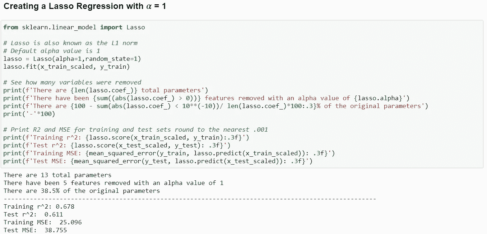

# 使用岭、套索和弹性网回归进行正则化

> 原文：<https://towardsdatascience.com/what-is-regularization-and-how-do-i-use-it-f7008b5a68c6?source=collection_archive---------37----------------------->

## 概述 3 种常见正则化技术的差异-山脊、套索和弹性网。


你已经训练了一个回归模型，你的 R 回来了，看起来很好——几乎好得不能再好了。当然，下一个合乎逻辑的步骤是看看测试数据集的进展如何。剧透警告:它不会有接近成功的训练集。

这是一种相当普遍的现象，被称为“过拟合”。过度拟合有一个相反的极性，叫做欠拟合。用专业术语来说，过度拟合意味着你建立的模型的参数比数据能够证明的要多。[点击此链接查看包含这篇博文笔记本的 GitHub 资源库。](https://github.com/bsamaha/Blog-Post-Ridge-and-Lasso)

> 与计算机打交道有一种让我们脱离现实的方式，过度拟合/欠拟合模型就是证明。例如，在建筑中，计算机辅助设计(CAD)使绘图员能够画出极限公差，例如 0.001 英寸。如果你画一个平面图，告诉挖掘机挖一个 34.963 英寸深的沟渠，你真的能指望重型机械有那种精度吗？你能指望一个在野外工作的木匠把木材切割到 0.001 英寸吗？凭经验我可以告诉你，这是不会发生的。沟渠大约有 36 英寸(3 英尺)深，木板可能会被修圆到最接近的 1/8 英寸，或者如果你幸运的话，1/16 英寸。这是一个现实世界中经常发生的过度拟合计算机模型计算的例子。

一个真实世界的欠拟合例子是一个煤气炉，它只有两个输入设置，最大热和关。因为你产出的食物要么被烤焦了，要么还是生的，所以你几乎不可能把任何东西都煮熟。

你可能会问*所有这些与正规化有什么关系？*答案是**一切**。通过降低模型对训练数据中某些噪声的敏感度，向模型中添加适量的偏差有助于做出更准确的预测。

[](https://scikit-learn.org/stable/auto_examples/model_selection/plot_underfitting_overfitting.html)

点击图片阅读更多 Sci-Kit Learn

在蓝点上方的图中，是来自现实世界的样本数据点。这些样本与黄线的距离，即“真实函数”，被称为数据的“噪声”。样本点到蓝线的距离被称为我们模型的“误差”。

```
# Equation of True Function
**def** true_fun(X):
    **return** [np.cos](https://docs.scipy.org/doc/numpy/reference/generated/numpy.cos.html#numpy.cos)(1.5 * [np.pi](https://docs.scipy.org/doc/numpy/reference/constants.html#numpy.pi) * X)
```

欠拟合模型的预测根本不能解释真实函数的样本数据。真实函数比一个一次的简单线性方程更复杂。如果你需要复习[如何确定多项式函数的次数，请参考这个网站](https://www.mathsisfun.com/algebra/degree-expression.html)。

这个模型的一个很好的类比是，在多项选择测试中，每个问题的答案都是“C”。当然，你可能会在几个问题上走运，但你会答错绝大多数。

过度拟合模型的预测线几乎完美地描述了真实函数——甚至更多。该模型的预测输出是一个超级复杂的 15 次多项式函数。随着模型的复杂性(程度)增加，模型开始不太关心其预测的误差，而更关心预测它所获得的训练数据的值。花点时间沿着过度拟合模型的预测线追踪，看看它离真正的函数有多远。

继续我们的考试类比，过度拟合模型找到了我们考试的答案并记住了那个答案。当我们给模型一个没有答案的考试会发生什么？很有可能它会悲惨地失败。

合适的模特在金发区。它既不太简单也不太复杂。作为一个 8 次多项式函数，该模型仍然具有复杂性，但该模型在看穿样本数据中的噪声方面做得很好。这允许模型极大地减少来自过度拟合模型的误差，并且更准确地预测真实函数值。这个模型拟合的黄金地带就是我们试图通过正则化来实现的。

# 正则化技术

岭和套索回归技术扩展了简单的线性回归。在继续之前，让我们回顾一下 OLS 的倒退:


使用 RSS 作为成本函数的多变量 OLS 回归

成本函数衡量模型输出与实际数据之间的差异。线性回归有多个成本函数，如 [RSS](https://en.wikipedia.org/wiki/Residual_sum_of_squares) 、 [MSE](https://en.wikipedia.org/wiki/Mean_squared_error) 、 [RMSE](https://en.wikipedia.org/wiki/Root-mean-square_deviation) 。在上例中，成本函数是 RSS(y _ actual-y _ predicted)。预测值可以用你的回归线方程代替。您的特征系数，也称为斜率，是(mⱼ).这些特征系数是我们用正则化技术处理的对象。

> 注意:在这篇文章中，我将预测器和特征作为同义词使用。预测值是模型中使用的独立变量(x 变量)。如果您正在构建一个身体质量指数估计器，高度很可能是您的预测因素之一。

在构建模型时，无论是哪种类型，您都必须执行适当的数据清理和探索技术，以完全理解您的数据。本博客中的所有正则化技术都应用了基于预测系数的惩罚。这意味着你必须在应用这些算法之前标准化你的数据。

这些技术的假设取决于应用正则化技术的模型的类型。[如果你需要重温一下 OLS 模型的假设，请看看我之前的博文。](https://medium.com/swlh/my-guide-to-understanding-the-assumptions-of-ordinary-least-squares-regressions-b180f81801a4)

## 里脊回归

岭回归是 OLS 成本函数的一个小扩展，随着模型复杂性的增加，它会给模型增加一个惩罚。数据集中的 predictors(mⱼ越多，r 值就越高，模型过度拟合数据的可能性就越大。岭回归通常被称为 L2 范数正则化。


岭成本函数-请注意λ(λ)乘以预测值的平方和

请记住，目标是最小化成本函数，因此惩罚项(λ * sum(mⱼ)越大，模型的性能就越差。此函数会因您的模型有太多或太大的预测值而惩罚您的模型。岭回归的目的是减少这些预测因子的影响，从而降低数据过度拟合的几率。如果我们设置λ = 0，那么这将是一个正常的 OLS 回归。

岭回归最常见的用途是*抢先*解决过度拟合问题。当您必须保留所有预测值时，岭回归是处理多重共线性的好工具。它通过缩小预测值的大小来解决共线性问题，但从未消除它们。

> **如果有许多大约相同量级的预测值，岭回归效果很好。这意味着所有预测器预测目标值的能力相似。**

## 套索回归

当你看着下面的等式，心里想“这看起来几乎和岭回归一样”嗯，你大部分都是对的。Lasso 不同于岭回归，它对预测值(mⱼ)的绝对值求和，而不是对平方值求和。


套索成本函数-请注意λ(λ)乘以预测值的绝对值之和

Lasso 是首字母缩略词，代表“最小绝对收缩和选择算子”*由于罚项不是平方，有些值可以达到 0。当预测器系数(mⱼ)达到 0 时，该预测器不会影响模型。*

由于 Lasso 的要素选择属性，它非常适合多重共线性。解决两个预测变量的共线性的最有效方法之一是删除其中一个。然而，移除是有代价的。可能存在变量集合共线的情况，并且仍然提供进行估计的价值。Lasso 将任意选择一个预测器进行预测，并放弃另一个。

如果很少有重要的预测因素，并且其他因素的大小接近于零，那么 Lasso 往往表现良好。换句话说**，**一些变量是比其他预测值更好的目标值预测值。

## 弹性净回归

那么，如果我不想选呢？如果我不知道自己想要什么或需要什么怎么办？弹性净回归是作为对套索回归的批判而产生的。虽然它有助于功能选择，但有时您不希望主动删除功能。正如你可能已经猜到的，弹性网是套索和脊回归的结合。因为我们已经知道了岭和套索回归是如何起作用的，所以我就不赘述了。请参考 [sci-kit learn 的文档。](https://scikit-learn.org/stable/modules/generated/sklearn.linear_model.ElasticNet.html?highlight=elastic%20net#sklearn.linear_model.ElasticNet)


λ₁是套索罚分(L1)，λ₂是岭回归罚分(L2)

如上图所示，现在有两个λ项。λ₁是回归套索部分的“alpha”值，λ₂是岭回归方程的“alpha”值。当使用 sci-kit learn 的弹性网络回归时，阿尔法项是λ₁:λ₂.的一个比率**当设置比率= 0 时，它作为岭回归，当比率= 1 时，它作为套索回归。介于 0 和 1 之间的任何值都是脊线和套索回归的组合。**

# 如何使用这些回归技术

现在好戏开始了！我假设你已经知道如何建立一个基本的线性模型。如果没有，你会在这个博客的相应笔记本中看到。使用套索和岭回归非常相似-除了“阿尔法值”。 [Sci-kit learn 的 GridSearchCV](https://scikit-learn.org/stable/modules/generated/sklearn.model_selection.GridSearchCV.html?highlight=gridsearch#sklearn.model_selection.GridSearchCV) 搜索一系列值，为您的超参数找到最佳值。

## 套索回归

下面是我用来构建下图结果图的代码。这个模型是使用 Sci-Kit Learn 的波士顿住房数据集创建的。

```
from sklearn.model_selection import GridSearchCV# Create an array of alpha values to test
# Start np.linspace value is 10**-10 because a value of 0 throws warnings
alphas = np.logspace(-10, 1, 1000,base=10)# Create dictionary key,value pair of alpha values
tuned_parameters = [{'alpha': alphas}]# Specify number of folds for cross_validation
n_folds = 5# Create grid search instance using desired variables
clf_lasso = GridSearchCV(lasso, tuned_parameters, cv=5, refit=True)
clf_lasso.fit(x_train_scaled, y_train)
lasso_scores = clf_lasso.cv_results_['mean_test_score']# Plot the results
plt.figure().set_size_inches(8, 6)
plt.plot(alphas, lasso_scores)
plt.xlabel('Alpha Value')
plt.ylabel('Model CV Score')
plt.title('Lasso Regression Alpha Demonstration')
plt.axvline(clf_lasso.best_params_['alpha'], color='black', linestyle='--')
print(f'The optimal alpha value is :{clf_lasso.best_params_["alpha"]}')
```


波士顿住房数据的优化 Lasso 回归

请注意，最佳 alpha 值是 0.0106，而不是 0。这证明了添加这一点 alpha 比纯线性回归产生了更高的交叉验证分数。从这张图表中很容易看出，随着 alpha 值的增加，CV 值接近并达到 0。



在 alpha 值为 1 时，几乎 2/3 的特征被移除，并且测试 R 仅降低了大约 0.1！

上图显示值为 1 时，套索回归移除了 8 个特征，在总共 13 个预测因子中只剩下 5 个。随着特征的去除，模型的预测强度下降，但是现在模型更简单了。这让我们对好的特性选择的力量有了一点了解。

## 里脊回归

再次，像套索回归这里是代码和下图产生。

```
from sklearn.model_selection import Ridge# Create an array of alpha values to test
alphas = np.logspace(-1, 1.5, 500,base=10)# Create a Ridge regression model instance
ridge = Ridge(random_state=0, max_iter=10000,alpha=alphas)# Create dictionary key,value pair of alpha values
tuned_parameters = [{'alpha': alphas}]# Specify number of folds for cross_validation
n_folds = 5# Create grid search instance using desired variables
clf_ridge = GridSearchCV(ridge, tuned_parameters, cv=5, refit=False)
clf_ridge.fit(x_train_scaled, y_train)
ridge_scores = clf_ridge.cv_results_['mean_test_score']# Plot the Figure
plt.figure().set_size_inches(8, 6)
plt.plot(alphas, ridge_scores)
plt.xlabel('Alpha Value')
plt.ylabel('Cross Validation Score')
plt.title('Ridge Regression Alpha Demonstration')
plt.axvline(clf_ridge.best_params_['alpha'], color='black', linestyle='--')
print(f'The optimal alpha value is: {clf_ridge.best_params_["alpha"]}')
```


Sci-Kit Learn 波士顿住房数据的岭回归优化

与套索回归不同，我们可以在这里看到随着 alpha 值的增加，该值是如何接近 0 的。如果你愿意，你可以在 GitHub 笔记本上增加 alpha 值，看看它永远不会达到 0。

在岭回归图中，我们看到 alpha 值为 2.97 时，我们的模型比值为 0 时有更好的性能。请记住，alpha 值为 0 等于正态回归。**这证明了适量的偏差可以改善你的模型，防止过度拟合！**

# 结论

就是这样！现在，您可以使用优化的 alpha 值来运行您选择的回归。下面是我们讨论内容的简要总结:

***什么是正则化*** :对抗过拟合和提高训练的技巧。

 **弹性网——脊和套索的混合物**

***如何使用正则化:***

1.  分割和标准化数据(只标准化模型输入，不标准化输出)
2.  决定哪一个回归技术脊，套索，或弹性网，你希望执行。
3.  使用 GridSearchCV 优化超参数 alpha
4.  用你现在优化的 alpha 构建你的模型并进行预测！

> 谢谢你花时间阅读我的博客。在我的 GitHub 库中可以找到该笔记本的全部细节。如果您有任何问题或有建设性的批评，请随时联系我！
> 
> 领英:【www.linkedin.com/in/blake-samaha-54a9bbaa 
> 
> 推特:@Mean_Agression