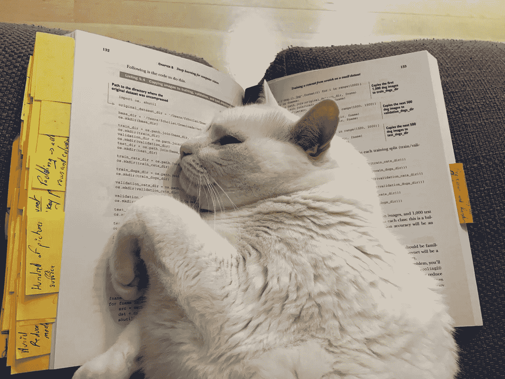

# 什么是研究？

> 原文：<https://towardsdatascience.com/what-is-research-e119da986a96?source=collection_archive---------55----------------------->

作者拍摄

*通过我们的思想发现自然*

*下面分享的所有观点都是基于我的经验和我的信念。这不是绝对的事实，而是我所想的一种天真的看法。*

## 什么是研究？

一些有趣的定义:

> **研究**是“为增加知识储备而进行的创造性和系统性工作，包括人类、文化和社会的知识，以及利用这些知识储备来设计新的应用。”它包括信息的收集、组织和分析，以增加我们对一个主题或问题的理解。([来源:维基百科](https://en.wikipedia.org/wiki/Research))

> 科学研究是一种收集数据和利用好奇心的系统方法。这项研究为解释世界的本质和属性提供了科学信息和理论。它使实际应用成为可能。([来源:维基百科](https://en.wikipedia.org/wiki/Research))

对我来说，**研究是想要对未知做出反应的生物之间的一种普遍想法**。如果我们看看过去，学者们掌握着知识，想要了解世界。每个人都有自己的愿景，这些愿景可以转化为**基本问题**，他们**通过假设**进行测试。
研究不是，找到答案，还是找不到答案。**使假设无效的结果本身就是一个结果**，因为它允许其他人不走这条路，并允许他们测试其他假设。**研究是对未知事物提出科学问题的艺术。创造一个有问题的问题，并且能够用一系列的假设来测试它，并且能够向其他人解释路径，以便他们跟随你并且帮助你。**

如果我们看看量子物理学的创建，来自所有国家的一群研究人员只花了几年时间，他们每年只聚会一次，交流他们的进展，以创建一个解释无限小的有限理论。今天所有的微电子工作都要归功于这个理论。尼尔斯·玻尔说:“**如果量子力学**还没有深刻地**震撼你**，**你还没有理解**。”

我觉得对于研究来说也是一样的，“**如果你觉得不是为了遇见未知，那就是你还没想通**”。

目前，研究并不性感。大多数研究人员花费超过一半的时间寻找资金。研究人员正在为发表论文而疯狂地竞争**，如果你想有一个好名声，一个好的 **H 指数**你必须每年发表 **2 到 3 篇论文**。大多数实验室都在战争中，无论是为了资金，为了招聘还是为了诋毁其他实验室的论文。**

[Yoshua Bengio 最近在他的博客中发表了一篇文章，指出会议论文的选择过程完全需要重新审核，因为提交的论文中有太多没有材料或基本回复](https://yoshuabengio.org/2020/02/26/time-to-rethink-the-publication-process-in-machine-learning/) [1]。

疯狂的出版竞赛破坏了研究的本质，即回答未回答的问题，探索未知环境的系统空间。**做好研究**需要时间，通过证明和测试假设来充分回应。

今天，**如果你在主要期刊或会议上发表了 *X* 篇论文**，你就是一名研究员。但是做研究员不就是一种生活方式吗？一种观察和预测世界的方式？在别人会经过的地方提问？用天真的眼光去看未知的地方？

做研究意味着大部分时间生活在失败中，也就是承认当我们找到一个答案时，其他研究人员可用的时间使它变得无用和无用。但美丽的是发现快乐瞬间的火花，为科学做出哪怕是最小的贡献。就像一个刚找到一盒巧克力的孩子。发现的喜悦。不幸的是，这很快就会被一个繁琐的过程所玷污，让你证明自己是你所声称的那样。

很久以前，我的一位论文导师对我说“**我们做研究不是为了赚钱**”我笑了很久，对自己说这太荒谬了，在爬上所有的文凭之后，薪水必须与之相称。但是最后，我明白了，这几句话包含了我可能永远不会拥有的金玉良言。研究不是一份工作，而是一种生活方式，一种激情，它让你每天早上起来的唯一目的就是发现这个世界。成为未知领域的探险家。

出版物的数量每年都在激增，这使得一个人不可能面面俱到。另一个问题是，目前大多数发表的研究结果是错误的[2]，这很正常，我们是人，但我希望大多数错误不是故意犯下的，以在出版物中显示结果。此外，复制危机是研究中的一大重要偏见(科学研究很难或不可能复制或再现[3])。

大概是**天真率真的眼光**。然而，我愿意相信这是**科学**的目标。我没有研究员的身份，因为我没有发表的可能性。我攻读了天体物理学博士学位，现在在“*人工智能*公司工作。我将我的知识和科学方法应用于它，但没有发表，我不断地在文献、出版平台或研究人员的博客中寻找答案，以找到问题的解决方案，或者通过我的研究找到答案，感谢这种方法让我们探索未知。也许真正的研究人员会向我扔石头，但有多少人在做研究呢？我的意思是，有多少人足够幸运，能够不用浪费时间去找工作就能做研究？

## 现在在哪里做研究？

几年前，研究只在学院和大学里进行，现在这种趋势正在改变。公司越来越多地通过专门的研究和开发团队获得他们的位置(R&D)，非常大的公司有巨大的部门专门从事各种研究。GAFAMs 和其他跨国公司每年投资数十亿美元进行研究，以揭示秘密和创新。

大多数公司已经意识到，如果他们想保持对竞争对手的竞争优势，他们必须超越他们所拥有的知识。获取新知识需要研究来产生智力资本。

## 如何成为一名研究员？

大多数人会回答你需要博士学位，拿了博士学位才能成为研究员。这是真的，但不是全部，博士学位培养你成为一名研究员，但对于招聘医生来说，有几个级别的“博士”。第一类是研究人员，他们开始了他们的论文主题，发展了解决问题的直觉。他们尝试假设，比较方法，获得本领域和相关领域的知识。他们已经解决了他们的课题，甚至更多。他们是充满热情的人，渴望无穷无尽的知识。

第二种情况是读博士学位的人，因为这是他们学业的延续或其他人的影响。他们发现自己在一个主题中，他们在等待一个程序，被告知该做什么。我记得数据科学家职位的两个候选人，其中一个曾告诉我“为什么要做文学和技术调查？我有博士学位，我什么都知道”另一个人向我介绍了他的课题，这个人使用了算法，然后我问他为什么只选择神经网络和决策树，他的回答是“我被要求测试它们，并且它有效，所以我们没有看任何其他东西”。

所以不，有博士学位不一定就能成为研究员。我遇到过本科生或硕士生，他们研究对他们来说很重要的课题，一些他们在科学文献、书籍或博客中没有找到满意答案的基本问题。他们已经确立了他们的研究课题。最糟糕的是，大多数人从来不想读博士，因为他们认为这会影响他们的创造力。

我和工程师们一起工作，他们更多的是研究人员而不是工程师，他们想通过自觉地应用科学方法来推进他们的领域。
做研究员不是文凭，也不是发表名单；这是一种存在的方式，一种想要解决问题的方式。一种知道如何将一个问题分成子部分来建立假设、数据、模型、测试的方法。

## 一个博士教我们什么？

很多事情。上班时间和工作时间？不，因为当你累的时候，你会犯更多的错误，而且要花很多时间来纠正它们。在我读博士期间，我记得我花了三天时间在我的代码中寻找一个 bug，直到我找到它才能睡觉。筋疲力尽的我上床睡觉，第二天，睡了个好觉后，重读一遍代码，错误就完美地出现在我面前。疲劳什么也教不了。

所以，博士教给我们很多东西:

*   多角度思考一个问题
*   不要被卡住
*   阅读、理解并对他人的工作做出直觉判断
*   专注和集中
*   当你没有问题时，回到根本上来
*   制定一个有问题的
*   提问
*   创建假设
*   创造和测试事物
*   自由
*   …
*   可选:专业知识

我想我不能阐述一个博士能带给你的所有东西，但这是值得的。但是，这取决于你，取决于你的主管，取决于你的实验室，取决于你手头的资源，取决于你周围的人。

对我来说，攻读博士学位是最好也是最糟糕的事情。最好是因为它教会了我日常使用的东西，而且我从来没有被卡住过，我总是在寻找解决方案。更糟糕的是，因为它需要大量的工作，你会失败，无论你的水平或你的天才，你将不得不失败。没有失败就没有成功。你会精疲力尽的。

很多时候，当你开始读博士学位的时候，你不知道它是什么，你不能教论文是什么或者你要做什么。我们从未为此做好准备。这么多学生第一年就止步不前或者转科，大概就是这个原因吧。我向那些想深入了解这一点的人推荐这篇文章。

## 应用 vs 研究 vs 数据，科学家

随着时间的推移，随着数据科学家职业的减少，这三种工作名称越来越多。那么它们之间的区别是什么呢？差别可能在于这些职位所需的知识深度。

*   **数据科学家**:总体来说，寻找、清理和结构化、分析、建模、可视化、呈现数据(这个职位可以远离研究，更多的是了解业务)
*   **研究科学家**:顾名思义，他们是做研究的。他们不关注业务、渠道或产品。他们专注于寻找不存在的答案。阐明假设，证明它们是否正确。研究人员研究的问题通常更深入，投入的时间比需要立即回报的商业项目更重要(研究需要几年，数据科学需要几周或几个月)。
*   那么，什么是**应用科学家**？这种情况越来越普遍。这是研究科学家角色的延伸，但是，它需要更多的软件知识来大规模应用解决方案(分布式或并行计算等，需要具有研究背景的 SDE 知识)。研究科学家更专注于科学发现，而应用科学家似乎对现实生活中的问题更感兴趣。

## 如何开始一个研究项目？

这是一个很好的问题，老实说，我没有完美的答案，因为我总是试图找出它。学术界或企业你最需要的东西“对某事的兴趣”，**你最感兴趣的是什么？**你热爱什么？这里有感兴趣的领域或应用。

从哪里开始？

不同的方式:

*1-阅读文学*

这是最常用的开始研究的方式，因为每个博士生都会以“*文献综述*开始他的论文，一般由“*调查论文*结束。这是一个缓慢的过程，非常缓慢，阅读科学论文并不容易，但随着时间的推移会变得容易。有利有弊，尽管 99.9%的研究人员对此深信不疑。

这种方法的优点是:

*   你在你的领域获得了专业知识
*   你知道有什么突破吗
*   你可以找到直觉，并发现在哪里搜索，在哪里你可以产生影响，有哪些问题没有答案(潜在的研究项目)
*   你有写论文的相关材料，因为你知道年表
*   你知道所有论文中使用的所有方法

缺点是:

*   到头来，你被过程带偏了。你只看到别人做什么，只看到他们想让你看到的
*   你知道人们如何做研究，你会复制同样的模式，同样的思考方式
*   文献有错误，可能难以复制
*   重新创建算法或数据的困难
*   不会帮助你发展自己的思维方式
*   文章的数量每年都在爆炸

*2 —开始你的想法*

与第一点相反。你有了一个想法，你就为之努力，直到你解决了它，而不需要做文献综述。从好的方面来看，你不会被文献中呈现的思维方式所偏见，你会阐明假设，找到验证或反驳它们的方法。你是这个过程的主人。不利的一面是，这个问题可能已经解决了不止一次，而且比你的解决方案更优雅。当文献已经给了你线索或解决方案时，缺乏专业知识会让你绕几个月的圈子。

*3——学习导师给的科目*

很可能是混合方法。你的导师是经验丰富的研究人员，他们对该领域有着完善的知识。他们知道什么可行，什么不可行。他们发现即将出现的潜在主题或问题。他们知道什么是有希望的，什么将产生很少。担心的通常不是你的想法。你信任那些对你感兴趣并让你解决他们问题的人。廉价劳动力。

*4 -费曼方法*

*   找到你感兴趣的主题
*   了解一下
*   教它，收集评论
*   努力克服你推理中的弱点
*   如果你还没有找到答案，回到第二步
*   对于新项目，回到步骤 1

我想，找了很久又找了一遍，没有完美的答案。这完全取决于地区，你能投入到项目中的时间。你可以建立的关系(联系可以帮助你的研究人员)。兴趣或领域的出现。

人工智能的领域非常广阔，似乎不可能掌握一切。但是，领域越广，寻找感兴趣的研究课题的空间就越大。无论如何要小心，大公司都在赌它，因此它是一个发展非常迅速的领域。

## 结论

不要害怕事情的消极面。得到警告并做好准备比发现自己被关在你不想去的地方要好？我坚信，作为一名研究人员是一种职业，一种思维方式和好奇心。发表不发表不重要，研究的本质在于你如何看待这个世界。
激情，疯狂，渴求答案，去冒险。

## 参考

*   [https://en.wikipedia.org/wiki/Research](https://en.wikipedia.org/wiki/Research)
*   [1] Yoshua Bengio，是时候重新思考机器学习中的出版过程了(2020 年)，yoshuabengio.org[https://Yoshua beng io . org/2020/02/26/Time-to-rethink-the-publication-process-in-machine-learning/](https://yoshuabengio.org/2020/02/26/time-to-rethink-the-publication-process-in-machine-learning/)
*   [2] [约翰·p·a·约安尼迪](https://www.ncbi.nlm.nih.gov/pubmed/?term=Ioannidis%20JP%5BAuthor%5D&cauthor=true&cauthor_uid=16060722) s，[为什么大多数发表的研究发现都是假的(2005)，PLos Med](https://www.ncbi.nlm.nih.gov/pmc/articles/PMC1182327/)
*   [3] [复制危机，维基百科](https://en.wikipedia.org/wiki/Replication_crisis)
*   [4]凯蒂·兰金(Katie Langin)退掉你的博士(2019)理科[https://www . Science mag . org/careers/2019/06/It-s-OK-quit-your-PhD](https://www.sciencemag.org/careers/2019/06/it-s-ok-quit-your-phd)
*   [5]乔纳森·圣·B·T·埃文斯，《如何成为一名研究者》(2015)，劳特利奇出版社