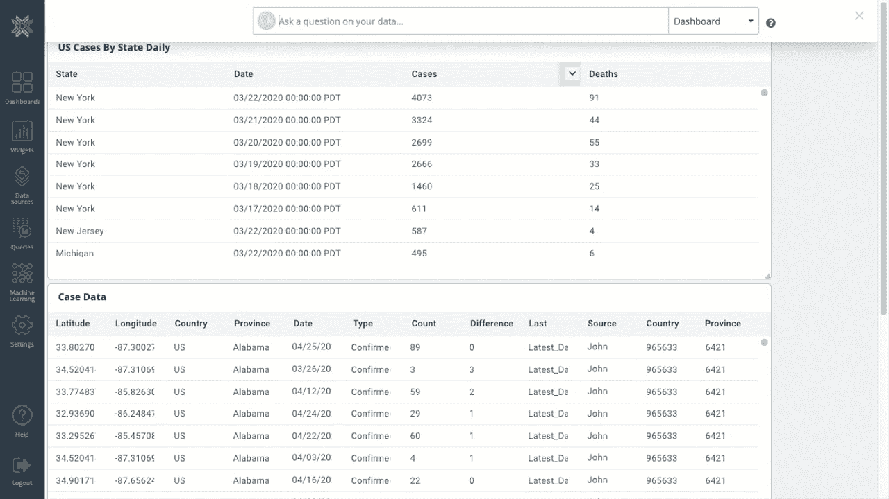
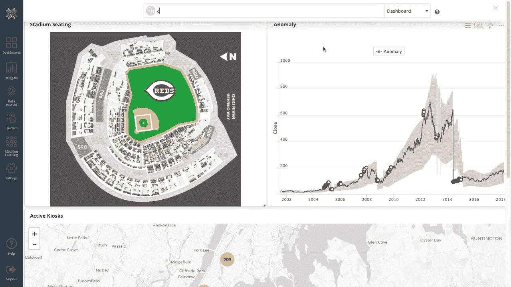
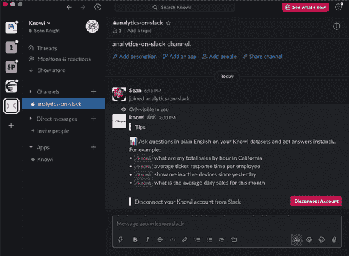

# 什么是基于搜索的分析？

> 原文：<https://towardsdatascience.com/what-is-search-based-analytics-a1097704ba91?source=collection_archive---------40----------------------->

## 那些不知道的人将被遗忘在尘埃中

在 [Unsplash](https://unsplash.com?utm_source=medium&utm_medium=referral) 上由 [Balázs Kétyi](https://unsplash.com/@balazsketyi?utm_source=medium&utm_medium=referral) 拍摄的照片

[什么是基于搜索的分析？](https://www.knowi.com/blog/what-is-search-based-analytics/)

# 什么是基于搜索的分析？

您可以将基于搜索的分析视为公司数据的搜索引擎。基于搜索的分析能够提出诸如“我们上个季度的净收入是多少”或“告诉我过去 30 天有多少人下载了我们的应用程序，按周排序”等问题，并获得可操作的数据和图表。

## 为什么需要基于搜索的分析？

在过去的十年中，商业智能工具赋予了业务用户创建自己的仪表板和可视化的能力。这有助于高管和部门主管做出数据驱动的决策，以支持公司目标。但是，利用这些控制面板和可视化的能力受到数据治理、数据孤岛和数据蔓延以及单个用户能力等问题的限制。

> 您可以将基于搜索的分析视为公司数据的搜索引擎

不仅如此，为了使用数据分析仪表板，必须首先创建仪表板。必须引入数据，必须选择和应用可视化，必须以能够回答特定业务问题的方式设计仪表板。这个过程可能需要几个小时甚至几天。

另一方面，基于搜索的分析允许企业用户用简单的英语提问，并立即得到可操作的数据和可视化结果。

使用基于搜索的分析来分析新冠肺炎数据(视频由作者使用[知识](https://www.knowi.com/search-based-analytics/)制作)

但是建立一个有效的基于搜索的分析平台是有挑战的。例如，为了使其有效工作，基于搜索的分析平台需要理解诸如“比较”、“多少”、“平均”和“总数”等术语。他们还需要理解特定于业务的术语，如“增长”、“保持”、“流失”和“成本”。同样至关重要的是，他们能够解释许多表示日期或时间跨度的不同方式，例如“从九月到十二月”、“上个季度”、“按月显示”和“去年”。这是通过自然语言处理完成的。

# 自然语言处理

自然语言处理(NLP)最早出现在 20 世纪 50 年代，但直到最近才达到该技术广泛应用的程度。你可以想象，让一台计算机理解人类语言是一个主要障碍——想想英语的复杂性和细微差别。

> NLP 工作是将人类语言的问题转换成分析引擎可以理解的查询

在过去十年中，这种情况发生了显著变化。谷歌搜索、Wolfram Alpha、亚马逊 Alexa 和苹果的 Siri 都在使用 NLP 为人们提供真正的服务方面取得了长足的进步。

在基于搜索的分析中，这可能会更加复杂。有许多方法可以要求特定类型的数据或可视化。NLP 的工作是将人类语言的问题转换成分析引擎可以理解的查询。

对物联网地理空间数据使用基于搜索的分析(作者使用[知识](https://www.knowi.com/search-based-analytics/)制作的视频)

# 为特定用例定制基于搜索的分析

除了将 NLP 应用于数据以创建基于搜索的分析所带来的一般挑战之外，还有特定于用例的挑战。

如果你调查 100 家公司如何使用商业智能工具，你可能会得到 100 个不同的答案。这是因为所有行业都使用不同的数据。甚至同一个行业中的单个公司也可能跟踪不同的度量和 KPI(关键性能指标)。许多行业也有不同的术语和特定领域的知识，当包含在自然语言查询中时，必须理解这些术语和知识，至少粗略地理解一下。

这就是为什么在这种情况下，提供商针对客户的特定使用情形定制基于搜索的分析部署至关重要。这个过程通常包括向 NLP 库中添加自定义术语和同义词、映射关系、调整变量名以及自定义可视化选择逻辑。

# 示例:这在实践中是什么样子的？

想象一下，一家冷藏卡车运输公司使用 GPS 和 IoT(物联网)温度传感器将监控数据输入其商业智能平台。他们会想知道他们的卡车在哪里，速度有多快，冷藏室的温度是多少。

这意味着基于搜索的分析平台需要理解诸如“告诉我亚利桑那州所有卡车的位置和温度”、“5 号钻井平台有多冷”和“有没有高于冰点的单位？”。第一个查询可能现成可用，但第二个和第三个示例可能需要一些定制才能正确解释。

在 Slack 中使用基于搜索的分析(作者使用[知识](https://www.knowi.com/search-based-analytics/)制作的视频)

# 真的像谷歌搜索一样简单吗？

简短的回答:没有。但是更好的回答可能是“还没有”如果你还记得网络爬虫、Alta Vista 和 Excite 的时代，你就会知道早期的搜索引擎并不擅长准确地找到人们想要的东西。

为数据建立搜索引擎是一个更加困难的挑战，特别是因为——如上所述——不同的公司有很大的不同。

然而，还是有希望的。当基于搜索的分析解决方案为特定的业务或用例定制时，可以实现类似 Google 的简单性能和准确性。这需要一点前期工作，但结果可能会改变游戏规则。