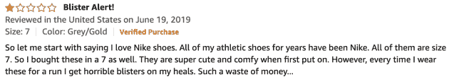
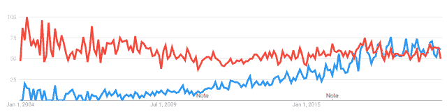
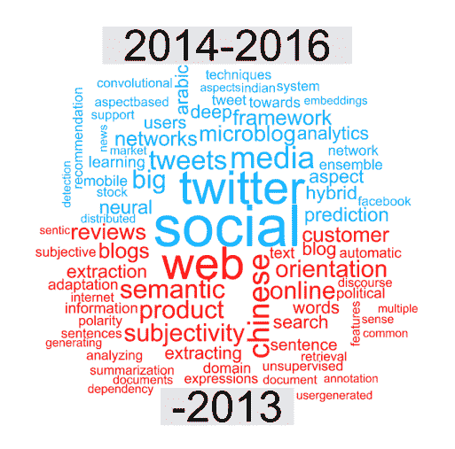

# 什么是情感分析，如何使用？

> 原文：<https://towardsdatascience.com/what-is-sentiment-analysis-and-how-is-it-used-217074887277?source=collection_archive---------35----------------------->

## 我们将了解什么是情感分析，它来自哪里，以及它能为我们做什么。让我们开始吧！

图片来自 [Pixabay](https://pixabay.com/?utm_source=link-attribution&utm_medium=referral&utm_campaign=image&utm_content=2301579) 的[科琳·奥戴尔](https://pixabay.com/users/StarGlade-768093/?utm_source=link-attribution&utm_medium=referral&utm_campaign=image&utm_content=2301579)

你最后一次坐飞机是什么时候？你还记得吗？

也许你坐在一个哭闹的婴儿旁边…或者你得到了免费的升级，享受了更多的腿部空间。

可能是空乘把咖啡洒到你身上了……也可能是他们很讨人喜欢，让你觉得很自在。

或者你甚至不记得你的最后一次飞行，因为没有什么值得纪念的事情发生——这可能是一件好事！

照片由 [Unsplash](https://unsplash.com/s/photos/flight-attendant?utm_source=unsplash&utm_medium=referral&utm_content=creditCopyText) 上的 [NeONBRAND](https://unsplash.com/@neonbrand?utm_source=unsplash&utm_medium=referral&utm_content=creditCopyText) 拍摄

# 作为“客户之声”的调查

不管你的经历如何，你都可能会收到航空公司发出的调查问卷。他们想知道从你的角度来看这次飞行怎么样。

一些调查问题可能会要求您从 1 到 10 对服务进行评分，如空乘人员的帮助程度，或浴室的清洁程度。

他们可能还会问一些开放式的问题— *“告诉我们你的经历以及我们可以改进的地方。”*

再来看*美联航*的例子。根据他们最近的情况介绍，联合航空公司去年有 1 . 62 亿乘客。

如果我们可以假设他们的营销部门随机向每 30 个人发出一份调查，得到的回复率为 5%，那么:

1.62 亿乘客/30 = 540 万被调查乘客 x 5% = **每年 27 万份调查反馈**

数据真多啊！这是一个电子表格中的 270，000 个单元格，用自由文本回答了联合航空公司可以做些什么来改善他们的服务。

这些数据中包含的观点对管理层来说非常有价值，有助于他们找出让乘客更快乐的方法。

不幸的是，对许多公司来说，下一步就是让一屋子实习生分头搜索电子表格。或者更糟的是，电子表格被推到一个黑暗的角落里，再也看不到了。

然而，为了拯救实习生的理智和等待被揭示的洞察力，我们可以利用**情绪分析的迷人方法。**

# 简短的定义

*情绪*简单地描述了对某事的**观点**——无论是你在新闻中读到的事件，你从亚马逊上买的书，还是当你的狗在地毯上弄得一塌糊涂后你对它的感觉。

我们或许可以把这种做法叫做**意见分析**，但这听起来并不容易记住，不是吗？

# 观点的反复无常

观点可能转瞬即逝，千变万化。你的宠物前一分钟还是一只毁坏地毯的野兽，下一分钟就变成了一个可爱的能量球。

在我们的航空公司的例子中，在任何给定的航班上，可能有数百种意见分散在乘客中。

为了解决大众分散的观点，自然语言从业者已经改进了*情感分析*来从无组织的和难以置信的多样化的观点数据中获取意义。

# 情感分析对我们有什么用？

情感分析可以用各种方式标记我们的数据，使我们更容易从杂乱的非结构化数据中获得洞察力。

## 极性

第一个也是最常用的度量是*极性*。

*极性*简单来说就是指语言是阳性、阴性还是中性。很多情感分析都是将文本浓缩成一个数字——比方说，在-10 到+10 之间，表示一个陈述的极性。

图片来自 [Pixabay](https://pixabay.com/?utm_source=link-attribution&utm_medium=referral&utm_campaign=image&utm_content=833421) 的[约翰·海恩](https://pixabay.com/users/johnhain-352999/?utm_source=link-attribution&utm_medium=referral&utm_campaign=image&utm_content=833421)

当*“这些花生是咸的”*可能记录为 0(中性)，我们可能期望*“这些奇妙的花生拯救了我的婚姻”*可能记录为+10(正极)。

同时，“*这些馊花生真恶心”*引出 a -8(负极性)。

## 主观性/客观性

情感分析也可以将文本标注为*主观*或*客观。*

主观文本意味着有观点的文本——不一定是可证明的或基于事实的。关于胡萝卜蛋糕好坏的观点就属于这一类。

另一方面，客观性涵盖了不受个人观点影响的基于事实的语言，比如“胡萝卜蛋糕里有胡萝卜”。

在分析客户反馈或评论时，过滤主观性尤其有用。我们不关心飞机*起飞*，我们想知道起飞*是怎么起飞的*。

## 基于特征的分析

最后是基于*特征的*情感分析。考虑以下产品评论:

注意这篇文章中有一些矛盾的观点。如果我们试图把极性作为一个整体来总结，我们可能会得出一个相当中性的结论。

然而，当我们将文本分解成它的*特征*，我们可以更清楚、更有用地了解这个客户喜欢什么、不喜欢什么。

*基于特征的*(或*基于方面的*)情感分析关注于发现谁是意见持有人，被评估的对象是什么，以及实际的意见是什么。

在上面的例子中，这个方法或许可以挑出这个**顾客**喜爱**耐克** **品牌**，并且认为这些**鞋子**可爱舒适。然而，系统也看到**可怕的水泡**和**浪费金钱**是与鞋子相关的负面因素。

通过打破这些特征，我们可能更有可能预测一星评论。我们甚至可以推荐其他可爱舒适的耐克鞋，其中“*无*水泡”是我们从评论中提取的特征。

# 情感分析从何而来？

鉴于意见的分散性，以及书面语言的普遍混乱，我们应该向那些最先开始试图理解混乱的勇敢者致敬。

一项关于情感分析历史应用的研究表明，99%的情感分析论文都是在 2004 年之后发表的。这在很大程度上是由于计算能力的提高。

上图来自谷歌趋势，显示了自 2004 年以来的搜索量。红色是*客户反馈*，蓝色是*情绪分析*。

当*客户反馈*作为一个重要话题一直享有突出地位的时候，*情绪分析*已经迅速赶上甚至超过了它。

这项研究的一些有趣的历史发现揭示了使用情感分析的一些最初尝试:

*   第一篇论文是 1940 年的，作者试图用手工*“划掉技术”*——计算极性关键词的数量来衡量不同主题的公众意见。
*   1945 年和 1947 年，两位作者试图衡量二战期间遭受苦难的国家的公众舆论。

## 情感分析的现代方法

概括地说，现代情感分析在 21 世纪初占据了主导地位。第一个跨领域应用于许多问题的通用工具之一被称为“ [General Inquirer](https://mitpress.mit.edu/books/general-inquirer) ”。该工具最初是在 20 世纪 90 年代由美国资助开发的，并在 2002 年左右广泛应用于学术研究。

《普通问询者》是一套手工编码技术，包括将单词映射到各种类别。最大的一类是*负面*(有类似*可怕*、*可怕*、*骇人*等词汇。).

进一步进入 2010 年，上面引用的研究显示了从情感分析论文形成的词云。下半部分代表 2013 年之前的关键词，上半部分代表 2013 年以来的关键词:

情感分析的一个重大变化

从“网络”到“社交”有一个明显的转变，并转向像神经网络这样的深度学习技术。这些最先进的模型把我们带到了今天。

# 基于知识与统计的情感分析

一些早期的尝试，包括*普通问询者*，使用了“基于知识”的技术，如创建一个自定义的硬编码单词字典，具有“明确的影响”。

换句话说，这些技术关注的是很少具有双重含义的单词。这些词几乎总是表示*好的*或*坏的*，像“开心”、“伤心”、“害怕”、“无聊”。你也可以看到这些被称为*基于词汇的方法*。

基于知识的技术的一个缺点是，根据数据集的上下文，一般的基于知识的字典可能会遗漏重要的单词。

例如，一篇关于癌症的文章可能会谈到“不可阻挡的增长”。在这种背景下，这是**不好。**

图片来自 [Pixabay](https://pixabay.com/?utm_source=link-attribution&utm_medium=referral&utm_campaign=image&utm_content=534103) 的[erikawittleb](https://pixabay.com/users/ErikaWittlieb-427626/?utm_source=link-attribution&utm_medium=referral&utm_campaign=image&utm_content=534103)

但是在一篇关于创业的文章中，“不可阻挡的增长”被认为是好的。

为了使用基于知识的方法获得每种类型数据的高度准确的结果，您可能需要定制硬编码的字典。这可能是时间密集型的。

有一些基于知识的技术方法尝试自动查找特定于上下文的关键字。一个例子依赖于像“*和*或者“*但是”*这样的连词。

假设我们看到一句关于*“病人恶化* ***和*** *不可阻挡的增长”*的话。因为*恶化*在负面字典中找到，我们可以推断*不可阻挡的增长*也是负面的。

单词的这种接近性(这也暗示了它们是如何相关的)也被称为*共现*。

## 统计法

基于知识的技术与后来更复杂的“统计”技术和机器学习方法形成对比。这些方法更依赖于通过大量文本获得的推理。

如果可以手动从文本中找出共现，或者可以使用基于规则的自动方法进行推断，那么可以以更加自动化的方式利用*统计*方法，该方法可以扩展到数十亿个数据点。

通过这种统计方法，我们使用大量数据相对快速地对共现做出推断。

如果一个单词经常出现在极性为正的单词中，我们也给这个单词分配一个正极性。否定词也一样。

我们不断迭代和训练大量的文本——比如维基百科中的所有文章。最终，结果是英语中大多数单词的权重，然后我们可以用它来预测新文本的情感。

请注意，这也适用于特定于上下文的自然语言。在我们早期的医学文本示例中，我们将仅在医学文献的语料库上训练我们的模型，以捕捉特定于主题的关键词的极性。

# 用于情感分析的深度学习

大部分统计方法仍然依赖于单个单词的意思——为给定文本的情感保留一种记分牌。

但是我们也必须考虑单词之间的相互作用。当考虑较长短语或句子中许多单词的含义时，语义分析模型更加准确。当然，这意味着我们必须训练更复杂的模型，这些模型使用更多的计算资源，运行时间更长。

图片来自 [Pixabay](https://pixabay.com/?utm_source=link-attribution&utm_medium=referral&utm_campaign=image&utm_content=2202381) 的

***“一个*** ***的朋友*** *告诉我我会喜欢这种三明治。*

***即使*** *我平时爱吃好的花生酱，这里用的那种不够奶油。*

*果冻是好的* ***但是*** *就是不够。”*

这篇 PB&J 评论传递了许多含混不清的信号。如果我们只关注单词本身，而不关注使用它们的短语，我们会给它分配一个相对积极的极性。例如，有很多“爱”和“好”。

虽然对神经网络的深入探讨超出了本讨论的范围，但重要的是要知道，这些模型可以保存和权衡关于文本的数百万个特征，以便最终提供对极性的预测。

例如，经过训练的神经网络可以逐句逐句地分析文本。

如果在句子的前面使用了“即使”,该模型可能会对句子的其余部分不考虑积极情绪。同样，“不错，但是”可能会打折扣，“喜欢这个三明治”可能会正确地归因于顾客的朋友，而不是顾客自己。

# 继续练习

做得好！如果你已经做到了这一步，你已经很好地理解了什么是*情绪分析*以及它如何在幕后工作以提取极其有价值的见解。

图片来自 [WikimediaImages](https://pixabay.com/users/WikimediaImages-1185597/?utm_source=link-attribution&utm_medium=referral&utm_campaign=image&utm_content=2202381) 来自 [Pixabay](https://pixabay.com/?utm_source=link-attribution&utm_medium=referral&utm_campaign=image&utm_content=2202381)

不用说，NLP 正在迅速发展和变化——情感分析也是如此。在我发表这篇文章的时候，可能会有另一个方法论上的突破，允许更高的准确性。

同时，如果你有兴趣学习更多关于情感分析的知识，你可以做的最好的事情之一就是开始探索和实践。想出一个你认为可以用我们上面描述的方法解决的问题，然后开始编码！

**感谢您阅读**。