# 你知道什么是香农熵吗？

> 原文：<https://towardsdatascience.com/what-is-shannons-entropy-5ad1b5a83ce1?source=collection_archive---------12----------------------->

## 完整全面的指南

来自 [Pexels](https://www.pexels.com/photo/person-about-to-catch-four-dices-1111597/?utm_content=attributionCopyText&utm_medium=referral&utm_source=pexels) 的[摄影记者拍摄的](https://www.pexels.com/@fotografierende?utm_content=attributionCopyText&utm_medium=referral&utm_source=pexels)

熵构成了宇宙和宇宙中一切事物的基础*。为什么深度学习应该有所不同？它在信息论中被高度使用(这里使用的熵的变体是*香农熵*)，并且也已经进入深度学习(*交叉熵损失*和 *KL 散度*)。让我们来理解一下香农熵的概念。*

# 熵是什么？

通俗地说，你把熵描述为:

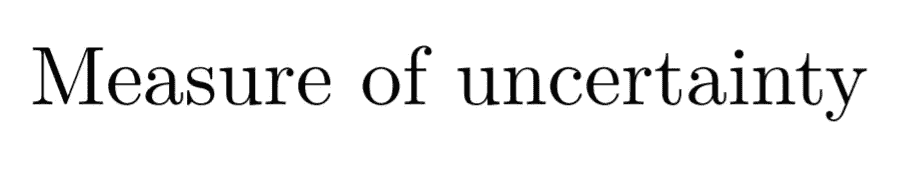

你得到的最基本的例子是**一枚公平的硬币:**当你扔它的时候，你会得到什么？**正面** (1)或**反面** (0)。

因为两个事件的概率是一样的(1/2)。没办法讲。所以，如果你在电话上玩抛硬币游戏。然后，你必须告诉对方一个结果，或者你需要一个比特(0 或 1)来传达这个信息。

**让我们考虑一个完全偏向硬币的情况(总是正面朝上):**

你需要告诉其他人结果吗？简单的答案是**不**。因为你们两个都知道答案(如果你没有作弊的话😄).因此，你什么也不用说。你一点也没用。

# 直观地消化熵

为了直观地理解熵，让我们再次重温它的定义:

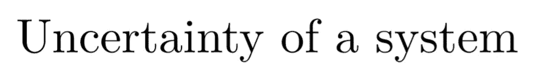

它的数学定义是:

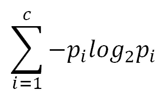

来源:作者

有一件中肯的事要注意，这个词**‘系统’**在外行人的定义和概率术语中出现两次虽然不同。

让我们重温一下概率的定义。概率是什么？事件发生的可能性。概率的定义讲的是单个事件，不是整个系统。因此，概率能给我们的是局部的图景，是整个系统的有限图景。

> 概率给出了整个系统的局部图像

为了让我们对整个系统有所了解，我们需要想出一种方法来告诉我们整个系统的全局情况。我们需要评估系统的各个部分，看看它们的总体效果。

你如何评价系统的一部分对系统的随机性的贡献？

熵公式中的 **pᵢ部分告诉我们关于**事件在整个系统**中的重要性。怎么会？概率值的分子告诉事件发生的次数，就是这样。**

对于下一部分，让我们从一个新的角度来看熵的公式:

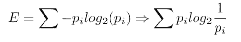

来源:作者

**我们可以将熵公式的第二部分转化为概率的倒数。**这会给我们带来什么？如果概率告诉你确定性，它的反义词意味着什么？**不确定性。**

因此，熵的公式可以解释为:

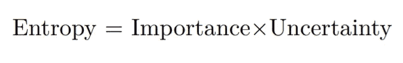

这就是，熵可以被解释为一个事件的重要性和这个事件的不确定性的乘积。系统中的事件越重要，它可以引入系统的不确定性(即随机性)就越多。因此，如果我们推导出每个事件的随机性并将其相加，我们就可以理解整个系统的随机性。

# 数学上消化熵

香农熵的数学公式是:

来源:作者

这里，c 是你拥有的不同类的数量。以硬币为例，我们有正面(1)或反面(0)。因此，c = 2。

所以，一枚公平硬币的熵是:

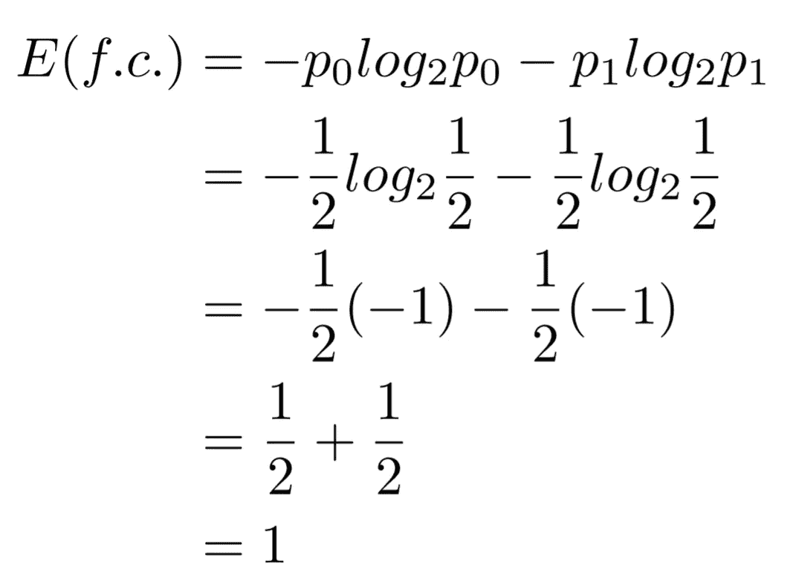

来源:作者

因此，公平硬币情况下的**熵为 1** 。完全不确定性(记住，熵的外行定义)。我们对结果完全没有把握。

现在，让我们考虑一下**完全偏向硬币**的情况。对它来说，熵就是:

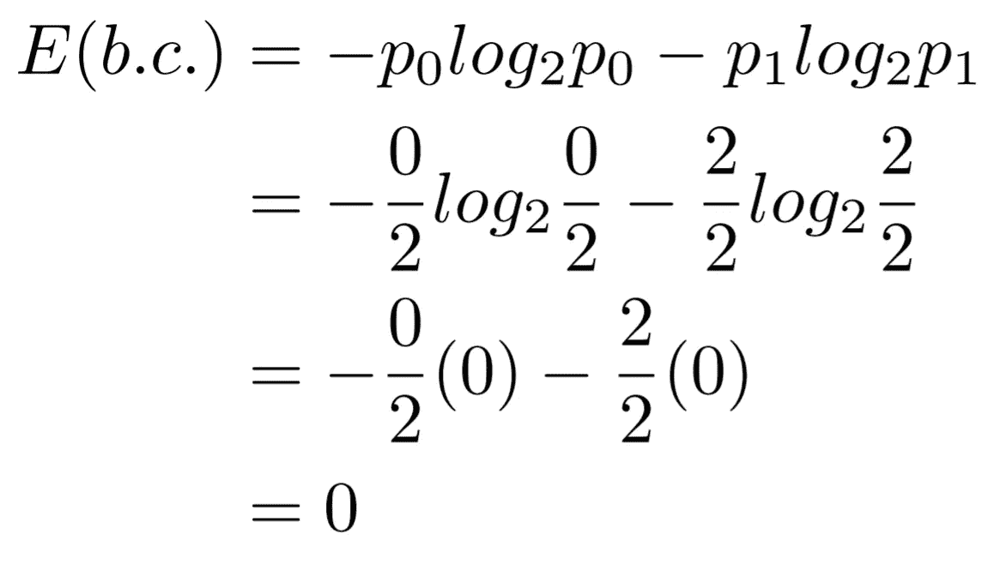

来源:作者

首先，*所有关于熵的计算中的 0log(0)都假设为 0* 。现在，我们已经平息了，在这种情况下可以观察到，熵是 0。无论如何，我们对结果完全有把握。

# 硬币没有完全偏向的时候呢？

让我们画出得到人头的概率在 0 和 1 之间时的合成熵。

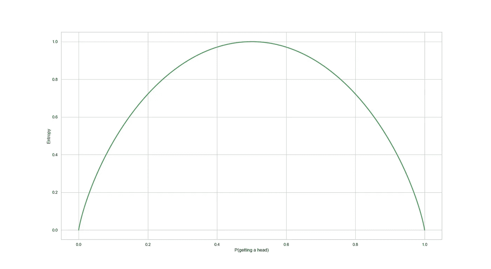

来源:作者

我们看到**熵在概率 1/2** 时变得最大。

一般情况下，*任何系统的熵的最大值都是 log₂c* 。这发生在概率为 1/2 的时候。**为什么？**

对此有两种解释。让我们看看。

## 直观解释:

因此，在硬币的情况下，最大熵将是 log₂2 = 1 比特。

当一切都是同等可能性(概率为 1/2)时，熵最高，因为你不知道会发生什么。

为了表达硬币可以采取的所有状态，即 0 或 1，你需要 1 位。

## **数学解释:**

如果不感兴趣，可以跳过这个。

记住如何找到给定函数值最大的值。

如果没有，我们修改一下:

**第一步**:对函数进行*求导，并使其等于零，得到的值将是该函数的最小值或最大值。如何知道找到的值是最小值还是最大值？*

**第二步**:你对函数取*的双导数，然后代入上一步得到的值。如果二阶导数的值小于 0，那么，该值将是函数的最大值，如果它大于 0，那么，该值将是函数的最小值。*

现在，让我们把这个过程应用于香农熵的公式。

香农熵的导数是:

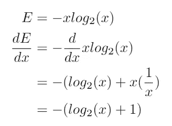

来源:作者

将导数等于 0，

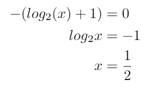

来源:作者

最后一步，我们把两边都提高到 2 的幂，2 的幂 log₂x 就是 x

现在，让我们验证该值是最大值还是最小值。首先，我们找到熵的二阶导数:

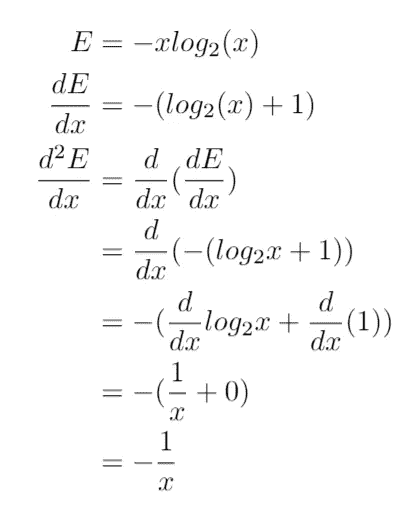

来源:作者

现在，我们把导数等于 0 的值代入这个二重导数，

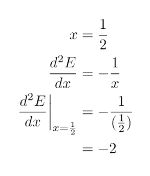

来源:作者

最后，我们得到的双导数的值是负的，因此，证实了熵的最大值是在概率 1/2 处。

因此，我们证明熵的最大值出现在概率 1/2 处。

# 摘要

在这篇文章中，我们从数学和直觉上理解了香农熵。我们知道香农熵的数学界限是什么。我们还导出了香农熵最大的概率。然后我们直观地理解了熵的概念。