# 什么是辛普森悖论？

> 原文：<https://towardsdatascience.com/what-is-simpsons-paradox-4a53cd4e9ee2?source=collection_archive---------18----------------------->

## 和第二波冠状病毒病例有什么关系？

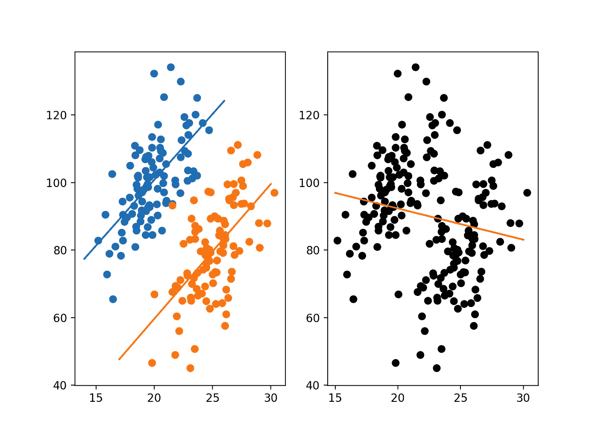

从未经汇总的数据中得出结论的危险

最近几周，人们越来越怀疑病例数上升和新冠肺炎死亡人数稳定或下降之间的差异。有几个[解释](https://medium.com/the-atlantic/covid-19-cases-are-rising-so-why-are-deaths-flatlining-3d801eb78871)流传着。首先，由于显而易见的原因，死亡是一个滞后指标。死亡高峰通常在病例高峰后约一个月出现。

然而，我们可能要考虑到我们一开始就看错了这些数字。美国是一个大国，怀俄明州发生的事情与德克萨斯州奥斯汀发生的事情没有什么联系。我们看的是整个国家的数字，为了获得准确的画面，我们需要深入到各个州、地区或城市，以更好地了解不同社区的情况。不幸的是，这些数据讲述了一个不同的故事。

# 输入:辛普森悖论

辛普森悖论(Simpson's Paradox)是指一种趋势出现在几组不同的数据中，但当这些组组合在一起时就消失或逆转的现象。

为了说明这一点，我[创建了](https://github.com/timcopelandoh/Medium/blob/master/simp_sim.py)一些模拟数据，其中有两组数据，它们都显示出 X 和 Y 之间的正相关性(引入了随机性，但在这两种情况下，X 每增加一个单位，Y 就增加 4 个单位)。

用模拟数据说明辛普森悖论【来源:原创】

单独考虑每一组时，两组的最佳拟合线都明显向上倾斜。但是，当您将这些组放在一起时，参数估计值会变为负值。

一个著名的现实世界的例子是伯克利性别偏见研究。在 1975 年《T4 科学》杂志的一篇文章中，研究人员观察到了柏克莱大学研究生院男女录取率的巨大差异。

男性和女性的总体入学率[来源:[维基百科](https://en.wikipedia.org/wiki/Simpson%27s_paradox)

从表面上看，这可能意味着学校可能存在性别歧视。然而，当研究人员深入挖掘 85 个不同部门的数据时，他们发现了一个不同的故事。

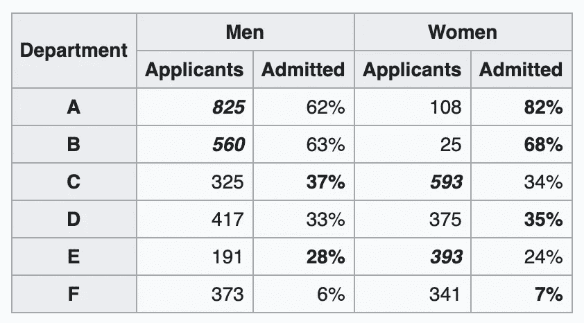

6 个最大部门的部门准入率[来源:[维基百科](https://en.wikipedia.org/wiki/Simpson%27s_paradox)

在特定的院系中，研究人员只发现了少数几个男生比女生更有可能被录取的院系(反之亦然)。然而，更重要的趋势是，妇女更有可能申请最具选择性的部门。由于选择部门的申请人中女性所占的比例比男性大，所以他们在接受率上似乎有很大的差异，即使个别部门没有发现男性比女性更受青睐。

# 国家新冠肺炎数据

如果你看看美国的全国趋势，死亡人数的下降趋势是显而易见的，即使在过去一个月里病例有所增加。

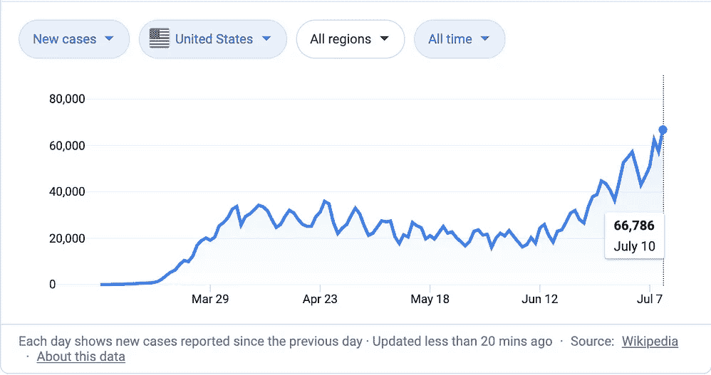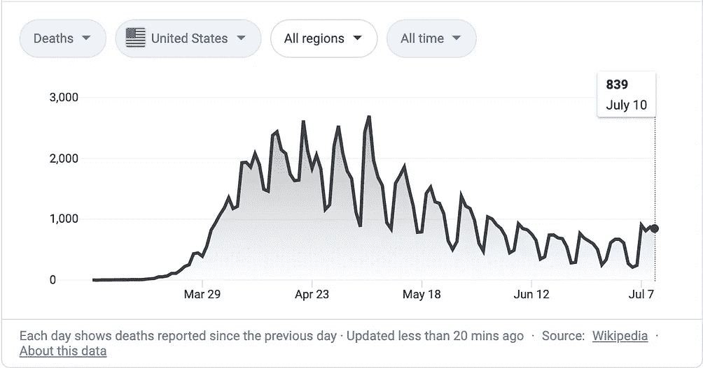

美国新冠肺炎确诊病例和死亡病例

然而，肯定有一些州的数据不符合这一趋势。例如，在亚利桑那州，从 6 月初开始病例激增，6 月底和 7 月死亡人数明显增加。

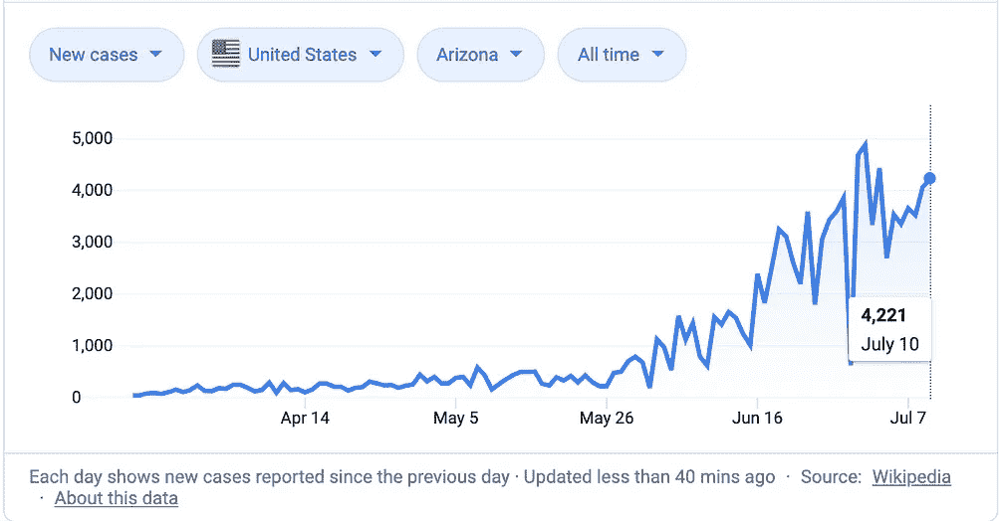

亚利桑那州新冠肺炎确诊病例和死亡病例

在佛罗里达州，死亡人数从 4 月到 6 月保持稳定(而全国范围内，死亡人数正在下降)，最近 7 月 9 日和 10 日是疫情最糟糕的两天。

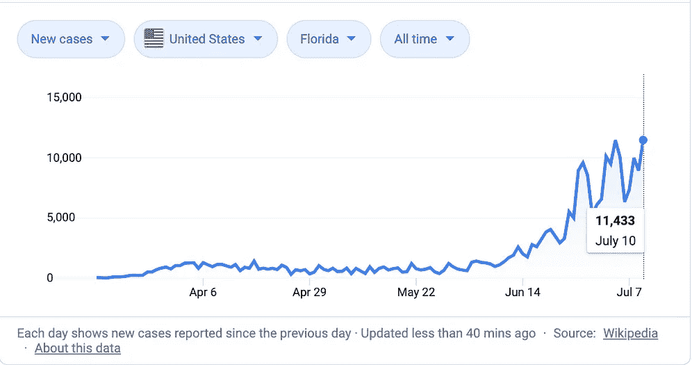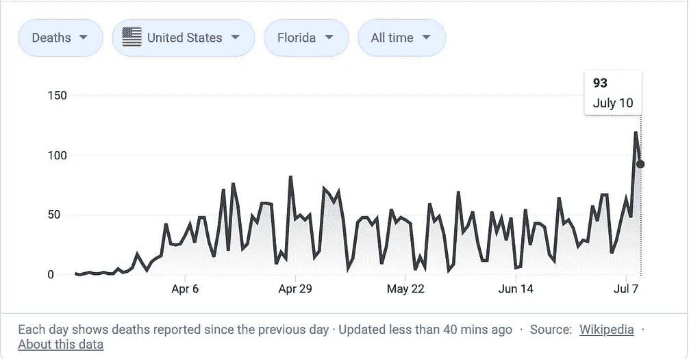

佛罗里达州新冠肺炎确诊病例和死亡病例

同样，德克萨斯州在 6 月份开始经历病例增加，现在可能也开始看到死亡人数增加。

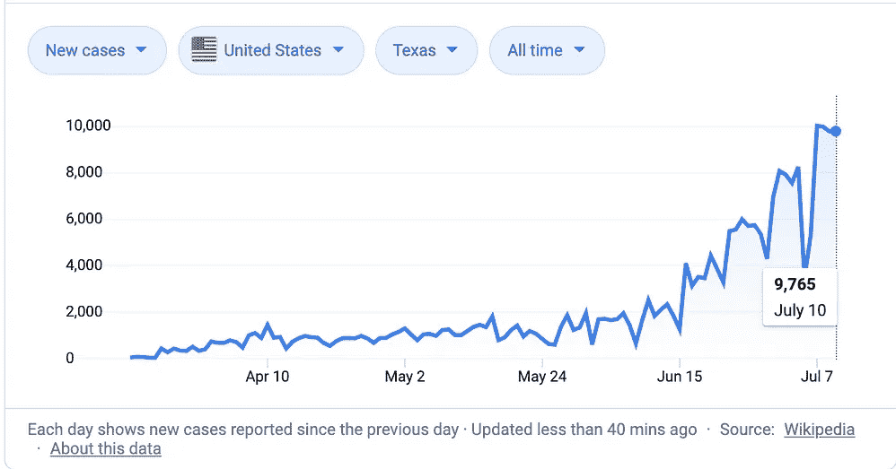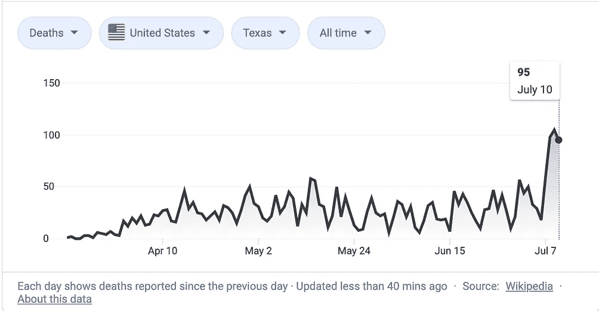

得克萨斯州新冠肺炎确诊病例和死亡病例

# 为什么这没有在国家数据中显示出来？

如果在多个州有稳定或上升的趋势，为什么我们仍然看到全国范围内的死亡率稳步下降？

还记得伯克利性别偏见的例子吗？大多数项目都同样或更频繁地接纳妇女。然而，更多的女性申请人申请了最具选择性的项目，导致她们的人数在汇总时看起来更糟。

以纽约为例。虽然它是第一波死亡人数中受灾最严重的城市之一，但它也恰好是该国人口最多的城市之一。

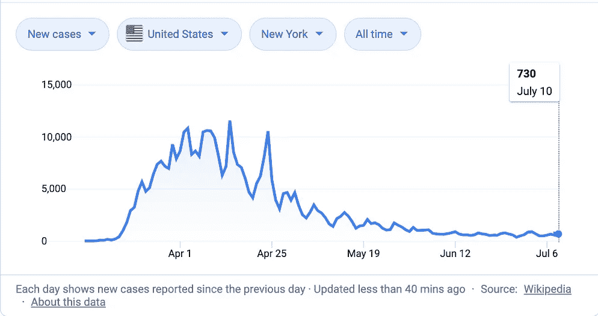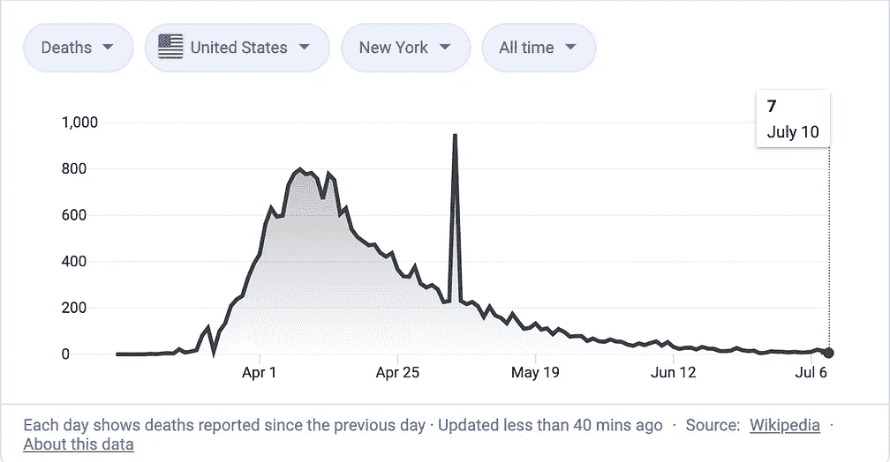

纽约州新冠肺炎确诊病例和死亡病例

在 4 月份的几个星期里，纽约州(主要在纽约市)每天的死亡人数稳定在 800 人左右，但现在平均每天超过 10 人。

纽约在控制疫情方面所做的努力当然应该受到称赞。然而，当查看我们的国家数据时，我们应该记住，这个国家人口最多的城市每天减少约 800 例死亡。不幸的是，虽然最近几周 COVID 死亡人数肯定会激增，但提到的 3 个州中没有一个在一天内死亡人数超过 150 人。纽约和其他在 4 月份遭受重创的州下降了 800 点，足以让我们在较小的州开始看到的任何飙升相形见绌。

当分析 COVID 数据或任何组间存在较大差异的数据时，要小心不适当的合并。虽然我很愿意相信全国范围内死亡人数下降所隐含的故事，但再看一下各个州就会发现，这可能过于乐观了。

# 参考

[1]辛普森悖论。[https://en.wikipedia.org/wiki/Simpson%27s_paradox](https://en.wikipedia.org/wiki/Simpson%27s_paradox)

[2]研究生入学中的性别偏见:来自伯克利的数据。[https://home page . stat . ui OWA . edu/~ MBO gnar/1030/比克尔-柏克莱. pdf](https://homepage.stat.uiowa.edu/~mbognar/1030/Bickel-Berkeley.pdf)

[3]新冠肺炎·疫情数据/美国各州医疗案例。[https://en . Wikipedia . org/wiki/Template:新冠肺炎 _ 疫情 _ 数据/美国 _ 医疗 _ 病例 _ 按州](https://en.wikipedia.org/wiki/Template:COVID-19_pandemic_data/United_States_medical_cases_by_state)