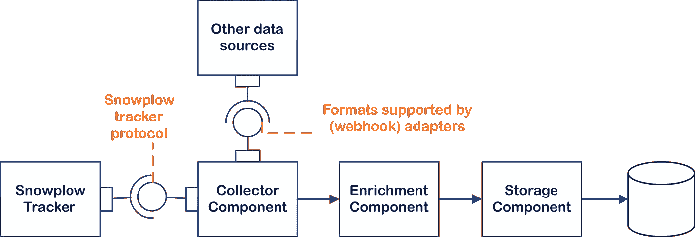
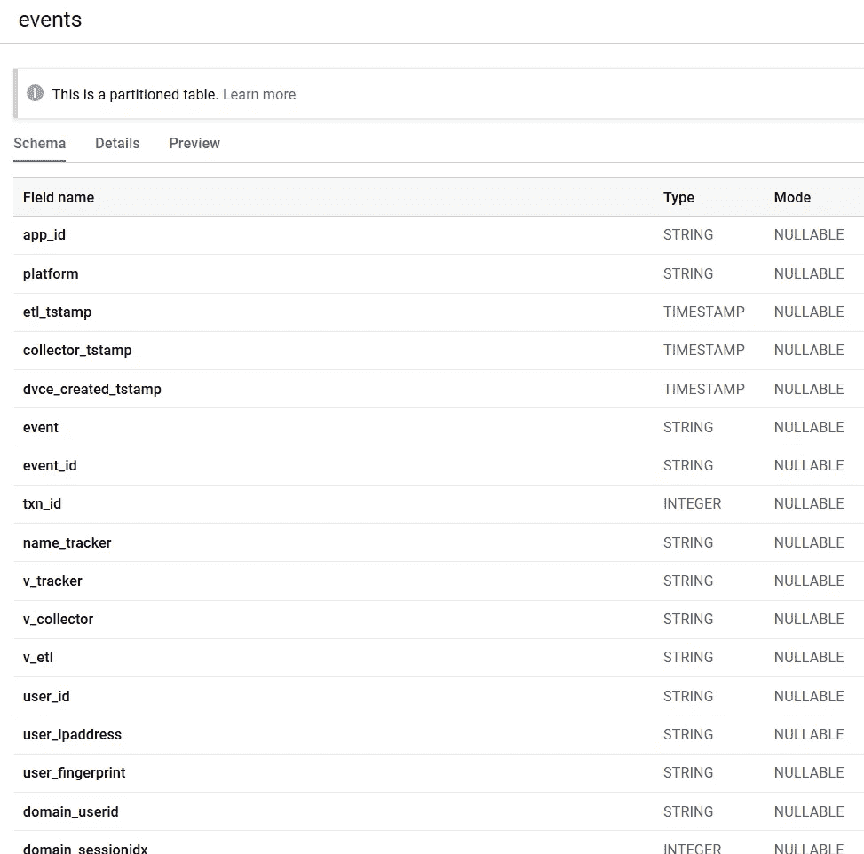
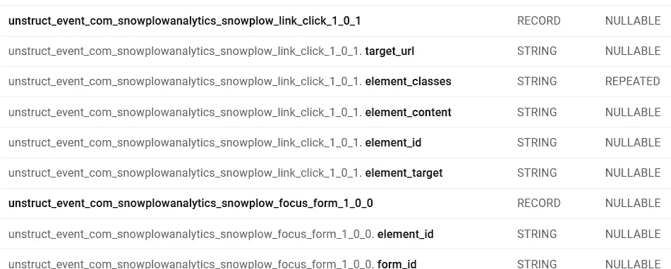
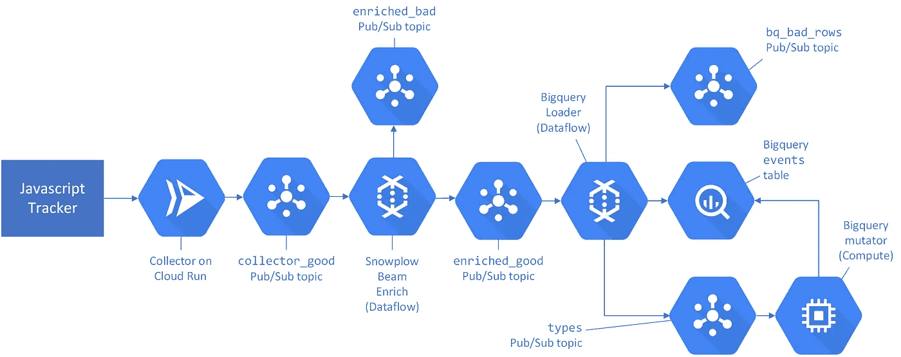

# 扫雪机简介

> 原文：<https://towardsdatascience.com/what-is-snowplow-and-do-i-need-it-cbe30fcb302b?source=collection_archive---------6----------------------->

## Snowplow 自称是“同类最佳数据收集平台”。我们探索这意味着什么，讨论扫雪机做什么和不做什么。了解 Snowplow 的架构，以及它是否是您需要的工具。

图片来自 [Pixabay](https://pixabay.com/photos/snowplow-road-truck-night-weather-1168278/) 的 [skeeze](https://pixabay.com/users/skeeze-272447)

这里有一个常见的场景:你运行一个网站，想知道你的用户如何使用它。你调查谷歌分析 360。您想为您的企业提供更好地了解客户所需的工具吗？你当然知道！对原始事件数据的访问，基于所有信息而非一小部分信息的见解？听起来不错！当您准备注册时，您注意到了 Analytic 的价格标签—起价为 15 万美元/年。大口喝。现在怎么办？当然，并不是所有的企业都能证明如此惊人的高价是合理的。

经常出现的谷歌分析的替代品是 Snowplow。Snowplow 是由 Snowplow Analytics 积极开发的一个**数据收集平台**。Snowplow 可以“收集”多种遥测数据，但它在点击流数据方面有着特殊的地位，提供了许多与开箱即用的网络跟踪相关的功能。

Snowplow Analytics 以各种形式提供其平台，包括一项名为 Snowplow Insights 的托管服务。它的所有核心组件都是**开源的**，可以以一种自己构建、自我管理的方式**免费**使用。您可以在公共云中运行自己的生产就绪、可扩展的实时数据接收管道，每月花费大约 200 美元。较小的部署或开发部署也是可能的(使用 Snowplow Mini ),每月大约 40 美元。

> Snowplow 可以“收集”各种各样的遥测数据，但它在点击流事件中有一个特殊的位置

当然，Snowplow 和 Google Analytics 这么简单的基于价格的比较是没有用的。这些产品之间的重叠部分实际上非常小。作为一个刚刚将 Snowplow 部署到 Google Cloud 的人，我知道我花了一段时间才弄清楚 Snowplow 是否满足了我们的需求。这个故事向你介绍了什么是扫雪机，以及它是否对你有用。

与其他帖子相比，如媒体系列的 [Snowplow，这个故事通过深入研究其架构和部署，而不是专注于其追踪器生成的数据的价值，来强调 Snowplow *实际上做了什么。对这个架构有了很好的理解，你就可以自己拿主意，决定扫雪机是否也应该成为*你的*数据分析工作的一部分！*](https://snowplowanalytics.com/blog/2019/05/29/snowplow-for-media-part-1/)

# 数据收集平台

一个*数据采集平台*到底是什么？在其核心，Snowplow 由一个**处理管道**组成，该管道通过对 HTTP 端点的调用来捕获、清理、丰富和保存所有呈现给它的信息。GET 和 POST 请求进入管道，然后输出 blob 存储或可查询数据库中的结构化数据。Snowplow 还附带了许多实用程序，如 JavaScript web tracker**和 tracking SDK**和**将生成这些 HTTP 调用，以响应用户在您的网站或应用程序中采取的操作，例如响应页面浏览或页面点击。**

> HTTP 请求进入管道，输出可查询的结构化数据

记住:平台≠平台，管道≠管道

## 扫雪机做什么

Snowplow 最初是一个网络分析平台，仅支持使用他们的网络追踪器和自己的追踪器协议进行追踪。现在，它的目标是成为您所有活动数据收集工作的一站式商店。想要将订阅事件捕获到 MailChimp 支持的邮件列表中吗？扫雪机覆盖了吗！捕获您自己的应用程序生成的自定义事件？那也没问题！当你想到所有你可能得到的物联网(IoT)数据时，网站跟踪似乎很无聊。Snowplow 允许你[定义和使用自定义事件模式](https://github.com/snowplow/iglu/wiki/Common-architecture)。它接受来自任何地方的数据，同时提供对它收集的每一位原始数据的直接访问。Snowplow 每秒钟可以轻松收集数千个事件。

收集邮票是*出*，收集数据是*入*。[来源](https://www.flickr.com/photos/smithsonianlibraries/4295567181)

## 扫雪机不做的事

然而，从这些原始的结构化数据中获得“洞察力”需要你付出一些努力。Snowplow 很少处理它为您接收的数据，如果您希望它为您提供易于理解的图表或有启发性的统计数据，您可能会失望。开源 Snowplow 的一个基本安装收集数据非常好，但是除了以结构化格式收集、清理和保存数据之外，几乎没有做什么。

外出时，不要忘记储备大灯液体。[来源](https://elbowgreasecleans.com)

扫雪机[没有 GUI](https://github.com/snowplow/snowplow/wiki/Developer-FAQ#gui) 。在收集点击流数据时，它只是为你提供原子事件，如页面点击、页面查看或页面 ping 事件；没有“用户流量”或类似滚动深度的衍生统计数据。知道 Snowplow 不仅限于获取点击流数据是有意义的。因此，Snowplow 也不是 Google Analytics 的真正替代品。事实上，并行运行 Snowplow 和 Google Analytics 完全有意义！

> Snowplow 不是 Google Analytics 的真正替代品

你也不会完全放任自流。Snowplow 确实有一些分析软件开发工具包，可以帮助你分析它生成的数据。还有一个 [Snowplow web 数据模型项目](https://github.com/snowplow/snowplow-web-data-model)，通过将原子跟踪事件分组到浏览会话中，专门帮助分析点击流数据。

# 扫雪机的加工流水线

因此，Snowplow 收集所有类型的事件数据，对它们进行处理，然后通过让数据流经“管道”来保存它们。让我们把这个过程变得更具体一些。Snowplow 处理管道如下所示:

扫雪机加工流水线。

本节讨论数据如何在管道中流动，以及什么接口连接管道的不同组件。

## 收集器组件

由 Snowplow tracker(例如[snow plow JavaScript tracker](https://github.com/snowplow/snowplow-javascript-tracker))、web hook 或来自 Snowplow tracker SDKs 之一的调用产生的数据命中**收集器组件**。收集器是一个对 HTTP 请求开放的基本 web 服务器，它编码并在消息总线上发布所有传入的数据。如果请求不包含标识用户的 cookie，它还会将随机生成的 cookie 嵌入到`Set-Cookie` HTTP 响应头中。

## 浓缩成分

**富集组件**是实现 [Snowplow 富集过程](https://github.com/snowplow/snowplow/wiki/The-Enrichment-Process)的该消息总线的订户。在这个过程中，Snowplow 验证输入的数据，验证它是在它理解的协议中指定的。然后，它提取事件属性并丰富事件。在丰富过程结束时，事件遵循 [Snowplow 规范事件模型](https://github.com/snowplow/snowplow/wiki/Canonical-event-model)。丰富的事件发布在另一条消息总线上。

浓缩组件无疑是 Snowplow 最复杂和有趣的部分。如果你想了解更多，可以看看我的后续报道:

 [## 扫雪机中的富集和批处理

### 细看 Snowplow 的浓缩组件及其批处理管道的弃用

medium.com](https://medium.com/datamindedbe/enrichment-and-batch-processing-in-snowplow-6b5258096c9b) 

## 存储组件

**存储组件**订阅浓缩组件发布的消息总线。它将消息保存在 blob 存储或可查询的数据存储中，如 BigQuery 或 Redshift。如果目标存储是一个(结构化)数据库，事件属性将映射到列上。

## 组件实现

组件有**多个兼容的实现**，允许你使用那些最适合你需求的。一些实现使用特定于特定公共云的云原生技术，例如存储组件 [Snowplow BigQuery Loader](https://github.com/snowplow-incubator/snowplow-bigquery-loader) 与 GCP 上的 [BigQuery](https://cloud.google.com/bigquery) 接口，并在[云数据流](https://cloud.google.com/dataflow)上运行。其他的构建在开源技术上，可以很容易地部署在你自己的硬件上，比如运行在 JVM 上的 [Scala 流收集器](https://github.com/snowplow/snowplow/wiki/Scala-Stream-Collector)，它不仅可以向 [AWS Kinesis](https://aws.amazon.com/kinesis/) 或 [Cloud Pub/Sub](https://cloud.google.com/pubsub/) 推送消息，还可以向 [Apache Kafka](https://kafka.apache.org/) 推送消息。

## 组件接口

用于组件间通信的消息看起来像什么？

*   *收集器接口*可以说是最重要的一个，因为它是面向外的。收集器接受所有的 **HTTP 请求**，但是只有实现了已知协议的请求**才能通过浓缩完成。这些是由 [Snowplow tracker 协议](https://github.com/snowplow/snowplow/wiki/snowplow-tracker-protocol)描述的格式，Snowplow 提供的收集器适配器或 [*任何*格式本机支持的格式之一，您为其实现了自己的远程 HTTP 适配器](https://snowplowanalytics.com/blog/2019/05/20/snowplow-r114-polonnaruwa-enrichments/#remoteAdapter)。其中，Snowplow 为 Google Analytics 使用的[自描述 JSON](https://github.com/snowplow/iglu/wiki/Self-describing-JSON-Schemas) 和 Google 的[测量协议](https://developers.google.com/analytics/devguides/collection/protocol/v1)提供了适配器。**
*   收集器和浓缩组件之间的*接口由 [**Apache Thrift**](https://thrift.apache.org/) 使用嵌入在[这个](https://github.com/snowplow/iglu-central/blob/a65bd9574c3bb34f1699afda5a22c3e717df3f78/schemas/com.snowplowanalytics.snowplow/CollectorPayload/thrift/1-0-0)自描述 JSON 模式中的有效载荷方案编码的 **HTTP 头和有效载荷组成。***
*   丰富组件和存储组件之间的*接口由以 TSV (制表符分隔值)格式编码的**规范事件组成(没有节俭！);有些值包含 JSON。这个接口大多没有文档记录。要了解 Beam Enrich 如何对消息进行编码，请查看`[EnrichedEvent](https://github.com/snowplow/snowplow/blob/3b8d9cc839e4af0b97c68477fb1c9f484de233e2/3-enrich/scala-common-enrich/src/main/scala/com.snowplowanalytics.snowplow.enrich/common/outputs/EnrichedEvent.scala)`和[的代码，Beam Enrich 中的实用程序方法将这些事件转换为 TSV](https://github.com/snowplow/snowplow/blob/3b8d9cc839e4af0b97c68477fb1c9f484de233e2/3-enrich/beam-enrich/src/main/scala/com.snowplowanalytics.snowplow.enrich.beam/utils.scala#L40) 。您还可以查看解析 TSV 记录的分析项目内部(例如 Python Analytics SDK 中的这个[测试)。](https://github.com/snowplow/snowplow-python-analytics-sdk/blob/0ddca91e3f6d8bed88627fa557790aa4868bdace/tests/test_event_transformer.py#L106)***

## 流还是不流

一些 Snowplow 组件没有实现上述的(流)接口。这些组件成批处理数据。它的缺点是，你应该忽略批处理实现，只需费心了解上面介绍的流式处理管道，因为 Snowplow 的 [**批处理管道已被弃用**](https://discourse.snowplowanalytics.com/t/deprecation-notice-clojure-collector-and-spark-enrich/3443) 。如果您出于某种原因仍然想了解更多关于批处理的知识，请查看[我的故事](https://medium.com/datamindedbe/enrichment-and-batch-processing-in-snowplow-6b5258096c9b)。

> Snowplow 批处理已被否决

# 扫雪机产量

Snowplow 丰富的规范事件可以存储到 blob 存储器或结构化数据库中。管道中数据的精确格式取决于您使用的存储组件。组件实现针对目标数据存储的属性进行了优化。

## Snowplow 在 BigQuery 中的输出

将数据转储到 BigQuery 时，所有事件都被转储到一个大的`events`表中。在初始化之后，甚至在添加单个事件之前，这个`events`表已经有大约 128 个属性了！

事件表模式的一部分

如你所见，所有的房产都标有`NULLABLE`。(事实上，有些是我所有记录中的遗产和等价物`NULL`。在 Snowplow 开始使用可扩展的事件类型方案之前，他们只是在一个胖表中添加与 web 分析相关的列。这个胖表的列定义了现在的“原子事件”。)因为 BigQuery 是一个列式数据存储，所以总是`NULL`的列实际上不需要任何成本:添加列不会增加表的大小或降低查询速度。添加新类型的事件会向`events`表中添加更多的列。

在接收新类型的数据(链接点击和焦点表单事件)后，事件表中添加了其他列/字段类型

对于所有较旧的数据，新列将是`NULL`,对于所有插入的但属于另一种类型的新记录，新列将是`NULL`。

## Snowplow 在其他数据存储中的输出

并非所有数据存储都具有与 BigQuery 相同的属性。因此，并非所有数据存储都使用与 BigQuery 存储组件相同的“胖表”方法。

例如，在 AWS 上将数据存储在 Redshift 中时，每个事件都会在 [a 表](https://raw.githubusercontent.com/snowplow/snowplow/7738c6de42674ced61141481f1300c7b43eee09e/4-storage/redshift-storage/sql/atomic-def.sql) `[atomic.events](https://raw.githubusercontent.com/snowplow/snowplow/7738c6de42674ced61141481f1300c7b43eee09e/4-storage/redshift-storage/sql/atomic-def.sql)`中产生一条记录。插入新类型的数据会导致创建新表；该表中的条目可以连接到`atomic.events`。Snowplow 将这种事件分裂过程称为[粉碎](https://github.com/snowplow/snowplow/wiki/Shredding)。

# 为什么要铲雪

Snowplow 接收 HTTP 请求，并近乎实时地将它们保存到数据存储中。这听起来并不特别令人兴奋；许多云数据存储也有 HTTP 前端，难道不能自动将发布/订阅事件转储到云存储吗？为什么要用扫雪机？

## 将 Snowplow 与其他产品进行比较

验证很重要。来源: [Lukas](https://www.pexels.com/@goumbik) 对[像素](https://www.pexels.com/photo/close-up-photo-of-man-wearing-black-suit-jacket-doing-thumbs-up-gesture-684385/)

***与一般的遥测数据收集产品*** 相比，如[亚马逊 Kinesis(数据分析)](https://aws.amazon.com/blogs/big-data/create-real-time-clickstream-sessions-and-run-analytics-with-amazon-kinesis-data-analytics-aws-glue-and-amazon-athena/)或[Azure Application Insights](https://medium.com/datamindedbe/capture-clickstream-data-with-azure-application-insights-7e0216f331ea)，Snowplow 为您提供了**验证**和丰富输入数据的优势。只有干净的数据才能进入您的数据库！当跟踪网络应用程序时，Snowplow 还会在你自己的域上设置来自服务器端的 cookies，允许在浏览会话之间进行可靠的跟踪。然而，Snowplow 的安装和运行更复杂，如果您处理的事件很少，它的成本也相对较高。

> 通过验证输入的数据，Snowplow 确保只有干净的数据进入您的数据库

***与提供高级数据处理类型*** 的应用相比，Snowplow 为你提供定制的**扩展性**，访问**原始数据**，摄取多种**不同类型数据**的能力，以及**低价**。专门服务的例子有用于网络分析的 Google Analtyics 或 [Matomo](https://matomo.org/) ，以及用于应用监控的 [New Relic](https://newrelic.com/) 、 [Datadog](https://www.datadoghq.com/) 或 [honeycomb.io](https://www.honeycomb.io/) 等应用。然而，与这些专门的程序不同，Snowplow 并不真正进一步处理或分析你的数据；它甚至没有为你提供一个图形用户界面。将这些程序与 Snowplow 进行比较并不总是有用的。

## 使用扫雪机的一些理由

*   你想收集遥测数据，但也要让**保持对你的处理流水线的控制**。您喜欢 Snowplow 是开源的，并且不想将自己与特定于云的产品捆绑在一起。
*   没有一个特定于数据类型的产品能完全满足您的需求。你要**全定制**。你想要原始数据。扫雪机为您提供了一个良好的基础。
*   您希望使用 Snowplow 出色的 [JavaScript 跟踪器](https://github.com/snowplow/snowplow-javascript-tracker)执行 **web 跟踪**，并利用 Snowplow 的事件模型，该模型非常适合 web 跟踪事件。
*   Snowplow 在**(近)实时**中接收、丰富和存储数据。如果您将收集的数据用于欺诈检测或类似的应用，这将特别有用。
*   您希望执行**自定义丰富**，但不需要成熟的流处理平台(如 Apache Flink 或 Apache Beam)的全部功能和复杂性。Snowplow 通过实现一个 JavaScript 函数或者通过实现一个 HTTP(微)服务使得构建你自己的 enrichment[变得相对容易。](https://github.com/snowplow/snowplow/wiki/JavaScript-script-enrichment)
*   你想继续使用 **Google Analytics** ，但又想访问所有原始数据而无需每年支付 15 万美元。你可以通过使用 [Snowplow 的谷歌分析跟踪器](https://github.com/snowplow-incubator/snowplow-google-analytics-plugin)插件将你发送给谷歌的所有数据抽取到你的 Snowplow 收集器来非常容易地做到这一点，因为谷歌的[测量协议](https://developers.google.com/analytics/devguides/collection/protocol/v1)是由[snow plow 适配器](https://github.com/snowplow/snowplow/blob/3b8d9cc839e4af0b97c68477fb1c9f484de233e2/3-enrich/scala-common-enrich/src/main/scala/com.snowplowanalytics.snowplow.enrich/common/adapters/registry/GoogleAnalyticsAdapter.scala)支持的协议之一。
*   你喜欢使用许多编程语言中都有的 [**分析 SDK**](https://github.com/snowplow/snowplow/wiki/Snowplow-Analytics-SDK)来分析你的数据。

## 不使用扫雪机的一些理由

*   您不愿意部署自己的基础设施，要么是因为您没有专业知识，要么是因为您不想维护它。您仍然可以使用 Snowplow，但应该考虑使用托管 Snowplow 平台 [Snowplow Insights](https://snowplowanalytics.com/products/snowplow-insights/) 。
*   你没有专业知识、时间或兴趣去分析你的数据。就其本身而言，Snowplow 生成的原始数据并不十分有用。你可以研究更专业的应用程序，比如 Matomo 或谷歌网络追踪分析。在 Looker 中也有分析扫雪机数据的[支持。](https://looker.com/platform/blocks/source/event-analytics-by-snowplow)
*   扫雪机**只收集事件数据**，不收集其他类型的遥测数据。New Relic 将遥测数据分为四类:度量、事件、日志和痕迹，简称为 [M.E.L.T](https://newrelic.com/platform/telemetry-data-101/) 。要使用 Snowplow 收集指标，您需要自己负责聚合。要进行(分布式)跟踪，您需要自己向事件添加跟踪上下文。不建议向 Snowplow 发送原始日志。

# 展开扫雪机

那么，扫雪机的部署实际上是什么样子的呢？

## 我们对谷歌云平台的部署

我们当前的部署如下所示:

我们目前在 GCP 部署的扫雪机

让我们看一下这张图:

*   我们唯一的数据源(目前)是 Snowplow JavaScript tracker，嵌入在我们的一个网站上。该组件根据 Snowplow Tracker 协议向收集器发出 HTTP 请求。

使用 JavaScript tracker 就像在你的网站上嵌入一个跟踪标签一样简单

*   **我们部署了** [**Scala 流收集器**](https://github.com/snowplow/snowplow/wiki/Scala-Stream-Collector) **到** [**云运行**](https://cloud.google.com/run) ，这是一个完全托管的无服务器计算平台，让我们不必担心可扩展性或可用性。请注意，当接收大量事件时(平均每天数百万)，在 App Engine 或 Compute 上运行收集器会便宜很多。
*   当 HTTP 请求到达收集器时，它将消息发布到发布/订阅主题`collector_good`。
*   **我们用** [**光束充实实现**](https://github.com/snowplow/snowplow/wiki/Beam-Enrich) **，它运行在数据流上。**数据流也是一种托管服务，提供开箱即用的自动扩展。
*   在 Beam Enrich 中通过验证的消息被丰富，然后发布到`enriched_good`。从`collector_good`读取的没有通过验证的消息被发布到`enriched_bad`。我们目前从来没有读过坏的话题。
*   **我们使用存储组件实现**[**big query Loader**](https://github.com/snowplow-incubator/snowplow-bigquery-loader/wiki)**，它也运行在数据流**上。Loader 订阅了`enriched_good`，并将事件插入到 BigQuery 的一个大表中，`events`。它还将事件类型(~事件中属性的名称和类型)发布到 PubSub 主题`types`上。当 BigQuery 中的插入失败时，事件发布在发布/订阅主题`bq_bad_rows`上
*   插入通常会失败，因为事件的属性在`events`表中不存在。运行在计算实例上的 Scala 应用程序 BigQuery Mutator 监视`types`主题，并在必要时向`events`表添加列。我们可以，但目前不会重新处理`bq_bad_rows`中的事件；因此，新类型的前几个事件总是会丢失。

## 你自己的部署

如果你想自己在 GCP 部署 Snowplow，[官方安装说明](https://github.com/snowplow/snowplow/wiki/GCP:-Getting-Started)和[Simo Avaha](https://www.simoahava.com/analytics/install-snowplow-on-the-google-cloud-platform#step-2-check-that-the-mutator-created-the-table)的这篇博客文章是极好的资源。您可能还想查看一下[这个](https://github.com/etnetera-activate/snowplow-gcp-template)或[这个](https://stuifbergen.com/2019/01/scripted-snowplow-analytics-on-the-google-cloud-platform/)部署脚本集合。我决定放弃这些脚本，转而支持与我自己的一些自定义脚本相结合的 Terraform。

还有在 AWS 上安装扫雪机的指南。目前，Azure 没有官方支持，也没有特定于 Azure 的组件实现。

如果我们的部署对您来说看起来复杂或昂贵，或者如果您只是想探索 Snowplow 的功能，您应该看看 [Snowplow Mini](https://github.com/snowplow/snowplow-mini) 。Mini 在单个映像中实现了所有必需的组件(以及更多组件),该映像可以部署到单个虚拟机上。它可以让你在 GCP 运行一个完整的雪犁栈，大约每月 40 美元。不建议将 Snowplow Mini 用于生产，因为它既不可扩展也不具备高可用性。

你觉得我错过了什么错误或事情吗？请在评论中告诉我！

> 我在 [Data Minded](https://www.dataminded.be/) 工作，这是一家独立的比利时数据分析咨询公司，在这里我记录并分享了我在 Publiq 部署 Snowplow 的心得。
> 
> Publiq 是一个非营利组织，管理着比利时佛兰德的活动数据库。作为一个令人兴奋的项目的一部分，该项目将使 Publiq 更加数据驱动，我们研究使用点击流数据来提高推荐的质量。

