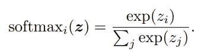
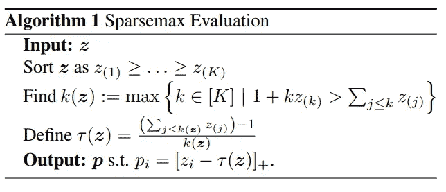
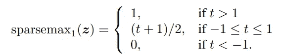
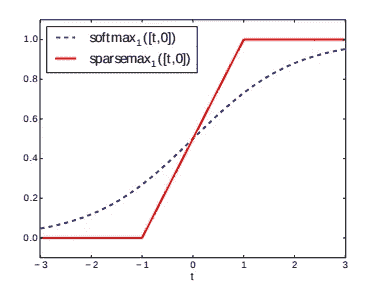
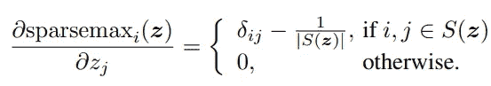

# 什么是 Sparsemax？

> 原文：<https://towardsdatascience.com/what-is-sparsemax-f84c136624e4?source=collection_archive---------17----------------------->

## softmax 的一个有用变体


格雷格·罗森克在 [Unsplash](https://unsplash.com?utm_source=medium&utm_medium=referral) 上的照片

在机器学习中，有几个非常有用的函数，比如 sigmoid，relu，softmax。后者作为神经网络的输出层广泛用于多类分类问题:



这个函数有一个有用的特性:它的元素之和是 1，这使得它对概率建模非常有用。它也是处处可微的，并且导数决不为零，这使得它在反向传播算法中很有用。相比之下，调用 softmax 替换的 argmax 函数的导数始终为零。另一个有用的特性是，该函数保留了后验概率分布的支持，因为输出概率决不为零，无论它们可能是多么小的值。

但是有时候你想有一个稀疏的输出，只保留几个非零概率的值。对于这种情况，André F. T. Martins 和 Ramón F. Astudillo 在他们的论文[从 Softmax 到 sparsemax:注意力和多标签分类的稀疏模型](http://proceedings.mlr.press/v48/martins16.pdf)中提出了一个名为 *sparsemax* 的新函数。

其思想是将 z 的最小值的概率设置为零，并且仅保持 z 的最高值的概率，但是仍然保持函数可微，以确保反向传播算法的成功应用。该功能定义为:



这里 **τ(z)** 称为*阈值函数*，它定义了包含 **p** 的所有非零索引的*支持函数* **S(z)** 。sparsemax 函数的 python 实现如下:

在相同的值上运行它和 softmax，我们确实可以看到它将一些概率设置为零，而 softmax 将它们保持为非零:

```
np.around(sparsemax([0.1,  1.1, 0.2, 0.3]), decimals=3)array([0\. , 0.9, 0\. , 0.1])np.around(softmax([0.1,  1.1, 0.2, 0.3]), decimals=3)array([0.165, 0.45 , 0.183, 0.202])
```

有趣的是，在二维情况下，这两个函数有什么不同。在这种情况下，softmax 变成了一个 *sigmoid* 函数，sparsemax 可以用以下形式表示:



下图说明了它们的不同之处:



注意，sparsemax 函数并不是处处可微的(但 *relu* 也不是)，但它在哪里是一个简单的计算:



这里 **|S(z)|** 是支撑 S(z)中元素的个数。

## 讨论

sparsemax 的明显问题是渐变消失。你可以看到，一旦 z 变大，导数变为零。作者承认这个问题，甚至提出了一个新的损失函数来代替交叉熵损失。然而，我认为 sparsemax 的主要优势不在输出层，而是在神经网络的中间，例如在*注意力*机制中。

你可以在[我的 github 库](https://github.com/mlarionov/machine_learning_POC/blob/master/sparsemax/Sparsemax.ipynb)中找到这篇文章的代码。