# 时间序列中的平稳性是什么，为什么要关注它

> 原文：<https://towardsdatascience.com/what-is-stationarity-in-time-series-and-why-should-you-care-f3b45082356b?source=collection_archive---------8----------------------->

距离我上一篇关于时间序列分析的文章已经有一段时间了。到目前为止，我已经讲述了关于*熊猫*的基础知识，比如日期处理、时间转换和重采样:

1.  [用 Python 从头开始进行时间序列分析:第 1 部分](/time-series-analysis-from-scratch-in-python-part-1-810dea60327a)
2.  [Python 中从头开始的时间序列分析:第二部分](/time-series-analysis-from-scratch-in-python-part-2-1408e91e5e02)

[M. B. M.](https://unsplash.com/@m_b_m?utm_source=medium&utm_medium=referral) 在 [Unsplash](https://unsplash.com?utm_source=medium&utm_medium=referral) 上拍摄的照片

在阅读这篇文章之前，阅读那些文章不是必须的，但是如果你是时间序列分析的新手或者你有点生疏，我会推荐你。然而，今天我想换个方式，深入到`statsmodels`库，更准确地说，处理时间序列数据中的平稳性。

## 但是什么是平稳性呢？

让我们来看看我不久前找到的一些定义:

> 平稳性意味着，无论起点如何，取相同大小的连续数据样本应具有相同的协方差。

我知道没那么容易处理，但是我们来分析一下。上面的定义是所谓的**弱形式平稳性**或“协方差平稳性”的定义，如一些参考资料中所述。存在另一种类型的平稳性，称为**严格平稳性**，它意味着相同大小的样本具有相同的分布。这种形式限制性很强，我们很少观察到，所以为了做 TSA，用“平稳性”这个术语来描述协方差平稳性。

好的，我明白了，但是时间序列是平稳的意味着什么呢？ 这个容易。对于一些被归类为平稳的时间序列(*协方差平稳性*)，必须满足 3 个条件:

1.  常数平均值
2.  恒定方差
3.  相同距离周期之间的常数协方差

最后一个可能一开始有点难以理解，所以让我们更深入地探讨一下。它只说明了相同长度的时间段之间的协方差(*假设 10 天/小时/分钟*)应该与相同长度的其他时间段的协方差**相同**:

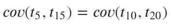

***现在这就清楚了，但是为什么我们还需要平稳性呢？*** 2 个理由(*最重要的*)，我的朋友:

1.  平稳过程更容易分析
2.  大多数算法都假设平稳性

***你能给我举一个平稳和非平稳时间序列的例子吗？*** 确定，在这里:

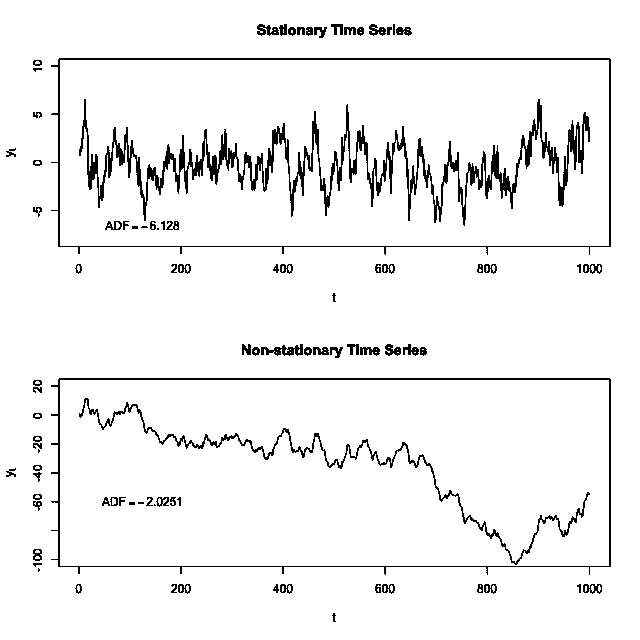

来自[维基共享资源](https://commons.wikimedia.org/wiki/File:Stationarycomparison.png)

好了，我希望这已经很清楚了，我可以继续了(*只剩下一点理论了*)。

# 平稳性测试

不久前，两个名叫大卫·迪基和韦恩·富勒的好家伙开发了一个平稳性测试。你可能会猜到，它被称为迪基-富勒测试，简称 DF 测试。一段时间后，考虑到时间依赖性，该测试的改进版本被开发出来，它被称为**增强的 Dicky Fuller 测试** (ADF-test)。

整个测试可以归结为一个简单的假设测试，其中:

*   **H0:** 时间序列不是平稳的
*   **哈:**时间序列是平稳的

这意味着我们可以很容易地计算测试统计量，并将其与临界值进行比较。如果检验统计量低于临界值，我们可以拒绝零假设，宣布时间序列是平稳的。

Python 的`statsmodels`库中的 ADF-test 将返回以下内容:

*   检验统计
*   p 值
*   使用的滞后数
*   {1%、5%和 10%的临界值}
*   对最大化信息标准的估计(基本上越低，就越容易做出未来预测)

为了简单起见，我将比较测试统计值和 p 值，但是如果你愿意，你可以稍后将它和 1%临界值进行比较。事不宜迟，我们开始吧！

# 导入和数据集

关于您需要的库，其中两个是常见的——*Numpy*和*Pandas*——但是您还需要从`statsmodels`库导入`statools`:

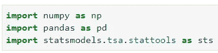

现在，您可以从提供的 [URL](https://raw.githubusercontent.com/jbrownlee/Datasets/master/airline-passengers.csv) 中读入数据集，并进行一些设置，使一切都符合需要:

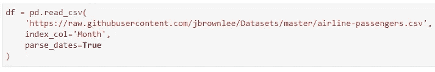

如果你以前做过时间序列分析，我相信你对这个数据集很熟悉。对于那些不是的人来说，这是前几行的样子:

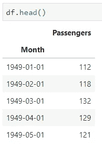

让我们也做一个快速的可视化，只是为了吸引眼球，如果时间序列在默认情况下是稳定的:

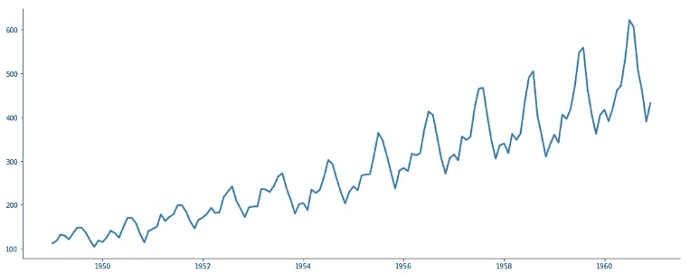

只要快速看一下，就很容易确定这个时间序列是**而不是平稳的**。平均值会随着时间的推移而变化，并且季节性周期中的峰值似乎只会变得更大。

然而，通过分析来确定平稳性是很好的。这是下一节将要讨论的内容。

# 执行 ADF 测试

还记得您从`statsmodels`库中导入的内容吗？我们现在要用它来测试平稳性。`statools`包含`adfuller`方法，您可以将时间序列数据传递给它:

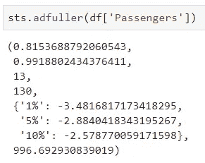

嗯，情况不是很好。正如预期的那样，时间序列不是平稳的，这一点 p 值(0.99)也证实了。让我们探索一种将**区分序列**的方法——因此用前一个值减去当前值。这个方法叫做`diff()`，在这个方法中，您可以传递订单—默认为 1:

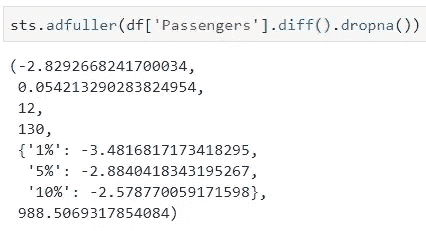

在对微分时间序列执行相同的测试后，您可以看到 p 值仅略高于通常的显著性水平—还不太令人满意。

如果您想知道为什么我们要删除丢失的值，原因如下:

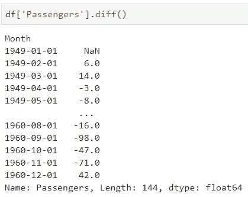

正如您所看到的，您不能从第一个值中减去，因此会导致**缺少值**。如果提供了缺失数据的时间序列，ADF-Test 将会失败，请记住这一点。

我们可以很容易地使用不同的微分顺序来查看 p 值是否会下降。让我们用 **order = 2** 来试试:

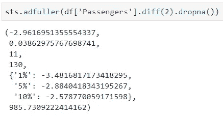

p 值现在低于显著性水平，因此时间序列可以被声明为平稳的。

手动完成整个过程可能会很乏味，如果必须处理大量时间序列数据，甚至会难以管理。假设您想要自动化时间序列模型训练的某个部分，如果您要使用需要平稳序列的算法，这将是一个很好的起点。

这就是为什么我决定做一个**函数**来为你处理这个过程。这里就不多解释了，恰如其分的评论:

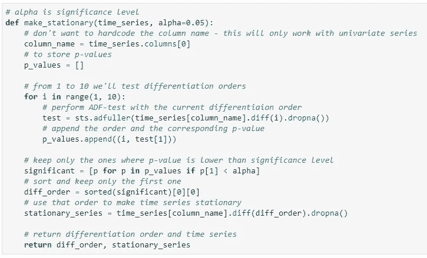

现在可以轻松使用声明的函数了:

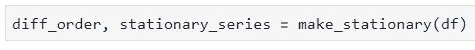

为了快速验证结果，我们将测试假定平稳的时间序列的平稳性:

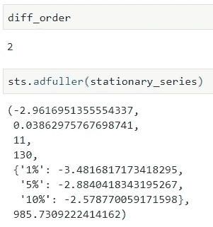

看起来一切都很好，微分阶是 2(手动计算的*)，时间序列是稳定的——通过 p 值。*

# *下一步是什么*

*这只是时间序列分析的第一步。对于大多数算法，序列必须是稳定的，以便进行分析和预测。*

*这也是我认为这一步需要**自动化**的主要原因——手工测试很多差异化订单很繁琐。*

*现在您有了继续进行的工具。感谢阅读。*

*喜欢这篇文章吗？成为 [*中等会员*](https://medium.com/@radecicdario/membership) *继续无限制学习。如果你使用下面的链接，我会收到你的一部分会员费，不需要你额外付费。**

* [## 通过我的推荐链接加入 Medium-Dario rade ci

### 作为一个媒体会员，你的会员费的一部分会给你阅读的作家，你可以完全接触到每一个故事…

medium.com](https://medium.com/@radecicdario/membership)*