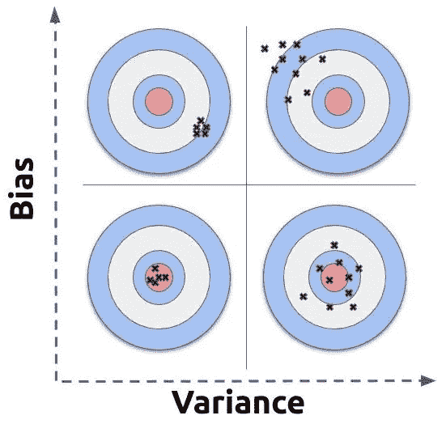
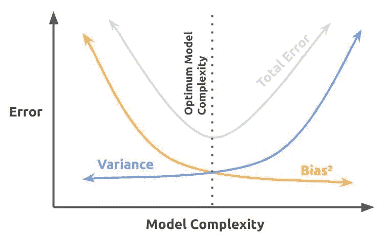

# 到底什么是偏差-方差权衡，为什么它很重要？

> 原文：<https://towardsdatascience.com/what-is-the-bias-variance-tradeoff-c3fda9897fff?source=collection_archive---------36----------------------->

## 数据科学概念

## 它们彼此有多么不同

[亚历克斯](https://unsplash.com/@worthyofelegance?utm_source=medium&utm_medium=referral)在 [Unsplash](https://unsplash.com?utm_source=medium&utm_medium=referral) 上的照片

W 当谈到数据科学时，人们必须确保他们的机器学习模型“恰到好处”。每一个机器学习模型都有不同的两面: ***偏差*** 和 ***方差*** 。作为数据科学家，我们必须寻找一种在两者之间达到完美平衡或至少接近完美平衡的模型。就像《金发姑娘和三只熊》中的金发姑娘一样，我们必须寻找一个既不“太热”也不“太冷”的模型。

这就是“*偏差-方差权衡*”的总体概念。**偏差**和**方差**是机器学习模型中的误差。当我们构建和训练我们的机器学习模型时，我们的目标是尽可能减少错误。在理想情况下，我们能够将模型中的偏差和方差都降低到零。然而，如果偏差减少到零，那么方差将增加，反之亦然。因此，为了优化我们的模型，我们必须能够在两者之间找到一个平衡点，这样我们就可以同时减少*偏差和*方差。

> 在这里注册一个中级会员，可以无限制地访问和支持像我这样的内容！在你的支持下，我赚了一小部分会费。谢谢！

# 什么是偏见？

偏差是机器学习模型中的一个错误。该误差是模型预测值和实际值之间的差异。

在统计学中，偏差是低估或高估一个参数的趋势。偏差可以以多种不同的形式出现，如 [**采样偏差**](http://onlinestatbook.com/2/research_design/sampling.html) 或 [**选择偏差**](http://sphweb.bumc.bu.edu/otlt/MPH-Modules/EP/EP713_Bias/EP713_Bias2.html) 。

照片由[罗姆森·普里查维特](https://unsplash.com/@woodies11?utm_source=medium&utm_medium=referral)在 [Unsplash](https://unsplash.com?utm_source=medium&utm_medium=referral) 上拍摄

# 什么是方差？

方差也是机器学习模型中的一个误差。这次的错误是模型对数据的敏感性。如果它太敏感，那么模型可能会看到实际上并不存在的信号和模式。

在统计学上，[方差](https://www.indeed.com/career-advice/career-development/what-is-variance)是数据集中每个变量与所有变量的平均值或均值之间的距离。它测量数据集的分布以及每个变量之间的距离。

# 偏差与方差

在偏倚和方差之间，哪个误差应该减少得最多？如果你选择减少一个错误而不是另一个，会发生什么呢？错误就是错误，所以总的来说，有一个或另一个并不更好。

## 欠拟合和过拟合

如果我们优先考虑减少一个误差，那么我们将得到一个模型，要么 [***过度拟合，要么***](https://machinelearningmastery.com/overfitting-and-underfitting-with-machine-learning-algorithms/) 数据不足。这意味着模型不会为任何新数据提供可用的结果。在拟合不足的情况下，模型无法拟合训练数据，因此将无法概括新数据。过度拟合将导致模型对训练数据建模得太好；检测数据中实际不存在的模式和噪声。这可能会对任何新数据的建模结果产生负面影响。

## 减少两者

由于优先减少一个错误的影响，我们必须同时减少两个错误。这将引导我们达到我们希望的最好结果。

偏差-方差权衡的准确性

看一下四个目标的图像以及偏差和方差对精确度的影响。随着偏差的增加，结果完全偏离目标，尽管是一致的。随着方差的增加，结果有时会接近标准，但过于分散。如果偏差和方差都很高，那么结果是分散的，完全偏离目标，如右上方的目标所示。最好的选择是偏差和方差最小的目标，其结果始终如一地准确。

为了获得最佳模型，偏差和方差都必须尽可能地降低。

# 最佳模型

降低偏差和方差意味着减少模型中的总误差。这也意味着创建一个不太简单也不太复杂的模型。当考虑偏差和方差时，我们也要考虑模型的复杂性。太复杂的模型是过度拟合的模型，太简单的模型是拟合不足的模型。这也与偏差和方差的方向相关。

观察误差和模型复杂性的图像，我们可以看到实现最佳模型的点。

绘制偏差-方差权衡图

想象上面的图像是一个大山谷。即使到达山顶可能更令人钦佩，但在偏差-方差权衡的情况下，我们希望到达谷底。谷底或最低点是我们在创建机器学习模型时希望偏差、方差和总误差保持不变的地方。

一旦我们能够实现最低可能的偏差和方差，那么我们就实现了最佳的机器学习模型。

# 结束语

正如您已经看到的，当涉及到偏差和方差时，减少一个比另一个更好的方法并不可取。偏差是实际值和模型预测值之间的误差。方差也是一个误差，但是来自模型对训练数据的敏感性。

如果我们的目标只是减少两者中的一个，那么另一个就会增加。偏差优先于方差将导致模型过度拟合数据。区分差异的优先级将使模型不符合数据。这两种结果都不被看好。然而，有一个点，我们可以在不影响另一个的情况下减少偏差和方差，这就是我们正在寻找的点。

为了实现最佳的机器学习模型，我们必须平衡两者的缩减。这将给我们一个既不太简单(数据欠拟合)也不太复杂(数据过拟合)的模型。这两种误差减少的平衡将使我们达到最佳的模型复杂度。这是偏差-方差权衡的总体概念。

[*在 Twitter 上关注我:@_Marco_Santos_*](https://twitter.com/_Marco_Santos_)