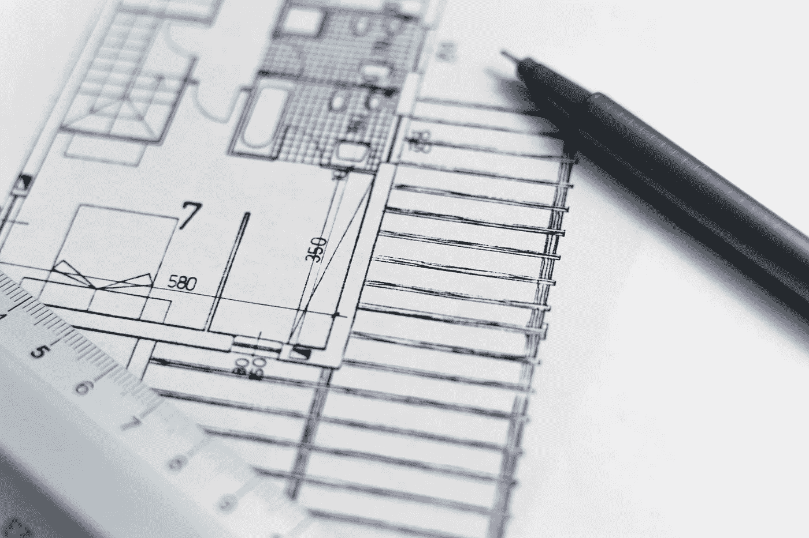

# 我们需要的数据架构是什么？

> 原文：<https://towardsdatascience.com/what-is-the-data-architecture-we-need-72606e71ba0c?source=collection_archive---------7----------------------->

照片通过 [Pixabay](https://pixabay.com/photos/architecture-blueprint-floor-plan-1857175/)

在大数据和数据科学的新时代，对于企业来说，拥有一个与业务流程一致的集中式数据架构至关重要，这种架构可以随着业务增长而扩展，并随着技术进步而发展。一个成功的数据架构提供了数据各个方面的清晰性，这使得数据科学家能够高效地使用可信的数据，并解决复杂的业务问题。它还通过利用新兴技术帮助组织快速利用新的业务机会，并通过管理整个企业中复杂的数据和信息交付来提高运营效率。

与信息体系结构、系统体系结构和软件体系结构相比，数据体系结构相对较新。数据架构师的角色也很模糊，落在了高级业务分析师、ETL 开发人员和数据科学家的肩上。尽管如此，我将使用数据架构师来指代那些为组织设计数据架构的数据管理专业人员。

当谈到建筑时，我们经常会想到与建筑的类比。传统的建筑建筑师规划、设计和审查建筑的建造。设计流程包括与客户合作，充分收集需求，了解当地的法律和环境限制，并与工程师、测量员和其他专家合作，以确保设计切实可行且在预算范围内。这项工作的复杂性确实非常类似于数据架构师的角色。然而，这两种架构师角色之间有一些基本的区别:

*   建筑架构是自顶向下设计的，而数据架构通常是可能已经存在的组件或系统的集成过程。
*   建筑设计师在建造建筑之前，必须了解所有的要求并定义整个范围。数据架构的范围很广，很容易改变。因此，一个成功的数据架构应该设计得灵活，并能预见未来的变化。
*   建筑建筑师有严格的教育和专业要求，应该拥有商业、艺术、结构物理和建筑材料方面的深入知识。另一方面，大多数数据架构师都有 IT 背景，在一些公司或行业有专业经验，对业务的了解有限。因此，他们应该意识到他们的设计可能会有偏差，他们需要根据组织中业务和技术专家的反馈进行调整。
*   建筑设计几乎总是为新建筑从头开始。因此，建筑建筑师可以完全根据新要求和新材料进行规划和设计。数据架构师没有这种奢侈。他们很少能从零开始，但在设计未来时需要了解现有的平台和数据库。

考虑到所有这些差异，数据架构师仍然可以向建筑架构师学习，特别是采用他们自顶向下的方法来改进数据架构设计。在许多组织中，缺乏系统的、集中的、端到端的数据架构设计。下面列出了一些主要原因:

*   一家公司有多个 IT 部门，他们各自使用自己的数据标准和架构。
*   应用程序和流程是基于单个业务需求构建的，没有数据架构标准可循。
*   数据架构师的角色只关注有限数量的技术领域，并且拥有有限的数据业务知识。
*   IT 项目的管理没有将数据架构作为设计阶段的一部分来考虑；数据科学家和工程师在没有一致的数据管理流程的情况下编写代码。

由于这些不足，我们经常看到公司的数据系统脱节，团队和部门之间存在差距。这种差异导致系统性能不佳，移交次数多，出现生产数据问题时需要很长时间进行故障排除，缺乏跨系统达成正确解决方案的责任感，以及缺乏评估变更影响的能力。最后，当迁移或重新设计到下一代平台时，脱节的系统可能会导致大量的分析和研究工作。

鉴于所有这些，一个成功的企业需要有一个基于业务流程和操作设计的自顶向下的一致的数据架构。特别是，就像建筑架构师所做的那样，在将技术应用到详细的应用程序设计和实现之前，企业数据架构师需要首先在概念和逻辑级别构建蓝图。

## **1。基于业务流程和操作的概念级数据架构设计**

在现代 IT 中，业务流程由数据实体、数据流和应用于数据的业务规则支持和驱动。因此，数据架构师需要有深入的业务知识，包括财务、营销、产品和业务流程的特定行业专业知识，例如健康、保险、制造商和零售商。然后，他或她可以通过设计代表每个业务领域的数据实体和分类法，以及业务流程下的数据流，在企业级正确地构建数据蓝图。特别是，在此概念阶段需要考虑和规划以下方面:

*   核心数据实体和数据元素，如关于客户、产品、销售的数据实体和数据元素。
*   客户和顾客需要的输出数据。
*   要收集、转换或引用的源数据，以生成输出数据。
*   每个数据实体的所有权，以及基于业务用例应该如何消费和分配它。
*   应用于每个数据实体的安全策略。
*   数据实体之间的关系，例如引用完整性、业务规则、执行顺序。
*   标准数据分类和分类学。
*   数据质量、运营和服务水平协议(SLA)的标准。

这个概念级的设计由支持每个业务功能的底层数据实体组成。蓝图对于企业和系统架构的成功设计和实现及其未来的扩展或升级至关重要。在许多组织中，这种概念设计通常嵌入到由单个项目驱动的业务分析中，而没有从企业端到端解决方案和标准的角度进行指导。

## **2。逻辑级数据架构设计**

通过考虑使用哪种类型的数据库或数据格式，这种级别的设计有时被称为数据建模。它将业务需求与底层技术平台和系统联系起来。然而，考虑到数据建模者的孤立角色，大多数组织只在特定的数据库或系统中设计数据建模。通过考虑适用于每个数据库或系统的标准，以及这些数据系统之间的数据流，一个成功的数据架构应该用一种集成的方法来开发。特别是，需要以协同方式设计以下 5 个领域:

***命名约定和数据完整性***

数据实体和元素的命名约定应该一致地应用于每个数据库。此外，如果相同的数据必须驻留在多个数据库中，应该加强数据源及其引用之间的完整性。最终，这些数据元素应该属于数据架构中的概念设计中的数据实体，然后可以基于业务需求对其进行协同和准确的更新或修改。

***数据归档/保留政策***

数据归档和保留策略通常直到生产的后期才被考虑或建立，这导致了资源浪费、不同数据库之间的数据状态不一致，以及数据查询和更新的低性能。为了加强数据完整性，数据架构师应该根据操作标准在数据架构中定义数据归档和保留策略。

***隐私和安全信息***

隐私和安全成为逻辑数据库设计的一个重要方面。虽然概念设计已经定义了哪个数据组件是敏感信息，但是逻辑设计应该将机密信息保存在一个数据库中，该数据库具有受限的访问权限、受限的数据复制、特定的数据类型和安全的数据流来保护信息。

***数据复制***

数据复制是考虑三个目标的关键方面:1)高可用性；2)避免通过网络传输数据的性能；3)解耦以最小化下游影响。然而，过多的数据复制会导致混乱、数据质量差和性能差。任何数据复制都应该由数据架构师检查，并按照原则和规则进行应用。

***数据流和流水线***

不同数据库系统和应用程序之间的数据流应该在这个层次上明确定义。同样，这个流程与业务流程和数据架构师概念层次中的流程是一致的。此外，数据接收的频率、管道中的数据转换以及针对输出数据的数据访问模式应该在逻辑设计的集成视图中加以考虑。例如，如果上游数据源是实时的，而下游系统主要用于具有大量索引的聚集信息的数据访问(例如，频繁更新和插入的开销很大)，则需要在两者之间设计数据管道来优化性能。

## **3。数据治理是数据架构持续成功的关键。**

由于数据架构反映并支持业务流程和流，因此每当业务流程发生变化时，数据架构也会随之变化。随着底层数据库系统的改变，数据架构也需要调整。因此，数据架构不是静态的，而是需要不断地管理、增强和审计。因此，应该采用数据治理，以确保在每个新项目启动时，企业数据架构的设计和实现都是正确的。

# **结论**

在一个成功的数据架构中，基于业务流程的概念设计是最重要的组成部分，其次是强调所有数据库和数据管道的一致性、完整性和效率的逻辑设计。一旦建立了数据架构，组织就可以看到哪些数据驻留在哪里，并确保数据得到保护、高效存储和准确处理。此外，当一个数据库或一个组件发生更改时，数据架构可以让组织快速评估影响，并指导所有相关团队进行设计和实现。最后，数据架构是企业系统的活文档，它保证是最新的，并给出清晰的端到端的描述。总之，反映端到端业务流程和运营的整体数据架构对于公司在经历重大变革(如收购、数字化转型或向下一代平台迁移)的同时快速高效地发展至关重要。