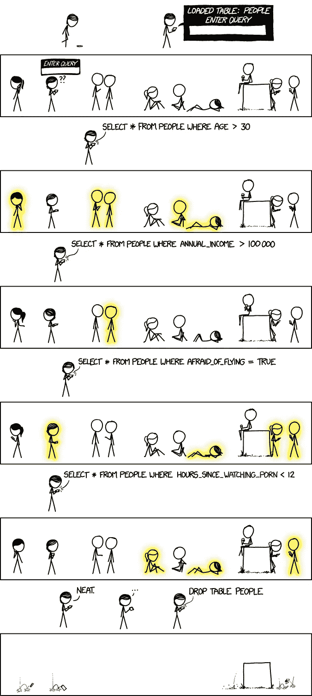
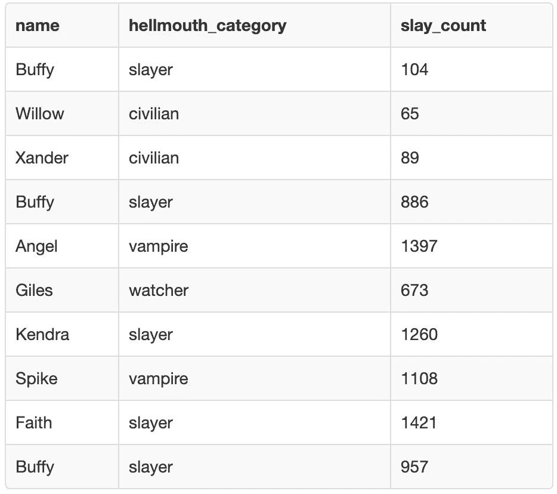
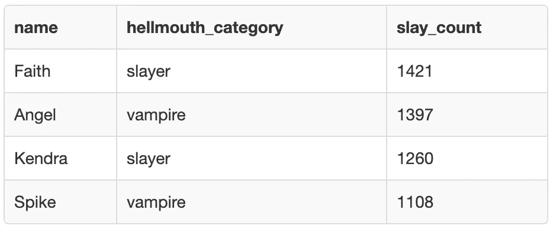
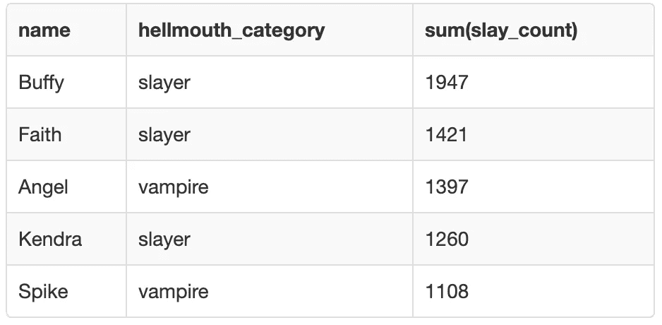

# SQL 中的 having 子句和 where 子句有什么区别？

> 原文：<https://towardsdatascience.com/what-is-the-difference-between-a-having-clause-and-a-where-clause-in-sql-ed74e0a8ad6d?source=collection_archive---------2----------------------->

## 一个常见的面试问题解释

在 SQL **中，其中**子句和 **having** 子句用于过滤数据。**这里的**子句相当简单，但是**有**子句就有点复杂了。 **Where** 子句按表中的形式过滤数据。相比之下，具有子句的**在**分组**和**聚合**之后过滤数据。另一种说法是， **where** 作用于单个记录，而**have**作用于**分组**记录。**

在这个故事中，我将描述 **where** 子句和 **having** 子句。然后，我将使用《吸血鬼猎人巴菲》中的角色，通过一个使用了 where 子句的示例和一个 having 子句的示例。



[https://imgs.xkcd.com/comics/query_2x.png](https://imgs.xkcd.com/comics/query_2x.png)

# 场景

## *剧透警报*

这个场景提到了《吸血鬼猎人巴菲》中的故事情节，所以如果你还没有看过，也不想知道会发生什么…停止在这里阅读。然而，鉴于它开始于 1997 年，结束于 2003 年，我认为我们可能是相当安全的😜

巴菲和她的朋友住在地狱口的阳光谷。巴菲是吸血鬼猎人，但其他角色也有助于猎杀吸血鬼和恶魔。

假设我们有一个包含在地狱之口收集的数据的表。这张表叫做**吸血鬼 _ 被杀**，显示了生活在阳光谷的所有角色杀死的吸血鬼数量。它也给每个人一个他们所属的类别标签，包括杀戮者，吸血鬼，平民和守望者。

在整个系列中，巴菲死了两次。第一季有一次主人淹死了她。她复活了，之后继续杀吸血鬼。她第二次死是在第五季的最后一集，她从一座塔上跳下，进入一个传送门，代替她的姐姐道恩死去。在第六季开始时，她的朋友们用巫术把她从死亡中带了回来，她也回去猎杀吸血鬼。

由于她死了两次，巴菲实际上在**吸血鬼 _ 被杀**表中有三个条目。

这些数字不是真实的。我编造了这些故事来猜测每个角色一生中会杀死多少吸血鬼。没错，我现在正在狂看《魔法奇兵》的整个 7 季，但我不会坐在那里统计所有死去的吸血鬼。

如果你想知道每个角色在屏幕上被杀死的实际次数，你可以在这里找到。我没有在我的例子中使用这些数字，因为这些数字偏向于那些有更多屏幕时间的主要角色。

# 问题是

费思和巴菲在吵架。他们一直有竞争，但这场争论是关于谁杀了最多的吸血鬼。费思认为只有她杀了 1000 多个吸血鬼，而巴菲还没有达到这个数字。巴菲不同意，并认为她已经杀死了 1000 多个吸血鬼。

为了解决他们的争吵，贾尔斯使用了**吸血鬼 _ 被杀**的记录。

```
CREATE TABLE vampires_slain (
    name varchar(255),
    hellmouth_category varchar(255),
    slay_count int
);
INSERT INTO vampires_slain (name, hellmouth_category, slay_count)
VALUES
    ('Buffy', 'slayer', 104),
    ('Willow', 'civilian', 65),
    ('Xander', 'civilian', 89),
    ('Buffy', 'slayer', 886),
    ('Angel', 'vampire', 1397),
    ('Giles', 'watcher', 673),
    ('Kendra', 'slayer', 1260),
    ('Spike', 'vampire', 1108),
    ('Faith', 'slayer', 1421),
    ('Buffy', 'slayer', 957)
;
```

> 吸血鬼 _ 被杀



## 环境

为了运行这个例子中的代码，我在 [SQL Fiddle](http://sqlfiddle.com/) 中使用了 MySQL 5.6。如果您想尝试运行代码，请随意使用它。

# 解决方案

为了解决巴菲和菲斯之间的争论，贾尔斯想要过滤掉**吸血鬼 _ 被杀的表格。**他想只显示那些 **slay_count** 大于 1000 的个体。他试图使用一个 **where** 子句来实现。

## Where 子句

**其中**在 SQL 中是一个简单的过滤器。如果满足查询的 **where** 条件，则在结果中返回该行数据。就这么简单。

在查询中， **where** 子句最常用在 **from** 之后。您可以在 **where** 子句中使用许多不同的运算符，包括 **=、>、<、> =、< =、！=，之间，像**中的和**。注意，在 MySQL 中要么**！=** 或 **< >** 可以用来表示‘不等于’。**

```
select *
from
vampires_slain
where
slay_count > 1000
order by 
slay_count desc;
```



费思很惊讶，她不是唯一一个杀死了 1000 多个吸血鬼的人。安吉尔、肯德拉和斯派克也在 slay_count 大于 1000 的名单**中。**

巴菲惊讶地发现她不在名单上。就连年纪轻轻就被杀的肯德拉也有 1000 以上的 **slay_count** 。

当巴菲买下肯德拉时，贾尔斯意识到当巴菲死了，肯德拉被召唤成为一名杀手时，巴菲的记录可能会一分为二。然后他想起她为了救 Dawn 第二次死了，并得出结论，Buffy 在表中有 3 个条目。

为了合并这三个记录，Giles 决定使用一个具有子句的**。这样他就能看到巴菲三个条目的**和**是否大于 1000，以及她杀死的吸血鬼数量是否大于费思。**

## Having 子句

**where** 关键字不能与聚合函数一起使用。这就是有了的**的用武之地。 **Having** 只能通过**子句与**组结合使用。SQL 中一些最常见的聚合函数有 **min** ， **max** ， **ave** ， **count** 和 **sum** 。**

当在查询中使用具有的**时，只返回满足具有**条件的**的**组**。**

贾尔斯用一个 **having** 子句解决了巴菲两次进入**吸血鬼 _ 被杀**表的问题。他按名称对条目进行分组，这样 Buffy 的两个条目将合并为一个。她名下的两个条目将使用 **having** 子句中的 **sum** 聚合函数进行**求和**。

然后，他可以再次使用 **>** 符号来过滤数据集，以仅包含总和 **slay_count** 大于 1000 的分组条目。

```
select name, hellmouth_category, sum(slay_count)
from
vampires_slain
group by 
name
having
sum(slay_count)>1000
order by sum(slay_count) desc;
```



因此，一旦 Giles 使用了 **having** 子句，就会对每个个体的 **slay_counts** 进行求和，然后过滤生成一个表，该表只包含 **sum(slay_count)** 大于 1000 的个体。结果表像以前一样包含了费思、安吉尔、肯德拉和斯派克，但它也包含了具有 1947 年 **sum(slay_count)** 的巴菲。

因此，贾尔斯解决了争论。巴菲和费思的总死亡数都超过了 1000。信仰是错误的。巴菲不仅杀死了 1000 多只吸血鬼，而且她在 1947 年杀死的吸血鬼总数比费思的 1421 只还多。

# 我如何使用 where 和 having 子句

我不得不承认，在我的日常数据库查询中，我倾向于不太使用 having 子句。相反，我通常会创建中间表，其中的项目被**分组**。然后，如果需要的话，我会使用一个 **where** 子句来过滤中间表。我想我经常**分组**字段或者**过滤**它们，但很少同时两者。

我之所以会创建中间表而不是使用带有子句的**来创建中间表，主要是因为我所处理的数据都在非常大的表中。当使用具有**子句的**时，会在内存中创建一个临时表。这意味着，对于大型数据集，使用具有**子句的**的查询会花费很长时间。**

然而， **having** 从句在科技面试中经常被用作问题。这是因为它们是需要正确使用的比较棘手的 SQL 子句之一。因此，即使你很少在实践中使用它们，了解它们的工作原理并对它们感到舒适也是值得的。

我希望这个例子有助于澄清 SQL 中的 **where** 和 **having** 之间的区别。

除了数据，我的另一个爱好是绘画。你可以在 www.katemarielewis.com[找到我的野生动物艺术](http://www.katemarielewis.com)

# 我写过的关于 SQL 的其他文章:

[](/what-is-the-difference-between-an-inner-and-an-outer-join-in-sql-5b5ec8277377) [## SQL 中的内部连接和外部连接有什么区别？

### SQL 中的内部连接、完全外部连接、左外部连接和右外部连接使用来自以下领域的示例进行解释…

towardsdatascience.com](/what-is-the-difference-between-an-inner-and-an-outer-join-in-sql-5b5ec8277377) 

# 我写的关于数据科学的文章:

[](/how-i-went-from-zero-coding-skills-to-data-scientist-in-6-months-c2207b65f2f3) [## 我如何在 6 个月内从零编码技能成为数据科学家

### 我用来自学数据科学的 4 个工具没有花一美元

towardsdatascience.com](/how-i-went-from-zero-coding-skills-to-data-scientist-in-6-months-c2207b65f2f3)