# SQL 中的内部连接和外部连接有什么区别？

> 原文：<https://towardsdatascience.com/what-is-the-difference-between-an-inner-and-an-outer-join-in-sql-5b5ec8277377?source=collection_archive---------1----------------------->

## SQL 中的内连接、全外连接、左外连接和右外连接用哈利波特世界中的例子来解释

SQL 中的连接用于组合不同表的内容。您可以通过多种方式指定希望如何联接表中的数据，其中一种方式是联接类型。有四种主要的联接类型:内部联接、完全外部联接、左外部联接和右外部联接。

内部联接和外部联接的主要区别在于，内部联接导致两个表的交集，而外部联接导致两个表的并集。

在这个故事中，我将描述内部连接、完全外部连接、左外部连接和右外部连接之间的区别。然后，我将通过一个使用《哈利·波特》中人物的例子来展示这些不同之处。

# 可视化连接

一个[维恩图](https://en.wikipedia.org/wiki/Venn_diagram)是一个可视化内部连接和外部连接之间差异的有用方法。

## 内部联接和完全外部联接

内部连接导致两个数据集的维恩图的重叠部分，而对于完全外部连接，维恩图的外部部分也将被返回。

对于内部联接，只返回两个表共有的行。但是，对于完全外部连接，将返回两个表中的所有行。

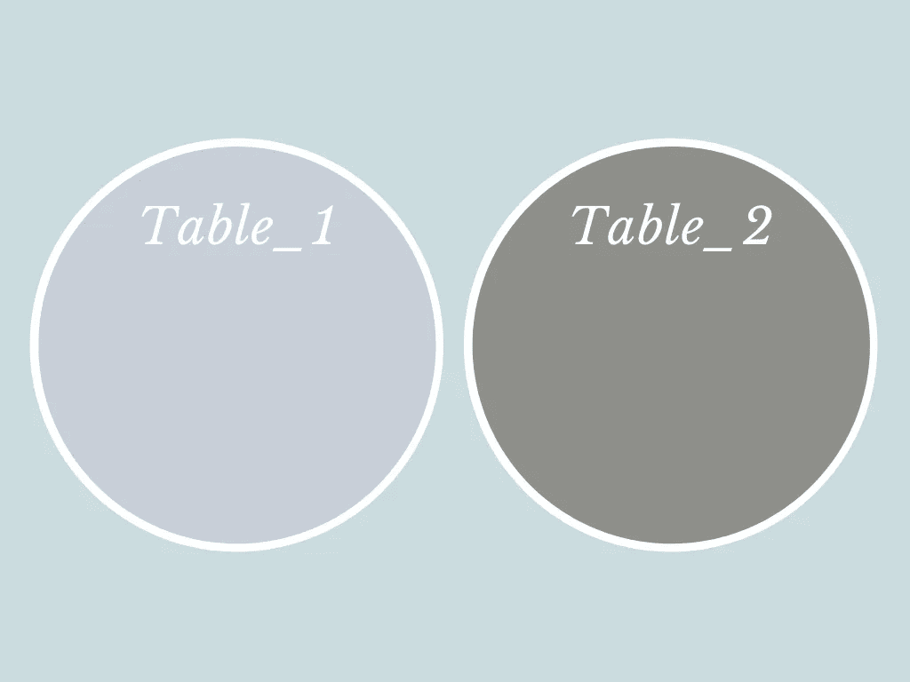

数据库中名为 Table_1 和 Table_2 的两个表

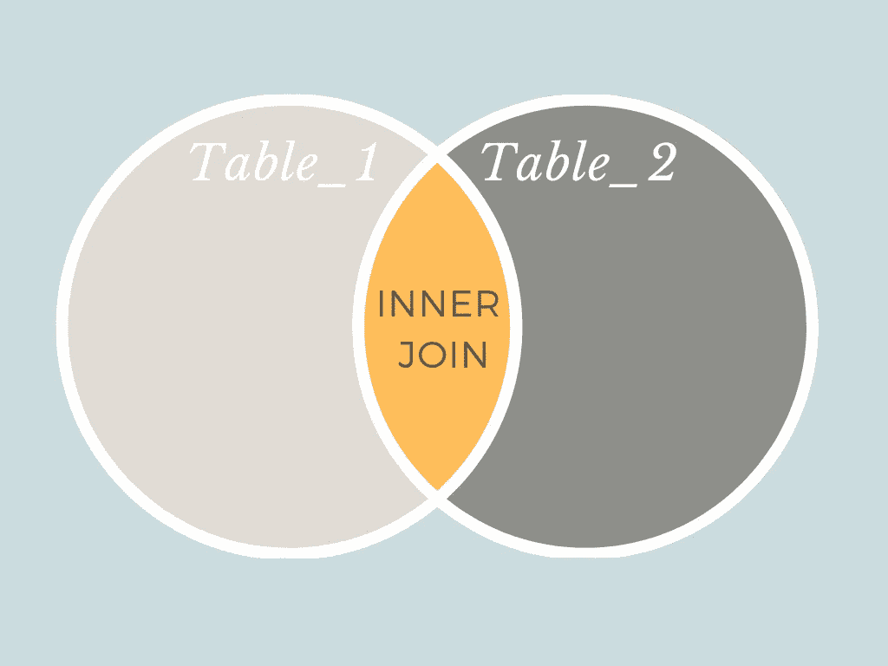

**内部连接:**内部连接的结果将只包含 Table_1 和 Table_2 重叠的黄色部分

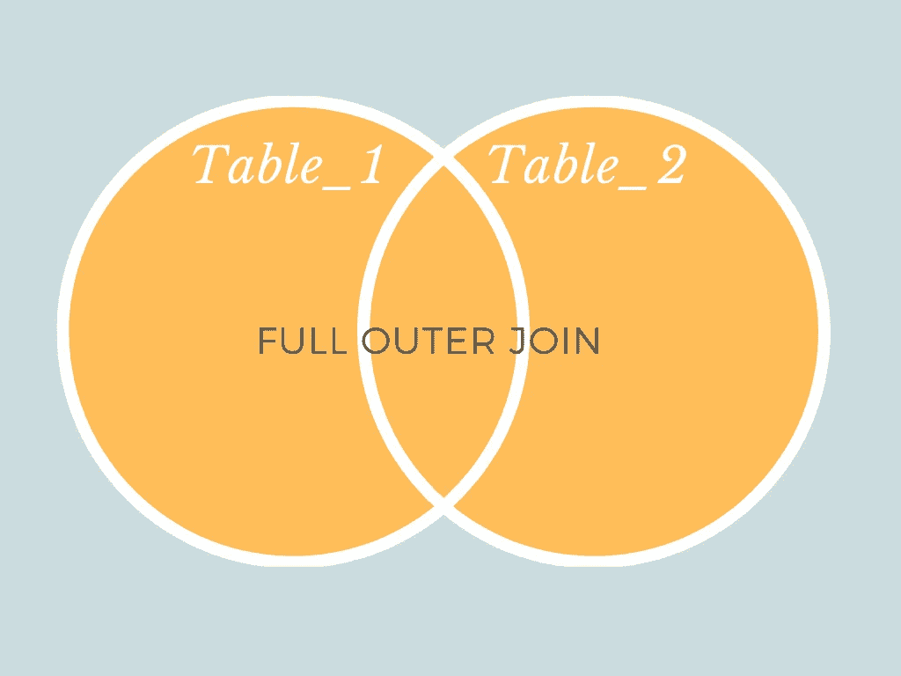

**完全外部连接:**外部连接的结果将包含所有黄色部分，包括整个 Table_1 和 Table_2，而不仅仅是两个圆重叠的地方

## 左右外部联接

如果您希望从一个表中获取所有值，但从另一个表中只获取与该表匹配的行，则左右外部联接非常有用。

因此，在左外连接中，将返回左表中的所有行以及右表中共有的行。相比之下，对于右外连接，将返回右表中的所有行以及左表中共有的行。

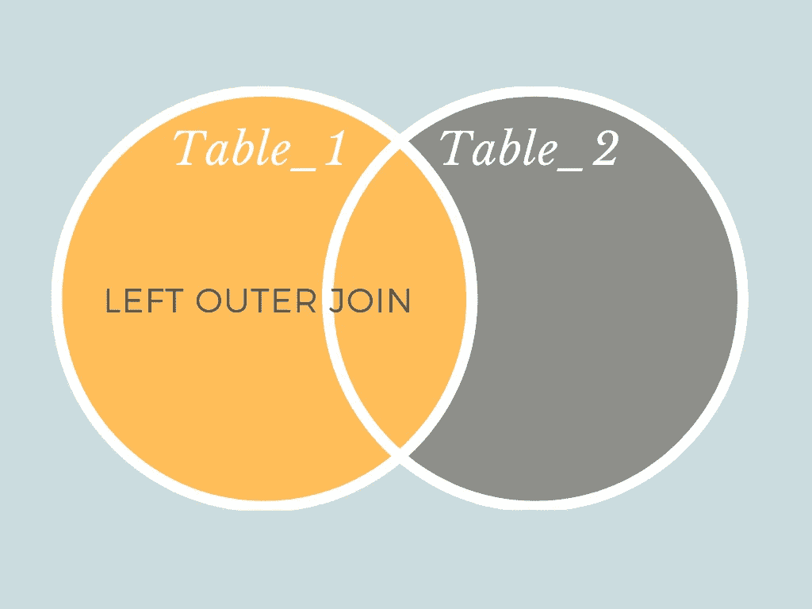

**左外连接:**左外连接的结果将包含 Table_1 和 Table_2 重叠的黄色部分，以及包含 Table_1 其余部分的黄色部分

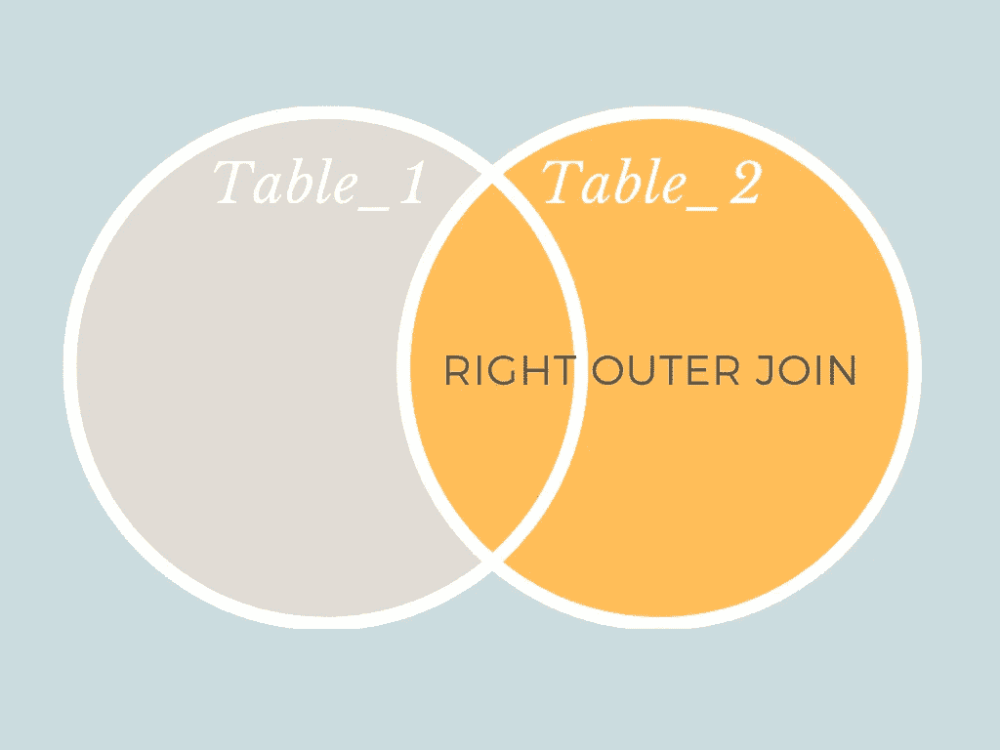

**右外连接:**右外连接的结果将包含 Table_1 和 Table_2 重叠的黄色部分，以及包含 Table_2 其余部分的黄色部分

# 例子

## 环境

为了运行这个例子中的代码，我在 [SQL Fiddle](http://sqlfiddle.com/) 中使用了 PostgreSQL 9.6。如果您想尝试在不设置复杂环境的情况下运行代码，请随意使用。我已经简化了示例中表格的输出，删除了重复的列，只是为了让它更清晰、更容易理解，所以如果您尝试了一下，看起来有点不同，不要惊慌。对于这个故事，我使用 PostgreSQL 而不是 MySQL，因为 MySQL 不使用完全外连接。

## 哈利·波特场景

让我们假设您正试图连接霍格沃茨魔法学校的两个学生成绩表。这些桌子被称为**魔药 _ 类**和**魔咒 _ 类**。每个表格都有两列，包含学生姓名和成绩。

```
CREATE TABLE charms_class(
student_namevarchar(255),
charms_gradevarchar(255)
);INSERT INTO charms_class (student_name, charms_grade)
VALUES
    ('Harry', 'C'),
    ('Ron', 'D'),
    ('Hermione', 'A'),
    ('Luna', 'B'),
    ('Neville', 'B')
;CREATE TABLE potions_class(
student_namevarchar(255),
potions_gradevarchar(255)
);INSERT INTO potions_class (student_name, potions_grade)
VALUES 
    ('Harry', 'A'),
    ('Ron', 'C'),
    ('Hermione', 'B'),
    ('Ginny', 'A'),
    ('Draco', 'D')
;
```

> charms_class

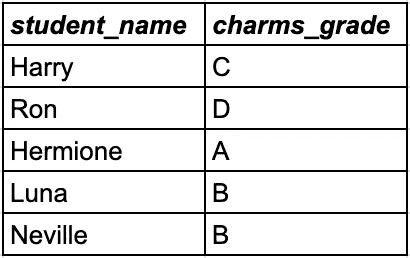

> 魔药课 _ 课堂

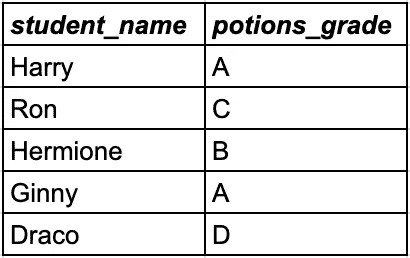

## 内部联接示例

想象一条龙威胁着霍格沃茨城堡。只有同时参加魔药课和魔法课的学生才能和老师一起出去保卫学校。

要找出哪些学生同时上了 charms 课和魔药课，以及他们在每门课中的成绩，可以使用 charms_class 和魔药课表中的内部联接。

```
select * 
from 
charms_class INNER JOIN potions_class 
on 
charms_class.student_name=potions_class.student_name;
```

生成的表如下所示:

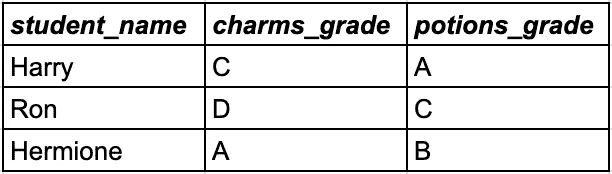

在这个内部连接的例子中，只有哈利、罗恩和赫敏同时参加了魔咒和魔药课，所以他们两个班级的成绩都在结果中返回。请注意，只注册了一个班而没有注册另一个班的学生不会出现在结果中。

因此只有哈利、罗恩和赫敏被允许面对龙。

## 完全外部连接示例

魔法部只雇佣完成了魔咒课和魔药课的毕业生。然而，没有足够的学生具备担任所有角色所需的先决条件，所以魔法部想要一份已经注册了一个班级的学生名单。

要找出哪些学生在魔法班或魔药班，可以使用一个完整的外部连接。请注意，如果学生没有注册魔药课，魔药等级值将为空，同样地，如果学生没有注册魔药课，魔药等级值也将为空。

所以任何一个成绩栏中有空值的学生都是魔法部想要联系的人。

```
select * 
from 
charms_class FULL OUTER JOIN potions_class 
on 
charms_class.student_name=potions_class.student_name;
```

生成的表如下所示:

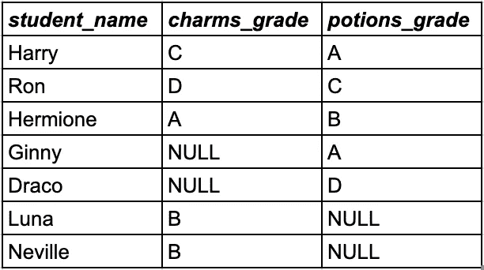

在这个完全外部连接的示例中，所有学生都包含在结果表中。只有哈利、罗恩和赫敏同时参加了魔法和魔药课，所以他们这两门课的成绩都在结果中返回，并且在他们的行中没有空值。

金妮和德拉科只有魔药课的成绩，因为他们没有使用符咒，所以他们的符咒成绩被指定为空值。卢娜和纳威只有魔法等级，因为他们没有学过魔药，所以他们的魔药等级被赋值为空值。

因此金妮、德拉科、卢娜和纳威都是可以选修额外课程的学生，以便毕业后能够在魔法部工作。

## 左外部联接示例

校长办公室搞了一场恶作剧，邓布利多教授的所有家具都漂浮在天花板上。参加魅力课程并获得 C 级或更高成绩的学生受到怀疑。然而，上魔药课的学生不可能是罪犯，因为恶作剧发生时他们的班级正在进行实地考察。

为了找出哪些学生在 charms 班的成绩为 C 或更高，而没有在魔药班注册，我们将使用左外连接来连接 charms_class 表和魔药 _class 表。请注意，如果学生没有注册魔药课，魔药课成绩值将为空。

```
select * 
from 
charms_class LEFT OUTER JOIN potions_class 
on 
charms_class.student_name=potions_class.student_name;
```

生成的表如下所示:

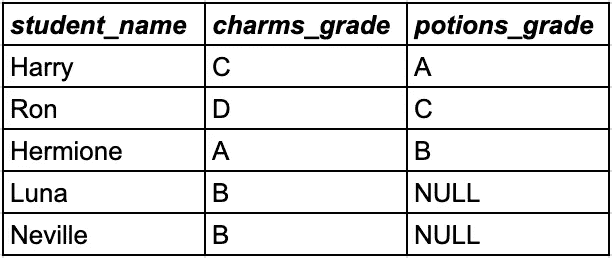

只有哈利、罗恩和赫敏同时参加了魔法和魔药课，所以他们这两门课的成绩都在结果中返回，并且在他们的行中没有空值。

卢娜和纳威只有魔法等级，因为他们没有学过魔药，所以他们的魔药等级被赋值为空值。

金妮和德拉科没有服用魔咒，所以他们没有包括在这个结果表中。

因此，校长办公室恶作剧的嫌疑人是卢娜和纳威。他们在魔法课上都得了 B，而且事发时都不在魔药课上。

## 右外部联接示例

斯内普教授经营着一个魔药俱乐部，在魔法课上同时开会。只有注册了魔药课但没有注册魔药课的学生才可以参加俱乐部。

要找出哪些学生上了魔药课，哪些没上魔药课，你可以使用一个右外连接。请注意，如果学生没有注册 charms 类，charms_grade 值将为空。

```
select * 
from 
charms_class RIGHT OUTER JOIN potions_class 
on 
charms_class.student_name=potions_class.student_name;
```

生成的表如下所示:

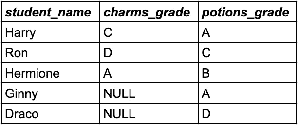

在这个右外连接的例子中，只有哈利、罗恩和赫敏同时参加了魔咒和魔药课，所以他们两个班的成绩都在结果中返回，并且他们的行中没有空值。

金妮和德拉科只有魔药课的成绩，因为他们没有使用符咒，所以他们的符咒成绩被指定为空值。

卢娜和纳威没有服用魔药，所以他们没有被包括在这个结果表中。

因此只有金妮和德拉科可以加入魔药俱乐部，因为他们不上魔法课。

# 我如何使用联接

作为一名数据科学家，我使用最多的连接是左外连接。例如，我曾经处理过健康数据，并且经常会按位置汇总程序编号。在这种情况下，我会将位置表放在左边，然后进行左连接。这是因为可能有一些位置我没有任何过程，如果我做了一个内部连接，我会丢失这些位置。当您只需要完整的数据集，而不需要添加外部联接带来的空值时，内部联接会更有用。我很少使用完全外连接，除非需要保留被连接的两个表中的所有数据。完全外连接最终可能会产生非常大的结果表，尤其是在要连接的表之间没有太多重叠的情况下。

如果你想解释不同的 SQL 方法，请在下面留下评论。

[](https://medium.com/@katemarielewis/membership) [## 通过我的推荐链接加入 Medium-Kate Marie Lewis

### 想了解更多关于数据科学的知识吗？今天就成为会员吧&不要错过凯特的帖子，直接交会员费…

medium.com](https://medium.com/@katemarielewis/membership) 

## 如果您想了解更多关于我如何成为数据科学家的信息，请访问:

[](/how-i-went-from-zero-coding-skills-to-data-scientist-in-6-months-c2207b65f2f3) [## 我如何在 6 个月内从零编码技能成为数据科学家

### 我用来自学数据科学的 4 个工具没有花一美元

towardsdatascience.com](/how-i-went-from-zero-coding-skills-to-data-scientist-in-6-months-c2207b65f2f3) [](/interview-strategy-that-landed-me-my-first-data-science-job-bdd5e77bfb49) [## 让我获得第一份数据科学工作的面试策略

### 我是如何展示自己得到这份工作的

towardsdatascience.com](/interview-strategy-that-landed-me-my-first-data-science-job-bdd5e77bfb49) [](/rage-quitting-cancer-research-5e79cb04801) [## 愤怒退出癌症研究

### 为什么我从神经科学家变成了数据科学家

towardsdatascience.com](/rage-quitting-cancer-research-5e79cb04801)