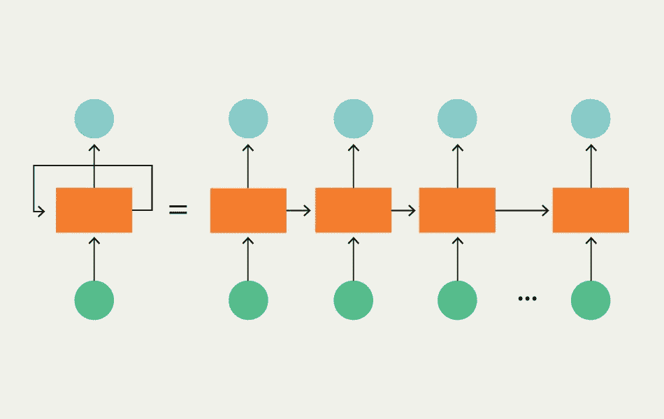
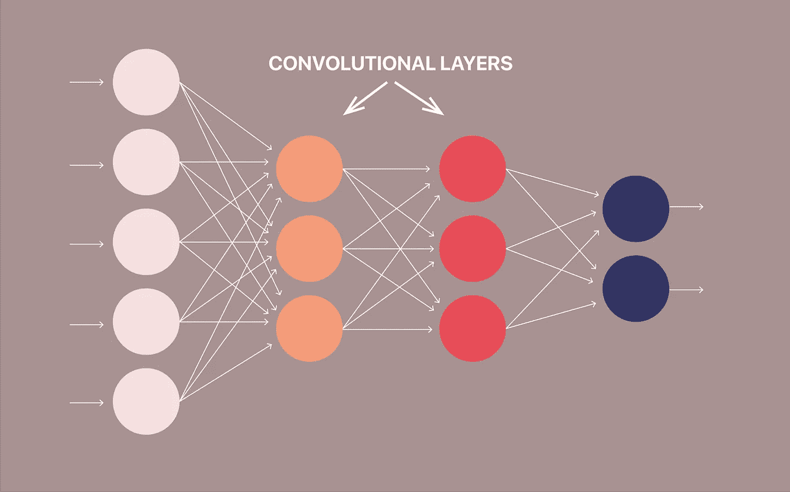
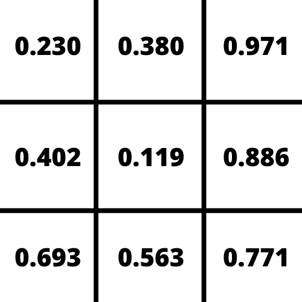
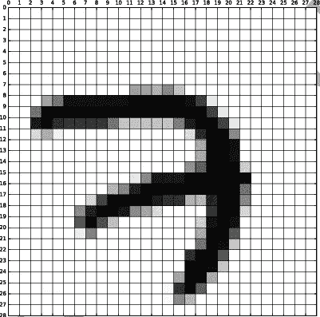
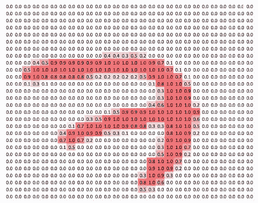
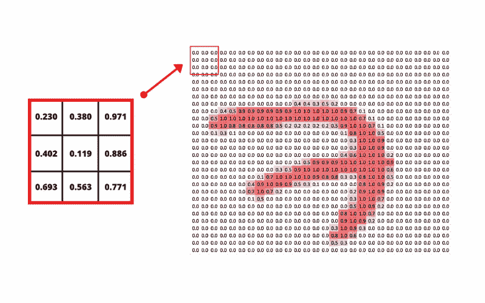
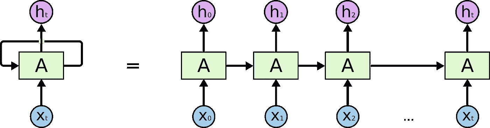
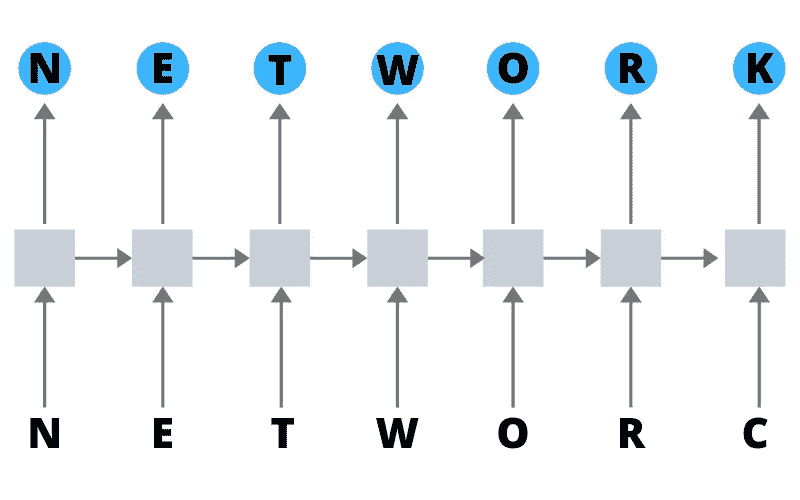

# CNN 和 RNN 的区别是什么？

> 原文：<https://towardsdatascience.com/what-is-the-difference-between-cnn-and-rnn-719dba4fd5a5?source=collection_archive---------43----------------------->

## 卷积神经网络和递归神经网络是当今 ML 中常用的方法。然而，它们通常用于完全不同的用例。

作者图片

在机器学习中，每种类型的人工神经网络都是为某些任务量身定制的。本文将介绍两种类型的神经网络:卷积神经网络(CNN)和递归神经网络(RNN)。使用流行的 Youtube 视频和视觉辅助工具，我们将解释 CNN 和 RNN 之间的区别，以及它们如何用于计算机视觉和自然语言处理。

# CNN 和 RNN 的区别是什么？

CNN 和 RNN 的主要区别在于处理时序信息或数据的能力，比如一个句子。此外，卷积神经网络和递归神经网络用于完全不同的目的，并且神经网络本身的结构存在差异以适应那些不同的使用情况。

CNN 在卷积层中使用滤波器来转换数据。然而，rnn 重用序列中其他数据点的激活函数来生成序列中的下一个输出。

虽然这是一个经常被问到的问题，但是一旦你看了这两个神经网络的结构并理解了它们的用途，CNN 和 RNN 之间的区别就变得很明显了。

首先，让我们看看 CNN 以及它们是如何被用来解读图像的。

# 什么是卷积神经网络？

卷积神经网络是在[计算机视觉](https://lionbridge.ai/articles/what-is-computer-vision/)中用于识别图像中的对象和模式的最常见的神经网络类型之一。它们的定义特征之一是在卷积层中使用滤波器。

**卷积层**
CNN 有独特的层，称为卷积层，将它们与 rnn 和其他神经网络分开。

作者图片

在卷积层中，输入在被传递到下一层之前被转换。CNN 通过使用过滤器来转换数据。

# 卷积神经网络中的滤波器是什么？

CNN 中的过滤器只是一个随机数值矩阵，如下图所示。

作者图片

过滤器中的行数和列数可以变化，这取决于用例以及正在处理的数据。在一个卷积层中，有许多过滤器在图像中移动。这个过程被称为卷积。过滤器卷积图像的像素，在将数据传递到 CNN 的下一层之前改变它们的值。

# 过滤器是如何工作的？

为了理解过滤器如何转换数据，让我们看看如何训练 CNN 识别手写数字。下面是来自 [MNIST 数据集](https://lionbridge.ai/datasets/mnist-datasets-for-machine-learning/)的数字 7 的 28 x 28 像素图像的放大版本。

图像取自 MNIST 数据集

下面是相同的图像转换成它的像素值。

当滤波器在图像中卷积时，滤波器中的值矩阵与图像的像素值对齐，并获得这些值的[点积](https://www.mathsisfun.com/algebra/matrix-multiplying.html)。

作者图片

过滤器移动或“卷积”通过每个 3×3 像素矩阵，直到所有像素都被覆盖。然后，每个计算的点积用作下一层的输入。

最初，过滤器中的值是随机的。因此，第一次通过或卷积作为一个训练阶段，最初的输出不是很有用。每次迭代后，CNN 使用[损失函数](/common-loss-functions-in-machine-learning-46af0ffc4d23)自动调整这些值。随着训练的进行，CNN 不断调整过滤器。通过调整这些过滤器，它能够区分边缘，曲线，纹理，以及图像的更多模式和特征。

虽然这是一个惊人的壮举，但为了实现损失函数，CNN 需要以标记训练数据的形式给出正确输出的例子。

> 当迁移学习无法应用时，许多卷积神经网络需要过量的标记数据。

你还不明白 CNN 吗？下面是杰瑞米·霍华德在 fast.ai 上的一个精彩但冗长的视频讲座。视频详细说明了 CNN 的工作原理:

# CNN 的不足之处

CNN 擅长解释视觉数据和没有顺序的数据。然而，它们不太擅长解释时间信息，如视频(本质上是一系列单独的图像)和文本块。

[文本中的实体提取](https://lionbridge.ai/articles/the-essential-guide-to-entity-extraction/)是序列中不同部分的数据如何相互影响的一个很好的例子。对于实体，句子中实体前后的单词对它们的分类有直接影响。为了处理时间或序列数据，如句子，我们必须使用算法，这些算法被设计为从序列中的过去数据和“未来数据”中学习。幸运的是，循环神经网络正是这样做的。

# 什么是递归神经网络？

递归神经网络结构—图片 via [colah.github.io](http://colah.github.io/)

递归神经网络是设计用于解释时间或顺序信息的网络。rnn 使用序列中的其他数据点进行更好的预测。它们通过接收输入并重用序列中前面或后面节点的激活来影响输出。如前所述，这在实体提取等任务中非常重要。以下面这段文字为例:

> *罗斯福总统是美国历史上最有影响力的总统之一。然而，曼哈顿的罗斯福街并不是以他的名字命名的。*

在第一句话中，罗斯福应该被称为一个人实体。而在第二句中，它应该被标记为街道名称或位置。如果不考虑前面的单词“总统”和后面的单词“街道”，就不可能知道这些区别。

# 自动更正的 RNNs

为了更深入地了解 rnn 是如何工作的，让我们看看它们是如何用于自动更正的。基本上，自动更正系统将您键入的单词作为输入。使用该输入，系统预测拼写是正确的还是不正确的。如果这个单词与数据库中的任何单词都不匹配，或者不符合句子的上下文，系统就会预测正确的单词可能是什么。让我们想象一下这个过程如何与 RNN 一起工作:

作者图片

RNN 将接受两个输入源。第一个输入是您键入的字母。第二个输入将是与您之前键入的字母相对应的[激活功能](https://missinglink.ai/guides/neural-network-concepts/7-types-neural-network-activation-functions-right/)。假设您想输入“网络”，但却错误地输入了“networc”。系统接收前面字母“网络”和您输入的当前字母“c”的激活功能。然后它吐出“k”作为最后一个字母的正确输出。

这只是一个简单的例子，说明了 RNN 的拼写纠正系统是如何工作的。今天，数据科学家使用 rnn 做更多不可思议的事情。从[生成文本](https://lionbridge.ai/articles/this-entire-article-was-written-by-an-ai-open-ai-gpt2/)和图像字幕到[创作音乐](https://lionbridge.ai/articles/ceo-of-ai-music-generator-mubert-wants-to-create-a-musical-dna/)和预测股票市场波动，rnn 有无穷无尽的潜在用例。

希望这篇关于 CNN 和 RNNs 的简介能帮助你理解这两种神经网络的区别。虽然处理时间或顺序数据的能力是主要区别之一，但网络本身的结构及其用例也有很大不同。

要获得更多机器学习指南、新闻和采访，请查看下面的相关文章，别忘了在 Medium 上关注我。

[原创文章](https://lionbridge.ai/articles/difference-between-cnn-and-rnn/)经许可转贴。