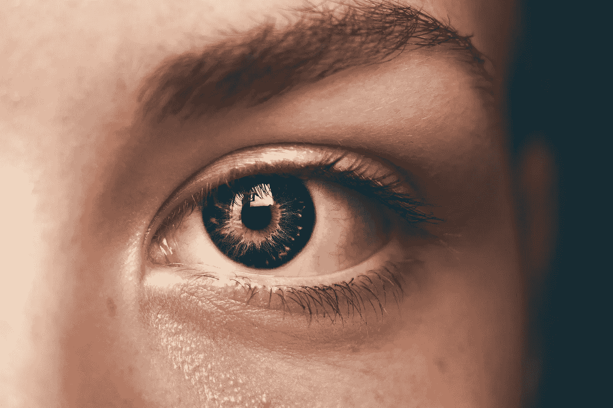
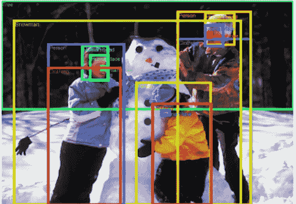
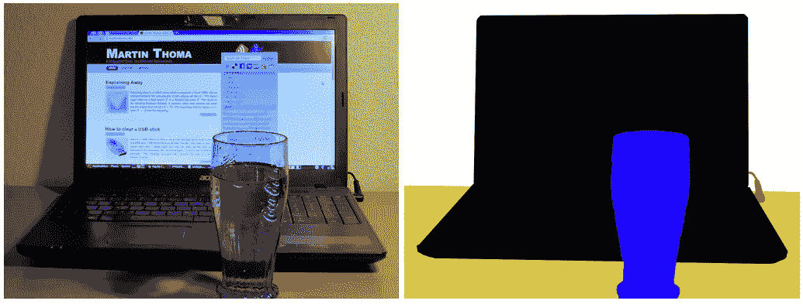

# 物体检测和图像分割有什么区别？

> 原文：<https://towardsdatascience.com/what-is-the-difference-between-object-detection-and-image-segmentation-ee746a935cc1?source=collection_archive---------17----------------------->

## 以及何时使用哪个？

目标检测和图像分割是计算机视觉的两种方法。阿曼达·达尔比约恩在 [Unsplash](https://unsplash.com/s/photos/artificial-intelligence?utm_source=unsplash&utm_medium=referral&utm_content=creditCopyText) 上拍摄的照片

# 人工智能中的图像处理

人工智能对图像处理有不同的任务。在本文中，我将介绍对象检测和图像分割之间的区别。

在这两个任务中，我们都希望找到图像上感兴趣的某些项目的位置。例如，我们可以有一组安全摄像机图片，在每张图片上，我们想要识别图片中所有人的位置。

通常有两种方法可以用于此:对象检测和图像分割。

# 对象检测—预测边界框

当我们谈论物体检测时，我们通常谈论包围盒。这意味着我们的图像处理将识别照片中每个人周围的矩形。

边界框通常由左上角的位置(2 个坐标)以及宽度和高度(以像素为单位)来定义。

来自开放图像数据集的带注释的图像。[一家人堆雪人](https://www.flickr.com/photos/mwvchamber/5433788065) by [mwvchamber](https://www.flickr.com/photos/mwvchamber/) 。由 2.0 许可在 [CC 下使用的图像。](https://creativecommons.org/licenses/by/2.0/)

## 如何理解物体检测方法？

如果我们回到任务:识别图片上的所有人，就可以理解通过边界框进行对象检测的逻辑。

解决方案的第一直觉可以是将图像切割成小部分，并在每个子图像上应用图像分类，以表明该图像是否是人。对单幅图像和目标检测进行分类是一项更容易的任务，因此，他们采取了这种循序渐进的方法。

目前来说，YOLO 模型(你只看一次)是一个解决这个问题的伟大发明。YOLO 模型的开发人员已经建立了一个神经网络，它能够一次完成整个包围盒方法！

## 对象检测的当前最佳模型

*   YOLO
*   更快的 RCNN

# 图像分割—预测遮罩

一步一步扫描图像的合理选择是远离绘制框，而是逐个像素地注释图像。

如果你这样做，你会有一个更详细的模型，这基本上是一个输入图像的转换。

## 如何理解图像分割方法？

这个想法很基本:即使在扫描产品上的条形码时，也有可能应用一种算法来转换输入(通过应用各种过滤器)，以便除了条形码序列之外的所有信息在最终的图片中变得不可见。

左:[https://commons . wikimedia . org/wiki/File:Image-segmentation-example . jpg](https://commons.wikimedia.org/wiki/File:Image-segmentation-example.jpg)。右:[https://commons . wikimedia . org/wiki/File:Image-segmentation-example-segmented . png](https://commons.wikimedia.org/wiki/File:Image-segmentation-example-segmented.png)。这两个文件都可以在[知识共享](https://en.wikipedia.org/wiki/en:Creative_Commons) [CC0 1.0 通用公共领域专用](https://creativecommons.org/publicdomain/zero/1.0/deed.en)下获得

这是在图像上定位条形码的基本方法，但类似于图像分割中发生的情况。

图像分割的返回格式称为遮罩:与原始图像大小相同的图像，但对于每个像素，它只具有一个布尔值，指示对象是否存在。

如果我们允许多个类别，它可以变得更复杂:例如，它可以将海滩景观分成三个类别:空气、海洋和沙滩。

## 当前图像分割的最佳模型

*   屏蔽 RCNN
*   Unet
*   Segnet

# 简言之，这种比较

## 目标检测

*   输入是一个矩阵(输入图像),每个像素有 3 个值(红色、绿色和蓝色),如果是黑色和白色，每个像素有 1 个值
*   输出是由左上角和大小定义的边界框列表

## 图象分割法

*   输入是一个矩阵(输入图像),每个像素有 3 个值(红色、绿色和蓝色),如果是黑色和白色，每个像素有 1 个值
*   输出是一个矩阵(遮罩图像),每个像素有一个值，包含指定的类别

我希望这篇短文对你有用。感谢阅读！