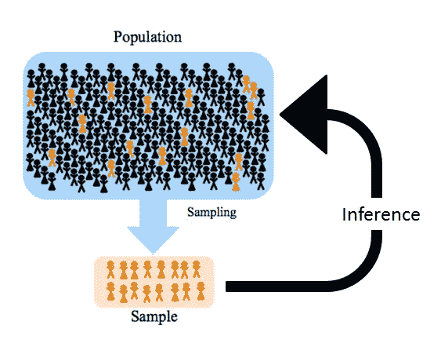

# 总体和样本有什么区别？

> 原文：<https://towardsdatascience.com/what-is-the-difference-between-population-and-sample-e13d17746b16?source=collection_archive---------14----------------------->

罗兰·德内斯拍摄的照片

# 介绍

人们经常无法正确区分总体和样本。然而，它在任何统计分析中都是必不可少的，从[描述性统计](https://www.statsandr.com/blog/descriptive-statistics-by-hand/)开始，根据我们面对的是样本还是总体，它有不同的方差和标准差公式。

此外，统计学的一个分支叫做[推断统计学](https://www.statsandr.com/blog/a-shiny-app-for-inferential-statistics-by-hand/)通常被定义为从对人口的代表性样本的观察中得出关于人口的结论的科学。因此，正确区分这两个概念至关重要。那么，总体和样本的区别到底是什么？

# 样本与总体

总体与样本。资料来源:towardsdatascience.com

群体包括**来自特定群体的所有成员**，所有感兴趣的可能结果或测量。确切的人数将取决于研究的范围。例如，假设您想知道在比利时数据科学家的具体案例中，工作表现和每周在家工作的时间是否有关联。在这种情况下，人口可能是比利时的数据科学家。但是，如果研究的范围更窄(例如，研究的重点是居住在离工作地点至少 30 公里以外的讲法语的比利时数据科学家)，那么人群将更具体，只包括符合标准的员工。关键是人口应该只包括那些结果适用的人。

样本由从总体中抽取的一些观察值组成，因此是总体的一部分或**子集。样本是实际参与研究的一组元素。**

成员和元素是在广义上定义的。可能是人类。例如，人口可能是"**所有**居住在比利时的人"，样本可能是"**一些**居住在比利时的人"。也可以是其他任何东西。假设你正在测试一种新肥料对农作物产量的影响。所有的庄稼地代表您的人口，而您测试的 10 块庄稼地对应于您的样本。因为样本是总体的子集，所以样本总是小于总体。 [1](https://www.statsandr.com/blog/what-is-the-difference-between-population-and-sample/#fn1) 注意，人口不一定要多。可能的情况是，你研究的人群如此狭窄(例如，你大学的一年级男学士学生，他们在 6 月份通过了统计学考试，他们的父母已经离婚超过 5 年)，人群的规模实际上相当小。

# 为什么是样本？

正如本文开头所提到的，统计学的一个主要关注点是能够从代表性样本中得出关于总体的结论。为什么使用人口样本而不是直接使用人口样本？一般来说，对整个研究人群进行测量几乎总是不可能的，因为:

*   人口太多了。例如:孕妇人口。如果我们想对世界上所有的孕妇进行测量，很可能要么需要太长时间，要么花费太多
*   人口是虚拟的。在这种情况下,“虚拟”人口被理解为“假设的”人口:它的规模是无限的。在一项实验研究中，我们关注的是接受新疗法治疗的前列腺癌患者。我们不知道有多少人将接受治疗，所以人口是变化的，在目前是无限的和不可计数的，因此是虚拟的
*   这些人不容易接触到。例如:比利时无家可归者的人口

由于这些原因，测量是在群体的一个观察子群上进行的，即在我们的群体样本上进行的。然后，使用这些度量得出关于感兴趣人群的结论。使用适当的方法和足够大的样本量，从样本中获得的结果通常几乎与从总体中获得的结果一样准确。

# 代表性样品

当然，样本的选择必须能够代表被研究的人群。如果参与者在自愿的基础上被纳入研究，那么结果样本可能无法代表总体，这是一个严重的问题。可能的情况是，志愿者在感兴趣的参数 [2](https://www.statsandr.com/blog/what-is-the-difference-between-population-and-sample/#fn2) 方面不同，导致选择偏差。例如，当研究人员通过互联网收集公民的工资时，会出现另一种选择偏差。可能的情况是，可以上网的人和不能上网的人的工资不同。

选择研究人群代表性样本的金标准是选择一个**随机**样本。随机样本是从总体中随机选择的样本，以便总体中的每个成员都有均等的机会被选中。随机样本通常是无偏样本，即其随机性不存在疑问的样本。

在某些情况下(例如，在医学中)，获取群体的随机样本是复杂的，甚至是不可能的。在这种情况下，重要的是要考虑所得样品的代表性。

# 成对样品

最后但并非最不重要的是，成对样本是这样的样本，其中各组(通常是成对的)实验单元通过相同的实验条件联系在一起。例如，可以在服用安眠药之前测量 20 个人的睡眠时间(形成样本 A)，然后在这些人服用安眠药之后对他们重复测量(形成样本 B)。

每个人的两个测量值(服用安眠药前后的睡眠时间)和两个样本当然是相关的。存在说明样本之间关系的统计工具，在这种情况下应该优先使用。

# 结论

总的来说，样本是参与研究的个人群体，而总体是研究结果将适用的更广泛的群体。对整个人口的测量过于复杂或不可能，因此使用代表性样本来得出关于人口的结论。基于随机选择的样本通常是最具代表性的样本。

感谢阅读。我希望这篇文章能帮助你理解总体和样本之间的区别。

和往常一样，如果您有与本文主题相关的问题或建议，请将其添加为评论，以便其他读者可以从讨论中受益。

**相关文章:**

*   我的数据符合正态分布吗？关于最广泛使用的分布以及如何检验 R 中的正态性的注释
*   [手工卡方独立性检验](https://www.statsandr.com/blog/chi-square-test-of-independence-by-hand/)
*   [手工描述性统计](https://www.statsandr.com/blog/descriptive-statistics-by-hand/)
*   [一个闪亮的手工推断统计应用](https://www.statsandr.com/blog/a-shiny-app-for-inferential-statistics-by-hand/)

*原载于 2020 年 1 月 18 日 https://statsandr.com**的* [*。*](https://statsandr.com/blog/what-is-the-difference-between-population-and-sample/)