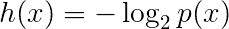
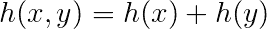
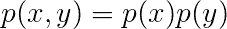
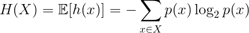
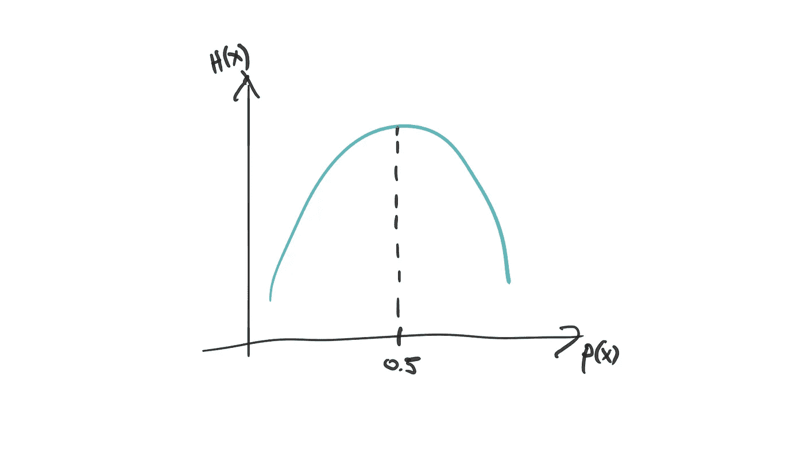
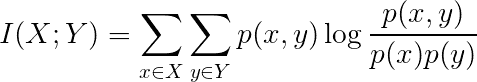

# 信息论中的“信息”是什么？

> 原文：<https://towardsdatascience.com/what-is-the-information-in-information-theory-d916250e4899?source=collection_archive---------15----------------------->

马库斯·斯皮斯克在 [Unsplash](https://unsplash.com?utm_source=medium&utm_medium=referral) 上的照片

## 打破信息的基本概念。

你可能听说过或读过一个例子，信息论与机器学习算法结合使用，要么解释它们，要么证明算法优化了正确的事情等等。

在这篇文章中，我想尝试用简单的语言来解释这一点:从基本概率出发的信息是什么？

信息论中的一个基本术语是**熵**。这可能是一个误导性的术语，因为熵是和混乱联系在一起的:主要是无序。在信息论中，熵告诉我们一个观察到的事件 **x** 中包含的信息量。一个事件当然有它的概率 **p(x)** 。

那么，我们所说的信息是什么意思呢？我发现直观地理解这个术语不是很简单。“信息”的数量实际上与存储有关。信息以位的形式存储。在信息论中，我们考虑用于将一些事件从一端传递到另一端的有噪声的通信信道。噪音现在并不重要。这些事件需要以某种方式编码，更具体地说，它们需要编码成比特(正如计算机科学理论家所看到的)。理想情况下，我们不希望使用太多的比特来通过通信信道传递这些事件，因为比特耗费能量。我们希望将大部分比特花在罕见事件上，因为它们通过信道发送的频率较低，因此成本较低。

[阿德里安·达斯卡尔](https://unsplash.com/@dascal?utm_source=medium&utm_medium=referral)在 [Unsplash](https://unsplash.com?utm_source=medium&utm_medium=referral) 上拍摄的照片

什么是罕见事件？嗯，当然是小概率的一个 **p(x)** 。这已经暗示了一些东西，我们希望一个事件的信息对于概率较低的事件来说更大。所以这个函数，我们姑且称之为 **h(x)，**应该会返回事件 **x** 所包含的信息量，低概率事件高，高概率事件低。现在，让我们来看看下面的**h(x)**

这似乎是正确的做法:概率越低，信息越高。它还有另一个很好的特性:如果我们获取同时发生的两个独立事件的信息，我们会得到以下结果:

这源于对数的简单操作，因为在 **x** 和 **y** 是独立的情况下(可能为了练习而检查它)，以下成立:

这是 **h** 函数的一个很好的特性，它意味着我们可以把独立事件的信息加起来，但也意味着我们不能把相关事件的信息加起来。对数本身是机器学习、数学、物理中经常出现的函数。简而言之，它在计算上如此之好是因为它允许我们将乘积写成和，导出函数的良好界限等等。

现在，如果我们想要测量随机变量的信息，我们需要查看其所有实现(事件)的预期信息。是的，我们对 **h(x)** 取期望值，如果我们假设处理的是一个离散的随机变量，它看起来像下面这样:

而这正是熵的定义！让我们假设 **p(x)** 是一个伯努利分布，这意味着有两个事件( **x** 和 **y** )可能发生，它们有各自的概率，那么我们可以写为 **p(x) =1-p(y)** ，因为事件空间上的概率需要总和为 1。在这种情况下，我们可以画出熵作为**p(x)**的函数，然后我们会注意到一些东西:

我们注意到，当 **p(x)** 取值为 0.5 时，它最大。这意味着所有事件的概率相等，因此在伯努利分布的情况下携带相同数量的信息。反过来，让我们说，我们有一些其他的系统，其中我们看到两个随机变量 **X** 和 **Y** 以及它们各自的分布 **p** 和 **q** 。我们可以看看他们的**互信息。**这是机器学习中经常使用的一个量，尤其是在大肆宣传的解纠缠领域，我们希望学习包含独立因素的潜在表示(即最小化独立因素之间的互信息)。无论如何，它归结为下面的等式:

让我们思考一下这个问题。我们知道，在随机变量 **x** 和 **y** 相互独立的情况下，我们可以写出联合分布 **p(x，y)=p(x)p(y)。**在它们不独立的情况下，我们必须服从贝叶斯法则， **p(x，y)=p(x)p(y|x)** 。如果独立性成立，对数中的比率变为 1，因此表达式等于 0，0 互信息。这是有意义的，因为通过独立性，我们知道一个事件的发生不会影响另一个事件的发生。在另一种情况下，我们会得到非零的互信息。

信息论对于机器学习实践者来说是一个非常有用的概念，因为它允许他们从信息论的角度来看待学习算法。信息论的更多乐趣即将到来！敬请关注。

马库斯·斯皮斯克在 [Unsplash](https://unsplash.com?utm_source=medium&utm_medium=referral) 上拍摄的照片