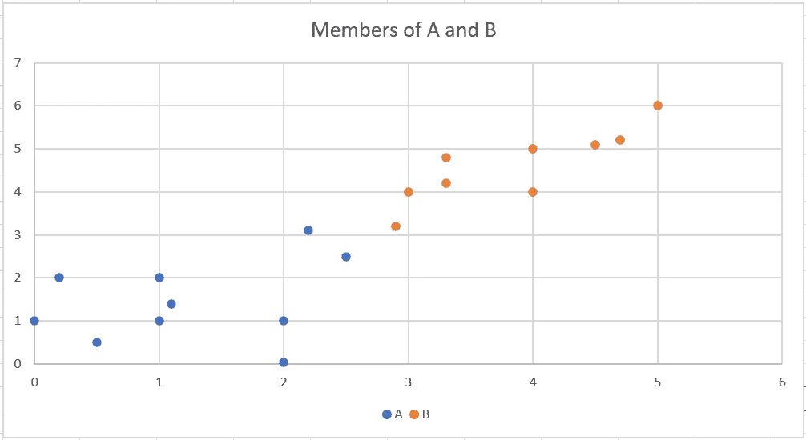
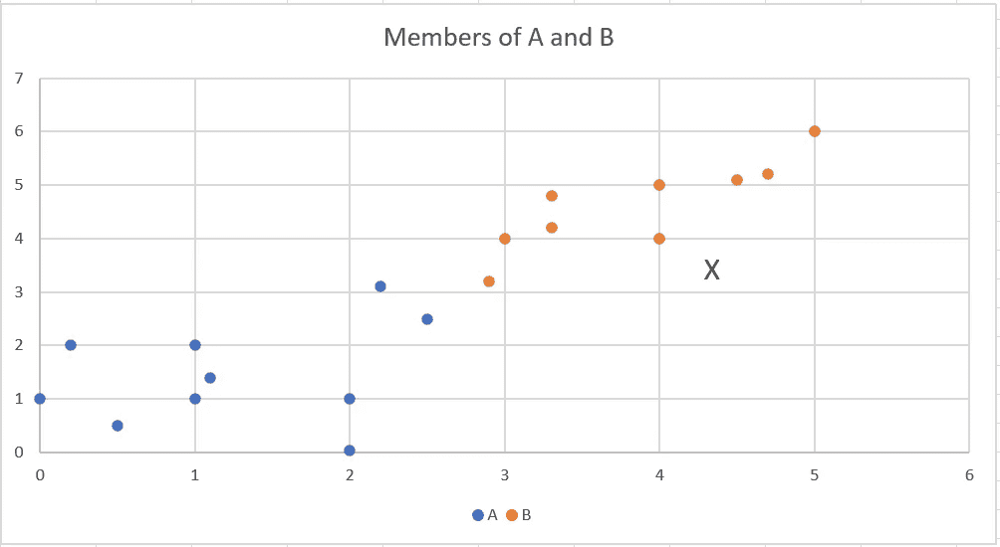
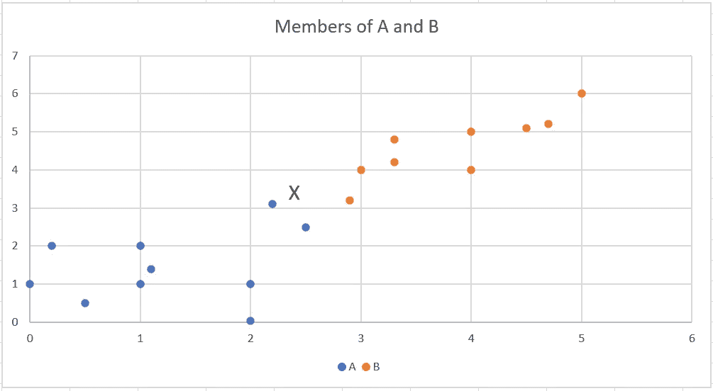
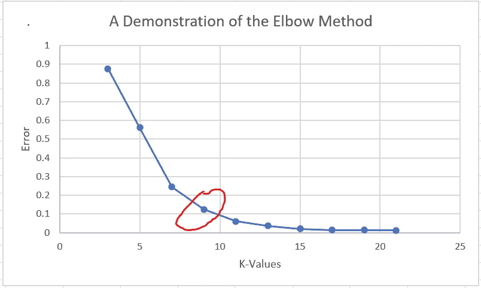

# K 近邻是什么？

> 原文：<https://towardsdatascience.com/what-is-the-k-nearest-neighbor-862a6a30e5dc?source=collection_archive---------38----------------------->

## Python 示例简介


乔恩·泰森在 [Unsplash](https://unsplash.com?utm_source=medium&utm_medium=referral) 上的照片

# k-最近邻算法

k-最近邻(KNN)是一种容易理解，但基本的和广泛适用的监督机器学习技术。要理解 KNN 背后的直觉，看看下面的散点图。该图显示了两个任意维度 x 和 y 之间的关系。蓝色点代表 A 组的成员，橙色点代表 b 组的成员。这将代表 KNN 的培训数据。



现在假设一个新的、未分类的数据点出现并绘制到图表上。KNN 将基于 K 个最近点(或最近邻居)对其进行分类，采取多数投票，并据此进行分类。注意 K 是事先设定好的，代表投票要拿多少分。

例如，如果 K= 1，KNN 将查看最近的数据点，并将新的数据点归类为相同的类别。在下面的例子中,“X”代表分类的新数据点。因为 X 最接近组 B 中的已知数据点，所以“X”也将被分类为组 B。



现在假设 K = 3。KNN 将查看 3 个最近的数据点，并投票进行分类。如果两个或两个以上的最近邻属于一个组，则新的数据点按多数分类。

在下面的例子中，新的数据点“X”移动。在最近的 3 个点中，2 个属于 A 组，1 个属于 b 组。因为大多数点属于 A 组，所以新的数据点“X”被分类为 A 组。



如果出现平局(这可能发生在 K=2 的情况下)，则从 K-1 个最近的邻居中取得多数。

# KNN 的优点

*   **非参数:** KNN 对基础数据不做任何假设。因此，它可以应用于广泛的问题，而不需要担心数据的属性。
*   **懒惰学习:**算法没有训练阶段。相反，它会在分类时进行计算。这使得 KNN 成为一种非常动态的机器学习技术，允许添加额外的数据，而无需重新训练它。
*   **高度非线性数据:**因为没有对数据进行假设，也没有计算正式模型，KNN 可以很好地预测高度非线性数据。
*   **多类问题:**不像其他一些算法需要对涉及 2 个以上类的分类进行调整，KNN 可以推广到任意多的类。
*   **直观:**即使对于非技术观众来说，该算法也相对容易理解和解释。

# KNN 的缺点

*   **内存密集型:**由于一个新的数据点必须与训练数据中的*每隔一个*数据点进行比较，KNN 经常使用大量的处理能力来进行分类，尤其是在较大的数据集上。
*   **维度的诅咒:**像其他使用距离作为度量的算法一样，KNN 很难预测具有大量输入变量的数据。
*   对异常值敏感:异常值给 KNN 带来了一个根本性的问题。通过简单地选择最近的邻居，不管它们有多远，离群值都可能扭曲它的预测。
*   **缺失数据:** KNN 没有处理缺失数据的方法。如果缺少任何东西，就不能准确预测整个数据点。

# 选择最佳 K

因为 K 是唯一要调整的参数，所以应该非常小心地选择一个好的值。一般来说，有两个基本的建议:一个估计和肘方法。

作为一个很好的参考点，有时建议将观察次数的平方根作为 K。例如，如果将 100 个观测值输入 KNN，K = 10 将作为快速估计。请注意，这更多的是一个经验法则，而不是一个严格的方法。

然而，更经验性的方法是肘法。基于边际收益递减的原则，这个想法是在测试数据上运行 KNN，逐步增加 K 值，并查看它如何影响模型性能。

如果直观地完成，那么在图的“肘”处(用更专业的术语来说是拐点)，K 的优化值表示在成本超过收益之前返回最佳性能的点处。下图中的红圈展示了这一原理。



然而，真实世界的数据并不总是那么清晰。如果数据变得更嘈杂，在局部最小值处选择最小的可能 K 是可行的选择。

# Python 中的演示

与许多其他机器学习算法一样，Scikit-Learn 模块提供了一个很好的 KNN 实现。

```
from sklearn.neighbors import KNeighborsClassifier
from sklearn.preprocessing import StandardScaler
import pandas as pd
import numpy as np
```

除了 KNN 模块之外，还导入了 StandardScaler 来标准化数据，并导入了 pandas 和 numpy 来处理数据。

```
# Store the data in a dictionary
data = {
    "X1": [1,1,3,4,5,2,0,4,0.5,3.3,1.1,4.7,0.2,2,4.5,3.3,2.5],
    "X2": [1,2,4,4,6,1,1,5,0.5,4.2,1.4,5.2,2,0.03,5.1,4.8,2.5],
    "Member": [A,A,B,B,B,A,A,B,A,B,A,B,A,A,B,B,A]
}# Convert the data into a dataframe
df = pd.DataFrame.from_dict(data)
```

接下来，数据集被生成并放入字典中。这组数字实际上是用来生成本文开头的例子的。为了方便起见，字典然后被转换成数据帧。

```
# Separate the the independent and dependent variables
features = df_sample.filter(["X1", "X2"])
category = df_sample["Member"]scaler = StandardScaler()
scaler.fit(features)
scaled_features = scaler.transform(features)
```

因为 KNN 使用距离作为度量单位，并且因为输入不一定使用相同的比例，所以调用标准缩放器来归一化数值数据。这是防止数据中单位偏差的重要步骤。

```
k = 5knn = KNeighborsClassifier(n_neighbors=k)
knn.fit(scaled_features, category)
```

实际拟合 KNN 的最后一步只是调用函数，并将缩放后的要素和类别用作参数。请注意参数 n_neighbors，它表示要使用多少个 K 近邻。

然而，如果应该使用弯头方法，则需要稍微不同的方法。

```
# Separate the data into training and test data sets
X_train, X_test, Y_train, Y_test = train_test_split(scaled_features, color_category, test_size=0.30)# Import Matplotlib for visualization
import matplotlib.pyplot as plt# Create an empty list to catch the error rate
error_rate = []# Iterate through K = 1-20
for i in range(1,20):

    knn = KNeighborsClassifier(n_neighbors=i)
    knn.fit(X_train,Y_train)
    pred_i = knn.predict(X_test)
    error_rate.append(np.mean(pred_i != Y_test))# plot the error rate 
plt.figure(figsize=(10,6))
plt.plot(range(1,20),error_rate,color='blue', linestyle='dashed', marker='o', markerfacecolor='red', markersize=10)
plt.title('Error Rate vs. K Value')
plt.xlabel('K')
plt.ylabel('Error Rate')
```

首先，数据被分成训练和测试子集(这应该是标准的过程)。接下来，针对 K = 1、K = 2 等等的测试数据对模型进行训练和评估，直到 K = 20。最后，结果会以图表的形式返回。

# 结论

KNN 是一种简单但强大的监督机器学习技术。其稳健的方法允许其应用于各种各样的问题。此外，单个参数 K 使得参数调整相对容易。Python 中一个简单易用的实现使得使用 KNN 只需几行代码。