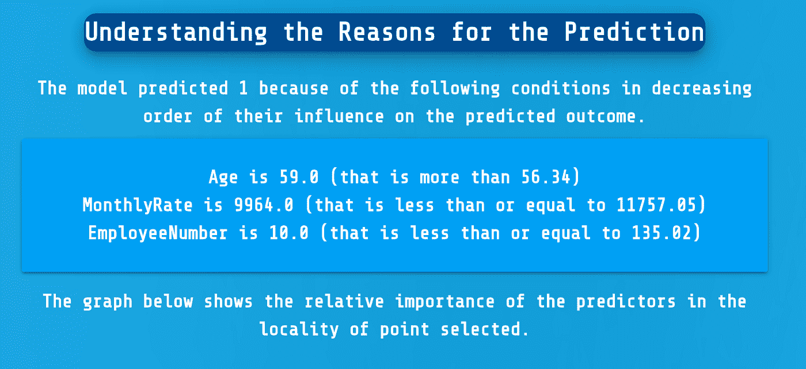

# 机器是如何处理你的数据的？你怎么能相信它？

> 原文：<https://towardsdatascience.com/what-is-the-machine-doing-with-your-data-how-can-you-trust-it-32a92fc79108?source=collection_archive---------67----------------------->

## 你每天都要和很多机器智能打交道。你知道他们实际上在用你的数据做什么吗？他们是如何做出预测的？你如何信任他们？

作为消费者，我们已经习惯于接受服务，而不是质疑这些服务的工作方式，并信任这些服务，即使它们是巨大的黑匣子。然而，黑盒是棘手的，因为根据定义，它们是秘密的，而不仅仅是私人的。在 ML 和开源的十字路口建立的东西可以增加你对机器学习数据使用的信任。

图片由本·怀特

我们每天都在生成和消耗越来越多的数据。我们的处理能力也在同步发展，新的机器学习技术可以以新的方式取悦用户，无论是更好的推荐引擎，更优化的购物体验，还是更智能(更便宜！)定价。

随着性能的进一步发展，我们也必须要求机器学习模型的内部工作有更多的发展。

机器学习的民主化有两个有趣的方面。一个是通过开源增加代码库的可见性，另一个是通过透明性和可解释性。可以说，这两者都是必要的和重要的，但是让我们看看实践中的那些以及它们有什么含义。

ML 中的透明性和可解释性

机器学习并不新鲜，但即使作为软件开发人员或数据分析师，它也是一个高门槛领域。当用大量原始数据训练模型时，这种数据的使用也可能引发许多围绕固有偏见和成见的不信任问题，即使这种意图从未存在过(只要看看我们如何与系统性种族主义作斗争)。

可解释性是理解哪些数据点是机器做出预测的因素，以及如何发现数据集中任何过度或不足表示的关键。一个领域越复杂，理解基础知识就越重要，并且能够追溯到前面的结果。

例如， [EazyML](http://www.eazyml.com) 就是这样通过让机器“解释给你听”来解决这个方程的。

EazyML 解释了工作满意度的机器学习预测模型中的局部预测。

开源是基础资源

除了作为一个蓬勃发展的市场和未来软件的基础构件，开源机器学习库也已经成为值得信赖的机器学习和人工智能软件的基石。

商业开源中有很多结构，比如 MorphL 已经公开发布了其“[社区版](https://github.com/Morphl-AI/MorphL-Community-Edition)“电商 AI 引擎”。然而，基本原则是，通过将代码发布到公共领域，您可以在看到软件的内部工作时获得额外的安慰，并且还可以解决供应商锁定的问题，任何人都可以派生软件并在其上进行构建。

当然，除了透明性之外，还有无数其他的好处，比如开放的协作仅仅是为了生产更好的软件和更多经得起未来考验的技术模型。

在我们在 [Prifina](http://www.prifina.com) 围绕用户持有和用户控制的数据所做的事情中，以及用于生成[合成数据的开源工具](https://github.com/tirthajyoti/Synthetic-data-gen)的出现中，有许多与 ML/AI 相关的有趣切线。他们都有能力尊重用户的数据，并在构建最复杂的模型和结果来为个人创造价值时将数据放在一边。

在未来，我们将能够只使用合成数据来构建模型，这些数据是在用户端创建的，允许直接的一对一交互。

我们将会使用越来越多的数据丰富的应用。我们需要能够信任他们。我们需要以值得的方式建设它们。