# 使用机器学习分析增加研究生院录取机会

> 原文：<https://towardsdatascience.com/what-is-the-most-important-factor-to-graduate-admission-e75de7a538d6?source=collection_archive---------28----------------------->


查尔斯·德洛耶在 [Unsplash](https://unsplash.com?utm_source=medium&utm_medium=referral) 上的照片

## 在本文中，我们将使用各种机器学习方法对最近的研究生入学数据进行分析，以分析 GRE 分数和 CGPA 等因素的最佳组合，从而提高研究生院的录取机会。

# 主要见解

*   ***CGPA 是目前研究生招生中最重要的因素*。**
*   GRE 多加一分，研究生录取几率增加 0.14%左右。
*   托福多一分，研究生录取几率增加 0.28%左右。
*   只有在大学评级较低的情况下，进行研究才有一定的益处。
*   高托福成绩无法抵消中/低 GRE 成绩；只有当 GRE 分数足够高时，托福考试才开始对录取机会产生显著的统计影响。

本文将深入探讨这些结果是如何使用以下机器学习技术实现的:

*   创建一个逻辑回归模型来预测录取的机会，分析和可视化的系数。
*   使用排列重要性和决策树回归模型来寻找特征重要性。
*   单变量和轮廓部分相关图(PDP ),以了解单个或多个变量如何影响录取机会。

# 数据

数据可以在 Kaggle [这里](https://www.kaggle.com/mohansacharya/graduate-admissions)找到。

数据头:

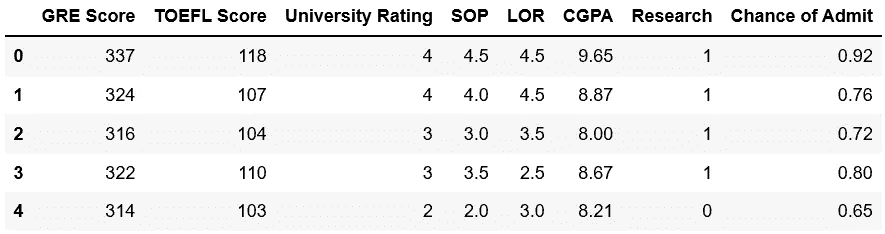

GRE 成绩、托福成绩、大学评级、SOP、LOR、CGPA、研究是预测录取机会的特征。

我们可以用熊猫的内置。描述():

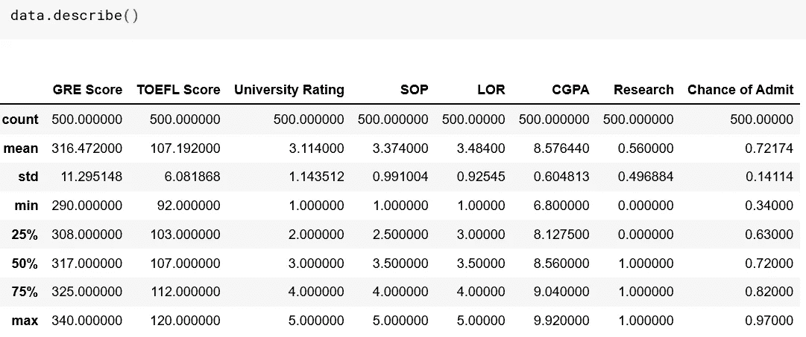

# 逻辑回归模型和系数分析

首先，使用 sklearn 方便的 train_test_split 函数，我们将数据分成训练集和测试集。

```
import sklearn
from sklearn.model_selection import train_test_split
X = data.drop('Chance of Admit ',axis=1)
y = data['Chance of Admit ']
X_train,X_test,y_train,y_test = train_test_split(X,y,test_size=0.2)
```

在 sklearn 中训练逻辑回归模型就像两行代码一样简单:

```
from sklearn.linear_model import LinearRegression
lin = LinearRegression().fit(X_train,y_train)
print((y_test - lin.predict(X_test)).apply(abs).mean())
```

输出:

```
0.04337302752734804
```

逻辑回归的平均误差(MAE)约为 0.045，或预测研究生入学机会的 4.5%(满分为 100%)。

现在，让我们从模型中获取系数:

```
coef = pd.DataFrame({'column':X_test.columns,'coefficient':lin.coef_*100}).sort_values('coefficient').reset_index()
coef.drop('index',axis=1)
```

输出:

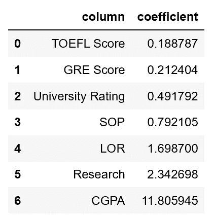

最重要的是，我们可以得出以下结论:

*   GRE 多加一分，研究生录取几率增加 0.14%左右。
*   托福考试增加一分，研究生入学的机会就会增加大约 0.28%
*   大学 GPA 多一分，研究生录取几率增加 12.34%左右。
*   进行研究增加了大约 2.97%的研究生入学机会。

请记住，这些都在 4%的误差范围内。

```
import seaborn as sns
import matplotlib.pyplot as plt
plt.style.use('ggplot')
fig = plt.figure(figsize = (15,5))
plt.xticks(rotation=45)
colors = ['#adebad','#adebad','#adebad','#adebad','#99e699','#85e085','#70db70']
sns.barplot(coef['column'],coef['coefficient'],palette = colors)
plt.ylabel("Additional % Admission")
plt.xlabel('Factor')
plt.show()
```

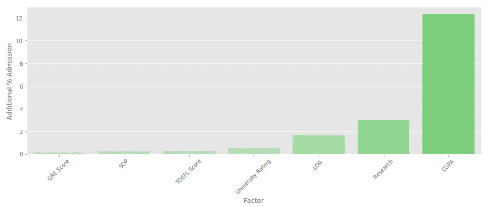

重要的是要认识到 GRE 和 TOEFL 有许多可能的分数，所以它们的系数低是有道理的。

一大要点是:大学的平均绩点对于研究生入学是必不可少的。每增加一分，就多了 12.84%的几率。

# **排列重要性**

置换重要性是一种评估特征重要性的方法，通过随机洗牌并观察准确性的相应降低。准确度下降最大的列应该比那些重排没有降低准确度的列更重要。

```
import eli5
from eli5.sklearn import PermutationImportance
perm = PermutationImportance(lin, random_state=1).fit(X_test, y_test)
eli5.show_weights(perm, feature_names = X_test.columns.tolist())
```

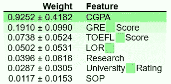

和以前一样，CGPA 很重要，其次是 GRE 和托福成绩。

# SHAP 价值观

## 决策树回归器和 SHAP 值

SHAP 值不支持逻辑回归，因此我们将选择决策树回归器，并收集 SHAP 值。

```
import shap
from sklearn.tree import DecisionTreeRegressor
dtr = DecisionTreeRegressor().fit(X_train,y_train)
explainer = shap.TreeExplainer(dtr)
shap_values = explainer.shap_values(X_test)
```

## SHAP 特征重要性

SHAP 是评估特征重要性的另一种方法。SHAP 不像逻辑回归系数那样考虑规模。

```
shap.summary_plot(shap_values, X_test, plot_type="bar")
```

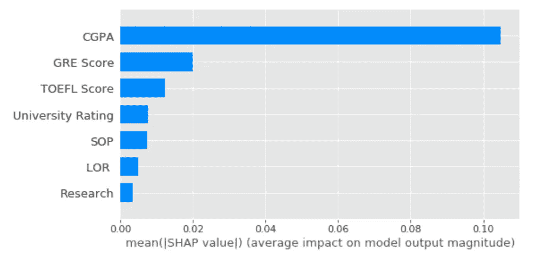

我们可以得出一些结论:

*   和往常一样，CGPA 是目前**最重要的特色**
*   GRE 和托福成绩很重要
*   大学的评级没有 GRE 分数，尤其是 CGPA 的影响大。这意味着无论大学排名如何，你的 CGPA 和 GRE 分数低，都不会走得很远。
*   研究好像不是很重要。

## SHAP 力图

SHAP 力图让我们看到为什么一个特定的例子取得了他们所做的成绩。举个例子，

```
i = 0 # or any other index for a different force plot
shap_values = explainer.shap_values(X_train.iloc[i])
shap.force_plot(explainer.expected_value, shap_values, X_test.iloc[i])
```

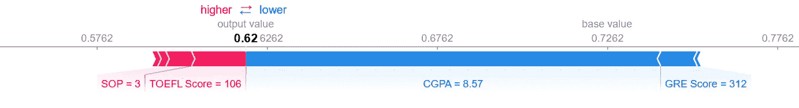

在这个例子中，最终的录取机会是 0.62。红色的因素解释了是什么推动了机会的增加，蓝色的因素解释了是什么推动了机会的减少。长度代表了它的力量有多大。

在这种特殊情况下，相当高的托福分数和 SOP 推动了分数的上升，但低 CGPA 是推动分数下降的一个巨大因素。

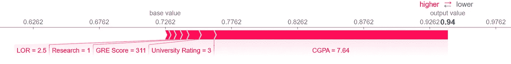

在这个例子中，最后的录取机会是 94%。高 CGPA 显著提高了它。

再画几个 SHAP 力图，就可以知道哪些因素一起使用时可以决定最终的机会:

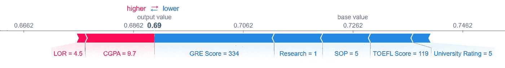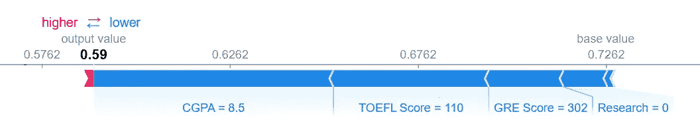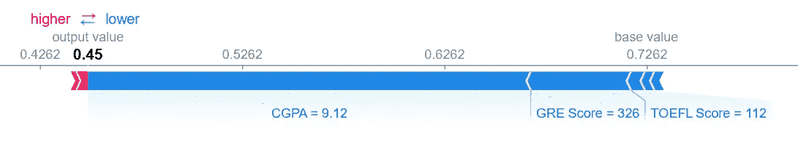

# PDP 图

PDP 图或部分相关性图显示了单个特征如何影响目标变量。

以下代码生成每列的 PDP 图:

```
from pdpbox import pdp, info_plots
import matplotlib.pyplot as plt
base_features = data.columns.values.tolist()
base_features.remove('Chance of Admit ')
for feat_name in base_features:
    pdp_dist = pdp.pdp_isolate(model=dtr, dataset=X_test, model_features=base_features, feature=feat_name)
    pdp.pdp_plot(pdp_dist, feat_name)
    plt.show()
```

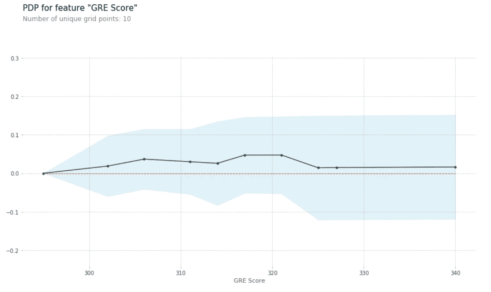

这个部分相关图表明，最佳 GRE 分数将在 320 分的峰值附近。然而，没有太多关于 GRE 高端的数据，但是这些数据表明 GRE 高实际上可能会降低机会。对此的一个可能的解释是，花在 GRE 学习上的时间可能会花在其他更重要的事情上(比如 CGPA)。此外，请注意较大的误差范围。

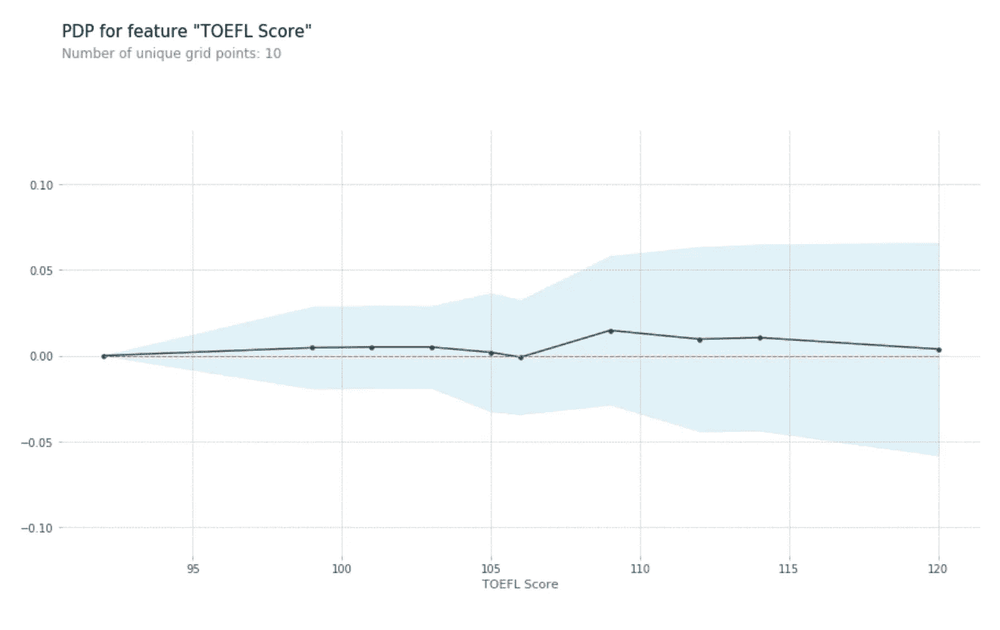

托福成绩的 PDP 似乎建议最好的分数在 109 到 114 之间。再次注意大的误差线。粗线只是平均值，在这种情况下，误差太大，数据太少，无法做出可信的判断。

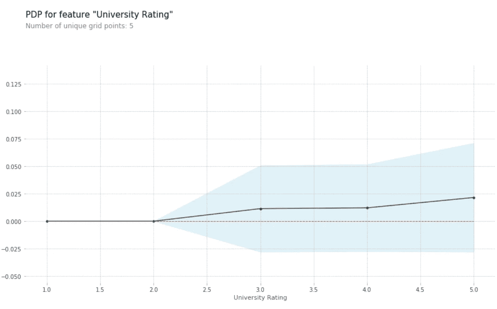

这个 PDP 很有意思——似乎越是名校，录取几率越高。这可能与数据偏差有关，但一个可能的解释是，申请高评级大学的研究生本身就有更强的资质。

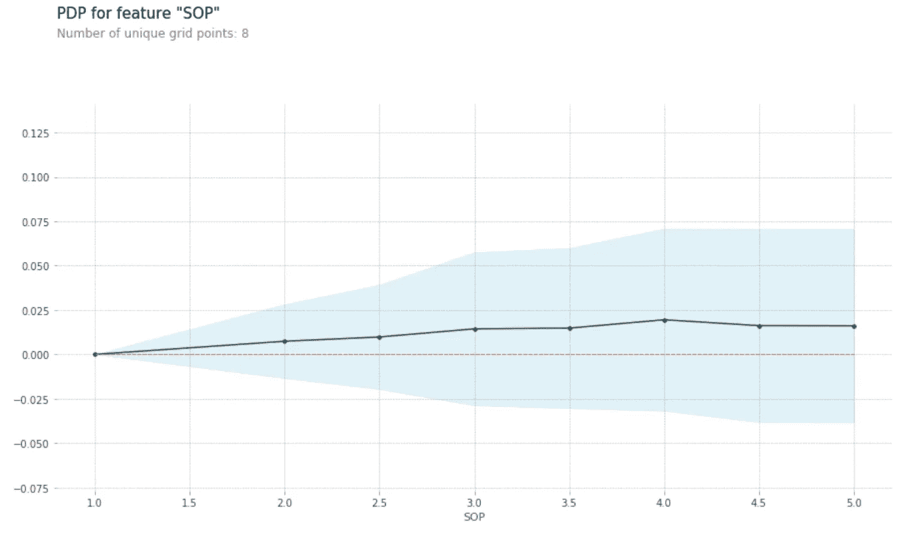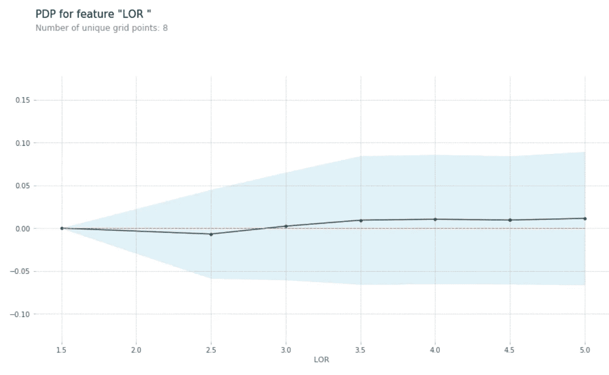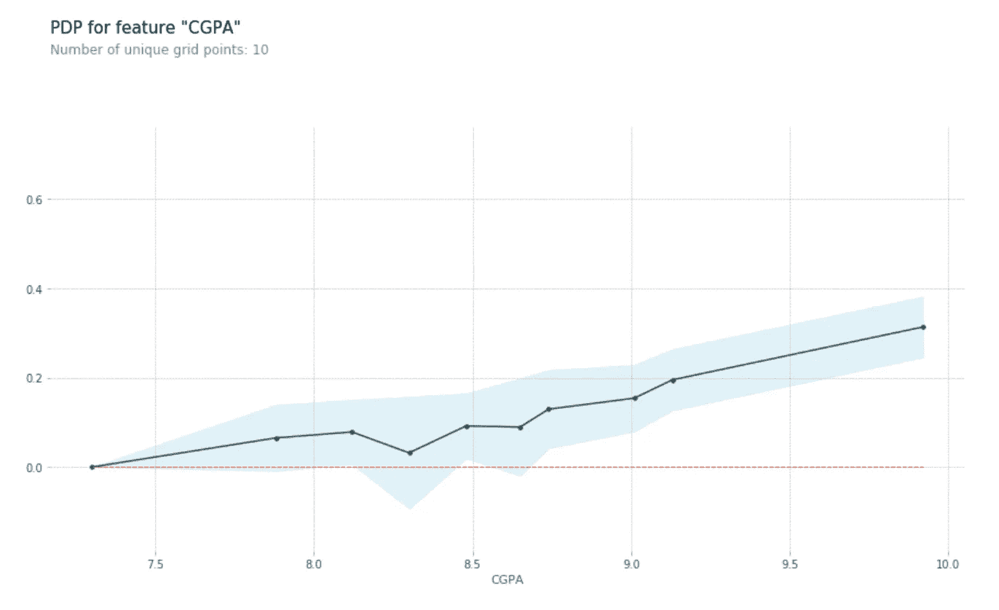

CGPA 的 PDP 最为突出，因为它的误差线非常小。有一个明显的趋势是，较高的 CGPA 与较高的录取机会相关。

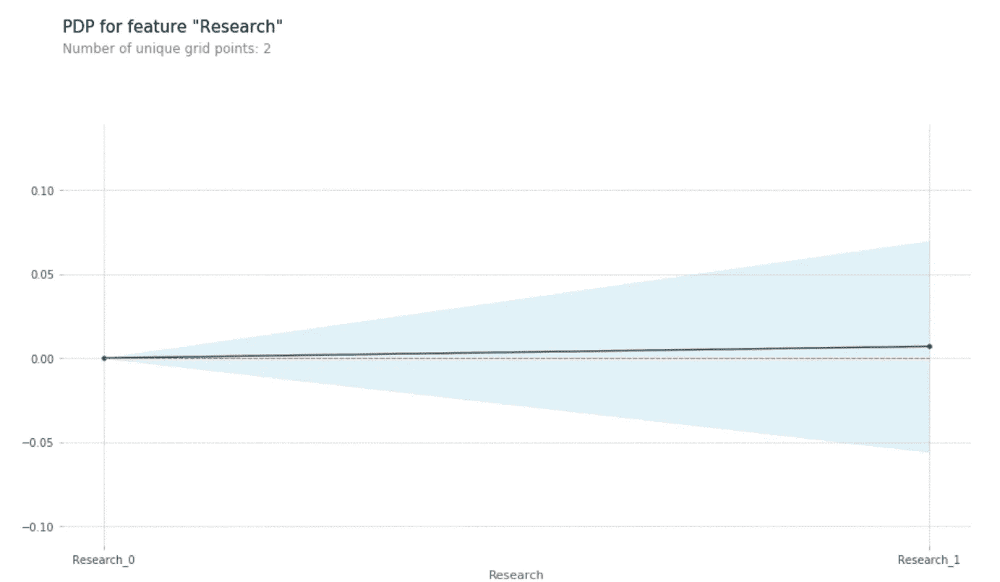

如前所述，一般来说，进行研究比不进行研究似乎没有什么增加。我们将通过多维 PDP 图对此主题进行更深入的研究。

# PDP 轮廓/多维 PDP 图

PDP 等高线/多维 PDP 图是一种特殊的宝石——它们显示了两个变量之间的相互作用(因此，它们也被称为 PDP 相互作用图)如何导致一定的准入机会。

以下代码生成大学分数与所有要素的等值线图。

```
for column in X_test.columns.drop('University Rating'):
    features = ['University Rating',column]
    inter1  =  pdp.pdp_interact(model=dtr, dataset=X_test, model_features=base_features,features=features)
    pdp.pdp_interact_plot(pdp_interact_out=inter1, feature_names=features, plot_type='contour')
    plt.show()
```

**大学分数对比所有特征**

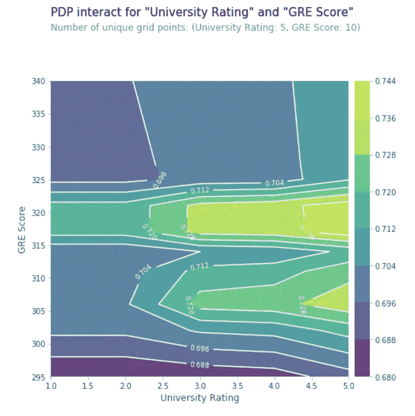

在等高线图中，黄色区域越多，被录取的几率越高。低 GRE 分数对几乎所有的大学评级都不利。正如之前在单变量 PDP 中看到的，GRE 分数 320 分左右的范围似乎是“黄金区域”，被评为 5 分的大学接受分数在该分数左右的人最多。

我们应该怀疑缺乏数据——这个数据集的数据并不丰富，因为我们发现，随着 GRE 分数的增加(在某一点之后)，录取的机会会减少，这是没有意义的。

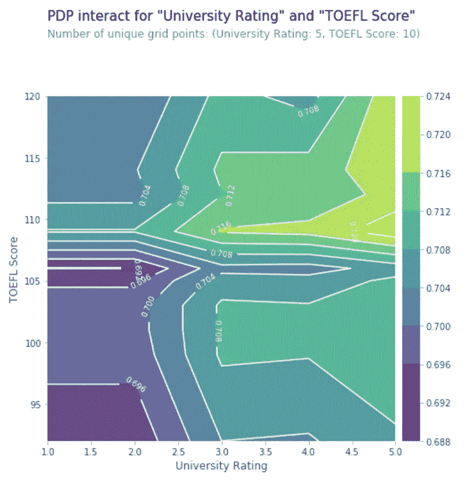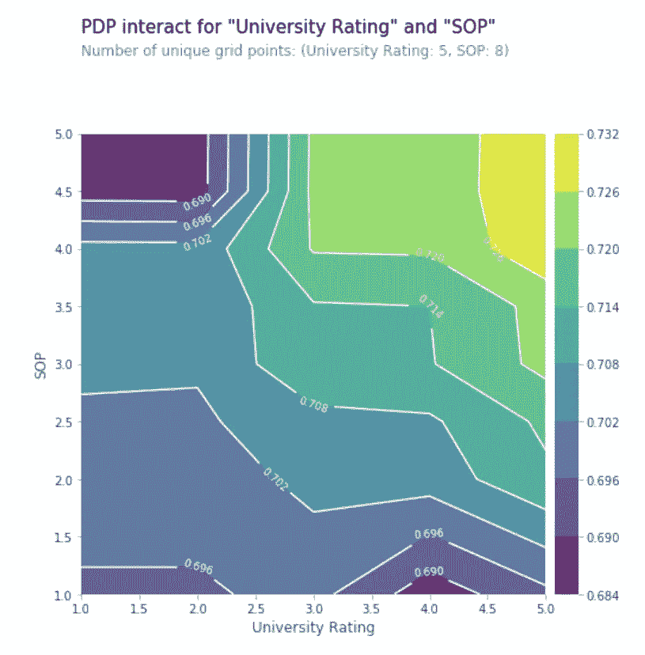

有了 SOP，很明显，拥有最高 SOP 分数的最高大学评级会产生最高的录取率。

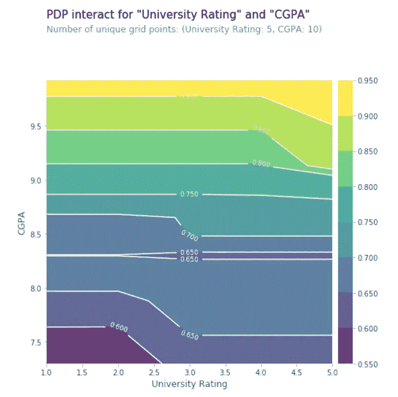

另一个重复的结果是——无论大学排名如何，CGPA 都非常重要。

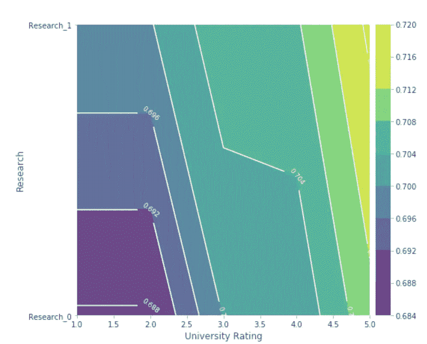

唉，我们关于开展研究的问题的答案是:等高线的倾斜性质表明，对于排名较低的大学，开展研究是有帮助的——它将 68%的百分比提高到 71%左右。然而，对于更高等级的大学，在执行研究方面真的没有太大的区别。

## GRE 成绩对比托福成绩

这里有个有趣的问题 GRE 和托福成绩是如何相互影响的？GRE 成绩好是弥补托福成绩差，还是相反？

```
features = ['GRE Score','TOEFL Score']
inter1  =  pdp.pdp_interact(model=dtr, dataset=X_test, model_features=base_features, 
                            features=features)pdp.pdp_interact_plot(pdp_interact_out=inter1, feature_names=features, plot_type='contour')
plt.show()
```

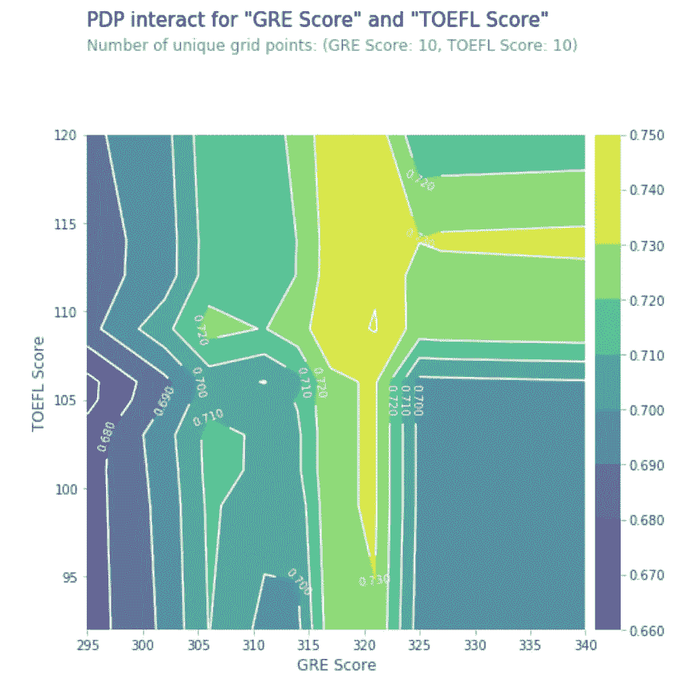

看起来，低 GRE 分数的托福非常依赖 GRE，但随着 GRE 分数的提高，托福分数在录取机会中的作用越来越大。

## GRE 分数与 CGPA

```
features = ['GRE Score','CGPA']
inter1  =  pdp.pdp_interact(model=dtr, dataset=X_test, model_features=base_features, 
                            features=features)pdp.pdp_interact_plot(pdp_interact_out=inter1, feature_names=features, plot_type='contour')
plt.show()
```

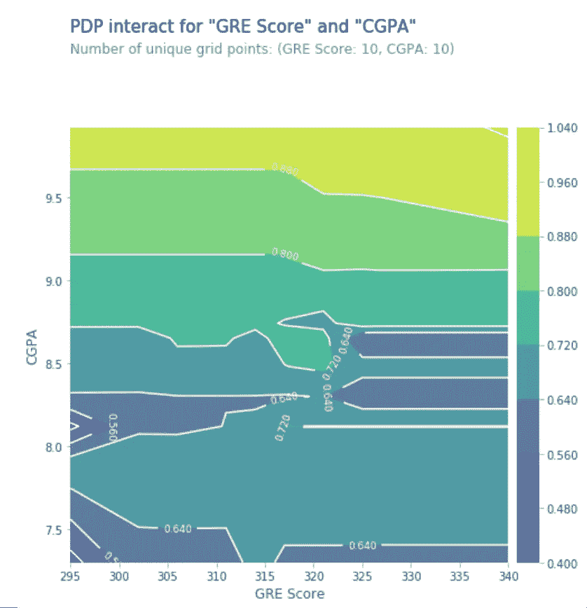

正如我们已经多次看到的那样，GRE 分数对低 CGPA 没有什么帮助。

使用代码和更多的实验来发现其他特性之间的关系；只需用所需的功能替换“功能”列表。

# 感谢阅读！

如果你喜欢，请随时查看我的其他帖子。


瓦西里·科洛达在 [Unsplash](https://unsplash.com?utm_source=medium&utm_medium=referral) 上的照片